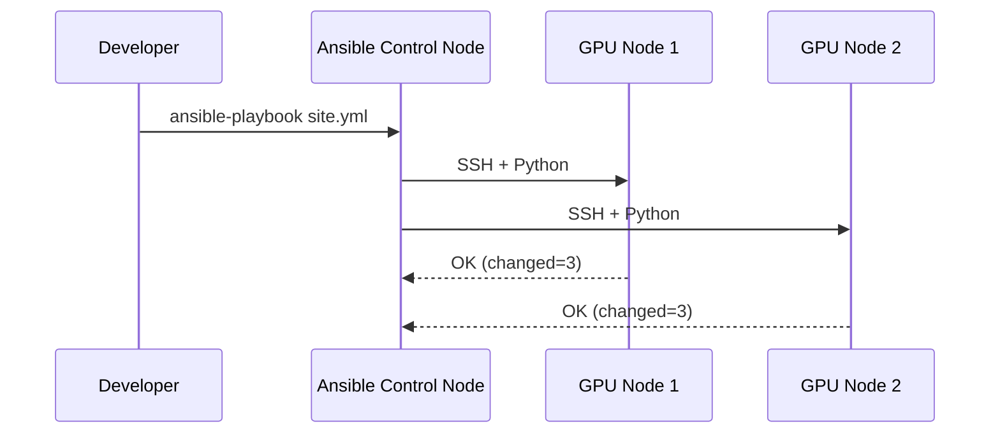
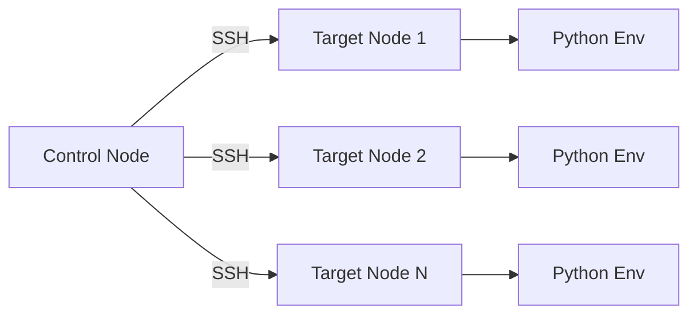

# ⚙️ Ansible y Configuración de Servidores

Desplegar infraestructura con Terraform es solo la mitad de la batalla. Una vez que tienes servidores, debes instalar dependencias, configurar servicios, desplegar código y gestionar secretos. Ansible es la herramienta agentless por excelencia para esta tarea.

> 💡 **Relevancia para ML/AI Engineering**: Los clusters de entrenamiento requieren drivers de NVIDIA, Docker, bibliotecas de Python específicas y montajes de sistemas de archivos distribuidos. Ansible permite estandarizar esta configuración en cientos de nodos sin instalar agentes permanentes.


---

## 1. Inventarios: estáticos vs dinámicos

El inventario define los hosts gestionados. Puede ser un archivo INI/YAML estático o un script dinámico que consulta una API de cloud.

**Inventario estático (`inventory.ini`)**:

```ini
[ml_trainers]
trainer-01 ansible_host=10.0.1.10 ansible_user=ubuntu
trainer-02 ansible_host=10.0.1.11 ansible_user=ubuntu

[ml_trainers:vars]
ansible_python_interpreter=/usr/bin/python3
```

**Inventario dinámico**: Plugins como `aws_ec2`, `gcp_compute` generan inventarios en tiempo real.

---

## 2. Playbooks: orquestación en YAML

Un playbook es una lista de plays. Cada play asocia hosts con tareas.

```yaml
- name: Configurar servidor base para ML
  hosts: ml_trainers
  become: yes
  tasks:
    - name: Actualizar paquetes
      apt:
        update_cache: yes
        upgrade: dist
```

---

## 3. Tasks, Handlers y Roles

- **Task**: Unidad mínima de trabajo (instalar un paquete, copiar un archivo).
- **Handler**: Tarea especial que se dispara por notificación cuando otra tarea cambia.
- **Role**: Estructura de directorios que organiza tasks, handlers, templates y variables.

Estructura de un role:

```
roles/
└── ml_node/
    ├── tasks/
    ├── handlers/
    ├── templates/
    ├── files/
    ├── vars/
    └── defaults/
```

---

## 4. Templates con Jinja2

Ansible utiliza Jinja2 para generar archivos dinámicos.

```jinja2
# templates/ml_config.j2
cuda_version: {{ cuda_version }}
python_version: {{ python_version }}
node_name: {{ inventory_hostname }}
```

```yaml
- name: Desplegar configuración de nodo
  template:
    src: ml_config.j2
    dest: /etc/ml/config.yaml
```

---

## 5. Módulos clave

| Módulo | Propósito | Ejemplo |
|--------|-----------|---------|
| `package`/`apt`/`yum` | Gestión de paquetes | Instalar `python3-pip` |
| `service` | Control de servicios | Iniciar `docker` |
| `copy` | Copiar archivos estáticos | Subir scripts |
| `template` | Renderizar Jinja2 | Configuraciones dinámicas |
| `command`/`shell` | Ejecutar comandos | Compilar desde fuente |

---

## 6. Idempotencia

Una operación es idempotente si aplicarla múltiples veces produce el mismo resultado que aplicarla una vez. Los módulos de Ansible están diseñados para ser idempotentes.

$$Idempotencia \implies \forall n \ge 1, f^n(x) = f(x)$$

💡 **Tip**: Si usas `command` o `shell`, asegúrate de verificar el estado (ej. `creates`) para mantener la idempotencia.

---

## 7. Ad-hoc Commands

Comandos rápidos sin necesidad de playbook.

```bash
ansible ml_trainers -m ping
ansible ml_trainers -a "nvidia-smi"
ansible ml_trainers -m apt -a "name=nvidia-driver-535 state=present" --become
```

---

## 8. Ansible Vault para secretos

Vault cifra variables sensibles (tokens, claves API).

```bash
ansible-vault create secrets.yml
ansible-vault encrypt secrets.yml
ansible-playbook -i inventory.ini site.yml --ask-vault-pass
```

⚠️ **Advertencia**: Nunca subas archivos sin cifrar que contengan credenciales a Git. Usa `.gitignore` y pre-commit hooks.

---

## 9. Comparativa: Ansible vs Chef vs Puppet vs SaltStack

| Característica | Ansible | Chef | Puppet | SaltStack |
|----------------|---------|------|--------|-----------|
| Arquitectura | Agentless (SSH) | Agent-based | Agent-based | Agent-based (opcional SSH) |
| Lenguaje | YAML / Jinja2 | Ruby (DSL) | Puppet DSL | YAML / Jinja2 |
| Curva de aprendizaje | Baja | Media | Alta | Media |
| Idempotencia | Nativa | Nativa | Nativa | Nativa |
| Escalabilidad | Muy alta | Alta | Alta | Muy alta |
| Uso típico en ML | Configuración de nodos | Infraestructura legacy | Compliance | Orquestación masiva |

> Caso real: En OpenAI, los equipos de investigación utilizan Ansible para preparar racks de servidores DGX con drivers CUDA, Docker y herramientas de monitoreo, reduciendo el tiempo de aprovisionamiento de horas a minutos.



---

## 📦 Código de compresión

```yaml
# site.yml - Playbook para configurar servidor Python para ML
- name: Configurar Servidor Python para ML
  hosts: all
  become: yes
  vars:
    python_version: "3.10"
    packages:
      - python3-pip
      - python3-venv
      - build-essential
      - libssl-dev
  tasks:
    - name: Instalar paquetes base
      apt:
        name: "{{ packages }}"
        state: present
        update_cache: yes

    - name: Crear directorio de aplicación
      file:
        path: /opt/mlapp
        state: directory
        owner: ubuntu
        group: ubuntu

    - name: Instalar dependencias Python
      pip:
        requirements: /opt/mlapp/requirements.txt
        virtualenv: /opt/mlapp/venv
        virtualenv_command: python3 -m venv
      become_user: ubuntu

    - name: Asegurar que el servicio de inferencia está corriendo
      systemd:
        name: ml-inference
        state: started
        enabled: yes
      notify: Reiniciar servicio

  handlers:
    - name: Reiniciar servicio
      systemd:
        name: ml-inference
        state: restarted
```


