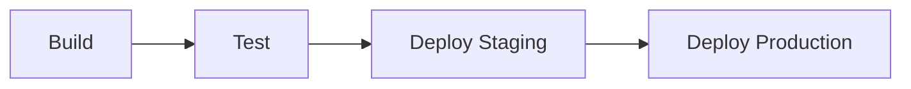
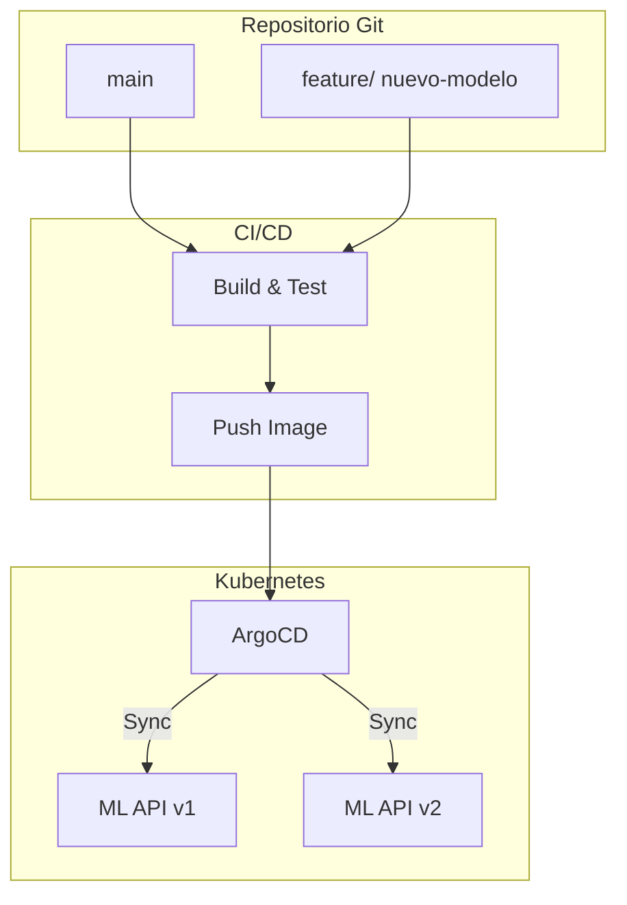

# 🚀 CI/CD y GitOps

El despliegue de modelos de Machine Learning no puede depender de scripts manuales ejecutados desde una laptop. Los pipelines de CI/CD automatizan la validación, construcción y entrega de artefactos, mientras que GitOps asegura que el estado deseado de la infraestructura siempre esté reflejado en un repositorio Git.

> 💡 **Relevancia para ML/AI Engineering**: Un pipeline CI/CD permite reentrenar un modelo, validar su rendimiento y desplegarlo a producción en minutos, no en días. GitOps añade trazabilidad: sabes exactamente qué versión de infraestructura y modelo está en cada entorno.


---

## 1. Pipelines CI/CD: GitHub Actions, GitLab CI, Jenkins, CircleCI

| Plataforma | Lenguaje de config | Hosting | Fortaleza en ML |
|------------|-------------------|---------|-----------------|
| GitHub Actions | YAML (`.github/workflows`) | SaaS / Self-hosted | Integración nativa con repos, marketplaces de actions |
| GitLab CI | YAML (`.gitlab-ci.yml`) | SaaS / Self-hosted | CI/CD integrado con registro de contenedores y monorepos |
| Jenkins | Groovy (Jenkinsfile) | Self-hosted | Extensible con miles de plugins, ideal para on-premise |
| CircleCI | YAML | SaaS | Velocidad de ejecución y paralelización avanzada |

---

## 2. Stages: build, test, deploy

Un pipeline típico se divide en etapas:

1. **Build**: Compilación de código, construcción de imágenes Docker.
2. **Test**: Pruebas unitarias, de integración y de modelo (validación de métricas).
3. **Deploy**: Despliegue a staging/producción.



---

## 3. Artifacts y Runners

- **Artifacts**: Archivos generados por un job (modelos entrenados, reportes, imágenes Docker).
- **Runners**: Agentes que ejecutan los jobs. Pueden ser compartidos (SaaS) o dedicados (self-hosted con GPUs).

💡 **Tip**: Para jobs de entrenamiento intensivos, usa self-hosted runners con GPUs para reducir costos y tiempos.

---

## 4. GitOps: infraestructura declarativa

GitOps es un paradigma donde Git es la única fuente de verdad. Herramientas como **ArgoCD** y **Flux** observan el repositorio y sincronizan automáticamente el estado del cluster.

> Caso real: En Weaveworks (creadores de GitOps), los pipelines de ML actualizan una imagen Docker en Git. ArgoCD detecta el cambio y despliega el nuevo modelo en Kubernetes sin intervención humana.

---

## 5. Pull vs Push Deployments

| Característica | Push | Pull |
|----------------|------|------|
| Trigger | Pipeline CI empuja cambios | Agente en cluster observa Git |
| Seguridad | Credenciales CI necesitan acceso a cluster | Cluster solo necesita lectura de Git |
| Rollback | Requiere pipeline nuevo | Revertir commit en Git |
| Auditoría | Difícil de trazar | Historial completo en Git |

$$DeploymentRisk_{push} \propto \frac{Permissions_{CI}}{Auditability} \implies DeploymentRisk_{pull} \ll DeploymentRisk_{push}$$

---

## 6. Image Promotion

La promoción de imágenes Docker asegura que el artefacto validado en staging sea exactamente el mismo que se despliega en producción.

```yaml
# Ejemplo conceptual de tag promotion
stages:
  - build
  - promote

build_image:
  stage: build
  script:
    - docker build -t $CI_REGISTRY_IMAGE:$CI_COMMIT_SHA .
    - docker push $CI_REGISTRY_IMAGE:$CI_COMMIT_SHA
```

---

## 7. Rollback automático

Un rollback automático se dispara cuando las métricas de salud (error rate, latencia) empeoran tras un despliegue.

⚠️ **Advertencia**: Los rollbacks de modelos de ML son más complejos que los de software tradicional. Un modelo puede degradarse silenciosamente (data drift). Implementa canary deployments con validación de métricas de negocio.

---

## 8. Feature Flags en CI/CD

Las feature flags permiten desacoplar el despliegue del lanzamiento. Puedes desplegar un nuevo modelo pero dirigir solo el 5% del tráfico a él.

---

## 9. Trunk-based Development vs GitFlow

| Aspecto | Trunk-based | GitFlow |
|---------|-------------|---------|
| Ramas principales | Una (`main`) | `main` + `develop` + features |
| Duración de branches | Horas | Días/semanas |
| Conflictos | Mínimos | Frecuentes |
| Ideal para | CI/CD rápido, MLops | Releases versionadas, hardware |

💡 **Tip**: Para equipos de ML, Trunk-based development acelera la experimentación. Usa tags para versionar datasets y modelos.

---

## 📦 Código de compresión

```yaml
# .github/workflows/ml-pipeline.yml
name: ML CI/CD Pipeline

on:
  push:
    branches: [main]
  pull_request:
    branches: [main]

jobs:
  build-and-test:
    runs-on: ubuntu-latest
    steps:
      - uses: actions/checkout@v4

      - name: Set up Python
        uses: actions/setup-python@v5
        with:
          python-version: '3.10'

      - name: Install dependencies
        run: |
          pip install -r requirements.txt

      - name: Run tests
        run: pytest tests/

      - name: Build Docker image
        run: docker build -t ml-api:${{ github.sha }} .

  deploy:
    needs: build-and-test
    runs-on: ubuntu-latest
    if: github.ref == 'refs/heads/main'
    steps:
      - uses: actions/checkout@v4

      - name: Deploy to staging
        run: |
          echo "Desplegando imagen ml-api:${{ github.sha }} a staging"
```


