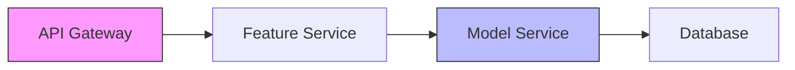
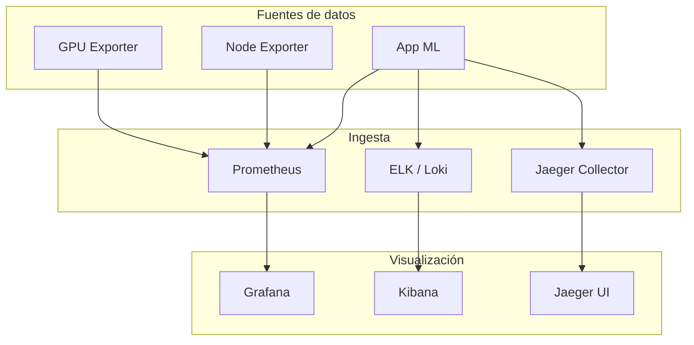

# 📊 Observabilidad y Monitoreo de Infraestructura

Un sistema de Machine Learning en producción es un sistema distribuido complejo: servicios de ingestión, pipelines de entrenamiento, APIs de inferencia y almacenamiento de features. Sin observabilidad, operar estos sistemas es como volar con los ojos vendados.

> 💡 **Relevancia para ML/AI Engineering**: La degradación de un modelo (drift) se manifiesta primero en métricas: latencia de predicción, tasa de errores, distribución de características de entrada. La observabilidad permite detectar estos síntomas antes de que afecten el negocio.


---

## 1. Pilares de la Observabilidad

La observabilidad se construye sobre tres pilares:

| Pilar | Definición | Ejemplo en ML |
|-------|------------|---------------|
| **Métricas** | Datos numéricos agregados en el tiempo | Latencia de inferencia, uso de GPU |
| **Logs** | Registros textuales de eventos | Errores de predicción, excepciones |
| **Traces** | Seguimiento de solicitudes a través de servicios | Pipeline de una predicción: API → Feature Store → Modelo |

---

## 2. Prometheus: métricas, exporters y PromQL

Prometheus es el estándar de facto para métricas en entornos cloud-native.

**Componentes clave**:

- **Prometheus Server**: Recolección y almacenamiento.
- **Exporters**: Agentes que exponen métricas de sistemas externos (Node Exporter, NVIDIA DCGM para GPUs).
- **PromQL**: Lenguaje de consulta.

```yaml
# prometheus.yml
global:
  scrape_interval: 15s

scrape_configs:
  - job_name: 'ml-api'
    static_configs:
      - targets: ['ml-api:8080']
```

**Consulta PromQL de ejemplo**:

```promql
rate(http_requests_total{job="ml-api",status="5xx"}[5m])
```

---

## 3. Grafana: dashboards y alertas

Grafana visualiza métricas de múltiples fuentes (Prometheus, CloudWatch, Loki).

💡 **Tip**: Crea dashboards por entorno (dev, staging, prod) y por servicio. Un dashboard de ML debe incluir: latencia de predicción, throughput, uso de recursos (GPU/CPU/memoria) y métricas de negocio (precisión en ventana deslizante).

---

## 4. ELK/EFK Stack: gestión de logs

- **Elasticsearch**: Almacén de búsqueda y análisis.
- **Logstash/Fluentd**: Procesamiento y enriquecimiento de logs.
- **Kibana**: Visualización.

⚠️ **Advertencia**: Los logs de ML pueden contener datos sensibles (PII). Implementa enmascaramiento antes de indexar en Elasticsearch.

---

## 5. Jaeger y Zipkin: distributed tracing

El tracing distribuido rastrea una solicitud a través de múltiples microservicios.



> Caso real: Uber utiliza Jaeger para rastrear millones de solicitudes de predicción diarias en su plataforma Michelangelo, identificando cuellos de botella en el feature store.

---

## 6. SRE: SLIs, SLOs, SLAs y Error Budgets

La Site Reliability Engineering aplica rigor de ingeniería a las operaciones.

| Concepto | Definición | Fórmula |
|----------|------------|---------|
| **SLI** | Service Level Indicator | Métrica cuantitativa (ej. latencia p99) |
| **SLO** | Service Level Objective | Objetivo para el SLI (ej. latencia p99 < 200ms) |
| **SLA** | Service Level Agreement | Contrato con consecuencias legales si se incumple |
| **Error Budget** | Margen de error permitido | $1 - SLO$ |

$$Availability = \frac{UPTIME}{UPTIME + DOWNTIME} \times 100\%$$

$$ErrorBudget = 1 - SLO$$

$$BurnRate = \frac{Errors}{TimeWindow}$$

💡 **Tip**: Si tu SLO de precisión del modelo es 95%, tu error budget es 5%. Un reentrenamiento que degrada la precisión al 92% consume el 60% de tu budget mensual.

---

## 7. On-call e Incident Management

La rotación on-call asegura que siempre haya un experto disponible. Las herramientas de gestión de incidentes estructuran la respuesta.

---

## 8. PagerDuty y Opsgenie

| Herramienta | Función |
|-------------|---------|
| PagerDuty | Orquestación de alertas, escalamiento automático, análisis post-incidente |
| Opsgenie | Gestión de on-call, enrutamiento de alertas, integración con Jira |

⚠️ **Advertencia**: Evita la alert fatigue. Una regla de oro: si una alerta no requiere acción inmediata, no debe despertar a alguien a las 3 AM.

---

## 📦 Código de compresión

```yaml
# docker-compose.observability.yml
version: '3.8'
services:
  prometheus:
    image: prom/prometheus:latest
    volumes:
      - ./prometheus.yml:/etc/prometheus/prometheus.yml
    ports:
      - "9090:9090"

  grafana:
    image: grafana/grafana:latest
    ports:
      - "3000:3000"
    environment:
      - GF_SECURITY_ADMIN_PASSWORD=admin

  jaeger:
    image: jaegertracing/all-in-one:latest
    ports:
      - "16686:16686"
```


