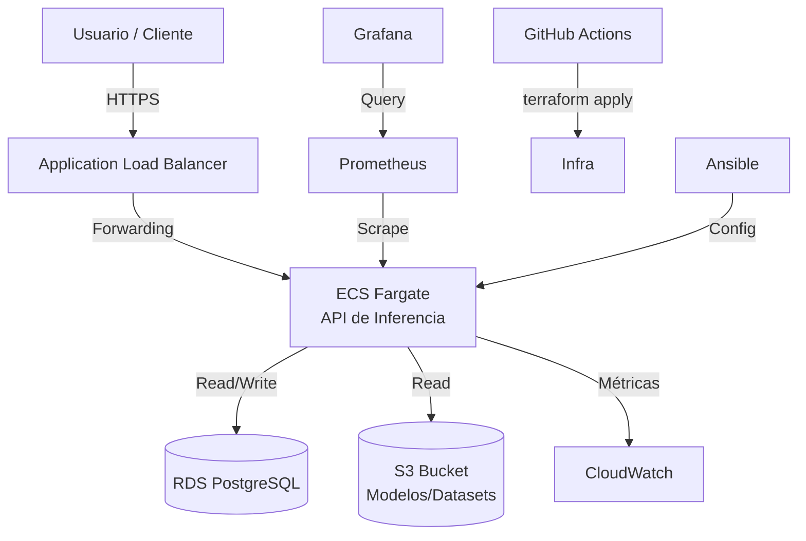
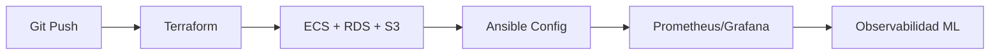

# 🎯 Caso Práctico - Infraestructura Completa como Código

Este caso práctico integra todo el conocimiento adquirido en un proyecto realista: desplegar la infraestructura completa para una aplicación de Machine Learning que expone un modelo de inferencia mediante una API REST, con base de datos, almacenamiento de objetos, monitoreo y pipeline de despliegue automatizado.

> 💡 **Relevancia para ML/AI Engineering**: En la industria, un modelo no vive aislado. Necesita una red segura, balanceo de carga, autoescalado, almacenamiento persistente y observabilidad. Este proyecto simula exactamente ese escenario.


---

## 1. Requisitos del proyecto

| ID | Requisito | Justificación |
|----|-----------|---------------|
| R1 | Red privada con subnets públicas y privadas | Seguridad por capas para la base de datos |
| R2 | Balanceador de aplicaciones (ALB) | Distribuir tráfico a contenedores de inferencia |
| R3 | ECS Fargate para la API | Serverless containers, pago por uso |
| R4 | RDS PostgreSQL | Almacenamiento de metadatos y predicciones |
| R5 | S3 para artefactos | Modelos entrenados y datasets versionados |
| R6 | IAM roles con least privilege | Seguridad y compliance |
| R7 | Monitoreo con Prometheus/Grafana | Observabilidad del rendimiento del modelo |
| R8 | Pipeline CI/CD en GitHub Actions | Automatización de despliegues |

---

## 2. Arquitectura de la solución



---

## 3. Componentes de infraestructura

### 3.1 VPC, subnets y ALB

La VPC aísla todo el entorno. El ALB expone únicamente la API al público.

```hcl
# terraform/vpc.tf
resource "aws_vpc" "ml_app" {
  cidr_block = "10.0.0.0/16"
  tags = { Name = "ml-app-vpc" }
}

resource "aws_subnet" "public" {
  count                   = 2
  vpc_id                  = aws_vpc.ml_app.id
  cidr_block              = cidrsubnet(aws_vpc.ml_app.cidr_block, 8, count.index)
  map_public_ip_on_launch = true
  availability_zone       = data.aws_availability_zones.available.names[count.index]
}

resource "aws_lb" "ml_alb" {
  name               = "ml-alb"
  internal           = false
  load_balancer_type = "application"
  security_groups    = [aws_security_group.alb.id]
  subnets            = aws_subnet.public[*].id
}
```

### 3.2 ECS Fargate

```hcl
resource "aws_ecs_cluster" "ml_cluster" {
  name = "ml-inference-cluster"
}

resource "aws_ecs_task_definition" "ml_api" {
  family                   = "ml-api"
  network_mode             = "awsvpc"
  requires_compatibilities = ["FARGATE"]
  cpu                      = "512"
  memory                   = "1024"
  execution_role_arn       = aws_iam_role.ecs_execution.arn
  container_definitions    = jsonencode([{
    name  = "ml-api"
    image = "${aws_ecr_repository.ml_api.repository_url}:latest"
    portMappings = [{ containerPort = 8080 }]
  }])
}
```

### 3.3 RDS y S3

```hcl
resource "aws_db_instance" "ml_db" {
  identifier        = "ml-postgres"
  engine            = "postgres"
  instance_class    = "db.t3.micro"
  allocated_storage = 20
  username          = "mluser"
  password          = var.db_password
  vpc_security_group_ids = [aws_security_group.rds.id]
}

resource "aws_s3_bucket" "ml_artifacts" {
  bucket = "ml-artifacts-${data.aws_caller_identity.current.account_id}"
}
```

⚠️ **Advertencia**: La contraseña de RDS debe gestionarse con AWS Secrets Manager o Ansible Vault. Nunca en texto plano.

---

## 4. Pipeline de despliegue

El pipeline en GitHub Actions ejecuta Terraform y Ansible de forma secuencial.

```yaml
# .github/workflows/deploy.yml
name: Deploy ML Infrastructure

on:
  push:
    branches: [main]

jobs:
  terraform:
    runs-on: ubuntu-latest
    steps:
      - uses: actions/checkout@v4
      - uses: hashicorp/setup-terraform@v3

      - name: Terraform Init
        run: terraform init
        working-directory: ./terraform

      - name: Terraform Plan
        run: terraform plan -out=tfplan
        working-directory: ./terraform

      - name: Terraform Apply
        if: github.ref == 'refs/heads/main'
        run: terraform apply -auto-approve tfplan
        working-directory: ./terraform

  ansible:
    needs: terraform
    runs-on: ubuntu-latest
    steps:
      - uses: actions/checkout@v4

      - name: Setup Ansible
        run: pip install ansible

      - name: Configure hosts
        run: ansible-playbook -i inventory.aws_ec2.yml configure.yml
        working-directory: ./ansible
```

---

## 5. Monitoreo con Prometheus y Grafana

Tras el despliegue, Prometheus recolecta métricas de la API. Grafana visualiza dashboards de negocio y técnicos.

```yaml
# ansible/files/prometheus.yml
scrape_configs:
  - job_name: 'ml-api-fargate'
    file_sd_configs:
      - files:
          - 'targets.json'
    metrics_path: /metrics
```

---

## 6. Métricas de éxito

El éxito del proyecto se mide con:

$$CostEfficiency = \frac{RequestsHandled}{InfraCost}$$

$$DeploymentFrequency = \frac{Deployments}{Week}$$

$$MTTR = MeanTimeToRecovery$$

| Métrica | SLO | Herramienta |
|---------|-----|-------------|
| Latencia p99 | < 500 ms | Prometheus + Grafana |
| Availability | 99.9% | CloudWatch |
| Error rate | < 1% | Prometheus |
| Deploy time | < 15 min | GitHub Actions |

> Caso real: Un fintech de scoring crediticio desplegó una arquitectura similar en AWS. Al migrar de EC2 tradicional a ECS Fargate con Terraform, redujeron sus costos de infraestructura en un 40% y acortaron el tiempo de despliegue de nuevos modelos de 2 días a 20 minutos.

---

## 🎯 Proyecto documentado

### Entregables

1. **Repositorio Git**: Estructura con carpetas `terraform/`, `ansible/`, `.github/workflows/`.
2. **Infraestructura desplegada**: VPC, ALB, ECS, RDS, S3.
3. **Pipeline funcional**: GitHub Actions que ejecuta `terraform plan/apply` y luego Ansible.
4. **Dashboards**: Grafana con métricas de infraestructura y negocio.
5. **Documentación**: README con diagramas, instrucciones de despliegue y troubleshooting.

### Estructura del repositorio

```
ml-infra-project/
├── terraform/
│   ├── main.tf
│   ├── vpc.tf
│   ├── ecs.tf
│   ├── rds.tf
│   └── variables.tf
├── ansible/
│   ├── inventory.aws_ec2.yml
│   ├── configure.yml
│   └── files/
├── .github/
│   └── workflows/
│       └── deploy.yml
├── prometheus/
│   └── prometheus.yml
└── README.md
```

### Próximos pasos

1. Clonar el repositorio y configurar credenciales AWS.
2. Ejecutar `terraform init && terraform apply` localmente para validar.
3. Configurar GitHub Secrets (`AWS_ACCESS_KEY_ID`, `AWS_SECRET_ACCESS_KEY`).
4. Hacer push a `main` y verificar el pipeline.
5. Acceder a Grafana y validar métricas.

---

## 📦 Código de compresión

```hcl
# main.tf - Proyecto completo (resumen)
module "vpc" {
  source  = "terraform-aws-modules/vpc/aws"
  name    = "ml-vpc"
  cidr    = "10.0.0.0/16"
  azs     = ["us-east-1a", "us-east-1b"]
  public_subnets  = ["10.0.1.0/24", "10.0.2.0/24"]
  private_subnets = ["10.0.3.0/24", "10.0.4.0/24"]
}

resource "aws_ecs_cluster" "this" { name = "ml-cluster" }
resource "aws_db_instance" "this" {
  engine = "postgres"; instance_class = "db.t3.micro"; allocated_storage = 20
}
resource "aws_s3_bucket" "artifacts" { bucket = "ml-artifacts-bucket" }
```

```yaml
# deploy.yml (resumen)
- terraform plan/apply
- ansible-playbook configure.yml
- prometheus + grafana
```


