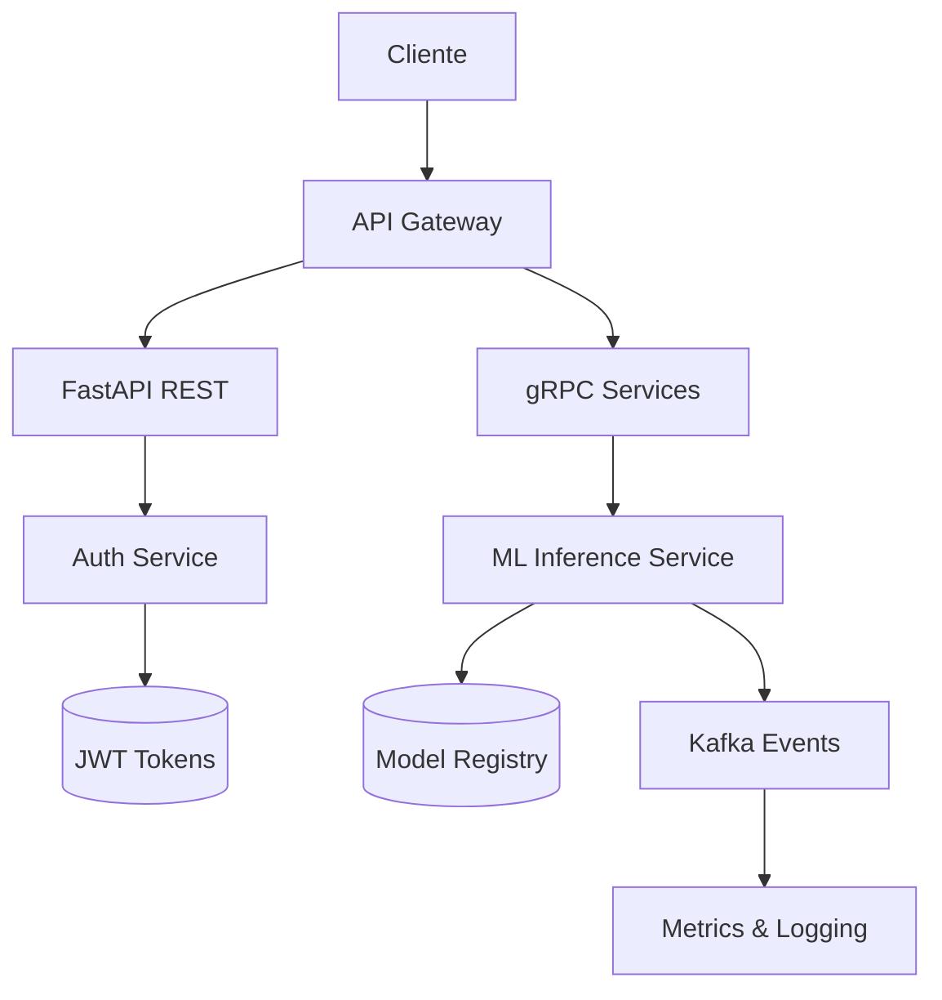
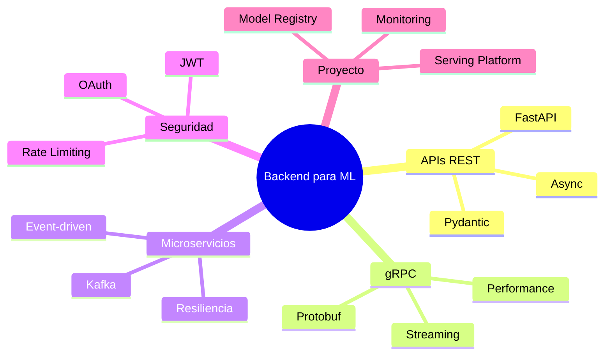

# 🚀 Bienvenida: Backend para ML

¡Bienvenido al módulo 24 del programa de Machine Learning e IA Engineering! En esta unidad exploraremos cómo construir infraestructuras backend robustas, escalables y seguras que permitan servir modelos de inteligencia artificial en producción.

La transición de un notebook de Jupyter a un sistema productivo requiere dominio de APIs, protocolos de comunicación, arquitecturas distribuidas y seguridad. Sin un backend bien diseñado, incluso el modelo más preciso permanece inaccesible para usuarios y aplicaciones.


## 1. Objetivos de Aprendizaje

Al finalizar este curso, serás capaz de:

1. Diseñar APIs REST eficientes usando FastAPI y Pydantic para servir inferencias de ML.
2. Implementar comunicación entre servicios mediante gRPC y Protocol Buffers.
3. Arquitecturar sistemas basados en microservicios y eventos con resiliencia.
4. Asegurar APIs con autenticación JWT, OAuth 2.0, rate limiting y buenas prácticas.
5. Construir una plataforma completa de serving de modelos en producción.


## 2. Índice de Notas

| # | Nota | Descripción |
|---|------|-------------|
| 00 | [[00 - Bienvenida]] | Índice, glosario y objetivos |
| 01 | [[01 - FastAPI y APIs REST]] | Construcción de APIs RESTful con FastAPI |
| 02 | [[02 - gRPC y Comunicacion entre Servicios]] | Comunicación de alto rendimiento con gRPC |
| 03 | [[03 - Microservicios y Arquitectura de Eventos]] | Microservicios, eventos y resiliencia |
| 04 | [[04 - Autenticacion y Seguridad en APIs]] | Seguridad, auth y protección de endpoints |
| 05 | [[05 - Caso Practico - Plataforma de Serving de Modelos]] | Proyecto integrador de serving de ML |


## 3. Diagrama del Módulo




## 4. Glosario de Términos

| Término | Definición |
|---------|------------|
| **API** | Interfaz de Programación de Aplicaciones. Protocolo que permite la comunicación entre softwares. |
| **REST** | Representational State Transfer. Estilo arquitectónico para sistemas hipermedia distribuidos basado en recursos y verbos HTTP. |
| **HTTP** | Protocolo de Transferencia de Hipertexto. Fundamento de la comunicación web (GET, POST, PUT, DELETE). |
| **gRPC** | Google Remote Procedure Call. Framework de RPC de alto rendimiento basado en HTTP/2 y Protocol Buffers. |
| **protobuf** | Protocol Buffers. Mecanismo de serialización estructurada desarrollado por Google, extensible y eficiente. |
| **microservice** | Estilo arquitectónico que estructura una aplicación como una colección de servicios débilmente acoplados. |
| **monolith** | Aplicación única donde todos los componentes están integrados en un solo despliegue. |
| **event-driven** | Arquitectura donde la producción, detección y consumo de eventos impulsan el flujo de la aplicación. |
| **Kafka** | Plataforma de streaming distribuida de alto throughput para construir pipelines de datos en tiempo real. |
| **RabbitMQ** | Broker de mensajes que implementa AMQP y facilita la comunicación asíncrona entre servicios. |
| **auth** | Proceso de autenticación (verificación de identidad) y autorización (permisos de acceso). |
| **JWT** | JSON Web Token. Token compacto y autocontenido para transmitir información entre partes de forma segura. |
| **OAuth** | Protocolo de autorización abierto que permite a terceros obtener acceso limitado a recursos. |
| **rate limiting** | Técnica para controlar la cantidad de tráfico enviado o recibido por un endpoint. |
| **middleware** | Software intermedio que procesa solicitudes y respuestas en el pipeline de una aplicación. |
| **async** | Modelo de programación asíncrona que permite manejar múltiples operaciones concurrentes sin bloquear. |
| **dependency injection** | Patrón de diseño donde un objeto recibe sus dependencias desde una fuente externa en lugar de crearlas. |


## 5. Relevancia para ML/AI Engineering

Los modelos de machine learning no generan valor hasta que están expuestos a través de interfaces consumibles. El backend actúa como el puente entre la ciencia de datos y la ingeniería de software productiva.

Las métricas de un sistema de ML en producción no solo miden la exactitud del modelo $Accuracy = \frac{TP + TN}{TP + TN + FP + FN}$, sino también la latencia de inferencia, throughput de peticiones y disponibilidad del servicio.

Caso real: Netflix utiliza microservicios para servir recomendaciones personalizadas. Su backend procesa más de 450 mil millones de eventos diarios a través de arquitecturas basadas en eventos para alimentar modelos de ranking en tiempo real.


## 6. Mapa Mental del Módulo




## 7. Recursos Visuales


---

⚠️ **Advertencia:** Este módulo asume conocimientos previos de Python, HTTP y conceptos básicos de redes. Se recomienda completar los módulos anteriores de Python avanzado antes de continuar.

💡 **Tip:** Mantén un entorno virtual por cada servicio que construyas. La independencia de dependencias es crítica cuando trabajas con múltiples modelos y librerías de ML.


## 📦 Código de Compresión

```python
# summary_welcome.py
# Resumen ejecutivo del módulo 24 - Backend para ML

MODULE_TOPICS = [
    "FastAPI y APIs REST",
    "gRPC y Comunicacion entre Servicios",
    "Microservicios y Arquitectura de Eventos",
    "Autenticacion y Seguridad en APIs",
    "Caso Practico - Plataforma de Serving de Modelos"
]

GLOSSARY_ESSENTIALS = [
    "API", "REST", "HTTP", "gRPC", "protobuf",
    "microservice", "monolith", "event-driven",
    "Kafka", "RabbitMQ", "JWT", "OAuth"
]

print("=== Modulo 24: Backend para ML ===")
print(f"Temas: {len(MODULE_TOPICS)}")
print(f"Terminos clave: {len(GLOSSARY_ESSENTIALS)}")
```
