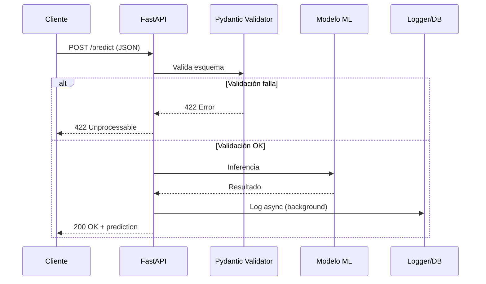

# ⚡ FastAPI y APIs REST

Las APIs REST constituyen el estándar de facto para exponer modelos de machine learning a clientes heterogéneos. FastAPI, un framework moderno de Python basado en Starlette y Pydantic, ha emergido como la herramienta preferida para construir APIs de alto rendimiento gracias a su soporte nativo de async/await, validación automática y generación de documentación OpenAPI.

En ML Engineering, una API REST permite que científicos de datos desplieguen modelos sin preocuparse por el lenguaje del cliente. La inferencia se convierte en un recurso HTTP accesible: un POST a `/predict` con un JSON de entrada retorna la predicción.


## 1. Comparativa de Frameworks Python para APIs

| Característica | FastAPI | Flask | Django REST Framework |
|---------------|---------|-------|----------------------|
| Performance | ⭐⭐⭐ Muy alta | ⭐⭐ Media | ⭐⭐ Media |
| Validación automática | Sí (Pydantic) | No (requiere extensión) | Sí (serializers) |
| Documentación auto | Sí (Swagger/ReDoc) | No (requiere extensión) | Sí (con configuración) |
| Async/await nativo | Sí | No | Parcial |
| Curva de aprendizaje | Media | Baja | Alta |
| Inyección de dependencias | Nativa | No | Parcial |
| Tamaño del framework | Ligero | Ligero | Pesado |

La elección de FastAPI para ML no es arbitraria. Cuando servimos modelos, la latencia importa. La capacidad de manejar múltiples solicitudes concurrentemente mediante `async` evita que un modelo pesado bloquee el servidor.

Caso real: Uber migró servicios de predicción de demanda a FastAPI para reducir la latencia de sus endpoints de ML en un 40%, aprovechando el soporte asíncrono para I/O intensivo.


## 2. Async/Await en Endpoints de ML

El modelo de concurrencia asíncrona de Python, basado en el event loop, es ideal para operaciones de I/O bound como la recepción de solicitudes HTTP, lectura de archivos o llamadas a bases de datos.

```python
import asyncio
from fastapi import FastAPI

app = FastAPI()

@app.post("/predict")
async def predict(features: dict):
    # I/O no bloqueante: lectura de modelo desde almacenamiento
    model = await load_model_async("s3://models/v1.pkl")
    # CPU-bound: la inferencia sí bloquea, usar ThreadPoolExecutor
    loop = asyncio.get_event_loop()
    prediction = await loop.run_in_executor(None, model.predict, features)
    return {"prediction": prediction}
```

⚠️ **Advertencia:** Las operaciones CPU-bound (como la inferencia de modelos de deep learning) no deben ejecutarse directamente en coroutines porque bloquean el event loop. Utiliza `run_in_executor` o procesos separados.

💡 **Tip:** Para modelos de deep learning que soportan batching, acumula solicitudes durante un ventana de tiempo $t$ y ejecuta inferencia batchada para maximizar throughput.


## 3. Validación con Pydantic

Pydantic utiliza type hints de Python para validar y serializar datos. En APIs de ML, esto garantiza que las features de entrada cumplan con el esquema esperado antes de llegar al modelo.

```python
from pydantic import BaseModel, Field
from typing import List

class InferenceRequest(BaseModel):
    features: List[float] = Field(..., min_length=10, max_length=10)
    model_version: str = Field(default="v1", pattern=r"^v\d+$")
    
    class Config:
        json_schema_extra = {
            "example": {
                "features": [0.1, 0.2, 0.3, 0.4, 0.5, 0.6, 0.7, 0.8, 0.9, 1.0],
                "model_version": "v1"
            }
        }

@app.post("/predict")
async def predict(request: InferenceRequest):
    # Los datos ya están validados
    return {"input_shape": len(request.features)}
```

La validación previa previene errores costosos en runtime. Si un cliente envía 9 features en lugar de 10, FastAPI responde automáticamente con un 422 Unprocessable Entity.


## 4. Inyección de Dependencias

FastAPI implementa dependency injection de forma nativa. Esto permite compartir recursos (como conexiones a bases de datos o instancias de modelos) entre endpoints de manera limpia.

```python
from fastapi import Depends

async def get_model():
    model = await load_model("production")
    try:
        yield model
    finally:
        await model.cleanup()

@app.post("/predict")
async def predict(request: InferenceRequest, model=Depends(get_model)):
    result = model.predict(request.features)
    return {"prediction": result}
```

La inyección de dependencias facilita el testing. Puedes sustituir `get_model` por un mock durante pruebas unitarias sin modificar la lógica del endpoint.


## 5. Background Tasks y Middleware

Las tareas en segundo plano son esenciales para ML: logging de predicciones, almacenamiento de métricas o encolamiento de jobs de reentrenamiento no deben bloquear la respuesta al cliente.

```python
from fastapi import BackgroundTasks

async def log_prediction(features: list, prediction: float):
    await save_to_db(features, prediction)

@app.post("/predict")
async def predict(
    request: InferenceRequest,
    background_tasks: BackgroundTasks,
    model=Depends(get_model)
):
    result = model.predict(request.features)
    background_tasks.add_task(log_prediction, request.features, result)
    return {"prediction": result}
```

El middleware permite ejecutar código antes y después de cada request. Útil para métricas, tracing o headers de seguridad.

```python
from fastapi import Request
import time

@app.middleware("http")
async def add_process_time_header(request: Request, call_next):
    start_time = time.time()
    response = await call_next(request)
    process_time = time.time() - start_time
    response.headers["X-Process-Time"] = str(process_time)
    return response
```


## 6. Exception Handlers y Robustez

Los modelos de ML fallan: features inesperadas, versiones incompatibles o errores de memoria. Un buen backend captura y transforma estas excepciones en respuestas HTTP coherentes.

```python
from fastapi import HTTPException
from fastapi.responses import JSONResponse

class ModelNotFoundException(Exception):
    pass

@app.exception_handler(ModelNotFoundException)
async def model_not_found_handler(request, exc):
    return JSONResponse(
        status_code=404,
        content={"detail": "Modelo no encontrado en el registry"}
    )
```

⚠️ **Advertencia:** Nunca expongas tracebacks completos al cliente en producción. Utiliza loggers internos y responde con mensajes genéricos al usuario.


## 7. OpenAPI y Swagger Auto-generado

FastAPI genera automáticamente documentación interactiva en `/docs` (Swagger UI) y `/redoc` (ReDoc). Esto elimina la duplicación entre código y documentación.


Para equipos de ML, esto significa que los científicos de datos pueden probar endpoints directamente desde el navegador sin escribir código cliente.


## 8. Testing con TestClient

El testing de APIs de ML debe cubrir validación de inputs, integridad de respuestas y manejo de errores.

```python
from fastapi.testclient import TestClient

client = TestClient(app)

def test_predict_valid_input():
    response = client.post("/predict", json={
        "features": [0.1] * 10,
        "model_version": "v1"
    })
    assert response.status_code == 200
    assert "prediction" in response.json()

def test_predict_invalid_input():
    response = client.post("/predict", json={
        "features": [0.1] * 9  # Incorrect length
    })
    assert response.status_code == 422
```


## 9. Deployment: Uvicorn y Gunicorn

FastAPI corre sobre ASGI, no WSGI. Uvicorn es el servidor ASGI recomendado, y Gunicorn actúa como process manager para múltiples workers de Uvicorn.

```bash
# Desarrollo
uvicorn main:app --reload --host 0.0.0.0 --port 8000

# Producción: múltiples workers
# Fórmula recomendada: workers = 2 * CPU_cores + 1
gunicorn main:app -w 4 -k uvicorn.workers.UvicornWorker --bind 0.0.0.0:8000
```

La fórmula de workers de Gunicorn:

$$
W = 2 \times C + 1
$$

Donde $W$ es el número de workers y $C$ es la cantidad de núcleos CPU. Para workloads de ML, considera workers = número de GPUs disponibles si cada worker carga un modelo en GPU.


## 10. Versioning de APIs

En ML, el versionado es crítico. Los modelos evolucionan y las APIs deben soportar múltiples versiones simultáneamente.

```python
from fastapi import APIRouter

v1_router = APIRouter(prefix="/v1")
v2_router = APIRouter(prefix="/v2")

@v1_router.post("/predict")
async def predict_v1(request: InferenceRequest):
    model = await load_model("v1")
    return model.predict(request.features)

@v2_router.post("/predict")
async def predict_v2(request: InferenceRequest):
    model = await load_model("v2")
    return model.predict_enhanced(request.features)

app.include_router(v1_router)
app.include_router(v2_router)
```

Caso real: OpenAI versiona explícitamente sus APIs de GPT. Cada modelo (`gpt-3.5-turbo`, `gpt-4`) expone capacidades distintas a través del mismo endpoint base con diferentes versiones de API.


## 11. Arquitectura de una API de ML




## 12. Imágenes de Referencia


---

⚠️ **Advertencia:** No expongas endpoints de inferencia sin autenticación en producción. Un atacante podría saturar tu servicio con requests maliciosos o extraer información del modelo (model inversion attacks).

💡 **Tip:** Implementa health checks (`/health`) que verifiquen no solo que el servidor responde, sino que el modelo está cargado y listo para inferencia.


## 📦 Código de Compresión

```python
# fastapi_ml_api.py
# API REST completa para serving de modelos ML con FastAPI

from fastapi import FastAPI, Depends, BackgroundTasks, HTTPException
from pydantic import BaseModel, Field
from typing import List
import asyncio
import time

app = FastAPI(title="ML Inference API", version="1.0.0")

class PredictRequest(BaseModel):
    features: List[float] = Field(..., min_length=10, max_length=10)
    model_version: str = "v1"

class PredictResponse(BaseModel):
    prediction: float
    model_version: str
    latency_ms: float

# Simulación de modelo
class FakeModel:
    def predict(self, features: List[float]) -> float:
        return sum(features) / len(features)
    async def cleanup(self):
        pass

async def get_model():
    model = FakeModel()
    try:
        yield model
    finally:
        await model.cleanup()

async def log_prediction(features, result, version):
    await asyncio.sleep(0.01)
    print(f"[LOG] v={version} pred={result:.4f}")

@app.middleware("http")
async def add_metrics(request, call_next):
    start = time.time()
    response = await call_next(request)
    latency = (time.time() - start) * 1000
    response.headers["X-Latency-Ms"] = str(latency)
    return response

@app.post("/predict", response_model=PredictResponse)
async def predict(
    req: PredictRequest,
    background: BackgroundTasks,
    model=Depends(get_model)
):
    start = time.time()
    pred = model.predict(req.features)
    latency = (time.time() - start) * 1000
    background.add_task(log_prediction, req.features, pred, req.model_version)
    return PredictResponse(
        prediction=pred,
        model_version=req.model_version,
        latency_ms=latency
    )

@app.get("/health")
async def health():
    return {"status": "ok", "model_loaded": True}

# Ejecutar: uvicorn fastapi_ml_api:app --reload
```
