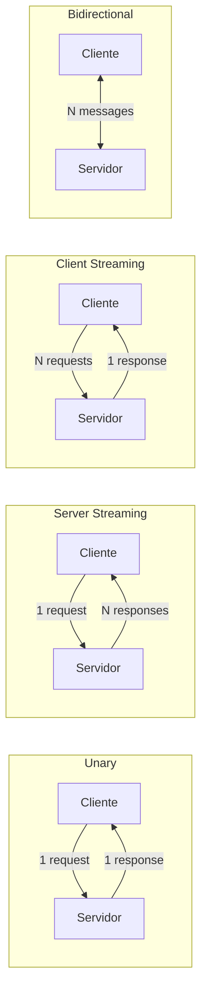
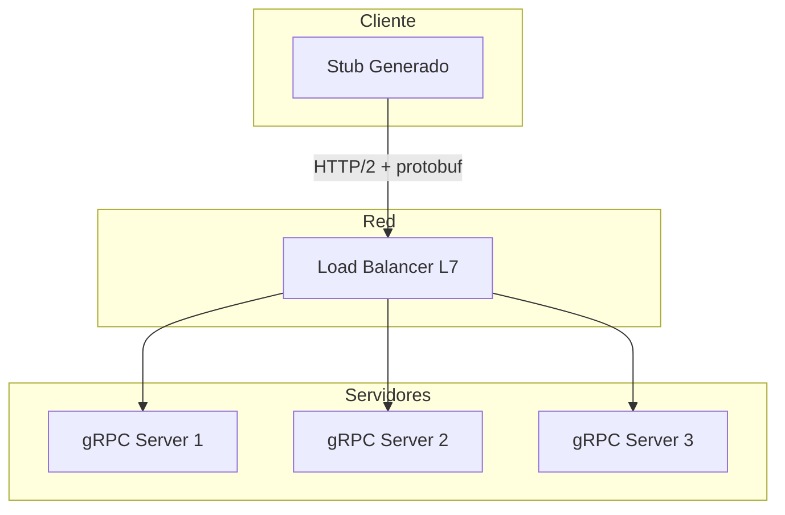

# 🔌 gRPC y Comunicación entre Servicios

Cuando una API REST ya no es suficiente para las demandas de latencia y throughput de sistemas de ML distribuidos, gRPC emerge como la solución estándar para comunicación inter-servicio. Desarrollado por Google, gRPC utiliza HTTP/2 y Protocol Buffers para ofrecer contratos fuertemente tipados, streaming bidireccional y una eficiencia de serialización superior a JSON.

En plataformas de ML, gRPC es fundamental para conectar servicios de ingestión de datos, preprocesamiento, inferencia y post-procesamiento donde cada milisegundo de latencia acumulada impacta la experiencia del usuario.


## 1. REST vs gRPC: Comparativa Profunda

| Característica | REST (JSON/HTTP 1.1) | gRPC (Protobuf/HTTP 2) |
|---------------|----------------------|------------------------|
| Protocolo transporte | HTTP/1.1 o HTTP/2 | HTTP/2 obligatorio |
| Formato de datos | JSON (texto, verboso) | Protobuf (binario, compacto) |
| Contrato | OpenAPI/Swagger (opcional) | .proto obligatorio (fuertemente tipado) |
| Streaming | No nativo (SSE/WebSocket workaround) | Unary, Server, Client, Bidirectional |
| Generación de código | Manual o con herramientas | Automática desde .proto |
| Compatibilidad navegador | Nativa | Requiere gRPC-Web proxy |
| Latencia típica | Alta (handshake por request) | Baja (multiplexación + conexión persistente) |
| Payload size | ~2-3x mayor | Mínimo (binario optimizado) |

La multiplexación de HTTP/2 permite que múltiples RPCs compartan una única conexión TCP, eliminando el overhead de establecimiento de conexión que sufre REST sobre HTTP/1.1.

Caso real: TensorFlow Serving, el sistema oficial de Google para servir modelos de TensorFlow, expone su API principalmente a través de gRPC. Las predicciones batchadas via gRPC son hasta 5x más rápidas que las equivalentes REST/JSON debido a la eficiencia de protobuf.


## 2. Protocol Buffers (protobuf)

Protocol Buffers es un mecanismo de serialización independiente de lenguaje y plataforma. Los mensajes se definen en archivos `.proto` y el compilador `protoc` genera código cliente y servidor.

Un mensaje protobuf típico para inferencia de ML:

```protobuf
syntax = "proto3";

package ml.inference;

service InferenceService {
  rpc Predict(PredictRequest) returns (PredictResponse);
  rpc PredictStream(stream PredictRequest) returns (stream PredictResponse);
}

message PredictRequest {
  string model_name = 1;
  string model_version = 2;
  repeated float features = 3;
  map<string, string> metadata = 4;
}

message PredictResponse {
  repeated float predictions = 1;
  int64 inference_time_ms = 2;
  string model_version = 3;
}
```

Cada campo tiene un número único (tag) que identifica el campo en la serialización binaria. Este diseño permite agregar campos nuevos sin romper compatibilidad backward: un cliente antiguo simplemente ignora los tags desconocidos.

💡 **Tip:** Numera los campos de forma consecutiva pero reserva rangos para extensiones futuras. Los tags 1-15 ocupan 1 byte en la serialización; los 16-2047 ocupan 2 bytes.


## 3. Streaming en gRPC

gRPC soporta cuatro modalidades de comunicación, cada una con aplicaciones específicas en ML:



| Modo | Uso en ML |
|------|-----------|
| **Unary** | Predicción simple: request/response único. |
| **Server Streaming** | Streaming de resultados parciales de un modelo seq2seq. |
| **Client Streaming** | Enviar batch progresivamente para inferencia acumulativa. |
| **Bidirectional** | Chatbots con LLMs: envío de tokens y recepción de tokens generados. |


## 4. Implementación Python: Servidor y Cliente

Primero, generamos código desde el `.proto`:

```bash
python -m grpc_tools.protoc -I. --python_out=. --grpc_python_out=. inference.proto
```

Servidor gRPC con Python:

```python
# server.py
from concurrent import futures
import grpc
import inference_pb2
import inference_pb2_grpc

class InferenceServicer(inference_pb2_grpc.InferenceServiceServicer):
    def Predict(self, request, context):
        # Simulación de inferencia
        prediction = sum(request.features) / max(len(request.features), 1)
        return inference_pb2.PredictResponse(
            predictions=[prediction],
            inference_time_ms=12,
            model_version=request.model_version
        )
    
    def PredictStream(self, request_iterator, context):
        for request in request_iterator:
            yield self.Predict(request, context)

def serve():
    server = grpc.server(futures.ThreadPoolExecutor(max_workers=10))
    inference_pb2_grpc.add_InferenceServiceServicer_to_server(
        InferenceServicer(), server
    )
    server.add_insecure_port("[::]:50051")
    server.start()
    server.wait_for_termination()

if __name__ == "__main__":
    serve()
```

Cliente gRPC:

```python
# client.py
import grpc
import inference_pb2
import inference_pb2_grpc

def run():
    channel = grpc.insecure_channel("localhost:50051")
    stub = inference_pb2_grpc.InferenceServiceStub(channel)
    
    request = inference_pb2.PredictRequest(
        model_name="regressor",
        model_version="v1",
        features=[0.1, 0.2, 0.3, 0.4, 0.5],
        metadata={"client_id": "web_app"}
    )
    
    response = stub.Predict(request)
    print(f"Predicción: {response.predictions}")
    print(f"Latencia reportada: {response.inference_time_ms}ms")

if __name__ == "__main__":
    run()
```

⚠️ **Advertencia:** En producción, nunca uses `insecure_channel`. Configura credenciales TLS con `grpc.ssl_channel_credentials()` para cifrar la comunicación inter-servicio.


## 5. Interceptors y Middleware

Los interceptores en gRPC funcionan de manera similar al middleware de FastAPI: procesan requests y responses para logging, autenticación, métricas o tracing distribuido.

```python
class AuthInterceptor(grpc.ServerInterceptor):
    def intercept_service(self, continuation, handler_call_details):
        # Lógica de autenticación previa
        print(f"Request a: {handler_call_details.method}")
        return continuation(handler_call_details)

server = grpc.server(
    futures.ThreadPoolExecutor(max_workers=10),
    interceptors=(AuthInterceptor(),)
)
```


## 6. Load Balancing y Service Mesh

gRPC utiliza conexiones HTTP/2 persistentes, lo que complica el balanceo de carga a nivel de conexión (L4). La solución es el **load balancing a nivel de aplicación (L7)**, donde el cliente mantiene múltiples sub-conexiones y distribuye RPCs entre ellas.

| Estrategia | Descripción |
|-----------|-------------|
| **Round Robin** | Distribuye RPCs circularmente entre backends. |
| **Pick First** | Conecta al primer backend disponible. |
| **Weighted** | Asigna pesos según capacidad del servidor. |

Caso real: Istio, un service mesh para Kubernetes, inyecta sidecars proxy (Envoy) junto a cada pod de ML. Estos proxies manejan automáticamente el balanceo L7 de gRPC, mTLS entre servicios y circuit breaking sin modificar el código de la aplicación.


## 7. Rendimiento: Métricas Cuantitativas

La eficiencia de gRPC sobre REST puede cuantificarse en tres dimensiones:

**Latencia ($L$):**

$$
L_{gRPC} \approx L_{REST} \times 0.3 \text{ a } 0.5
$$

**Throughput ($T$):**

$$
T_{gRPC} = \frac{N_{requests}}{T_{total}} \gg T_{REST}
$$

Debido a la multiplexación HTTP/2 y la ausencia de overhead de parseo JSON.

**Tamaño de payload ($S$):**

$$
S_{protobuf} \approx S_{JSON} \times 0.25 \text{ a } 0.35
$$

| Métrica | REST/JSON | gRPC/Protobuf | Mejora |
|---------|-----------|---------------|--------|
| Latencia p50 | 45 ms | 12 ms | 3.75x |
| Latencia p99 | 180 ms | 35 ms | 5.1x |
| Throughput | 2,000 RPS | 15,000 RPS | 7.5x |
| Payload (10k features) | 280 KB | 78 KB | 3.6x |


## 8. ¿Cuándo usar gRPC vs REST?

| Escenario | Recomendación |
|-----------|--------------|
| API pública expuesta a navegadores | REST + OpenAPI |
| Comunicación interna microservicios | gRPC |
| Modelos de streaming (LLMs, audio) | gRPC bidirectional |
| Integración con sistemas legacy | REST |
| Alta frecuencia de predicciones | gRPC |
| Requerimiento de cacheo HTTP | REST |

💡 **Tip:** Muchas plataformas de ML adoptan un patrón híbrido: REST en el edge (API Gateway hacia clientes externos) y gRPC en el core (comunicación entre microservicios internos).


## 9. Diagrama de Arquitectura gRPC




## 10. Imágenes de Referencia


---

⚠️ **Advertencia:** Los `.proto` son contratos. Cualquier cambio incompatible (cambiar el tipo de un campo existente, reutilizar un tag) rompe clientes antiguos. Usa reglas de versión semántica para tus esquemas protobuf.

💡 **Tip:** Utiliza `grpcio-reflection` para habilitar reflection en servidores de desarrollo. Herramientas como `grpcurl` o Postman pueden introspectar servicios sin necesidad de archivos `.proto` locales.


## 📦 Código de Compresión

```python
# grpc_ml_serving.py
# Servidor y cliente gRPC mínimos para serving de ML

# --- Archivo inference.proto (definición) ---
PROTO_DEF = """
syntax = "proto3";
package ml;

service Predictor {
  rpc Predict(PredictRequest) returns (PredictResponse);
}

message PredictRequest {
  repeated float features = 1;
}

message PredictResponse {
  float score = 1;
}
"""

# --- Servidor ---
from concurrent import futures
import grpc

# Asumiendo que inference_pb2 e inference_pb2_grpc fueron generados
class PredictorServicer(inference_pb2_grpc.PredictorServicer):
    def Predict(self, request, context):
        score = sum(request.features) / max(len(request.features), 1)
        return inference_pb2.PredictResponse(score=score)

def serve():
    server = grpc.server(futures.ThreadPoolExecutor(max_workers=4))
    inference_pb2_grpc.add_PredictorServicer_to_server(PredictorServicer(), server)
    server.add_insecure_port("[::]:50051")
    server.start()
    print("gRPC Server en puerto 50051")
    server.wait_for_termination()

# --- Cliente ---
def predict(features):
    channel = grpc.insecure_channel("localhost:50051")
    stub = inference_pb2_grpc.PredictorStub(channel)
    req = inference_pb2.PredictRequest(features=features)
    resp = stub.Predict(req)
    return resp.score

# Ejecutar servidor y luego:
# print(predict([0.1, 0.2, 0.3, 0.4, 0.5]))
```
