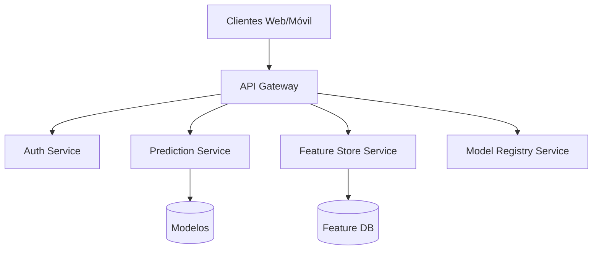
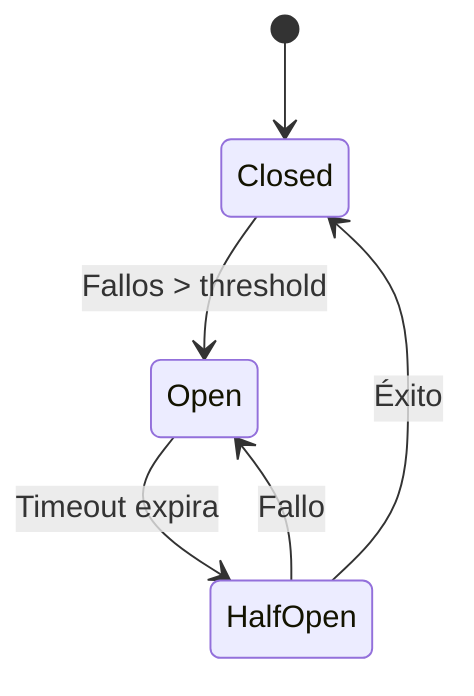
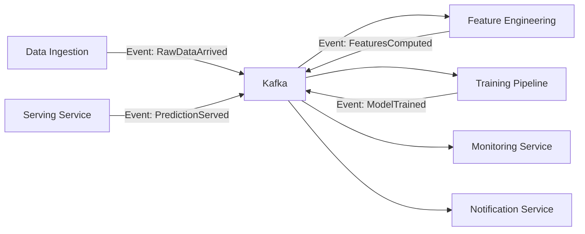
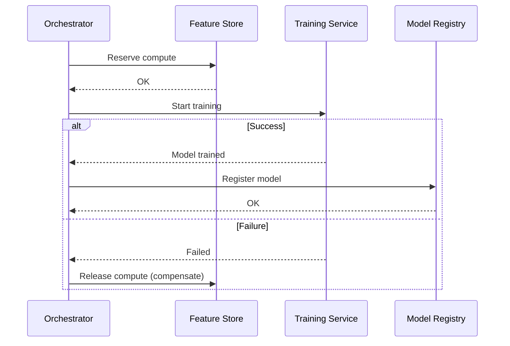

# 🏗️ Microservicios y Arquitectura de Eventos

El monolito ha sido el punto de partida natural para la mayoría de aplicaciones de ML: un único script de Python que carga datos, entrena un modelo y expone una API. Sin embargo, cuando la plataforma crece —múltiples modelos, equipos concurrentes, requisitos de escalabilidad independiente— la arquitectura de microservicios se vuelve inevitable.

Un sistema de ML moderno no es una aplicación, sino un ecosistema: ingestión de datos, feature store, entrenamiento, serving, monitoreo y retraining automatizado. Cada uno de estos componentes tiene patrones de carga, requisitos de escalabilidad y ciclos de despliegue distintos.


## 1. Monolito vs Microservicios

| Característica | Monolito | Microservicios |
|---------------|----------|----------------|
| Despliegue | Único, acoplado | Independiente por servicio |
| Escalabilidad | Horizontal de toda la app | Por componente crítico |
| Complejidad cognitiva | Baja inicial | Alta, distribuida |
| Tecnología | Homogénea | Políglota permitida |
| Debugging | Simple | Requiere tracing distribuido |
| Consistencia de datos | Fuerte (una BD) | Eventual |
| Tiempo de startup | Largo | Rápido por servicio |

La ley de Conway predice que la arquitectura de un sistema refleja la estructura de comunicación de la organización que lo diseña. Equipos autónomos necesitan servicios autónomos.

Caso real: Netflix migró de un monolito Java a más de 700 microservicios para soportar su plataforma de streaming. Su sistema de recomendaciones ML consiste en decenas de servicios especializados: ingestion, feature computation, model training, A/B testing y serving, cada uno con su propio ciclo de vida.


## 2. Bounded Contexts y Domain-Driven Design

En ML, un bounded context define los límites semánticos de un modelo. El concepto de "usuario" para el modelo de recomendación no es igual al "usuario" del sistema de facturación.

| Contexto | Entidad "Usuario" | Atributos relevantes |
|----------|------------------|---------------------|
| Recomendación | Viewer | Historial de visualización, géneros preferidos, tiempo de sesión |
| Facturación | Subscriber | Método de pago, plan activo, fecha de renovación |
| Seguridad | Account | Credenciales, roles, tokens, MFA |

Respetar los bounded contexts evita que un cambio en el esquema de facturación impacte inadvertidamente un modelo de ML.


## 3. API Gateway

El API Gateway actúa como fachada única hacia el exterior, enrutando solicitudes a los microservicios internos y centralizando cross-cutting concerns: autenticación, rate limiting, logging y transformación de protocolos.



💡 **Tip:** En arquitecturas híbridas, el API Gateway traduce REST externo a gRPC interno, permitiendo que clientes consuman JSON mientras los servicios internos se comunican eficientemente con protobuf.


## 4. Service Discovery

En entornos dinámicos (Kubernetes, auto-scaling), las direcciones IP de los servicios cambian constantemente. El service discovery permite que los consumidores localicen instancias saludables automáticamente.

| Herramienta | Tipo | Integración común |
|-------------|------|-------------------|
| **Consul** | DNS + Health checks | Kubernetes, VMs |
| **Eureka** | Registro cliente-side | Spring Cloud, Netflix stack |
| **Kubernetes DNS** | Server-side | Nativo en K8s |
| **AWS Cloud Map** | Cloud-native | ECS, EKS |

El algoritmo de selección de instancia puede ser round-robin, least-connections o basado en health scores:

$$
S_i = \frac{1}{L_i + \epsilon} \times H_i
$$

Donde $S_i$ es el score de selección, $L_i$ la latencia promedio y $H_i$ el health score (0-1) de la instancia $i$.


## 5. Circuit Breaker y Resiliencia

La falla en cascada es el peor enemigo de los sistemas distribuidos. Si el servicio de feature store colapsa, el servicio de predicción no debería bloquearse esperando timeouts indefinidamente.

El patrón Circuit Breaker tiene tres estados:



| Estado | Comportamiento |
|--------|---------------|
| **Closed** | Requests fluyen normalmente. Se monitorea tasa de errores. |
| **Open** | Requests fallan inmediatamente. Se retorna fallback. |
| **Half-Open** | Se permite un request de prueba para verificar recuperación. |

Implementaciones:
- **Java:** Resilience4j
- **Python:** pybreaker
- **Go:** gobreaker

```python
from pybreaker import CircuitBreaker

breaker = CircuitBreaker(fail_max=5, reset_timeout=60)

@breaker
def call_feature_store(user_id):
    # Llamada HTTP/gRPC al feature store
    return requests.get(f"http://features/{user_id}").json()

# Si falla 5 veces consecutivas, el breaker abre
# y las siguientes llamadas lanzan CircuitBreakerError inmediatamente
```

⚠️ **Advertencia:** Un circuit breaker mal configurado puede ocultar problemas reales. Asegúrate de alertar cuando un breaker esté abierto, incluso si la aplicación sigue respondiendo con fallbacks.


## 6. Arquitectura Orientada a Eventos

En lugar de que los servicios se llamen directamente, publican y suscriben eventos a través de un message broker. Esto desacopla productores de consumidores y permite procesamiento asíncrono.



**Ventajas para ML:**
- El servicio de serving no espera al entrenamiento.
- Múltiples consumidores pueden reaccionar al mismo evento (métricas, alertas, logging).
- Facilita el replay de eventos para debugging o retraining.


## 7. Message Brokers: Comparativa

| Característica | RabbitMQ | Apache Kafka | Redis Streams |
|---------------|----------|--------------|---------------|
| Modelo | Colas (AMQP) | Log distribuido (pub/sub) | Log en memoria |
| Persistencia | En disco configurable | Durable por diseño | Volátil (snapshots opcionales) |
| Throughput | ~50k msg/s | >1M msg/s | ~100k msg/s |
| Ordering | Por cola | Por partición | Por stream |
| Retención | Ack-based | Time/size-based | Time-based |
| Caso de uso ML | Task queues, jobs | Event sourcing, pipelines | Caché + colas ligeras |

Caso real: LinkedIn procesa 7 billones de mensajes diarios en Kafka para alimentar sus sistemas de ML. Cada interacción del usuario genera eventos que fluyen a través de decenas de topics hacia modelos de ranking y recomendación.


## 8. CQRS y Saga Pattern

**CQRS** (Command Query Responsibility Segregation) separa los modelos de escritura de los de lectura. En ML, esto permite que el feature store de escritura (ingesta batch) sea optimizado para throughput, mientras que el de lectura (serving) está optimizado para latencia.

**Saga Pattern** gestiona transacciones distribuidas mediante una secuencia de pasos locales compensables. Si el entrenamiento de un modelo falla después de reservar recursos de GPU, un compensating transaction libera esos recursos.




## 9. Eventual Consistency

En sistemas distribuidos, la consistencia fuerte (ACID) es costosa. La consistencia eventual acepta que los datos pueden ser temporalmente inconsistentes entre servicios, pero convergen.

El teorema CAP establece que un sistema distribuido no puede garantizar simultáneamente Consistency, Availability y Partition tolerance.

$$
\text{Dado } P, \text{ se debe elegir entre } C \text{ y } A
$$

Para plataformas de ML, la disponibilidad (Availability) suele priorizarse: es preferible servir una predicción con features ligeramente desactualizadas que rechazar la solicitud.


## 10. Imágenes de Referencia


---

⚠️ **Advertencia:** No fragmentes tu sistema en microservicios prematuramente. La complejidad operativa (logging distribuido, tracing, despliegues múltiples) puede matar la productividad de un equipo pequeño. Empieza con un monolito modular (modulito) y extrae servicios cuando los límites estén claros.

💡 **Tip:** Instrumenta cada microservicio con métricas RED: Rate (requests/seg), Errors (tasa de error), Duration (latencia). Herramientas como Prometheus y Grafana son estándar en observabilidad de ML.


## 📦 Código de Compresión

```python
# microservices_ml_platform.py
# Patrones de microservicios para plataforma de ML

from dataclasses import dataclass
from typing import List, Callable, Optional
import random
import time

# --- Service Discovery simulada ---
REGISTRY = {
    "feature-store": ["http://fs-1:8080", "http://fs-2:8080"],
    "predictor": ["http://pred-1:9000"],
}

def discover(service: str) -> str:
    instances = REGISTRY.get(service, [])
    return random.choice(instances) if instances else None

# --- Circuit Breaker ---
class CircuitBreaker:
    def __init__(self, threshold=3, timeout=10):
        self.failures = 0
        self.threshold = threshold
        self.timeout = timeout
        self.last_failure = 0
        self.state = "CLOSED"

    def call(self, func: Callable, *args, **kwargs):
        if self.state == "OPEN":
            if time.time() - self.last_failure > self.timeout:
                self.state = "HALF_OPEN"
            else:
                raise RuntimeError("Circuit breaker is OPEN")
        try:
            result = func(*args, **kwargs)
            self.failures = 0
            self.state = "CLOSED"
            return result
        except Exception as e:
            self.failures += 1
            self.last_failure = time.time()
            if self.failures >= self.threshold:
                self.state = "OPEN"
            raise e

# --- Event Bus simulado ---
class EventBus:
    def __init__(self):
        self.subscribers: dict[str, List[Callable]] = {}

    def subscribe(self, event_type: str, handler: Callable):
        self.subscribers.setdefault(event_type, []).append(handler)

    def publish(self, event_type: str, payload: dict):
        for handler in self.subscribers.get(event_type, []):
            handler(payload)

# --- Uso ---
bus = EventBus()
breaker = CircuitBreaker()

@dataclass
class PredictionEvent:
    model: str
    latency_ms: float
    error: Optional[str] = None

def on_prediction_served(payload):
    print(f"[MONITOR] Prediccion servida: {payload}")

bus.subscribe("prediction.served", on_prediction_served)

# Simular flujo
try:
    latency = breaker.call(lambda: random.uniform(10, 50))
    bus.publish("prediction.served", {"model": "v1", "latency_ms": latency})
except RuntimeError as e:
    print(f"[ERROR] {e}")
```
