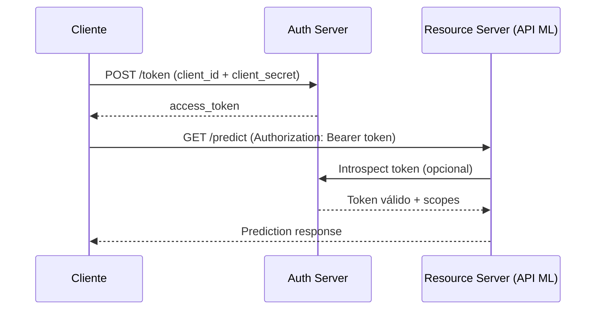

# 🔐 Autenticación y Seguridad en APIs

Exponer modelos de machine learning a través de APIs sin seguridad adecuada es equivalente a dejar la puerta de un banco abierta. Los ataques no solo comprometen datos; pueden extraer información sensible del modelo mismo (model inversion), manipular sus predicciones (adversarial attacks) o saturar la infraestructura (DoS).

La seguridad en APIs de ML es un problema de múltiples capas: transporte, autenticación, autorización, validación de inputs y observabilidad. Cada capa debe fortalecerse independientemente.


## 1. Autenticación vs Autorización

Aunque frecuentemente confundidos, son conceptos distintos:

| Concepto | Pregunta que responde | Implementación típica |
|----------|----------------------|----------------------|
| **Autenticación** | ¿Quién eres? | JWT, OAuth, API Keys, mTLS |
| **Autorización** | ¿Qué puedes hacer? | RBAC, ABAC, scopes, policies |

Un usuario autenticado no debería poder acceder a todos los modelos. El rol `data_scientist` puede entrenar modelos; el rol `end_user` solo puede predecir con modelos específicos.

Caso real: OpenAI implementa rate limits y scopes de autorización diferenciados por tier de usuario. Un desarrollador de tier gratuito no puede acceder a modelos `gpt-4` ni exceder los límites de tokens asignados.


## 2. JSON Web Tokens (JWT)

JWT es un estándar abierto (RFC 7519) para transmitir claims de forma compacta y autocontenida entre partes. Consta de tres partes separadas por puntos:

$$
JWT = \underbrace{base64(header)}_{\text{metadata}} . \underbrace{base64(payload)}_{\text{claims}} . \underbrace{signature}_{\text{HMAC/RSA}}
$$

**Header:**
```json
{"alg": "HS256", "typ": "JWT"}
```

**Payload (claims):**
```json
{"sub": "user123", "role": "ml_engineer", "iat": 1715000000, "exp": 1715003600}
```

**Signature:**

$$
HMACSHA256(base64url(header) + "." + base64url(payload), secret)
$$

⚠️ **Advertencia:** Nunca almacenes secretos o información sensible en el payload de un JWT. Aunque está firmado, no está cifrado por defecto (usa JWE si necesitas confidencialidad).


## 3. Implementación de JWT con FastAPI

```python
from fastapi import FastAPI, Depends, HTTPException, status
from fastapi.security import HTTPBearer, HTTPAuthorizationCredentials
from jose import JWTError, jwt
from datetime import datetime, timedelta
from pydantic import BaseModel

app = FastAPI()
SECRET_KEY = "super-secret-key-cambiar-en-produccion"
ALGORITHM = "HS256"
ACCESS_TOKEN_EXPIRE_MINUTES = 30

security = HTTPBearer()

def create_access_token(data: dict):
    to_encode = data.copy()
    expire = datetime.utcnow() + timedelta(minutes=ACCESS_TOKEN_EXPIRE_MINUTES)
    to_encode.update({"exp": expire})
    return jwt.encode(to_encode, SECRET_KEY, algorithm=ALGORITHM)

def verify_token(credentials: HTTPAuthorizationCredentials = Depends(security)):
    token = credentials.credentials
    try:
        payload = jwt.decode(token, SECRET_KEY, algorithms=[ALGORITHM])
        return payload
    except JWTError:
        raise HTTPException(
            status_code=status.HTTP_401_UNAUTHORIZED,
            detail="Token inválido o expirado"
        )

@app.post("/login")
def login(username: str, password: str):
    # Verificar credenciales (simplificado)
    if username == "ml_user" and password == "secret":
        token = create_access_token({"sub": username, "role": "engineer"})
        return {"access_token": token}
    raise HTTPException(status_code=401, detail="Credenciales inválidas")

@app.post("/predict")
def predict(features: list, user=Depends(verify_token)):
    if user.get("role") != "engineer":
        raise HTTPException(status_code=403, detail="Acceso denegado")
    return {"prediction": sum(features)}
```

💡 **Tip:** Rota las claves de firma periódicamente. Implementa un mecanismo de `kid` (key ID) en el header del JWT para permitir la transición entre claves sin downtime.


## 4. OAuth 2.0 y OpenID Connect

OAuth 2.0 es un protocolo de autorización, no de autenticación. OpenID Connect (OIDC) añade una capa de identidad sobre OAuth 2.0.

| Flujo | Uso recomendado | Seguridad |
|-------|-----------------|-----------|
| **Authorization Code** | Aplicaciones web server-side | Alta (con PKCE) |
| **Client Credentials** | Comunicación machine-to-machine (M2M) | Media-Alta |
| **Device Code** | Dispositivos con input limitado | Media |
| **Implicit** | Obsoleto, no usar | Baja |

Para APIs de ML entre microservicios, el flujo **Client Credentials** es el estándar: un servicio de predicción se autentica contra un Authorization Server y obtiene un access token para llamar al feature store.




## 5. API Keys

Las API keys son simples pero efectivas para identificación de proyectos o aplicaciones. No reemplazan a JWT/OAuth para usuarios finales, pero son útiles para tracking de uso y throttling por cliente.

```python
from fastapi import Security, APIKeyHeader

API_KEY_NAME = "X-API-Key"
api_key_header = APIKeyHeader(name=API_KEY_NAME)

VALID_KEYS = {"prod-ml-key-123": "tier_premium", "dev-key-456": "tier_free"}

async def verify_api_key(key: str = Security(api_key_header)):
    if key not in VALID_KEYS:
        raise HTTPException(status_code=403, detail="API Key inválida")
    return VALID_KEYS[key]

@app.post("/predict")
async def predict(features: list, tier: str = Depends(verify_api_key)):
    if tier == "tier_free" and len(features) > 100:
        raise HTTPException(status_code=429, detail="Límite excedido para tier gratis")
    return {"prediction": sum(features)}
```


## 6. Rate Limiting

El rate limiting protege contra abuso y garantiza la equidad de recursos. Dos algoritmos dominan:

**Token Bucket:**

El bucket tiene capacidad $C$ y se llena a una tasa de $r$ tokens por segundo. Cada request consume 1 token. Si el bucket está vacío, el request es rechazado.

$$
\text{Permitido si } tokens \geq 1, \quad \text{donde } tokens = \min(C, tokens + r \times \Delta t)
$$

**Leaky Bucket:**

Las solicitudes entran a una cola de tamaño fijo y salen a una tasa constante. Si la cola se llena, las nuevas solicitudes se descartan.

| Algoritmo | Ventaja | Desventaja |
|-----------|---------|------------|
| Token Bucket | Permite burst controlado | Requiere estado por cliente |
| Leaky Bucket | Rate constante garantizado | Menos flexible para tráfico burst |

```python
import time
from collections import defaultdict

class TokenBucket:
    def __init__(self, capacity: int, refill_rate: float):
        self.capacity = capacity
        self.tokens = capacity
        self.refill_rate = refill_rate
        self.last_refill = time.time()

    def allow_request(self) -> bool:
        now = time.time()
        elapsed = now - self.last_refill
        self.tokens = min(self.capacity, self.tokens + elapsed * self.refill_rate)
        self.last_refill = now
        if self.tokens >= 1:
            self.tokens -= 1
            return True
        return False

buckets = defaultdict(lambda: TokenBucket(10, 1))
```

Caso real: AWS API Gateway aplica throttling por defecto a 10,000 requests/segundo por cuenta. Los usuarios pueden configurar burst limits y rate limits por método HTTP, protegiendo backends de ML de picos inesperados.


## 7. CORS y HTTPS/TLS

**CORS** (Cross-Origin Resource Sharing) controla qué dominios pueden consumir tu API desde navegadores.

```python
from fastapi.middleware.cors import CORSMiddleware

app.add_middleware(
    CORSMiddleware,
    allow_origins=["https://miapp.com"],  # NUNCA "*" en producción de ML
    allow_methods=["POST"],
    allow_headers=["Authorization", "Content-Type"],
)
```

**HTTPS/TLS** cifra la capa de transporte. En producción, termina TLS en el load balancer o reverse proxy (nginx, traefik) y utiliza certificates gestionados por Let's Encrypt o tu cloud provider.

⚠️ **Advertencia:** Nunca transmitas tokens JWT o API keys sobre HTTP sin cifrar. Un atacante en la misma red puede realizar un man-in-the-middle attack trivial con herramientas como Wireshark.


## 8. Validación de Inputs y Prevención de Inyecciones

Los modelos de ML son vulnerables a inputs maliciosos. La validación no es solo negocio, es seguridad.

| Ataque | Descripción | Prevención |
|--------|-------------|------------|
| **SQL Injection** | Inputs que alteran queries SQL | ORMs, queries parametrizadas, nunca concatenar strings |
| **XSS** | Scripts inyectados en respuestas | Escapar output, Content-Security-Policy |
| **Command Injection** | Inputs ejecutados en shell | Nunca usar `os.system` con inputs de usuario |
| **Adversarial Input** | Features diseñadas para engañar al modelo | Input sanitization, adversarial training |

```python
from pydantic import BaseModel, Field, validator
import re

class SafeRequest(BaseModel):
    text: str = Field(..., max_length=1000)
    
    @validator("text")
    def no_scripts(cls, v):
        if re.search(r"<script.*?>.*?</script>", v, re.IGNORECASE):
            raise ValueError("Input contiene posible XSS")
        return v
```


## 9. Security Headers

Los headers de seguridad HTTP mitigan ataques comunes sin modificar la lógica de la aplicación:

```python
from fastapi import Request
from fastapi.responses import JSONResponse

@app.middleware("http")
async def security_headers(request: Request, call_next):
    response = await call_next(request)
    response.headers["X-Content-Type-Options"] = "nosniff"
    response.headers["X-Frame-Options"] = "DENY"
    response.headers["Content-Security-Policy"] = "default-src 'self'"
    response.headers["Strict-Transport-Security"] = "max-age=31536000; includeSubDomains"
    return response
```

| Header | Protección |
|--------|-----------|
| `X-Content-Type-Options: nosniff` | Evita MIME-sniffing |
| `X-Frame-Options: DENY` | Previene clickjacking |
| `Content-Security-Policy` | Mitiga XSS |
| `Strict-Transport-Security` | Fuerza HTTPS |


## 10. Imágenes de Referencia


---

⚠️ **Advertencia:** Guarda secretos (SECRET_KEY, API keys, contraseñas de DB) en gestores de secretos (AWS Secrets Manager, HashiCorp Vault, Azure Key Vault), nunca en el código fuente o variables de entorno en repos públicos.

💡 **Tip:** Implementa logging de seguridad: registra todos los intentos de autenticación fallidos, accesos a endpoints sensibles y anomalías de rate limiting. Herramientas como SIEM o Splunk correlacionan estos logs para detectar ataques.


## 📦 Código de Compresión

```python
# secure_ml_api.py
# API FastAPI con autenticación JWT, rate limiting y headers de seguridad

from fastapi import FastAPI, Depends, HTTPException, status, Security
from fastapi.security import HTTPBearer, HTTPAuthorizationCredentials
from fastapi.middleware.cors import CORSMiddleware
from jose import jwt, JWTError
from datetime import datetime, timedelta
from pydantic import BaseModel, Field
import time
from collections import defaultdict

app = FastAPI()
SECRET_KEY = "change-me-in-production"
ALGORITHM = "HS256"

# --- Seguridad: Bearer Token ---
security = HTTPBearer()

def create_token(data: dict, expires_minutes: int = 30):
    payload = data.copy()
    payload["exp"] = datetime.utcnow() + timedelta(minutes=expires_minutes)
    return jwt.encode(payload, SECRET_KEY, algorithm=ALGORITHM)

def verify_token(cred: HTTPAuthorizationCredentials = Depends(security)):
    try:
        return jwt.decode(cred.credentials, SECRET_KEY, algorithms=[ALGORITHM])
    except JWTError:
        raise HTTPException(status_code=401, detail="Token invalido")

# --- Rate Limiting ---
class TokenBucket:
    def __init__(self, cap: int, rate: float):
        self.cap = cap
        self.tokens = float(cap)
        self.rate = rate
        self.last = time.time()
    def allow(self) -> bool:
        now = time.time()
        self.tokens = min(self.cap, self.tokens + (now - self.last) * self.rate)
        self.last = now
        if self.tokens >= 1:
            self.tokens -= 1
            return True
        return False

buckets = defaultdict(lambda: TokenBucket(10, 2))

async def rate_limit(user=Depends(verify_token)):
    uid = user.get("sub", "anon")
    if not buckets[uid].allow():
        raise HTTPException(status_code=429, detail="Rate limit excedido")
    return user

# --- Middleware de seguridad ---
@app.middleware("http")
async def secure_headers(request, call_next):
    resp = await call_next(request)
    resp.headers["X-Content-Type-Options"] = "nosniff"
    resp.headers["Strict-Transport-Security"] = "max-age=63072000"
    return resp

app.add_middleware(
    CORSMiddleware,
    allow_origins=["https://trusted.com"],
    allow_methods=["POST"],
    allow_headers=["Authorization"],
)

# --- Endpoints ---
class PredictRequest(BaseModel):
    features: list[float] = Field(..., min_length=2, max_length=100)

@app.post("/login")
def login(username: str, password: str):
    if username == "ml" and password == "safe":
        return {"access_token": create_token({"sub": username, "role": "user"})}
    raise HTTPException(status_code=401)

@app.post("/predict")
def predict(req: PredictRequest, user=Depends(rate_limit)):
    return {"prediction": sum(req.features), "user": user["sub"]}

# Ejecutar: uvicorn secure_ml_api:app --reload
```
