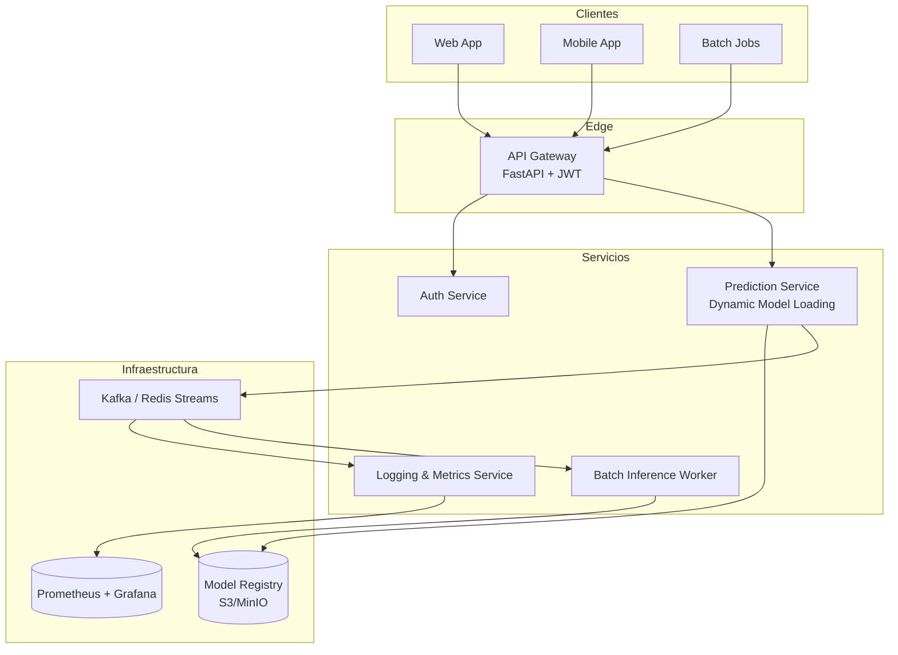
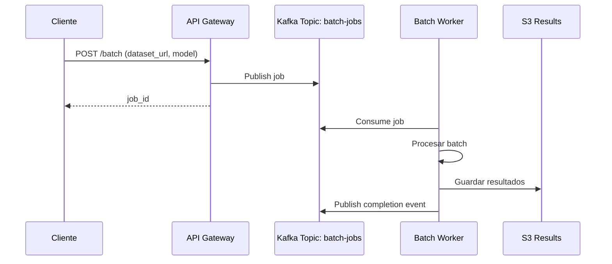
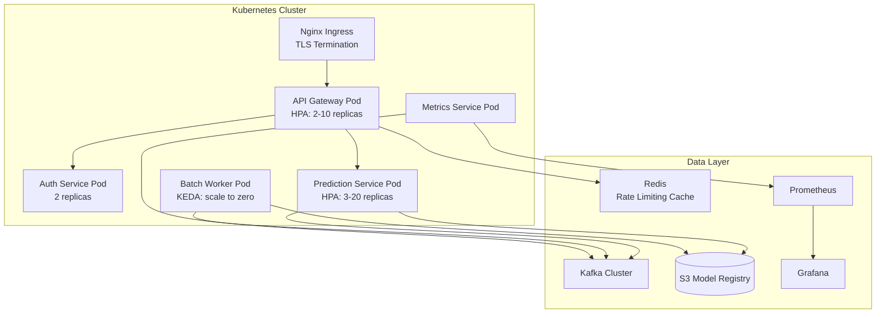

# 🎯 Caso Práctico: Plataforma de Serving de Modelos

Este proyecto integra todos los conceptos del módulo para construir una plataforma completa de serving de modelos de ML. El objetivo es servir múltiples modelos vía API REST de forma escalable, segura y observable, utilizando arquitectura de microservicios y comunicación basada en eventos.

La plataforma demuestra cómo un equipo de ML Engineering puede pasar de un notebook de predicción a un sistema productivo que atiende miles de solicitudes concurrentes con latencia garantizada.


## 1. Requisitos del Sistema

| ID | Requisito | Categoría |
|----|-----------|-----------|
| R1 | Servir predicciones de múltiples modelos | Funcional |
| R2 | Carga dinámica de modelos sin reinicio | Funcional |
| R3 | Autenticación y autorización por endpoint | Seguridad |
| R4 | Rate limiting adaptativo por cliente | Seguridad |
| R5 | Latencia p95 < 100ms para modelos ligeros | Performance |
| R6 | Throughput > 5000 RPS | Performance |
| R7 | Métricas de latencia, throughput y errores | Observabilidad |
| R8 | Cola de jobs para batch inference | Escalabilidad |
| R9 | Disponibilidad 99.9% | Confiabilidad |

Caso real: Uber Michelangelo, la plataforma de ML de Uber, soporta más de 1000 modelos en producción, desde predicciones en tiempo real (tiempo de llegada de viajes) hasta pipelines batch de detección de fraude. Su arquitectura de serving desacopla el almacenamiento de modelos de la inferencia mediante un model registry centralizado.


## 2. Arquitectura de Microservicios




## 3. Componentes Detallados

### 3.1. API Gateway (FastAPI)

Punto de entrada único que enruta solicitudes, valida JWT, aplica rate limiting y centraliza logging.

```python
# gateway.py
from fastapi import FastAPI, Depends, HTTPException, Request
from fastapi.security import HTTPBearer
import httpx
import time

app = FastAPI(title="ML Platform Gateway")
security = HTTPBearer()

PREDICTION_SERVICE_URL = "http://prediction:8000"
AUTH_SERVICE_URL = "http://auth:8001"

@app.middleware("http")
async def metrics(request: Request, call_next):
    start = time.time()
    response = await call_next(request)
    latency = (time.time() - start) * 1000
    # Enviar métricas a Prometheus pushgateway o StatsD
    print(f"method={request.method} path={request.url.path} latency={latency:.2f}ms")
    return response

async def verify_token(credentials=Depends(security)):
    async with httpx.AsyncClient() as client:
        resp = await client.post(
            f"{AUTH_SERVICE_URL}/verify",
            headers={"Authorization": f"Bearer {credentials.credentials}"}
        )
    if resp.status_code != 200:
        raise HTTPException(status_code=401, detail="Token inválido")
    return resp.json()

@app.post("/predict/{model_name}")
async def predict(model_name: str, payload: dict, user=Depends(verify_token)):
    async with httpx.AsyncClient() as client:
        resp = await client.post(
            f"{PREDICTION_SERVICE_URL}/predict/{model_name}",
            json=payload,
            timeout=5.0
        )
    return resp.json()
```

### 3.2. Servicio de Autenticación

Emite y verifica JWT. Soporta múltiples roles: `admin`, `data_scientist`, `end_user`.

```python
# auth_service.py
from fastapi import FastAPI
from jose import jwt
from datetime import datetime, timedelta

app = FastAPI()
SECRET = "platform-secret"

@app.post("/login")
def login(username: str, password: str):
    # Verificación simplificada
    users = {
        "admin": {"password": "admin123", "role": "admin"},
        "ds": {"password": "ds123", "role": "data_scientist"},
    }
    u = users.get(username)
    if not u or u["password"] != password:
        return {"error": "Invalid credentials"}
    token = jwt.encode(
        {"sub": username, "role": u["role"], "exp": datetime.utcnow() + timedelta(hours=1)},
        SECRET,
        algorithm="HS256"
    )
    return {"access_token": token}

@app.post("/verify")
def verify(token: str):
    try:
        payload = jwt.decode(token, SECRET, algorithms=["HS256"])
        return payload
    except jwt.JWTError:
        return {"error": "Invalid token"}
```

### 3.3. Servicio de Predicción (Carga Dinámica de Modelos)

Carga modelos bajo demanda desde un registro centralizado (S3, GCS, MinIO). Implementa cacheo LRU para evitar I/O repetido.

```python
# prediction_service.py
from fastapi import FastAPI, HTTPException
from functools import lru_cache
import joblib
import boto3
import io

app = FastAPI()
s3 = boto3.client("s3")
BUCKET = "ml-model-registry"

class ModelCache:
    def __init__(self, maxsize=10):
        self.cache = {}
        self.maxsize = maxsize
    
    def get(self, model_name: str, version: str):
        key = f"{model_name}:{version}"
        if key not in self.cache:
            if len(self.cache) >= self.maxsize:
                self.cache.pop(next(iter(self.cache)))
            obj = s3.get_object(Bucket=BUCKET, Key=f"{model_name}/{version}/model.pkl")
            self.cache[key] = joblib.load(io.BytesIO(obj["Body"].read()))
        return self.cache[key]

cache = ModelCache()

@app.post("/predict/{model_name}")
def predict(model_name: str, payload: dict):
    version = payload.get("version", "latest")
    try:
        model = cache.get(model_name, version)
    except Exception as e:
        raise HTTPException(status_code=404, detail=f"Modelo no encontrado: {e}")
    
    features = payload.get("features", [])
    prediction = model.predict([features]).tolist()
    return {
        "model": model_name,
        "version": version,
        "prediction": prediction
    }
```

⚠️ **Advertencia:** El cacheo en memoria de modelos grandes puede causar OOM (Out Of Memory). Monitorea el uso de RAM y establece límites estrictos. Considera usar `weakref` o almacenamiento en disco (mmap) para modelos masivos.

### 3.4. Servicio de Logging y Métricas

Consume eventos de Kafka para calcular métricas agregadas y persistir logs de auditoría.

```python
# metrics_service.py
from kafka import KafkaConsumer
import json
from collections import deque

consumer = KafkaConsumer(
    "predictions",
    bootstrap_servers=["kafka:9092"],
    value_deserializer=lambda m: json.loads(m.decode("utf-8"))
)

latencies = deque(maxlen=10000)

for msg in consumer:
    event = msg.value
    latencies.append(event["latency_ms"])
    
    p50 = sorted(latencies)[len(latencies)//2]
    p95 = sorted(latencies)[int(len(latencies)*0.95)]
    
    print(f"[METRICS] total={len(latencies)} p50={p50}ms p95={p95}ms")
```


## 4. Métricas Clave de la Plataforma

| Métrica | Fórmula | Objetivo |
|---------|---------|----------|
| **Latencia p50/p95/p99** | Percentiles de tiempo de respuesta | p95 < 100ms |
| **Throughput** | $\frac{\text{requests}}{\text{segundo}}$ | > 5000 RPS |
| **Availability** | $\frac{\text{uptime}}{\text{uptime} + \text{downtime}} \times 100$ | 99.9% |
| **Error Rate** | $\frac{\text{errors}}{\text{total requests}} \times 100$ | < 0.1% |
| **Model Load Time** | Tiempo desde solicitud hasta ready | < 5s |
| **Cache Hit Rate** | $\frac{\text{cache hits}}{\text{total lookups}} \times 100$ | > 80% |

La latencia de inferencia total puede descomponerse como:

$$
L_{total} = L_{network} + L_{gateway} + L_{auth} + L_{model\_load} + L_{inference} + L_{serialization}
$$

Optimizar cada término es responsabilidad de un componente diferente, lo que justifica la arquitectura desacoplada.


## 5. Cola de Jobs para Batch Inference

No todas las predicciones son en tiempo real. Los jobs batch (retraining datasets, predicciones sobre millones de registros) se encolan y procesan por workers independientes.



```python
# batch_worker.py
from kafka import KafkaConsumer, KafkaProducer
import json

producer = KafkaProducer(
    bootstrap_servers=["kafka:9092"],
    value_serializer=lambda v: json.dumps(v).encode("utf-8")
)

consumer = KafkaConsumer(
    "batch-jobs",
    bootstrap_servers=["kafka:9092"],
    value_deserializer=lambda m: json.loads(m.decode("utf-8"))
)

for msg in consumer:
    job = msg.value
    print(f"Procesando job {job['job_id']}")
    # Cargar dataset desde job['dataset_url']
    # Ejecutar predicciones batch
    # Subir resultados a S3
    producer.send("batch-completed", {
        "job_id": job["job_id"],
        "status": "completed",
        "output_url": f"s3://results/{job['job_id']}.parquet"
    })
```

💡 **Tip:** Usa patrones de backpressure en los workers. Si la cola crece más allá de un umbral, escala horizontalmente agregando más workers o reduce la frecuencia de ingestión desde el gateway.


## 6. Diagrama de Despliegue




## 7. Imágenes de Referencia


---

⚠️ **Advertencia:** Una plataforma de serving sin estrategia de rollback es peligrosa. Si un modelo nuevo degrada las métricas, el sistema debe poder revertir automáticamente a la versión anterior (canary deployment + shadow traffic).

💡 **Tip:** Implementa shadow mode para nuevos modelos: envía tráfico real al nuevo modelo pero no sirvas sus predicciones al cliente. Compara métricas offline antes de promocionar el modelo a producción.


## 🎯 Proyecto Documentado

### Nombre: ML Serving Platform v1.0

**Stack Tecnológico:**
- **Gateway:** FastAPI + Uvicorn
- **Comunicación interna:** HTTP/REST (hacia gRPC en v2.0)
- **Message Broker:** Apache Kafka
- **Model Registry:** S3 con versionado
- **Observabilidad:** Prometheus + Grafana + Logs centralizados (ELK/Loki)
- **Auth:** JWT (HS256), migración a OAuth 2.0 Client Credentials
- **Deployment:** Kubernetes con HPA y KEDA

**Estructura de Repositorio:**

```
ml-platform/
├── gateway/
│   ├── main.py
│   ├── Dockerfile
│   └── k8s/
├── auth-service/
│   ├── main.py
│   └── Dockerfile
├── prediction-service/
│   ├── main.py
│   ├── model_cache.py
│   └── Dockerfile
├── batch-worker/
│   ├── worker.py
│   └── Dockerfile
├── metrics-service/
│   └── consumer.py
├── proto/
│   └── inference.proto
└── docker-compose.yml
```

**Roadmap:**
1. MVP con monolito modular (semana 1-2)
2. Extracción de auth service (semana 3)
3. Introducción de Kafka para eventos (semana 4)
4. Carga dinámica de modelos desde S3 (semana 5)
5. Batch workers con KEDA (semana 6)
6. Migración interna a gRPC (semana 7-8)
7. Service mesh con Istio (semana 9-10)

**Criterios de éxito:**
- Latencia p95 < 100ms en modelo de referencia (sklearn RandomForest, 100 features).
- Despliegue de nuevo modelo sin downtime.
- 99.9% de requests autenticadas responden en < 200ms.
- Recuperación automática ante fallo de un pod de predicción (< 30s).


## 📦 Código de Compresión

```python
# platform_serving.py
# Código integrador de la plataforma de serving de modelos ML

from fastapi import FastAPI, Depends, HTTPException
from jose import jwt
from datetime import datetime, timedelta
import hashlib
import json
from typing import Any

app = FastAPI(title="ML Serving Platform")
SECRET = "platform-secret"
MODEL_REGISTRY = {}

# --- Auth ---
def create_token(sub: str, role: str) -> str:
    payload = {
        "sub": sub,
        "role": role,
        "exp": datetime.utcnow() + timedelta(hours=1)
    }
    return jwt.encode(payload, SECRET, algorithm="HS256")

def verify_token(token: str) -> dict:
    try:
        return jwt.decode(token, SECRET, algorithms=["HS256"])
    except jwt.JWTError:
        raise HTTPException(status_code=401, detail="Token invalido")

# --- Model Registry simulado ---
class SimpleModel:
    def predict(self, features: list) -> float:
        return sum(features) / max(len(features), 1)

def load_model(name: str, version: str) -> Any:
    key = f"{name}:{version}"
    if key not in MODEL_REGISTRY:
        MODEL_REGISTRY[key] = SimpleModel()
    return MODEL_REGISTRY[key]

# --- Endpoints ---
@app.post("/auth/login")
def login(username: str, password: str):
    # Hash simple para demo
    if username == "ml" and hashlib.sha256(password.encode()).hexdigest() == hashlib.sha256(b"safe").hexdigest():
        return {"access_token": create_token("ml", "engineer")}
    raise HTTPException(status_code=401)

@app.post("/predict/{model_name}")
def predict(model_name: str, payload: dict, token: str):
    user = verify_token(token)
    model = load_model(model_name, payload.get("version", "latest"))
    pred = model.predict(payload.get("features", []))
    return {
        "prediction": pred,
        "model": model_name,
        "user": user["sub"],
        "role": user["role"]
    }

@app.get("/health")
def health():
    return {"status": "ok", "models_loaded": len(MODEL_REGISTRY)}

# Ejecutar: uvicorn platform_serving:app --host 0.0.0.0 --port 8000
```
