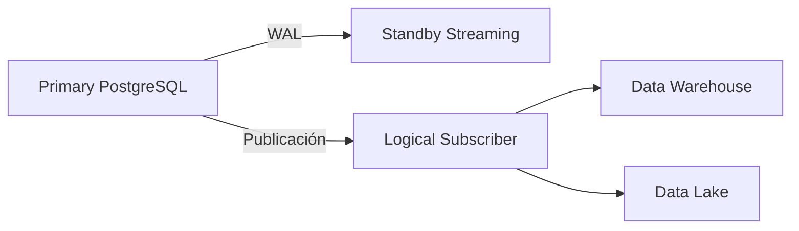

# 🐘 PostgreSQL Avanzado

PostgreSQL es el sistema de gestión de bases de datos relacionales de referencia en la industria. Para un ML/AI Engineer, PostgreSQL no es solo una base de datos transaccional: es el backend de feature stores, el registro de experimentos, el almacén de metadatos de modelos y, en muchos casos, la fuente de datos principal para entrenamiento. Dominar sus capacidades avanzadas permite reducir la latencia de inferencia, garantizar la integridad de los datos y escalar sin perder consistencia.


## 1. Índices Avanzados

Los índices son estructuras de datos que aceleran la recuperación de registros a costa de espacio adicional y sobrecarga en escrituras. PostgreSQL ofrece múltiples tipos de índices, cada uno optimizado para patrones de acceso específicos.

### 1.1 B-Tree (Balanced Tree)

El índice por defecto. Organiza los datos en un árbol balanceado donde cada nodo mantiene un rango ordenado de claves.

- **Complejidad de búsqueda:** $O(\log_{f} n)$, donde $f$ es el fan-out (número de punteros por nodo) y $n$ el número de registros.
- **Ideal para:** operaciones de igualdad (`=`) y rango (`<`, `>`, `BETWEEN`).

⚠️ **Advertencia:** Los índices B-Tree no son eficientes para patrones de búsqueda con comodines al inicio (`LIKE '%texto%'`).

### 1.2 Hash

Genera un valor hash de la columna indexada y apunta directamente a la tupla.

- **Complejidad:** $O(1)$ para igualdad exacta.
- **Limitación:** No soporta consultas de rango ni ordenamiento.

### 1.3 GIN (Generalized Inverted Index)

Diseñado para tipos de datos compuestos y búsquedas de contención (full-text search, arrays, JSONB).

- **Estructura:** Almacena una lista de tuplas para cada elemento clave.
- **Caso real:** Un equipo de NLP indexa embeddings de texto tokenizados en una columna `tsvector` usando GIN para recuperar documentos similares en milisegundos.

### 1.4 GiST (Generalized Search Tree)

Framework extensible que permite definir índices sobre datos multidimensionales.

- **Usos comunes:** índices espaciales (PostGIS), búsqueda de vecinos más cercanos (KNN), rangos de fechas.
- **Caso real:** Plataforma de delivery utiliza GiST para indexar coordenadas geográficas de restaurantes y calcular rutas óptimas en tiempo real.

| Tipo de Índice | Mejor Uso | Complejidad Búsqueda | Soporta Rango | Overhead Escritura |
|----------------|-----------|----------------------|---------------|--------------------|
| B-Tree | Igualdad, rango, orden | $O(\log n)$ | Sí | Medio |
| Hash | Igualdad exacta | $O(1)$ | No | Bajo |
| GIN | Full-text, arrays, JSONB | $O(k + \log n)$ | Parcial | Alto |
| GiST | Datos multidimensionales, KNN | $O(\log n)$ | Sí | Medio-Alto |

```sql
-- Ejemplo: índice GIN sobre JSONB para feature store
CREATE INDEX idx_features_gin ON model_features USING GIN (features jsonb_path_ops);

-- Ejemplo: índice GiST para búsqueda de vecinos más cercanos (KNN)
CREATE INDEX idx_embeddings_gist ON embeddings USING gist (vector_embedding);
```

💡 **Tip:** Usa `pg_size_pretty(pg_relation_size('idx_nombre'))` para monitorear el tamaño de tus índices y evitar sobredimensionamiento.


## 2. Optimización de Consultas con EXPLAIN ANALYZE

El planificador de PostgreSQL genera planes de ejecución basados en estadísticas de las tablas. `EXPLAIN ANALYZE` ejecuta la consulta y muestra el plan real.

### 2.1 Componentes del Costo

PostgreSQL modela el costo de una operación como:

$$
\text{Costo Total} = \sum_{i} \left( \text{CPU}_i + \text{IO}_i \right)
$$

Donde $\text{CPU}_i$ representa el costo de procesamiento en memoria y $\text{IO}_i$ el costo de lectura/escritura en disco (medido en unidades arbitrarias de "bloques de disco").

### 2.2 Lectura del Plan

```sql
EXPLAIN (ANALYZE, BUFFERS, FORMAT JSON)
SELECT user_id, feature_vector
FROM model_features
WHERE created_at > '2024-01-01'
  AND model_version = 'v2.1'
ORDER BY created_at DESC
LIMIT 100;
```

⚠️ **Advertencia:** Un `Seq Scan` en una tabla grande (> 1M filas) suele indicar la ausencia de un índice adecuado o estadísticas desactualizadas. Ejecuta `ANALYZE tabla;` para refrescar las estadísticas.

💡 **Tip:** Un `Index Only Scan` es más rápido que un `Index Scan` porque evita el acceso a la tabla heap al satisfacer la consulta únicamente con el índice (covering index).


## 3. Particionamiento (Partitioning)

El particionamiento divide tablas grandes en fragmentos más pequeños y manejables, mejorando el rendimiento de consultas y operaciones de mantenimiento.

### 3.1 Tipos de Particionamiento

| Tipo | Clave de Partición | Caso de Uso Ideal |
|------|--------------------|--------------------|
| **Range** | Rango continuo (fechas, IDs) | Tablas de eventos por mes, logs por semana |
| **List** | Valor discreto de una lista | Datos regionales (país, ciudad) |
| **Hash** | Función hash sobre la clave | Distribución uniforme cuando no hay patrón natural |

### 3.2 Declaración Declarativa (PostgreSQL 10+)

```sql
CREATE TABLE user_events (
    event_id BIGSERIAL,
    user_id BIGINT NOT NULL,
    event_type VARCHAR(50),
    event_data JSONB,
    created_at TIMESTAMP NOT NULL,
    PRIMARY KEY (event_id, created_at)
) PARTITION BY RANGE (created_at);

CREATE TABLE user_events_2024_q1 PARTITION OF user_events
    FOR VALUES FROM ('2024-01-01') TO ('2024-04-01');

CREATE TABLE user_events_2024_q2 PARTITION OF user_events
    FOR VALUES FROM ('2024-04-01') TO ('2024-07-01');
```

**Caso real:** Plataforma de streaming de video particiona tablas de eventos de reproducción por rango de fechas. Las consultas de análisis de consumo solo escanean la partición relevante, reduciendo el tiempo de lectura en un 85%.

⚠️ **Advertencia:** El particionamiento agrega complejidad. Las claves foráneas que referencian tablas particionadas tienen restricciones adicionales y algunas operaciones DDL requieren manejo manual de las particiones hijas.


## 4. Transacciones ACID y Niveles de Aislamiento

### 4.1 Propiedades ACID

PostgreSQL garantiza las propiedades ACID para todas las transacciones:

- **Atomicidad:** Todas las operaciones se ejecutan o ninguna (`COMMIT` / `ROLLBACK`).
- **Consistencia:** Las reglas de integridad (constraints, triggers) se respetan siempre.
- **Aislamiento:** Las transacciones concurrentes no interfieren entre sí según el nivel definido.
- **Durabilidad:** Una vez confirmada, la transacción persiste incluso ante caídas del sistema.

### 4.2 Niveles de Aislamiento (SQL Standard)

| Nivel | Dirty Read | Non-Repeatable Read | Phantom Read | Uso en ML/AI |
|-------|------------|---------------------|--------------|--------------|
| Read Uncommitted | Sí | Sí | Sí | No recomendado en PostgreSQL (se comporta como Read Committed) |
| Read Committed | No | Sí | Sí | Default; adecuado para la mayoría de operaciones |
| Repeatable Read | No | No | Sí | Reportes de entrenamiento donde los datos no deben cambiar durante la lectura |
| Serializable | No | No | No | Feature stores críticos donde la consistencia total es indispensable |

```sql
-- Iniciar una transacción con aislamiento serializable
BEGIN ISOLATION LEVEL SERIALIZABLE;

SELECT * FROM training_dataset WHERE model_version = 'v3.0';

-- Las filas leídas no cambiarán ni desaparecerán hasta el COMMIT
COMMIT;
```


## 5. MVCC y Control de Concurrencia

PostgreSQL implementa **Multiversion Concurrency Control (MVCC)** en lugar de bloqueos pesados para lecturas. Cada transacción ve una "foto" (snapshot) consistente de la base de datos en el momento de su inicio.

### 5.1 Mecanismo de Tuplas

Cada fila contiene campos ocultos `xmin` (transacción que creó la fila) y `xmax` (transacción que la eliminó). Una fila es visible para una transacción $T$ si:

$$
\text{xmin} \leq T_{\text{id}} < \text{xmax}
$$

(Esto es una simplificación conceptual; el algoritmo real compara snapshots.)

### 5.2 Vacuum y Bloat

Las filas actualizadas generan versiones "muertas" que deben limpiarse. El proceso `autovacuum` es esencial para evitar el **bloat** (inflado de tablas).

⚠️ **Advertencia:** Tablas con alta frecuencia de actualización (como logs de métricas de modelos) pueden crecer descontroladamente si `autovacuum` no está bien sintonizado.

💡 **Tip:** Monitorea `pg_stat_user_tables` para identificar tablas con alto `n_dead_tup` y ajusta `autovacuum_vacuum_scale_factor` si es necesario.


## 6. Stored Procedures, Funciones y Triggers

PostgreSQL permite ejecutar lógica directamente en el servidor mediante PL/pgSQL.

### 6.1 Funciones

```sql
CREATE OR REPLACE FUNCTION compute_feature_hash(
    p_user_id BIGINT,
    p_features JSONB
) RETURNS TEXT AS $$
DECLARE
    hash_value TEXT;
BEGIN
    SELECT encode(digest(p_features::text, 'sha256'), 'hex')
    INTO hash_value;
    RETURN hash_value;
END;
$$ LANGUAGE plpgsql IMMUTABLE;
```

### 6.2 Triggers

Los triggers permiten ejecutar acciones automáticamente ante eventos `INSERT`, `UPDATE` o `DELETE`.

```sql
CREATE TRIGGER trg_audit_feature_update
    AFTER UPDATE ON model_features
    FOR EACH ROW
    EXECUTE FUNCTION log_feature_change();
```

**Caso real:** Un feature store utiliza un trigger para invalidar automáticamente la caché de Redis cuando una característica se actualiza, garantizando que los modelos de inferencia siempre consuman datos frescos.


## 7. Replicación: Streaming y Lógica

La replicación permite distribuir la carga de lectura y garantizar alta disponibilidad.

### 7.1 Streaming Replication (Física)

Replica los archivos WAL (Write-Ahead Log) bit a bit desde un servidor primario a uno o más servidores en espera (standby).

- **Ventaja:** Baja latencia, alta fidelidad.
- **Desventaja:** No permite replicar selectivamente tablas o bases de datos.

### 7.2 Logical Replication

Replica cambios a nivel de fila basándose en el **pub/sub** de publicaciones y suscripciones.

- Permite replicar solo tablas específicas.
- Permite replicar entre versiones diferentes de PostgreSQL.
- Ideal para pipelines de datos hacia data warehouses o sistemas analíticos.




## 8. Connection Pooling con PgBouncer

Crear una conexión a PostgreSQL es costoso. En aplicaciones de ML con microservicios que escalan dinámicamente, **PgBouncer** actúa como un intermediario que mantiene un pool de conexiones reutilizables.

| Modo | Descripción | Recomendación |
|------|-------------|---------------|
| **Session** | Mantiene la conexión durante toda la sesión del cliente | Transacciones preparadas, LISTEN/NOTIFY |
| **Transaction** | Asigna una conexión del pool por transacción | **Recomendado** para la mayoría de apps web/ML |
| **Statement** | Asigna una conexión por statement | Solo para workloads completamente autónomos |

💡 **Tip:** Configura `default_pool_size` basado en `(núcleos_CPU * 2) + discos_efectivos` en el servidor PostgreSQL, y apunta tus aplicaciones a PgBouncer en lugar de al puerto directo de PostgreSQL.


## 📦 Código de Compresión

Script para comprimir un dump SQL de una base de datos de features:

```python
import gzip
import shutil
from pathlib import Path

def comprimir_dump(input_path: str, output_path: str):
    with open(input_path, 'rb') as f_in:
        with gzip.open(output_path, 'wb', compresslevel=9) as f_out:
            shutil.copyfileobj(f_in, f_out)
    print(f"✅ Dump comprimido: {output_path}")

if __name__ == "__main__":
    comprimir_dump("features_backup.sql", "features_backup.sql.gz")
```
