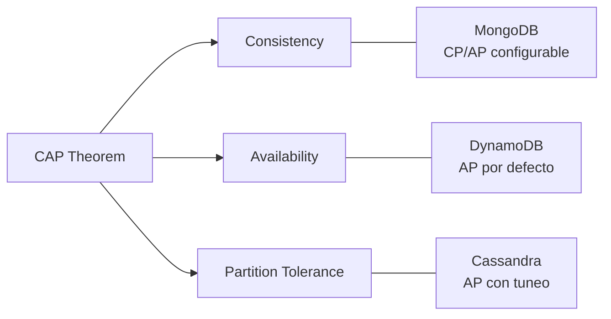

# 🍃 Bases de Datos NoSQL

En el ecosistema de ML/AI, los datos rara vez encajan en filas y columnas rígidas. Logs de experimentos, perfiles de usuario no estructurados, grafos de conocimiento y vectores de características demandan flexibilidad de esquema y escalabilidad horizontal. Las bases de datos NoSQL nacieron para resolver exactamente estos problemas, ofreciendo modelos de datos especializados que complementan a las bases relacionales.


## 1. Tipos de Bases de Datos NoSQL

### 1.1 Documentales: MongoDB

Almacenan datos en documentos tipo JSON/BSON.

- **Fortalezas:** Esquemas flexibles, consultas ricas por documento, escalabilidad horizontal nativa.
- **Caso real:** Una startup de recomendación almacena perfiles de usuario completos (historial de navegación, preferencias, embeddings) en documentos MongoDB, permitiendo agregar nuevos campos sin migraciones costosas.

### 1.2 Clave-Valor: DynamoDB

Modelo simple y de ultra baja latencia.

- **Fortalezas:** Millisegundos de latencia garantizada, escalabilidad automática, integración serverless.
- **Caso real:** Sistema de inferencia en tiempo real utiliza DynamoDB para lookup de features pre-calculadas por `user_id`, logrando p99 < 10ms.

### 1.3 Wide-Column: Cassandra

Optimizada para escrituras masivas y consultas por clave de partición.

- **Fortalezas:** Alta disponibilidad, tolerancia a particiones, throughput de escritura extremo.
- **Caso real:** Plataforma IoT almacena series temporales de sensores en Cassandra, ingestando millones de eventos por segundo sin cuellos de botella.

### 1.4 Grafos: Neo4j

Modela relaciones complejas entre entidades.

- **Fortalezas:** Consultas de grafos eficientes (recorridos, shortest path), modelo intuitivo para redes.
- **Caso real:** Motor de detección de fraude modela transacciones y relaciones entre cuentas en un grafo Neo4j para identificar ciclos sospechosos en segundos.

| Tipo | Ejemplo | Modelo de Datos | Mejor Para | Relaciones Complejas |
|------|---------|-----------------|------------|---------------------|
| Documental | MongoDB | JSON/BSON | Perfiles flexibles, catálogos | Medio |
| Clave-Valor | DynamoDB | HashMap | Lookups rápidos, sesiones | Bajo |
| Wide-Column | Cassandra | ColumnFamilies | Series temporales, logs | Bajo |
| Grafo | Neo4j | Nodos y Aristas | Redes, recomendaciones | Alto |


## 2. Teorema CAP

El teorema CAP (Brewer, 2000) establece que un sistema distribuido de datos no puede garantizar simultáneamente más de dos de las siguientes tres propiedades:

- **C**onsistency: Todos los nodos ven los mismos datos al mismo tiempo.
- **A**vailability: Cada solicitud recibe una respuesta, sin errores.
- **P**artition Tolerance: El sistema continúa operando a pesar de fallos de red.

$$
\forall S \in \text{Sistemas Distribuidos}, \quad S \models (C \land A) \lor (C \land P) \lor (A \land P)
$$

En la práctica, todos los sistemas distribuidos deben tolerar particiones (P), por lo que la elección real se reduce a **CP** o **AP**.



⚠️ **Advertencia:** No existe un sistema "CAP completo". Si un vendedor te dice lo contrario, está simplificando excesivamente.


## 3. Consistencia Eventual y BASE

Las bases NoSQL que priorizan disponibilidad adoptan el modelo **BASE**:

- **B**asically **A**vailable: El sistema responde siempre, posiblemente con datos no actualizados.
- **S**oft state: El estado puede cambiar sin intervención externa (por replicación).
- **E**ventually consistent: Dado tiempo suficiente sin nuevas escrituras, todas las réplicas convergen.

Matemáticamente, la consistencia eventual implica que la probabilidad de lectura consistente tiende a 1 con el tiempo:

$$
\lim_{t \to \infty} P(\text{read}(x) = \text{last_write}(x)) = 1
$$

**Caso real:** Un sistema de recomendación social eventualmente consistente permite que un "like" aparezca con retardo de 200ms en réplicas geográficas secundarias, a cambio de mantener la aplicación responsive globalmente.


## 4. Sharding y Replicación

### 4.1 Sharding

El sharding (fragmentación) distribuye datos horizontalmente entre múltiples servidores.

| Estrategia | Descripción | Ejemplo |
|------------|-------------|---------|
| Hash | `shard = hash(key) % N` | Distribución uniforme de usuarios |
| Range | Rangos contiguos de la clave | Datos por fecha, geografía |
| Geo | Ubicación física del usuario | Réplicas en regiones AWS |

⚠️ **Advertencia:** Un shard "caliente" (hot spot) ocurre cuando una clave de sharding desbalanceada concentra la carga en un único nodo. Evita shard keys monotónicas como timestamps secuenciales puras.

### 4.2 Replicación

| Modelo | Rol Primario | Escrituras | Caso de Uso |
|--------|--------------|------------|-------------|
| Master-Slave | Un nodo master | Solo en master | Lecturas escalables, failover |
| Master-Master | Múltiples nodos | En cualquier master | Multi-región, alta disponibilidad |

**Caso real:** Cassandra utiliza un modelo peer-to-peer donde cada nodo es igual, replicando datos según el factor de replicación configurado (`RF=3` es estándar para producción).


## 5. ¿Cuándo Usar NoSQL vs SQL?

| Criterio | SQL (PostgreSQL) | NoSQL (MongoDB/DynamoDB/Cassandra) |
|----------|------------------|------------------------------------|
| Esquema | Rígido, relacional | Flexible, desnormalizado |
| Escalabilidad | Vertical + replicación | Horizontal nativa |
| Transacciones | ACID fuertes | BASE / ACID limitado |
| Consultas complejas | JOINs, agregaciones | Agregaciones pipeline, lookups |
| Caso ML | Feature stores transaccionales, metadatos | Logs, perfiles, embeddings, eventos |

💡 **Tip:** En arquitecturas modernas de ML, SQL y NoSQL no son excluyentes. Se usan juntos: PostgreSQL para metadatos y consistencia, MongoDB para perfiles de usuario, Redis para caché.


## 6. MongoDB Aggregation Pipeline

El aggregation pipeline de MongoDB procesa documentos en etapas (`$match`, `$group`, `$sort`, `$project`), similar a un pipeline de datos en Python.

```python
from pymongo import MongoClient

client = MongoClient("mongodb://localhost:27017/")
db = client["ml_platform"]
collection = db["user_profiles"]

pipeline = [
    {"$match": {"last_active": {"$gte": "2024-01-01"}}},
    {"$group": {
        "_id": "$subscription_tier",
        "avg_engagement": {"$avg": "$engagement_score"},
        "count": {"$sum": 1}
    }},
    {"$sort": {"avg_engagement": -1}}
]

results = list(collection.aggregate(pipeline))
for doc in results:
    print(doc)
```

**Caso real:** Un equipo de Data Science utiliza aggregation pipelines para pre-agrregar métricas de usuarios antes de exportarlas a un DataFrame de Pandas para entrenamiento de modelos, reduciendo la carga de transferencia de red.


## 7. DynamoDB: Diseño de Partition Keys

En DynamoDB, el rendimiento y la escalabilidad dependen casi exclusivamente del diseño de la clave primaria.

### 7.1 Estructura de Clave

- **Partition Key (PK):** Determina en qué nodo físico residen los datos.
- **Sort Key (SK):** Ordena los datos dentro de la partición.

La distribución ideal busca que la cardinalidad de la PK sea alta y el acceso uniforme:

$$
\text{Cardinalidad}(PK) \gg \text{Throughput Peak}
$$

### 7.2 Evitando Hot Partitions

```python
import boto3
from boto3.dynamodb.conditions import Key

dynamodb = boto3.resource('dynamodb', region_name='us-east-1')
table = dynamodb.Table('Features')

# Buen diseño: user_id como PK (alta cardinalidad)
response = table.query(
    KeyConditionExpression=Key('user_id').eq('user_12345')
)

# Mal diseño: 'status' como PK (baja cardinalidad, hot partition)
```

💡 **Tip:** Si necesitas consultar por múltiples patrones de acceso, diseña **Global Secondary Indexes (GSI)** con proyecciones selectivas. Recuerda que los GSIs tienen su propio throughput y costo.

⚠️ **Advertencia:** Las operaciones `Scan` en DynamoDB recorren toda la tabla. Son prohibitivamente caras y lentas en producción; diseña siempre alrededor de `Query`.


## 📦 Código de Compresión

Utilidad para comprimir exportaciones JSON de MongoDB:

```python
import json
import gzip
from pathlib import Path

def comprimir_json_mongodb(input_path: str, output_path: str):
    with open(input_path, 'r', encoding='utf-8') as f_in:
        data = json.load(f_in)
    
    with gzip.open(output_path, 'wt', encoding='utf-8', compresslevel=9) as f_out:
        json.dump(data, f_out, ensure_ascii=False, separators=(',', ':'))
    
    original = Path(input_path).stat().st_size
    compressed = Path(output_path).stat().st_size
    ratio = (1 - compressed / original) * 100
    print(f"✅ Comprimido: {original} -> {compressed} bytes ({ratio:.1f}% reducción)")

if __name__ == "__main__":
    comprimir_json_mongodb("user_profiles.json", "user_profiles.json.gz")
```
