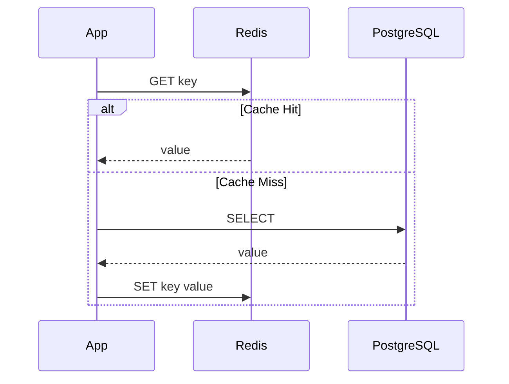
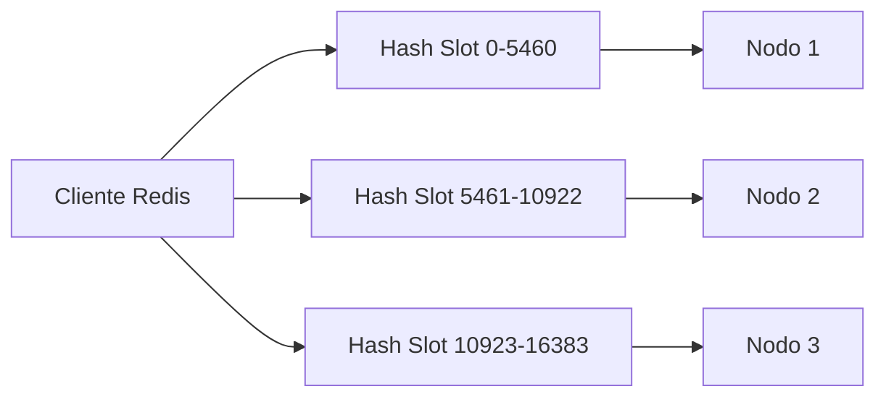

# ⚡ Redis y Caching

Redis no es simplemente una "base de datos en memoria". Es un motor de estructuras de datos de alta velocidad que funciona como caché, broker de mensajes, store de sesiones y, en contextos de ML/AI, como feature store de baja latencia. Cuando un modelo de inferencia necesita recuperar un vector de características en menos de un milisegundo, Redis es frecuentemente la respuesta.


## 1. Estructuras de Datos de Redis

Redis soporta estructuras de datos más allá de simples strings, lo que lo hace extremadamente versátil.

| Estructura | Comandos Clave | Complejidad | Caso de Uso en ML/AI |
|------------|----------------|-------------|----------------------|
| **String** | `SET`, `GET`, `INCR` | $O(1)$ | Almacenar un embedding serializado |
| **List** | `LPUSH`, `RPOP`, `LRANGE` | $O(n)$ para range | Cola de jobs de entrenamiento |
| **Set** | `SADD`, `SISMEMBER`, `SUNION` | $O(1)$ | Conjunto de IDs de usuarios activos |
| **Hash** | `HSET`, `HGET`, `HGETALL` | $O(1)$ | Feature vector con nombres de campo |
| **Sorted Set** | `ZADD`, `ZRANGE`, `ZREVRANK` | $O(\log n)$ | Ranking de predicciones por score |
| **Stream** | `XADD`, `XREAD`, `XGROUP` | $O(1)$ por entrada | Log de eventos de inferencia |

**Caso real:** Un motor de búsqueda vectorial almacena IDs de documentos en un Sorted Set donde el score es la similitud coseno con la consulta del usuario, permitiendo recuperar los top-k resultados en tiempo constante amortizado.


## 2. Patrones de Caching

El caching reduce la latencia y la carga en bases de datos primarias. Existen tres patrones principales:

### 2.1 Cache-Aside (Lazy Loading)

La aplicación consulta la caché primero. Si no está (miss), la lee de la base de datos y la almacena en caché.

```python
import redis
import json

r = redis.Redis(host='localhost', port=6379, db=0)

def get_user_features(user_id: str):
    key = f"features:{user_id}"
    cached = r.get(key)
    if cached:
        return json.loads(cached)
    
    # Simulación de lectura de DB
    features = fetch_from_postgres(user_id)
    r.setex(key, 3600, json.dumps(features))  # TTL de 1 hora
    return features
```

### 2.2 Write-Through

Los datos se escriben simultáneamente en caché y en base de datos. Garantiza consistencia a costa de latencia de escritura.

### 2.3 Write-Behind (Write-Behind Caching)

La aplicación escribe solo en caché; un proceso asíncrono posterior persiste en la base de datos. Maximiza la velocidad de escritura pero introduce riesgo de pérdida de datos.

⚠️ **Advertencia:** Write-Behind es peligroso si Redis cae antes de la persistencia. Úsalo solo para datos regenerables o cuando la durabilidad no sea crítica.




## 3. TTL y Políticas de Evicción

Redis opera en memoria, por lo que debe decidir qué datos eliminar cuando la memoria se agota.

### 3.1 Time-To-Live (TTL)

Cada clave puede tener un tiempo de expiración:

$$
t_{\text{expiración}} = t_{\text{actual}} + \Delta_{\text{TTL}}
$$

### 3.2 Políticas de Evicción

| Política | Descripción | Recomendación |
|----------|-------------|---------------|
| `noeviction` | Rechaza escrituras cuando la memoria está llena | Solo para entornos controlados |
| `allkeys-lru` | Elimina la clave menos recientemente usada (LRU) | **Recomendado** para caching general |
| `allkeys-lfu` | Elimina la clave menos frecuentemente usada (LFU) | Cuando hay patrones de acceso muy desiguales |
| `volatile-lru` | LRU solo entre claves con TTL | Mix de datos persistentes y cache |
| `volatile-ttl` | Elimina la clave con TTL más corto | Datos temporales críticos |

💡 **Tip:** Para feature stores en Redis, `allkeys-lru` es generalmente la mejor opción: mantiene en memoria los vectores de los usuarios más activos y expulsa los inactivos.


## 4. Redis Pub/Sub

El modelo publicador/suscriptor de Redis permite mensajería de uno a muchos en tiempo real.

```python
import redis

r = redis.Redis()
pubsub = r.pubsub()
pubsub.subscribe("model_updates")

for message in pubsub.listen():
    if message['type'] == 'message':
        print(f"Nuevo evento: {message['data']}")
```

⚠️ **Advertencia:** Redis Pub/Sub es **fire-and-forget**. Si un suscriptor está desconectado en el momento del mensaje, lo pierde para siempre. No es adecuado para eventos que requieren durabilidad.


## 5. Redis Streams

Introducido en Redis 5.0, Streams es una estructura de log append-only que soluciona las limitaciones de Pub/Sub.

- **Características:** Persistencia, IDs autogenerados, consumer groups, reconocimiento de mensajes (ACK).
- **Caso real:** Un pipeline de ML utiliza Redis Streams para encolar predicciones de un modelo de clasificación, permitiendo a múltiples workers procesar el stream en paralelo con garantías de entrega.

```python
# Productor
r.xadd("inference_events", {"user_id": "123", "prediction": "0.87"})

# Consumidor con grupo
r.xgroup_create("inference_events", "workers", id="0", mkstream=True)
messages = r.xreadgroup("workers", "consumer_1", {"inference_events": ">"}, count=10)
```


## 6. Distributed Locks: Redlock

En sistemas distribuidos con múltiples workers de ML, los locks garantizan que solo una instancia ejecute una tarea crítica (por ejemplo, actualizar un modelo en producción).

El algoritmo **Redlock** requiere adquirir el lock en la mayoría de instancias Redis independientes:

$$
\text{Lock Valido} = \text{drift} < \text{expiración} - \text{tiempo de adquisición}
$$

```python
import redis
from redis.lock import Lock

r = redis.Redis()
lock = Lock(r, "model_training_lock", timeout=30, thread_local=True)

with lock:
    print("Entrenando modelo...")
    # Solo un worker ejecuta esto a la vez
```

⚠️ **Advertencia:** Implementar locks distribuidos correctamente es difícil. En la práctica, usa la implementación probada de `redis-py` en lugar de construir la tuya desde cero.


## 7. Alta Disponibilidad: Sentinel y Cluster

### 7.1 Redis Sentinel

Proporciona monitoreo, notificación, auto-failover y descubrimiento de nodos maestros.

- **Arquitectura:** 1 master + N replicas + 3+ Sentinels.
- **Caso real:** Feature store crítico utiliza Sentinel para failover automático. Si el master cae, un replica es promovido en segundos sin intervención manual.

### 7.2 Redis Cluster

Particiona datos automáticamente en múltiples nodos mediante **hash slots** (16,384 slots).

$$
\text{slot} = \text{CRC16}(\text{key}) \mod 16384
$$



💡 **Tip:** Redis Cluster es la opción cuando tus datos exceden la RAM de una sola máquina. Para datasets menores, Sentinel + replicación es más simple y eficiente.


## 8. Rate Limiting con Redis

El rate limiting protege APIs de inferencia de modelos contra abuso o picos de tráfico.

### 8.1 Fixed Window

Contador que se reinicia cada ventana de tiempo $T$.

### 8.2 Sliding Window Log

Almacena timestamps de cada request y cuenta los del último intervalo.

### 8.3 Token Bucket

Mantiene un bucket con $B$ tokens que se recargan a una tasa $R$:

$$
\text{Tokens}(t) = \min\left(B, \text{Tokens}(t_0) + R \cdot (t - t_0)\right)
$$

```python
import redis
import time

r = redis.Redis()

def is_allowed(user_id: str, max_requests: int, window: int) -> bool:
    key = f"rate_limit:{user_id}"
    current = r.get(key)
    if current is None:
        r.setex(key, window, 1)
        return True
    if int(current) < max_requests:
        r.incr(key)
        return True
    return False
```

**Caso real:** Plataforma de ML as a service utiliza rate limiting basado en Redis para restringir llamadas a su API de embeddings según el tier de suscripción del cliente, evitando sobrecarga de GPUs compartidas.


*Figura: Concepto de memoria caché. Fuente: Wikimedia Commons.*


## 📦 Código de Compresión

Script para serializar y comprimir estructuras de datos Redis en un archivo `.gz`:

```python
import gzip
import json
import redis

r = redis.Redis(decode_responses=True)

def export_and_compress(pattern: str, output_path: str):
    data = {}
    for key in r.scan_iter(match=pattern):
        key_type = r.type(key)
        if key_type == "string":
            data[key] = r.get(key)
        elif key_type == "hash":
            data[key] = r.hgetall(key)
        elif key_type == "zset":
            data[key] = r.zrange(key, 0, -1, withscores=True)
    
    with gzip.open(output_path, 'wt', encoding='utf-8') as f:
        json.dump(data, f, ensure_ascii=False, indent=2)
    
    print(f"✅ Exportados {len(data)} keys a {output_path}")

if __name__ == "__main__":
    export_and_compress("features:*", "redis_features_backup.json.gz")
```
