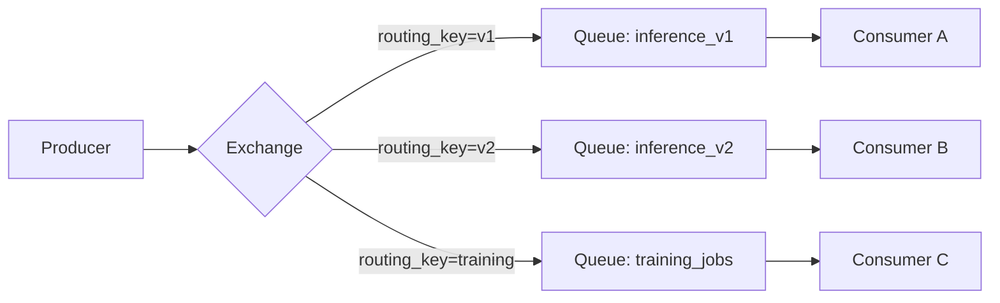
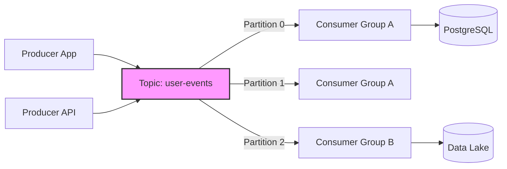

# 📨 Message Queues y Streaming

En sistemas de ML/AI, los componentes rara vez operan en silencio. Un microservicio genera predicciones, otro recolecta feedback, un tercero reentrena el modelo. Message queues y plataformas de streaming son el sistema nervioso que permite que estos componentes se comuniquen de forma asíncrona, tolerante a fallos y escalable. Dominar estas tecnologías es esencial para construir pipelines de datos que no colapsen ante la presión del tráfico en producción.


## 1. Message Queues: RabbitMQ

RabbitMQ es un broker de mensajes robusto que implementa el protocolo AMQP (Advanced Message Queuing Protocol).

### 1.1 Componentes Fundamentales

| Componente | Descripción | Analogía en ML |
|------------|-------------|----------------|
| **Exchange** | Enrutador de mensajes hacia colas | Dispatcher de tareas de entrenamiento |
| **Queue** | Búfer que almacena mensajes | Cola de jobs de batch inference |
| **Binding** | Regla que vincula un exchange con una queue | Regla de enrutamiento por tipo de modelo |
| **Routing Key** | Etiqueta que el exchange usa para enrutar | Versión del modelo o nombre del experimento |

### 1.2 Tipos de Exchange

- **Direct:** Enruta si el routing key coincide exactamente.
- **Topic:** Soporta patrones con comodines (`model.*`, `training.#`).
- **Fanout:** Difunde a todas las colas vinculadas, ignorando el routing key.
- **Headers:** Enruta basado en atributos en los headers del mensaje.



**Caso real:** Plataforma de MLOps utiliza RabbitMQ con exchange topic para enrutar métricas de experimentos (`experiment.{id}.metric`) a diferentes colas de análisis y alertas en tiempo real.


## 2. Apache Kafka: La Plataforma de Streaming

Kafka es un sistema distribuido de publicación-suscripción diseñado para alta throughput y persistencia.

### 2.1 Conceptos Clave

- **Topic:** Categoría de feeds de mensajes.
- **Partition:** División de un topic que permite paralelismo. Cada partición es un log inmutable ordenado.
- **Offset:** Posición secuencial de un mensaje dentro de una partición.
- **Replication Factor ($R$):** Número de copias de cada partición en el cluster. $R=3$ es estándar para producción.

El throughput teórico de un topic puede aproximarse como:

$$
\text{Throughput}_{\text{topic}} \approx \sum_{i=1}^{P} \frac{\text{Mensajes}}{\text{segundo}} \times \text{Tamaño}_{\text{mensaje}}
$$

Donde $P$ es el número de particiones.

### 2.2 Consumer Groups

Los consumidores dentro de un grupo comparten el trabajo: cada partición es asignada a un único consumidor del grupo.

$$
\text{Consumidores Efectivos} = \min(\text{Consumidores}, P)
$$

⚠️ **Advertencia:** Si tienes más consumidores que particiones, los consumidores excedentes permanecerán inactivos. Planifica el número de particiones según el paralelismo deseado.

### 2.3 Kafka Connect y Schema Registry

- **Kafka Connect:** Framework para integrar Kafka con sistemas externos (PostgreSQL, S3, Elasticsearch) sin escribir código.
- **Schema Registry:** Gestiona y evoluciona esquemas Avro/Protobuf/JSON Schema, garantizando compatibilidad entre productores y consumidores.



**Caso real:** Empresa de e-commerce utiliza Kafka para capturar eventos de usuario (vistas, clicks, compras). Un consumer group alimenta un data lake para entrenamiento offline; otro actualiza un feature store en Redis para inferencia online.


## 3. Comparativa: RabbitMQ vs Kafka vs Redis Streams

| Característica | RabbitMQ | Apache Kafka | Redis Streams |
|----------------|----------|--------------|---------------|
| **Modelo** | Cola tradicional / Pub-Sub | Log distribuido persistente | Log en memoria con persistencia opcional |
| **Durabilidad** | Alta (disco) | Muy alta (disco, replicación) | Media (depende de configuración) |
| **Throughput** | Alto (decenas de miles/s) | Muy alto (millones/s) | Alto (centenas de miles/s) |
| **Orden garantizado** | Dentro de una cola | Dentro de una partición | Dentro de un stream |
| **Reprocesamiento** | Complejo | Nativo (cambiar offset) | Limitado (depende de trimming) |
| **Retención** | Hasta consumo o TTL | Tiempo/tamaño configurables | Tamaño configurado |
| **Mejor para** | Tareas job queue, RPC | Streaming de eventos, data pipelines | Comunicación interna rápida, métricas |

💡 **Tip:** En una arquitectura de ML híbrida, es común usar **Kafka** para el backbone de eventos, **RabbitMQ** para job queues puntuales (entrenamiento de modelos pesados) y **Redis Streams** para telemetría de baja latencia.


## 4. Event Sourcing

Event Sourcing es un patrón arquitectónico donde el estado de una aplicación se deriva de una secuencia inmutable de eventos, en lugar de almacenar solo el estado actual.

$$
\text{Estado}(t) = \text{fold}(\text{Estado}_0, [e_1, e_2, \dots, e_n])
$$

**Caso real:** Un sistema de recomendación basado en event sourcing almacena cada interacción del usuario (`ItemViewed`, `ItemPurchased`, `RatingGiven`) en Kafka. El perfil del usuario se reconstruye en cualquier momento reprocesando sus eventos, permitiendo "viajar en el tiempo" para entrenar modelos con snapshots históricas.

⚠️ **Advertencia:** Event Sourcing aumenta la complejidad operativa. Requiere manejo de eventos obsoletos (snapshotting) y garantías de idempotencia en los consumidores.


## 5. Dead Letter Queues (DLQ)

Cuando un mensaje falla repetidamente en ser procesado, no debe bloquear indefinidamente la cola principal. Las **Dead Letter Queues** capturan estos mensajes para análisis posterior.

```python
# Pseudocódigo de manejo con DLQ
MAX_RETRIES = 3

for message in consumer.poll():
    try:
        process(message)
        commit_offset(message)
    except Exception as e:
        if message.retry_count < MAX_RETRIES:
            retry_with_backoff(message)
        else:
            dlq_producer.send(message)
            commit_offset(message)  # Evitar re-procesamiento infinito
```

⚠️ **Advertencia:** Si no comiteas el offset tras enviar a DLQ, el consumer reintentará el mensaje eternamente y la partición se congestinará.


## 6. Idempotencia

Una operación es **idempotente** si aplicarla múltiples veces produce el mismo resultado que aplicarla una sola vez:

$$
f(f(x)) = f(x)
$$

En consumidores de Kafka, la idempotencia es crítica porque los rebalances de consumer groups o los fallos transitorios pueden causar re-entrega de mensajes.

**Caso real:** Un consumer que actualiza un contador de impresiones de anuncios debe ser idempotente. En lugar de `count += 1`, almacena el `offset` del mensaje procesado y solo incrementa si el offset es mayor que el último registrado.

```python
def process_event(user_id: str, event_offset: int):
    last_offset = redis.get(f"last_offset:{user_id}")
    if last_offset and int(last_offset) >= event_offset:
        return  # Idempotencia: ya procesado
    
    update_model(user_id)
    redis.set(f"last_offset:{user_id}", event_offset)
```

💡 **Tip:** Diseña tus consumers pensando en "al menos una vez" (at-least-once delivery). La idempotencia es más robusta que depender de exactly-once semantics, que introducen overhead significativo.


*Figura: Logo de Apache Kafka. Fuente: Wikimedia Commons.*


## 📦 Código de Compresión

Script para comprimir un lote de mensajes de Kafka en formato JSONLines:

```python
import gzip
import json
from pathlib import Path
from datetime import datetime

def comprimir_kafka_batch(input_path: str, output_dir: str):
    output_path = Path(output_dir) / f"kafka_batch_{datetime.now():%Y%m%d_%H%M%S}.jsonl.gz"
    
    with open(input_path, 'r', encoding='utf-8') as f_in:
        with gzip.open(output_path, 'wt', encoding='utf-8') as f_out:
            for line in f_in:
                f_out.write(line)
    
    original = Path(input_path).stat().st_size
    compressed = output_path.stat().st_size
    ratio = (1 - compressed / original) * 100
    print(f"✅ Batch comprimido: {original} -> {compressed} bytes ({ratio:.1f}% reducción)")

if __name__ == "__main__":
    comprimir_kafka_batch("kafka_messages.jsonl", "./compressed_batches")
```
