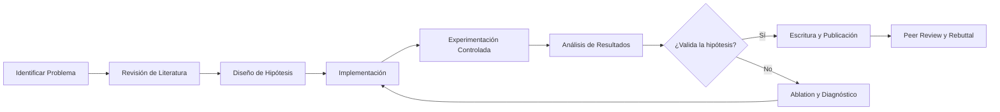
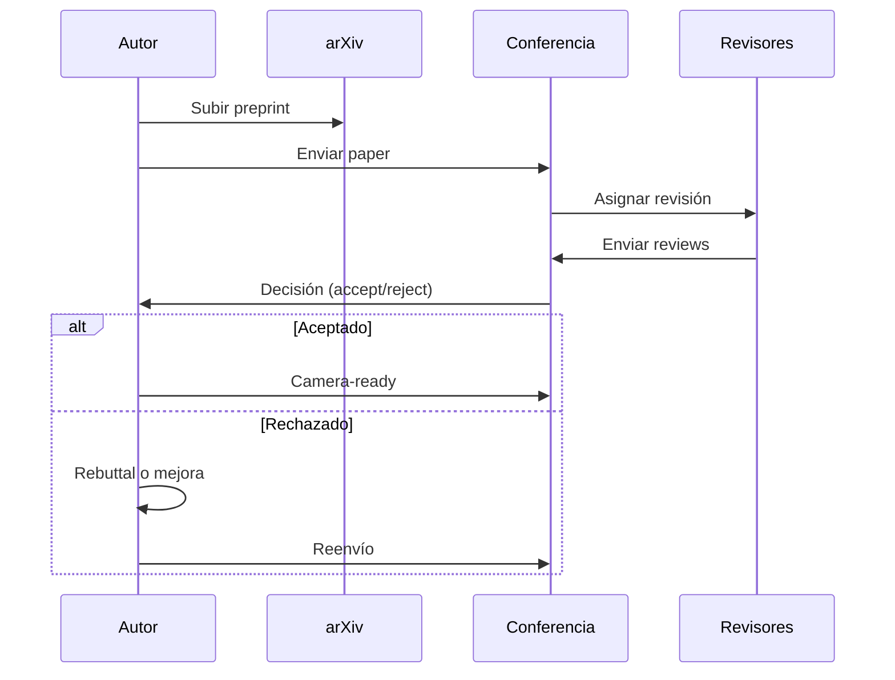

# 🎓 26 - Metodología de Investigación en ML

Bienvenido al módulo de investigación aplicada en Machine Learning. Dominar la metodología científica en ML no es opcional: te permite discernir entre hype real y resultados sesgados, construir sistemas robustos y comunicar hallazgos con rigor. Como ML/AI Engineer, entender cómo se produce el conocimiento te convierte en un profesional capaz de evaluar arquitecturas, replicar experimentos y contribuir a la comunidad.


## 1. Objetivos de Aprendizaje

Al finalizar este curso serás capaz de:

1. Leer papers académicos de ML de forma estructurada y crítica.
2. Reproducir experimentos controlando variables técnicas (seeds, hardware, dependencias).
3. Diseñar y evaluar benchmarks para comparar modelos de forma honesta.
4. Escribir documentación técnica, abstracts y respuestas a revisores con claridad.
5. Replicar un paper clásico documentando discrepancias y publicando tu código.


## 2. Estructura del Curso

| Nota | Título | Descripción |
|------|--------|-------------|
| [[01 - Como Leer Papers de ML]] | Lectura Crítica de Papers | Estructura, skim, deep read, análisis de figuras y trazado de citas |
| [[02 - Reproducibilidad y Experimentos]] | Reproducibilidad | Seeds, determinismo, logging, contenedores y crisis de reproducibilidad |
| [[03 - Benchmarking y Competencias]] | Benchmarks y Kaggle | Diseño de benchmarks, leaderboards, overfitting y competencias |
| [[04 - Escritura Tecnica y Papers]] | Escritura Técnica | IMRaD, abstracts, significancia estadística, rebuttals y ética |
| [[05 - Caso Practico - Reproduccion de un Paper]] | Caso Práctico | Reproducción completa de un paper clásico con documentación |


## 3. Glosario de Términos Esenciales

| Término | Definición |
|---------|------------|
| **Paper** | Artículo científico que presenta una contribución técnica o teórica. |
| **Conference** | Conferencia de alto impacto (NeurIPS, ICML, ICLR) con revisiones y plazos estrictos. |
| **Journal** | Revista científica con ciclos de revisión más largos y artículos extensos. |
| **Peer review** | Proceso de evaluación anónima por expertos antes de la aceptación. |
| **Reproducibility** | Capacidad de obtener los mismos resultados usando el mismo código y datos. |
| **Benchmark** | Protocolo estandarizado para evaluar y comparar modelos. |
| **SOTA** | *State of the Art*: el mejor resultado conocido para una tarea específica. |
| **Ablation study** | Experimento que elimina componentes de un modelo para medir su impacto individual. |
| **Baseline** | Modelo simple de referencia contra el cual se comparan nuevos métodos. |
| **Hyperparameter** | Parámetro configurado antes del entrenamiento (ej. learning rate). |
| **Random seed** | Valor inicial que controla la secuencia de números pseudoaleatorios. |
| **P-value** | Probabilidad de observar un resultado igual o más extremo bajo la hipótesis nula. |
| **Effect size** | Magnitud del efecto observado, independiente del tamaño de la muestra. |
| **arXiv** | Repositorio de preprints donde los autores publican versiones previas al peer review. |


## 4. Roadmap de Investigación en ML

El siguiente diagrama resume el ciclo de vida de un proyecto de investigación aplicada:




## 5. Flujo de Publicación Académica




## 6. Imagen del Ecosistema de Investigación


El crecimiento exponencial de publicaciones en ML obliga a desarrollar filtros de calidad y habilidades de lectura eficiente.


## 7. Cómo Usar Este Curso

💡 **Tip:** No leas las notas de forma lineal si ya tienes experiencia. Usa el índice para saltar al tema que necesites refinar.

⚠️ **Advertencia:** La reproducibilidad no es un "nice to have". En producción, un experimento que no puedes replicar es un riesgo operacional.

Cada nota incluye código Python ejecutable, tablas comparativas y casos reales extraídos de la literatura. Al final de cada archivo encontrarás un bloque de compresión para estudio rápido.


📦 **Código de Compresión - Bienvenida**

```python
# Glosario rápido como diccionario Python
glosario = {
    "paper": "Artículo científico técnico",
    "peer_review": "Evaluación por pares anónima",
    "reproducibility": "Capacidad de replicar resultados",
    "benchmark": "Protocolo estándar de evaluación",
    "SOTA": "State of the Art",
    "ablation_study": "Análisis de contribución por componente",
    "baseline": "Modelo de referencia simple",
    "hyperparameter": "Parámetro pre-entrenamiento",
    "random_seed": "Semilla de aleatoriedad",
    "p_value": "Probabilidad bajo hipótesis nula",
    "effect_size": "Magnitud del efecto observado",
    "arXiv": "Repositorio de preprints"
}

for term, definicion in glosario.items():
    print(f"{term:20s} -> {definicion}")
```
