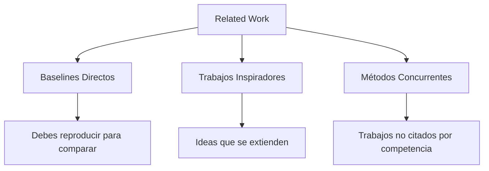
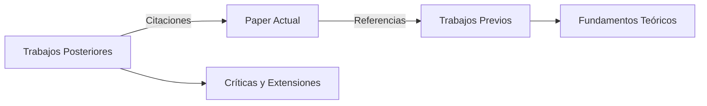

# 📄 01 - Cómo Leer Papers de ML

Leer papers académicos es una habilidad adquirida, no innata. Para un ML/AI Engineer, esta capacidad determina la velocidad con la que adoptas nuevas arquitecturas, detectas limitaciones en modelos propuestos y evitas reinventar soluciones existentes. Un paper bien leído ahorra semanas de experimentación fallida.


## 1. Anatomía de un Paper de ML

La mayoría de los papers de ML siguen una estructura estándar que facilita la extracción de información:

| Sección | Función | Qué buscar |
|---------|---------|------------|
| **Abstract** | Resumen ejecutivo | Contribución principal y ganancia numérica |
| **Introduction** | Contexto y motivación | Problema que resuelve y por qué importa |
| **Related Work** | Mapa del estado del arte | Diferenciación respecto a trabajos previos |
| **Method** | Propuesta técnica | Arquitectura, ecuaciones, algoritmos |
| **Experiments** | Evaluación empírica | Datasets, métricas, comparativas, ablations |
| **Conclusion** | Resumen y trabajo futuro | Limitaciones reconocidas por los autores |

⚠️ **Advertencia:** No todos los papers tienen la misma calidad. Las conferencias tier-1 (NeurIPS, ICML, ICLR) tienen tasas de aceptación del 20-25%, pero incluso papers aceptados pueden contener errores.


## 2. Lectura en 3 Pasos

### 2.1 Skim (5-10 minutos)

Objetivo: decidir si el paper merece una lectura profunda.

1. Lee el título y el abstract.
2. Lee la introducción y la conclusión.
3. Revisa las figuras y tablas principales.
4. Lee los encabezados de la sección de method.

💡 **Tip:** Si el abstract no menciona números concretos (ej. "mejora la exactitud en un 2.3%"), el paper puede carecer de evaluación rigurosa.

### 2.2 Deep Read (30-60 minutos)

Objetivo: entender la propuesta técnica en detalle.

1. Lee la sección de method paso a paso.
2. Reproduce mentalmente las ecuaciones clave.
3. Analiza las figuras: ¿los ejes están bien escalados? ¿hay barras de error?
4. Verifica el dataset y las métricas usadas.

La ecuación central de optimización en muchos papers de ML es la minimización del riesgo empírico:

$$
\hat{\theta} = \arg \min_{\theta} \frac{1}{N} \sum_{i=1}^{N} \mathcal{L}(f_{\theta}(x_i), y_i) + \lambda \Omega(\theta)
$$

Donde $\mathcal{L}$ es la función de pérdida, $\Omega(\theta)$ es el regularizador y $\lambda$ controla su intensidad.

### 2.3 Critical Analysis (20-30 minutos)

Objetivo: evaluar la validez y utilidad de la contribución.

- ¿La mejora sobre el baseline es estadísticamente significativa?
- ¿Los autores reportan desviaciones estándar o solo medias?
- ¿El método escala a problemas reales?
- ¿Hay conflictos de interés o sesgos en la selección de datasets?

Caso real: En el paper original de GANs (Goodfellow et al., 2014), la falta de métricas cuantitativas claras dificultó años de comparaciones posteriores hasta la adopción de IS y FID.


## 3. Identificación de Contribuciones Clave

Un paper puede contribuir en varias dimensiones. Usa esta matriz para clasificar:

| Tipo de contribución | Indicadores en el paper |
|----------------------|--------------------------|
| **Nueva arquitectura** | Diagramas de bloques, ecuaciones de forward pass |
| **Nueva función de pérdida** | Derivadas, demostraciones de convexidad o límites |
| **Nuevo algoritmo de optimización** | Pseudocódigo, complejidad computacional |
| **Nuevo dataset** | Estadísticas descriptivas, proceso de recolección, licencia |
| **Nuevo análisis teórico** | Teoremas, lemas, demostraciones formales |
| **Nuevo resultado empírico** | Tablas SOTA, ablation studies detallados |

💡 **Tip:** La contribución real raramente está en la primera página. Búscala en las últimas líneas de la introducción o en el primer párrafo del method.


## 4. Related Work Mapping

La sección de related work no es solo una lista de referencias: es un mapa estratégico donde los autores posicionan su trabajo.



Caso real: El paper del Transformer (Vaswani et al., 2017) cita explícitamente a RNNs y CNNs como baselines, pero omite mencionar trabajos concurrentes en mecanismos de atención. Un lector crítico traza esas citas faltantes.


## 5. Análisis de Figuras y Tablas

Las figuras son donde los autores cuentan la historia que las palabras no pueden.

| Elemento | Qué evaluar |
|----------|-------------|
| **Curvas de entrenamiento** | ¿Hay overfitting? ¿Convergen ambos ejes? |
| **Barras de error** | ¿Son desviaciones estándar o error estándar? ¿Cuántas seeds? |
| **Heatmaps de atención** | ¿Son interpretables o artefactos posicionales? |
| **Tablas de ablation** | ¿El componente propuesto aporta más allá del hype? |
| **Comparativas SOTA** | ¿Usan los mismos datasets y splits que los demás? |

⚠️ **Advertencia:** Las escalas truncadas en el eje Y pueden magnificar diferencias insignificantes. Siempre verifica los rangos.


## 6. Encontrar Código Asociado

Un paper sin código es un documento incompleto para el practitioner.

1. **PapersWithCode:** Base de datos que vincula papers con implementaciones oficiales y de terceros.
2. **GitHub:** Busca el título del paper entre comillas + "pytorch" o "tensorflow".
3. **OpenReview:** Muchos submissions incluyen código en el material suplementario.
4. **Appendice del paper:** A veces incluye pseudocódigo detallado suficiente para reimplementar.

Caso real: El paper de ResNet (He et al., 2015) fue publicado con código Caffe. La comunidad desarrolló implementaciones en PyTorch y TensorFlow que superaron en popularidad a la oficial, pero introdujeron pequeñas diferencias en la inicialización que afectaron la reproducibilidad exacta.


## 7. Trazado de Citas (Citation Tracing)

Para profundizar en un tema, usa el trazado bidireccional:

- **Backward:** Revisa las referencias del paper para entender los fundamentos.
- **Forward:** Usa Google Scholar para ver quién citó al paper después y si encontraron limitaciones.




## 8. Código: Resumen Automático de Papers

El siguiente script usa la API de arXiv para descargar abstracts y generar un resumen estructurado:

```python
import arxiv
import re

def summarize_paper(paper_id: str):
    """
    Descarga un paper de arXiv y extrae información estructurada.
    paper_id: ej. '1706.03762' para Attention Is All You Need
    """
    client = arxiv.Client()
    search = arxiv.Search(id_list=[paper_id])
    paper = next(client.results())
    
    # Extraer año de la fecha de publicación
    year = paper.published.year
    
    # Contar figuras aproximadas (heurística simple en el resumen)
    fig_count = len(re.findall(r'Figure \d+', paper.summary))
    
    summary = f"""
    Título: {paper.title}
    Autores: {', '.join([a.name for a in paper.authors])}
    Año: {year}
    Categoría: {paper.primary_category}
    
    Abstract (primeros 300 chars):
    {paper.summary[:300]}...
    
    Métricas sugeridas a buscar: accuracy, F1, BLEU, perplexity
    Figuras detectadas en abstract: {fig_count}
    PDF: {paper.pdf_url}
    """
    return summary

# Ejemplo de uso
# print(summarize_paper("1706.03762"))

# Función para mapear contribuciones desde el abstract

def classify_contribution(abstract: str) -> dict:
    keywords = {
        "architecture": ["network", "layer", "block", "module", "transformer", "resnet"],
        "optimization": ["optimizer", "gradient", "learning rate", "sgd", "adam"],
        "loss_function": ["loss", "objective", "penalty", "regularization"],
        "dataset": ["dataset", "benchmark", "corpus", "collection"],
        "theory": ["theorem", "proof", "bound", "convergence", "guarantee"]
    }
    
    abstract_lower = abstract.lower()
    scores = {k: sum(1 for w in v if w in abstract_lower) for k, v in keywords.items()}
    dominant = max(scores, key=scores.get)
    return {"scores": scores, "dominant_contribution": dominant}

# Ejemplo
abstract = "We propose a new neural network architecture for image classification..."
print(classify_contribution(abstract))
```

💡 **Tip:** Extiende este script para extraer tablas del PDF usando `pymupdf` o `pdfplumber`.


## 9. Checklist de Lectura Rápida

- [ ] ¿El abstract tiene números concretos?
- [ ] ¿Los datasets son públicos y estándar?
- [ ] ¿Hay código disponible?
- [ ] ¿Las figuras incluyen barras de error o múltiples seeds?
- [ ] ¿Los autores reportan limitaciones?
- [ ] ¿La mejora sobre el baseline justifica la complejidad añadida?


📦 **Código de Compresión - Lectura de Papers**

```python
class PaperReader:
    def __init__(self, title: str, pdf_url: str):
        self.title = title
        self.pdf_url = pdf_url
        self.contributions = []
        self.baselines = []
    
    def skim(self, abstract: str, figures_count: int):
        self.relevant = figures_count > 2 and len(abstract) > 200
        return self.relevant
    
    def deep_read(self, method_summary: str, metrics: dict):
        self.method_summary = method_summary
        self.reported_metrics = metrics
    
    def critical_analysis(self, significance: bool, has_code: bool):
        self.is_valid = significance and has_code
        return {
            "title": self.title,
            "valid": self.is_valid,
            "metrics": self.reported_metrics
        }

# Uso
paper = PaperReader("Attention Is All You Need", "https://arxiv.org/pdf/1706.03762.pdf")
print(paper.skim("We propose Transformer...", 4))
```
