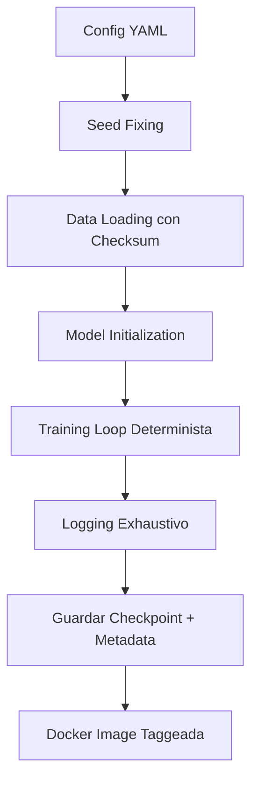

# 🔁 02 - Reproducibilidad y Experimentos

La reproducibilidad es el pilar sobre el cual descansa la credibilidad del ML empírico. Si un experimento no puede replicarse, no es ciencia: es anécdota. Para un ML/AI Engineer, construir pipelines reproducibles reduce la deuda técnica, facilita la depuración y permite la colaboración en equipo.


## 1. La Crisis de Reproducibilidad en ML

Múltiples estudios han documentado que una fracción alarmante de papers de ML no son reproducibles:

| Estudio | Hallazgo |
|---------|----------|
| Pineau et al. (2021) | Solo ~30% de papers aceptados en conferencias top incluyen código |
| Gundersen & Kjensmo (2018) | Menos del 6% de experiments en AI son reproducibles en la práctica |
| Henderson et al. (2018) | Deep RL es particularmente frágil: mismos algoritmos pueden divergir enormemente |

Caso real: En el artículo "Deep Reinforcement Learning that Matters" (Henderson et al., 2018), los autores demostraron que cambiar la semilla aleatoria en PPO podía alterar el ranking relativo entre algoritmos, poniendo en duda decenas de claims de SOTA.


## 2. Factores que Rompen la Reproducibilidad

### 2.1 Hardware

Las diferencias en GPU (CUDA cores, memoria), CPUs y versiones de drivers pueden alterar los resultados debido a:

- Operaciones de reducción no deterministas en GPU.
- Diferencias en precisión numérica (FP16 vs FP32 vs TF32).
- Comunicación en entrenamiento distribuido.

### 2.2 Random Seeds

Los seeds controlan:

- Inicialización de pesos.
- Dropout.
- Augmentación de datos.
- Orden de muestreo en mini-batches.

### 2.3 Hiperparámetros

Un cambio aparentemente menor como el learning rate puede invertir conclusiones:

$$
\theta_{t+1} = \theta_t - \eta \nabla_{\theta} \mathcal{L}(\theta_t)
$$

Donde $\eta$ es el learning rate. Dos papers que reportan diferentes métricas pueden simplemente haber usado $\eta = 1\times10^{-3}$ vs $\eta = 3\times10^{-4}$.

### 2.4 Data Splits

Caso real: En el benchmark GLUE, algunos papers usaban el split de validación para ajuste de hiperparámetros sin revelarlo explícitamente, inflando artificialmente sus scores hasta que se estandarizó el uso del split de test privado.


## 3. Gestión de Random Seeds

Un protocolo mínimo incluye fijar seeds en todas las fuentes de aleatoriedad:

```python
import random
import numpy as np
import torch

def set_seed(seed: int = 42):
    """
    Fija la semilla para todas las librerías relevantes.
    No garantiza determinismo total en GPU sin torch.use_deterministic_algorithms.
    """
    random.seed(seed)
    np.random.seed(seed)
    torch.manual_seed(seed)
    torch.cuda.manual_seed_all(seed)
    # Para determinismo adicional en convoluciones
    torch.backends.cudnn.deterministic = True
    torch.backends.cudnn.benchmark = False

# Uso
set_seed(42)
```

⚠️ **Advertencia:** Incluso con seeds fijos, `torch.backends.cudnn.benchmark = True` puede introducir no determinismo al seleccionar algoritmos de convolución diferentes según el hardware.


## 4. Ejecución Determinista

PyTorch ofrece banderas adicionales para forzar determinismo:

```python
import torch

def enable_full_determinism(seed: int = 42):
    set_seed(seed)
    # Advertencia: puede degradar performance
    torch.use_deterministic_algorithms(True)
    # Variables de entorno necesarias en algunas operaciones
    import os
    os.environ["CUBLAS_WORKSPACE_CONFIG"] = ":4096:8"

# Nota: Algunas operaciones no tienen implementación determinista
# y lanzarán RuntimeError.
```

💡 **Tip:** Documenta en tu README qué operaciones no son deterministas si usas `use_deterministic_algorithms`. Tu lector te lo agradecerá.


## 5. Logging Exhaustivo

Un experimento sin logs es un experimento perdido. Los metadatos mínimos a registrar son:

| Categoría | Qué guardar |
|-----------|-------------|
| **Código** | Commit hash de git, diff si hay cambios no commiteados |
| **Entorno** | Versión de Python, CUDA, PyTorch, numpy, etc. |
| **Datos** | Ruta, checksum MD5, transformaciones aplicadas |
| **Modelo** | Arquitectura, número de parámetros, inicialización |
| **Hiperparámetros** | Learning rate, batch size, scheduler, epochs, weight decay |
| **Resultados** | Métricas por epoch, curvas de loss, tiempos de entrenamiento |

El siguiente patrón centraliza el logging:

```python
import json
import hashlib
from datetime import datetime
from pathlib import Path

class ExperimentLogger:
    def __init__(self, output_dir: str):
        self.output_dir = Path(output_dir)
        self.output_dir.mkdir(parents=True, exist_ok=True)
        self.metadata = {
            "start_time": datetime.now().isoformat(),
            "git_commit": self._get_git_commit(),
            "environment": self._get_env(),
            "config": {}
        }
    
    def _get_git_commit(self) -> str:
        import subprocess
        try:
            return subprocess.check_output(
                ["git", "rev-parse", "HEAD"]
            ).decode().strip()
        except Exception:
            return "unknown"
    
    def _get_env(self) -> dict:
        import torch, numpy
        return {
            "python": __import__("sys").version,
            "torch": torch.__version__,
            "numpy": numpy.__version__,
            "cuda_available": torch.cuda.is_available()
        }
    
    def log_config(self, config: dict):
        self.metadata["config"] = config
        config_path = self.output_dir / "config.json"
        with open(config_path, "w") as f:
            json.dump(config, f, indent=2)
    
    def log_metrics(self, metrics: dict, epoch: int):
        metrics_path = self.output_dir / "metrics.jsonl"
        record = {"epoch": epoch, **metrics}
        with open(metrics_path, "a") as f:
            f.write(json.dumps(record) + "\n")
    
    def finalize(self):
        self.metadata["end_time"] = datetime.now().isoformat()
        with open(self.output_dir / "metadata.json", "w") as f:
            json.dump(self.metadata, f, indent=2)

# Uso
logger = ExperimentLogger("experiments/run_001")
logger.log_config({"lr": 1e-3, "batch_size": 32, "seed": 42})
logger.log_metrics({"train_loss": 0.45, "val_acc": 0.89}, epoch=1)
logger.finalize()
```


## 6. Contenedores para Reproducibilidad

Docker permite encapsular el entorno completo. Un `Dockerfile` mínimo para ML:

```dockerfile
FROM pytorch/pytorch:2.1.0-cuda12.1-cudnn8-runtime

WORKDIR /workspace
COPY requirements.txt .
RUN pip install --no-cache-dir -r requirements.txt

COPY . .
CMD ["python", "train.py"]
```

Y un `docker-compose.yml` para estandarizar ejecución:

```yaml
version: '3.8'
services:
  ml-experiment:
    build: .
    volumes:
      - ./data:/workspace/data
      - ./results:/workspace/results
    environment:
      - CUDA_VISIBLE_DEVICES=0
      - PYTHONUNBUFFERED=1
```

💡 **Tip:** Congela las dependencias con `pip freeze > requirements.txt` y evita usar `latest` en imágenes base.


## 7. Papers que No Reproducen

Es frecuente encontrar discrepancias. La comunidad ha respondido con iniciativas formales:

| Iniciativa | Descripción |
|------------|-------------|
| **ML Reproducibility Challenge** | Evento anual donde voluntarios intentan replicar papers de conferencias top |
| **PapersWithCode** | Vincula papers con implementaciones y resultados reportados |
| **NeurIPS Code Submission** | Requisito creciente de incluir código y datos en submissions |

Caso real: Durante la ML Reproducibility Challenge 2019, aproximadamente el 50% de los papers seleccionados presentaron dificultades de replicación significativas, principalmente por falta de detalles de implementación o datos no disponibles.


## 8. Diagrama de Pipeline Reproducible




## 9. Imagen Representativa


El ciclo de reproducibilidad aplica igual al software científico que al laboratorio experimental.


📦 **Código de Compresión - Reproducibilidad**

```python
import os, random, numpy as np, torch, json
from datetime import datetime

def full_reproducibility_setup(seed=42, output_dir="run"):
    os.makedirs(output_dir, exist_ok=True)
    random.seed(seed); np.random.seed(seed)
    torch.manual_seed(seed); torch.cuda.manual_seed_all(seed)
    torch.backends.cudnn.deterministic = True
    torch.backends.cudnn.benchmark = False
    metadata = {
        "seed": seed,
        "time": datetime.now().isoformat(),
        "torch": torch.__version__,
        "cuda": torch.version.cuda,
        "deterministic": True
    }
    with open(f"{output_dir}/repro.json", "w") as f:
        json.dump(metadata, f, indent=2)
    return metadata

print(full_reproducibility_setup())
```
