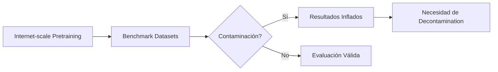
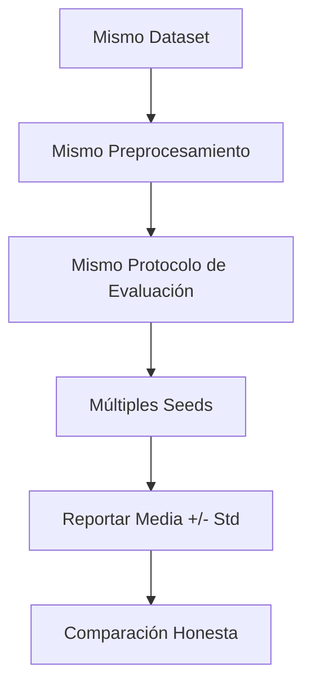

# 🏆 03 - Benchmarking y Competencias

Un benchmark bien diseñado es la brújula que orienta el progreso del ML. Sin embargo, los benchmarks también pueden distorsionar la investigación cuando los investigadores optimizan métricas en lugar de resolver problemas reales. Para un ML/AI Engineer, entender cómo se construyen y cómo se contaminan los benchmarks es esencial para evaluar honestamente qué modelo usar en producción.


## 1. Diseño de Benchmarks

Un benchmark robusto consta de tres pilares:

### 1.1 Datasets

- **Representatividad:** ¿El dataset refleja la distribución real de producción?
- **Tamaño adecuado:** Suficiente para detectar diferencias estadísticamente significativas.
- **Protección contra leakage:** Train, validation y test deben ser estrictamente separados.

### 1.2 Métricas

La elección de la métrica condiciona el comportamiento del modelo. Las más comunes:

| Métrica | Fórmula | Cuándo usarla |
|---------|---------|---------------|
| **Accuracy** | $\\frac{TP+TN}{TP+TN+FP+FN}$ | Clases balanceadas |
| **F1-Score** | $2 \\cdot \\frac{precision \\cdot recall}{precision + recall}$ | Clases desbalanceadas |
| **AUC-ROC** | $\\int_0^1 TPR(FPR^{-1}(x))dx$ | Comparación global de clasificadores |
| **BLEU** | $\\text{BP} \\cdot \\exp\\left(\\sum_{n=1}^N w_n \\log p_n\\right)$ | Traducción y generación de texto |
| **mAP** | $\\frac{1}{Q} \\sum_{q=1}^Q \\text{AP}(q)$ | Detección de objetos |
| **Perplejidad** | $\\exp\\left(-\\frac{1}{N}\\sum_{i=1}^N \\log P(x_i)\\right)$ | Modelado de lenguaje |

### 1.3 Protocolos de Evaluación

- **Single split:** Rápido pero con alta varianza.
- **K-fold cross-validation:** Estimación más robusta, costo computacional K veces mayor.
- **Bootstrap:** Remuestreo con reemplazo para intervalos de confianza.

⚠️ **Advertencia:** Un benchmark con un solo split y una sola seed no puede distinguir entre una mejora real y una fluctuación estadística.


## 2. Leaderboards y su Impacto

Los leaderboards centralizan resultados pero introducen sesgos:

| Plataforma | Enfoque | Riesgo |
|------------|---------|--------|
| **PapersWithCode** | Agrega SOTA por tarea | Puede incluir resultados no revisados por pares |
| **Kaggle** | Competencias con premios | Overfitting al leaderboard privado, leakage |
| **GLUE/SuperGLUE** | NLU estandarizada | Agotamiento de la batería de tests (benchmark saturation) |
| **ImageNet** | Clasificación de imágenes | Dataset contamination con pretraining masivo |

Caso real: En GLUE, el modelo RoBERTa alcanzó puntuaciones cercanas al techo humano, forzando la creación de SuperGLUE con tareas más difíciles. Este ciclo de saturación y reemplazo es común en benchmarks maduros.


## 3. Overfitting a Benchmarks

Cuando la comunidad optimiza exclusivamente para una métrica en un dataset fijo, ocurren distorsiones:

- **Arquitecturas infladas:** Modelos con miles de millones de parámetros que mejoran un 0.1% en ImageNet pero son impracticables en edge devices.
- **Data augmentation excesiva:** Técnicas que mejoran el score de benchmark pero degradan la robustez en dominio real.
- **Ensemble masivo:** Combinar 50 modelos para ganar un leaderboard sin valor práctico.

La fórmula del error de generalización a un benchmark satura cuando:

$$
R_{\\text{true}}(h) \\leq \\hat{R}_{\\text{benchmark}}(h) + \\sqrt{\\frac{d \\log(n/d) + \\log(1/\\delta)}{n}}
$$

Donde $d$ es la dimensión VC y $n$ es el tamaño del dataset. Si $n$ es fijo y la complejidad de los modelos crece, el segundo término se dispara.


## 4. Dataset Contamination

El pretraining a gran escala ha introducido un problema sistémico: los datasets de benchmark pueden haber estado en los datos de preentrenamiento.

Caso real: Estudios sobre GPT-4 y modelos similares revelaron que algunos ejemplos de benchmarks como MMLU o HumanEval aparecían textualmente en el corpus de pretraining, inflando artificialmente el rendimiento reportado. La comunidad ahora exige decontamination rigurosa antes de evaluar.




## 5. Competencias Kaggle

Kaggle es un laboratorio de benchmarking competitivo. Sus competencias se clasifican en:

| Tipo | Descripción | Estrategia típica |
|------|-------------|-------------------|
| **Featured** | Competencias principales con premios monetarios | Ensembles complejos, feature engineering intensivo |
| **Research** | Competencias académicas sin premio | Publicación de métodos novedosos |
| **Getting Started** | Tutoriales para principiantes | Aprendizaje de pipelines básicos |
| **Playground** | Experimentación mensual | Probar ideas rápidamente |

### 5.1 Leakage en Competencias

El leakage ocurre cuando información del conjunto de test se filtra al conjunto de entrenamiento o a la lógica del modelo:

- **Target leakage:** Features que no estarán disponibles en producción.
- **Temporal leakage:** Usar datos futuros para predecir el pasado.
- **ID leakage:** El ID del ejemplo correlaciona con el target.

Caso real: En la competencia "Predicting Molecular Properties" de Kaggle, algunos participantes descubrieron que el orden de los datos en el archivo CSV correlacionaba con la dificultad de la molécula, permitiendo un leakage accidental que mejoraba el score sin entender química.

### 5.2 Estrategias de Ensemble

Los ensembles dominan Kaggle porque reducen la varianza:

$$
\hat{y}_{\\text{ensemble}} = \\frac{1}{M} \\sum_{m=1}^{M} \\hat{y}_m
$$

Donde $M$ es el número de modelos. Variantes avanzadas incluyen stacking y blending.

💡 **Tip:** En producción, un solo modelo bien calibrado suele superar a un ensemble de 20 modelos en latencia y mantenibilidad.


## 6. Comparativa Honesta de Modelos

Para comparar modelos de forma íntegra, sigue este protocolo:

1. **Mismo hardware:** Reporta GPUs, CPUs y tiempo de entrenamiento.
2. **Mismos hiperparámetros de referencia:** Usa grid search o valores reportados por los autores.
3. **Múltiples seeds:** Reporta media y desviación estándar, no solo el mejor run.
4. **Mismo preprocesamiento:** Asegúrate de que la tokenización o normalización sea idéntica.
5. **Métricas secundarias:** Además de accuracy, reporta fairness, robustness y eficiencia.




## 7. Código: Benchmark Simple desde Cero

El siguiente script implementa un benchmark reproducible para clasificación:

```python
import numpy as np
from sklearn.datasets import load_iris
from sklearn.model_selection import StratifiedKFold
from sklearn.preprocessing import StandardScaler
from sklearn.linear_model import LogisticRegression
from sklearn.ensemble import RandomForestClassifier
from sklearn.metrics import accuracy_score, f1_score
import json

def run_benchmark(X, y, models: dict, n_splits: int = 5, seed: int = 42):
    kfold = StratifiedKFold(n_splits=n_splits, shuffle=True, random_state=seed)
    results = {name: {"accuracy": [], "f1": []} for name in models}
    
    for fold, (train_idx, val_idx) in enumerate(kfold.split(X, y)):
        X_train, X_val = X[train_idx], X[val_idx]
        y_train, y_val = y[train_idx], y[val_idx]
        
        scaler = StandardScaler()
        X_train_s = scaler.fit_transform(X_train)
        X_val_s = scaler.transform(X_val)
        
        for name, model in models.items():
            model.fit(X_train_s, y_train)
            preds = model.predict(X_val_s)
            results[name]["accuracy"].append(accuracy_score(y_val, preds))
            results[name]["f1"].append(f1_score(y_val, preds, average="macro"))
    
    # Agregar estadísticas
    summary = {}
    for name, metrics in results.items():
        summary[name] = {
            "accuracy_mean": float(np.mean(metrics["accuracy"])),
            "accuracy_std": float(np.std(metrics["accuracy"])),
            "f1_mean": float(np.mean(metrics["f1"])),
            "f1_std": float(np.std(metrics["f1"]))
        }
    return summary

if __name__ == "__main__":
    X, y = load_iris(return_X_y=True)
    models = {
        "LogisticRegression": LogisticRegression(max_iter=200),
        "RandomForest": RandomForestClassifier(n_estimators=100, random_state=42)
    }
    summary = run_benchmark(X, y, models, n_splits=5, seed=42)
    print(json.dumps(summary, indent=2))
```

⚠️ **Advertencia:** Este benchmark es ilustrativo. En producción, añade validación de que los splits no tengan leakage de identificadores.


## 8. Imagen Representativa


Las curvas de saturación de benchmarks obligan a la comunidad a diseñar evaluaciones cada vez más difíciles y realistas.


📦 **Código de Compresión - Benchmarking**

```python
import numpy as np
from sklearn.model_selection import cross_validate

def honest_model_comparison(models, X, y, cv=5, seed=42):
    results = {}
    for name, model in models.items():
        scores = cross_validate(model, X, y, cv=cv, scoring=["accuracy", "f1_macro"])
        results[name] = {
            "acc": f"{scores['test_accuracy'].mean():.3f} +/- {scores['test_accuracy'].std():.3f}",
            "f1": f"{scores['test_f1_macro'].mean():.3f} +/- {scores['test_f1_macro'].std():.3f}"
        }
    return results

# Uso rápido
# honest_model_comparison({"LR": LogisticRegression(), "RF": RandomForestClassifier()}, X, y)
```
