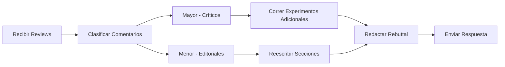

# ✍️ 04 - Escritura Técnica y Papers

Escribir sobre ML no es un arte accesorio: es un medio de transferencia de conocimiento que determina si tu trabajo será adoptado, citado o ignorado. Un ML/AI Engineer que documenta con claridad reduce la fricción entre la investigación y la producción, permitiendo que equipos escalen soluciones con confianza.


## 1. Estructura IMRaD para ML

IMRaD (Introduction, Methods, Results, and Discussion) es el estándar de las ciencias duras, adaptado al ML con variaciones:

| Sección | Contenido ML-específico |
|---------|--------------------------|
| **Introduction** | Problema, motivación, brecha en el estado del arte, contribución explícita |
| **Related Work** | Taxonomía de métodos previos, diferenciación clara |
| **Method** | Arquitectura, ecuaciones, pseudocódigo, justificación de diseño |
| **Experiments** | Datasets, métricas, protocolos, resultados numéricos, ablations |
| **Results** | Tablas, figuras, análisis estadístico |
| **Discussion** | Limitaciones, implicaciones, trabajo futuro |
| **Conclusion** | Resumen ejecutivo de la contribución |

💡 **Tip:** En conferencias de ML, la sección de Method a veces se llama "Model" o "Approach", y Experiments/Results se fusionan.


## 2. Redacción de Abstracts Efectivos

Un abstract de ML de alto impacto sigue la estructura de 5 oraciones:

1. **Background:** Contexto amplio (1 oración).
2. **Problem:** Limitación del estado del arte (1 oración).
3. **Method:** Qué propones (1-2 oraciones).
4. **Results:** Ganancia cuantitativa clave (1 oración).
5. **Conclusion:** Implicación o generalización (1 oración).

Ejemplo estructurado para ResNet:

> Las redes neuronales profundas son difíciles de entrenar. Nosotros presentamos una arquitectura de aprendizaje residual que facilita el entrenamiento de redes sustancialmente más profundas. Evaluamos en ImageNet y COCO, obteniendo mejoras del 3.57% en top-5 error respecto a VGG-19. Nuestros modelos ganaron ILSVRC 2015.

⚠️ **Advertencia:** Evita afirmaciones vagas como "mejoramos significativamente". Usa números con unidades y baselines comparables.


## 3. Presentación de Resultados

### 3.1 Tablas

Una tabla efectiva compara al menos tu método contra 3 baselines en las mismas condiciones:

| Modelo | Top-1 Acc | Top-5 Acc | Parámetros | FLOPs |
|--------|-----------|-----------|------------|-------|
| VGG-16 | 71.5% | 89.8% | 138M | 15.5G |
| ResNet-50 | 76.1% | 92.9% | 25.6M | 4.1G |
| ResNet-101 | 77.4% | 93.5% | 44.5M | 7.8G |
| **Ours** | **78.2%** | **94.1%** | **30.1M** | **5.2G** |

Reglas de oro:
- Negrita en el mejor resultado por columna.
- Alineación decimal para facilitar comparación.
- Unidades consistentes (no mezcles porcentajes y fracciones).

### 3.2 Figuras

- **Curvas de entrenamiento:** Muestra train y validation loss en el mismo gráfico.
- **Barras de error:** Indica desviación estándar sobre múltiples seeds.
- **Heatmaps:** Usa colores perceptualmente uniformes (viridis, plasma), no jet.

### 3.3 Significancia Estadística

No asumas que una diferencia de 0.2% es real. Usa tests apropiados:

- **t-test pareado:** Cuando comparas dos modelos en los mismos folds.
- **Test de McNemar:** Para comparar tasas de error de clasificadores.
- **Bootstrap:** Para intervalos de confianza de métricas complejas.

El p-value para un t-test de dos muestras es:

$$
t = \\frac{\\bar{X}_1 - \\bar{X}_2}{\\sqrt{\\frac{s_1^2}{n_1} + \\frac{s_2^2}{n_2}}}
$$

Donde $\\bar{X}$ son las medias muestrales y $s^2$ las varianzas. Reporta $p < 0.05$ como umbral convencional, pero prefere reportar effect sizes:

$$
d = \\frac{\\bar{X}_1 - \\bar{X}_2}{s_{\\text{pooled}}}
$$

Caso real: El paper de BERT reporta significancia estadística en GLUE, pero estudios posteriores mostraron que el effect size en algunas tareas era pequeño, sugiriendo que la mejora, aunque real, era de importancia práctica limitada.


## 4. Código Abierto con Papers

Publicar código no es opcional para la credibilidad moderna:

| Elemento | Qué incluir |
|----------|-------------|
| **README.md** | Instalación, uso rápido, resultados esperados, citas |
| **requirements.txt** | Versiones exactas de dependencias |
| **Config YAML** | Todos los hiperparámetros reproducibles |
| **Scripts** | Preprocesamiento, entrenamiento, evaluación, inferencia |
| **Checkpoints** | Enlace a modelo entrenado (si el tamaño lo permite) |
| **LICENSE** | Permiso de uso, preferiblemente MIT o Apache-2.0 |

💡 **Tip:** Usa herramientas como `hydra` para configuración y `wandb` o `tensorboard` para logging visual compartible.


## 5. Consideraciones Éticas

La sección de ethical considerations es cada vez más exigida en revisiones:

- **Sesgo en datos:** ¿El dataset subrepresenta grupos demográficos?
- **Impacto ambiental:** ¿Cuántas toneladas de CO2 emitió el entrenamiento?
- **Aplicaciones dañinas:** ¿Podría tu modelo usarse para vigilancia masiva o discriminación?
- **Privacidad:** ¿Hay riesgo de memorización de datos personales?

Caso real: El paper de GPT-3 incluyó una extensa sección de ethical considerations y un análisis de sesgos, estableciendo un estándar para papers de modelos fundacionales posteriores.


## 6. Respuesta a Revisores (Rebuttal)

Cuando recibes reviews, tu rebuttal debe ser conciso y basado en evidencia:

1. **Agradece** cada comentario constructivo.
2. **Responde punto por punto**, citando cambios en el paper o datos adicionales.
3. **No seas defensivo:** Si el revisor tiene razón, admítelo y explica cómo lo corregiste.
4. **Añade experimentos** solo si es factible en el tiempo del rebuttal.

Estructura típica de respuesta:

> **Reviewer 1, Comment 3:** "Los autores no reportan desviación estándar."
>
> **Respuesta:** Agradecemos la observación. Hemos agregado la desviación estándar sobre 5 seeds en la Tabla 2 (líneas 145-150). El resultado mantiene su significancia estadística (p < 0.01).




## 7. Tips de Escritura Clara

- **Voz activa:** "Proponemos un método" es mejor que "Es propuesto un método".
- **Oraciones cortas:** Menos de 25 palabras por oración.
- **Párrafos unitarios:** Cada párrafo expresa una sola idea.
- **Evita jerga innecesaria:** No uses "leverage" cuando quieres decir "usar".
- **Define acrónimos en primera aparición:** Long Short-Term Memory (LSTM).

⚠️ **Advertencia:** El corrector automático no detecta errores técnicos. Revisa que las citas coincidan con la bibliografía y que las ecuaciones estén numeradas consistentemente.


## 8. Imagen Representativa


El proceso de escritura científica es iterativo: redactar, revisar, recibir feedback y reescribir.


📦 **Código de Compresión - Escritura Técnica**

```python
class PaperSection:
    def __init__(self, title: str, sentences: list):
        self.title = title
        self.sentences = sentences
    
    def word_count(self) -> int:
        return sum(len(s.split()) for s in self.sentences)
    
    def has_numbers(self) -> bool:
        return any(any(c.isdigit() for c in s) for s in self.sentences)
    
    def check_abstract_structure(self) -> dict:
        return {
            "background": self.sentences[0],
            "problem": self.sentences[1],
            "method": self.sentences[2],
            "results": self.sentences[3] if len(self.sentences) > 3 else "",
            "conclusion": self.sentences[-1]
        }

# Uso rápido para validar estructura
abstract = PaperSection("Abstract", [
    "Deep learning has advanced...",
    "However, training deep networks remains hard...",
    "We propose residual connections...",
    "Our model achieves 94.1% top-5 accuracy...",
    "This enables scalable vision systems."
])
print(abstract.check_abstract_structure())
```
