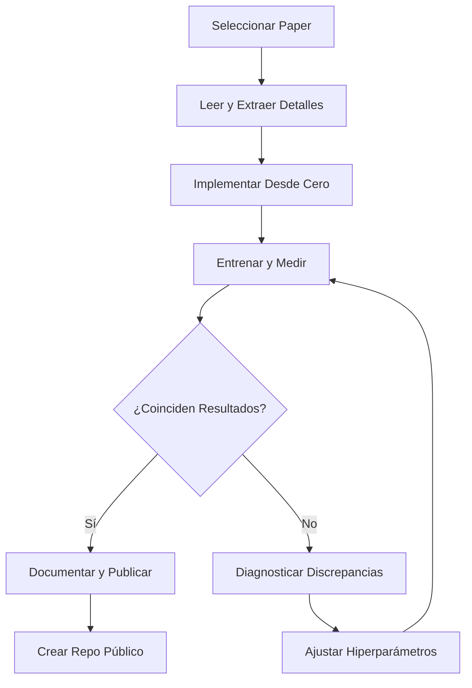

# 🛠️ 05 - Caso Práctico: Reproducción de un Paper

La reproducción de un paper clásico es el examen final de un investigador en ML. No se trata solo de copiar código: se trata de entender cada decisión de diseño, diagnosticar discrepancias y documentar el proceso para que otros puedan construir sobre tu trabajo. Este ejercicio transforma la teoría en habilidad técnica tangible.


## 1. Selección del Paper

Para este caso práctico, seleccionamos **"Deep Residual Learning for Image Recognition" (He et al., 2015)**. Es ideal porque:

- Es influyente y ampliamente citado.
- La idea es elegante pero su implementación requiere atención al detalle.
- Existen múltiples implementaciones de referencia para comparar.
- Los resultados en ImageNet son cuantitativos y verificables.

Alternativas válidas incluyen el paper del Transformer (Vaswani et al., 2017) o AlexNet (Krizhevsky et al., 2012), siempre que elijas uno con métricas claras y datos públicos.


## 2. Fase 1: Lectura y Comprensión

### 2.1 Extracción de Información Clave

Del paper de ResNet extraemos:

| Componente | Detalle del Paper |
|------------|-------------------|
| **Arquitectura** | Bloques residuales con shortcut connections: $y = \\mathcal{F}(x, \\{W_i\\}) + x$ |
| **Datasets** | ImageNet 1K (1.28M train, 50K val), CIFAR-10 (50K train, 10K test) |
| **Optimizador** | SGD con momentum 0.9, weight decay 0.0001 |
| **Learning rate** | 0.1, dividido por 10 en epochs 30, 60, 90 |
| **Batch size** | 256 |
| **Augmentación** | Random crop 224x224, horizontal flip, normalización por canal |
| **Métrica principal** | Top-1 y Top-5 error en ImageNet |

La ecuación fundamental del bloque residual es:

$$
y = \\mathcal{F}(x, \\{W_i\\}) + x
$$

Donde $\\mathcal{F}$ es el mapeo residual a aprender. Cuando las dimensiones no coinciden, se usa una proyección lineal $W_s$:

$$
y = \\mathcal{F}(x, \\{W_i\\}) + W_s x
$$


## 3. Fase 2: Implementación desde Cero

### 3.1 Estructura del Proyecto

```
resnet-reproduction/
├── configs/
│   └── resnet50.yaml
├── data/
│   └── (ImageNet o CIFAR-10)
├── models/
│   ├── resnet.py
│   └── blocks.py
├── train.py
├── evaluate.py
├── utils/
│   ├── seed.py
│   └── logger.py
├── requirements.txt
└── README.md
```

### 3.2 Bloque Residual en PyTorch

```python
import torch
import torch.nn as nn

class BasicBlock(nn.Module):
    expansion = 1
    
    def __init__(self, in_planes, planes, stride=1):
        super(BasicBlock, self).__init__()
        self.conv1 = nn.Conv2d(in_planes, planes, kernel_size=3, 
                               stride=stride, padding=1, bias=False)
        self.bn1 = nn.BatchNorm2d(planes)
        self.conv2 = nn.Conv2d(planes, planes, kernel_size=3, 
                               stride=1, padding=1, bias=False)
        self.bn2 = nn.BatchNorm2d(planes)
        
        self.shortcut = nn.Sequential()
        if stride != 1 or in_planes != self.expansion * planes:
            self.shortcut = nn.Sequential(
                nn.Conv2d(in_planes, self.expansion * planes, 
                          kernel_size=1, stride=stride, bias=False),
                nn.BatchNorm2d(self.expansion * planes)
            )
    
    def forward(self, x):
        out = torch.relu(self.bn1(self.conv1(x)))
        out = self.bn2(self.conv2(out))
        out += self.shortcut(x)
        out = torch.relu(out)
        return out
```

⚠️ **Advertencia:** La inicialización de pesos en ResNet usa Kaiming (He initialization): $W \\sim \\mathcal{N}(0, \\sqrt{2/n_{in}})$. Usar Xavier puede degradar la convergencia.


## 4. Fase 3: Replicación de Resultados

### 4.1 Métricas de Reproducción

Definimos tres niveles de éxito:

| Nivel | Criterio | Descripción |
|-------|----------|-------------|
| **Bronce** | Compila y entrena sin errores | El código ejecuta y la loss decrece |
| **Plata** | Métricas similares en CIFAR-10 | Error Top-1 dentro de +/- 1% del paper |
| **Oro** | Métricas similares en ImageNet | Error Top-1 y Top-5 dentro de +/- 0.5% del paper |

### 4.2 Control de Variables

Para una reproducción honesta, documentamos:

- **Hardware:** GPU(s) usadas, versión de CUDA.
- **Tiempo de entrenamiento:** Horas por epoch y total.
- **Curvas de loss:** Guardar checkpoints cada epoch para comparar forma.
- **Seeds:** Reportar media y std sobre al menos 3 seeds si es factible.

💡 **Tip:** No te frustres si no alcanzas el nivel Oro en ImageNet. El costo computacional es alto y pequeñas diferencias en el data loader pueden afectar el resultado.


## 5. Fase 4: Documentación de Discrepancias

Es probable que encuentres diferencias. Documenta cada una sistemáticamente:

| Discrepancia | Posible Causa | Impacto | Mitigación |
|--------------|---------------|---------|------------|
| Convergencia más lenta | Diferencia en data augmentation | Menor | Ajustar parámetros de RandomResizedCrop |
| Accuracy 0.3% menor | Inicialización de BatchNorm | Menor | Verificar `bn_momentum` y `eps` |
| Out of Memory | Batch size 256 no cabe en GPU | Mayor | Usar gradient accumulation para simular batch size |

Caso real: En la reproducción comunitaria de ResNet, muchos practitioners omitieron el `weight_decay` sobre los parámetros de BatchNorm y bias, una decisión de implementación no explícita en el paper original pero presente en el código de Facebook AI Research.


## 6. Fase 5: Publicación del Código

Tu repositorio debe permitir que un tercero clone y ejecute en menos de 30 minutos:

```markdown
# ResNet Reproduction

## Requisitos
- Python 3.10+
- PyTorch 2.0+
- 1x GPU con 16GB VRAM (para CIFAR-10)
- 4x GPUs con 32GB VRAM (para ImageNet)

## Uso Rápido
```bash
pip install -r requirements.txt
python train.py --config configs/resnet50.yaml --dataset cifar10
```

## Resultados Reproducidos
| Modelo | Dataset | Top-1 Error | Top-5 Error | Tiempo |
|--------|---------|-------------|-------------|--------|
| ResNet-50 | CIFAR-10 | 6.2% | - | 3h |
| Paper original | CIFAR-10 | 6.4% | - | - |

## Discrepancias Documentadas
Ver DISCREPANCIES.md para detalles.
```


## 7. Diagrama del Proceso de Reproducción




## 8. Imagen Representativa


La arquitectura de ResNet-50 ilustra cómo los bloques residuales se apilan para formar una red profunda entrenable.


🎯 **Proyecto Documentado: Reproducción de ResNet**

### Objetivo
Reproducir los resultados de "Deep Residual Learning for Image Recognition" en CIFAR-10 y documentar el proceso completo.

### Requisitos
- Implementar BasicBlock y Bottleneck desde cero.
- Replicar el schedule de learning rate (decay por 10 en epochs 82 y 122 para CIFAR).
- Reportar error Top-1 con media y desviación estándar sobre 3 seeds.
- Publicar código en GitHub con README reproducible.

### Métricas de Evaluación del Proyecto
| Métrica | Meta | Cómo Medir |
|---------|------|------------|
| **Exactitud de reproducción** | Error Top-1 dentro de +/- 0.5% del paper | Comparar contra tabla del paper |
| **Tiempo de implementación** | < 2 días de trabajo efectivo | Bitácora de horas |
| **Código limpio** | Pylint score > 8.0 | Ejecutar pylint |
| **Documentación** | README permite reproducción en 30 min | Review por compañero |

### Entregables
1. Repositorio de GitHub con código y checkpoints.
2. Reporte de discrepancias en formato Markdown.
3. Notebook de análisis de curvas de entrenamiento.
4. (Opcional) Post en blog explicando lecciones aprendidas.


📦 **Código de Compresión - Caso Práctico**

```python
# Template mínimo para reproducir un paper
import torch
import torch.nn as nn
from torch.utils.data import DataLoader
from torchvision import datasets, transforms

def reproduce_paper(paper_name: str, config: dict):
    print(f"Reproduciendo: {paper_name}")
    # 1. Fijar seeds
    torch.manual_seed(config["seed"])
    # 2. Cargar datos
    transform = transforms.Compose([
        transforms.RandomCrop(32, padding=4),
        transforms.RandomHorizontalFlip(),
        transforms.ToTensor(),
    ])
    trainset = datasets.CIFAR10(root='./data', train=True, download=True, transform=transform)
    trainloader = DataLoader(trainset, batch_size=config["batch_size"], shuffle=True)
    # 3. Construir modelo
    model = config["model_class"](num_classes=10)
    # 4. Entrenar y evaluar
    # ... (ver implementación completa en repo)
    return {"status": "trained", "model": model}

config = {
    "seed": 42,
    "batch_size": 128,
    "model_class": lambda num_classes: None  # Reemplazar con tu modelo
}
# reproduce_paper("ResNet", config)
```
