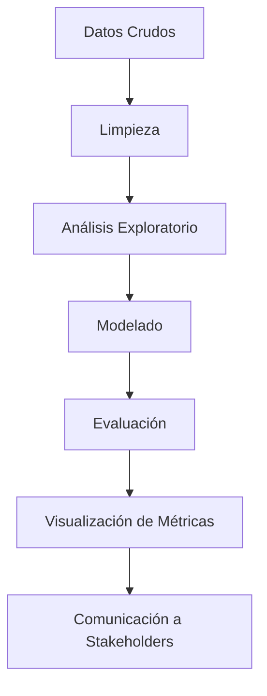
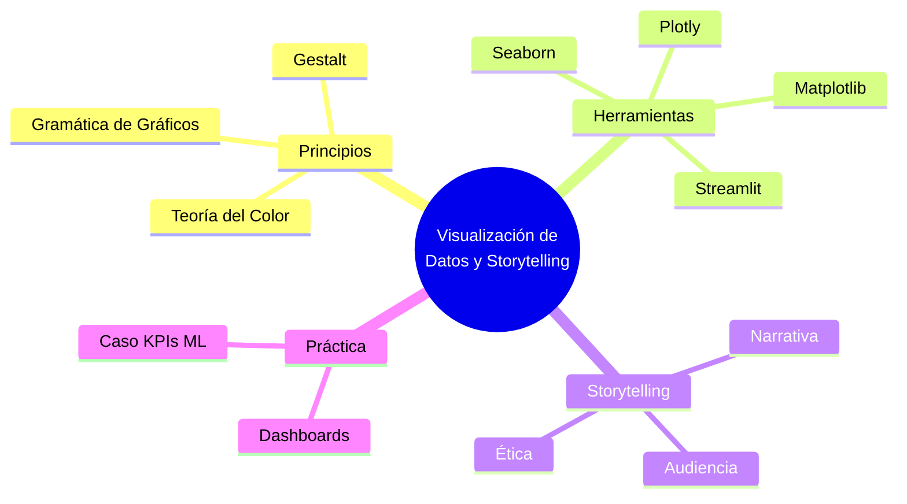

# 🎨 Bienvenida al Curso de Visualización de Datos y Storytelling

La visualización de datos no es solo un conjunto de gráficos bonitos: es el puente entre el análisis crudo y la toma de decisiones. Para un ML/AI Engineer, comunicar resultados de modelos, métricas de drift y hallazgos de investigación de forma clara es tan crítico como entrenar una red neuronal. Una visualización deficiente puede ocultar sesgos, distorsionar métricas o hacer que un stakeholder deseche un proyecto con alto potencial.

En este curso, aprenderás a construir narrativas visuales robustas, diseñar dashboards interactivos y aplicar principios de percepción visual para que tus datos cuenten una historia honesta y efectiva.

---

## 1. Objetivos del Curso

Al finalizar este módulo serás capaz de:

- Aplicar los principios de la gramática de gráficos y la teoría de la Gestalt para diseñar visualizaciones correctas.
- Seleccionar la herramienta de visualización adecuada según el contexto (Python puro, web, BI).
- Construir narrativas de datos (storytelling) que resuenen con diferentes audiencias.
- Desarrollar dashboards interactivos para el monitoreo de modelos de ML.
- Identificar y evitar prácticas de visualización éticamente cuestionables o técnicamente engañosas.

---

## 2. Estructura del Curso

| Nota | Título | Descripción |
|------|--------|-------------|
| [[01 - Principios de Visualizacion]] | Principios de Visualización | Fundamentos teóricos, gramática de gráficos, percepción visual y tipos de gráficos. |
| [[02 - Herramientas de Visualizacion]] | Herramientas de Visualización | Comparativa de librerías Python y herramientas BI. |
| [[03 - Storytelling con Datos]] | Storytelling con Datos | Narrativa, audiencia, ética y técnicas de revelación. |
| [[04 - Dashboards Interactivos]] | Dashboards Interactivos | Diseño, frameworks Python y despliegue. |
| [[05 - Caso Practico - Dashboard de KPIs para ML]] | Caso Práctico | Proyecto integrador de dashboard de ML. |


---

## 3. Glosario

| Término | Definición |
|---------|------------|
| **Visualization** | Representación gráfica de datos para facilitar su comprensión. |
| **Chart** | Tipo específico de visualización (barras, líneas, etc.). |
| **Plot** | Acción de graficar datos; también sinónimo de gráfico en contextos estadísticos. |
| **Dashboard** | Panel visual que agrupa múltiples métricas y gráficos para monitoreo. |
| **Storytelling** | Arte de construir una narrativa coherente alrededor de los datos. |
| **Narrative** | Secuencia estructurada de hechos y análisis que guía al espectador. |
| **Gestalt** | Conjunto de principios psicológicos sobre cómo percibimos patrones visuales. |
| **Color Theory** | Marco para seleccionar paletas de colores funcionales y accesibles. |
| **Encoding** | Mapeo de variables de datos a atributos visuales (posición, color, tamaño). |
| **Marks** | Elementos geométricos básicos que representan datos (puntos, líneas, barras). |
| **Channels** | Propiedades visuales de los marks (color, forma, orientación). |
| **Interactivity** | Capacidad del usuario de manipular la visualización (zoom, filtro, tooltip). |
| **KPI** | Key Performance Indicator; métrica clave de negocio o de modelo. |
| **Metric** | Medida cuantitativa específica (accuracy, latency, F1-score). |
| **Dimension** | Atributo cualitativo o categórico de los datos (fecha, región, clase). |

---

## 4. Relevancia para ML/AI Engineering

En pipelines de machine learning, la visualización interviene en múltiples etapas:

1. **Exploración de datos (EDA):** Identificar distribuciones, correlaciones y outliers antes del entrenamiento.
2. **Depuración de modelos:** Analizar feature importance, curvas de aprendizaje y matrices de confusión.
3. **Monitoreo en producción:** Dashboards de drift, latencia y degradación de rendimiento.
4. **Comunicación de resultados:** Reportes para stakeholders no técnicos.

Caso real: En 2016, un equipo de data science en una fintech presentó la "precisión del 99%" de su modelo de fraude usando una barra gigante sin contexto de clase desbalanceada. La dirección aprobó el despliegue sin darse cuenta de que el recall era del 5%. Una visualización honesta (por ejemplo, una matriz de confusión normalizada) habría evitado la decisión errónea.

---

## 5. Cómo Usar Estas Notas

Cada nota está diseñada para ser autocontenida pero interconectada. Lee los enlaces internos `[[...]]` para navegar entre conceptos. Los bloques de código son ejecutables en Python 3.8+ con las dependencias indicadas.

💡 Tip: Mantén un notebook paralelo donde copies y modifiques el código de cada sesión. La retención activa supera la lectura pasiva.

⚠️ Advertencia: No copies ciegamente el código de producción de los dashboards sin revisar requisitos de seguridad, autenticación y manejo de secretos.

---

## 6. Primer Contacto con el Código

Antes de sumergirnos, valida que tu entorno tenga las librerías básicas:

```python
import matplotlib.pyplot as plt
import numpy as np

x = np.linspace(0, 10, 100)
y = np.sin(x)

plt.figure(figsize=(8, 4))
plt.plot(x, y, label='sin(x)', color='#2E86AB')
plt.title('Hello Visualization World')
plt.xlabel('x')
plt.ylabel('sin(x)')
plt.legend()
plt.grid(True, alpha=0.3)
plt.show()
```

---

## 7. Pipeline de Visualización en ML



Este flujo ilustra cómo la visualización no es un paso aislado, sino una capa transversal que acompaña al ciclo de vida del modelo.

---

## Recursos Visuales

### Roadmap del Curso


### Imagen de Referencia


*Figura: Mapa de Minard de la campaña de Rusia (1869), considerado uno de los mejores ejemplos de storytelling visual en la historia.*

---

📦 Código de Compresión

```python
# Comprime todas las notas del curso en un archivo ZIP para portabilidad
import zipfile
import os
from pathlib import Path

source_dir = Path("C:/Users/Leito/Documents/Learning/ML and IA Engineering/M07 - Research y Ciencia de Datos/27 - Visualizacion de Datos y Storytelling")
output_zip = source_dir.parent / "27 - Visualizacion de Datos y Storytelling.zip"

with zipfile.ZipFile(output_zip, 'w', zipfile.ZIP_DEFLATED) as zf:
    for file in source_dir.glob("*.md"):
        zf.write(file, arcname=file.name)

print(f"Comprimido en: {output_zip}")
```