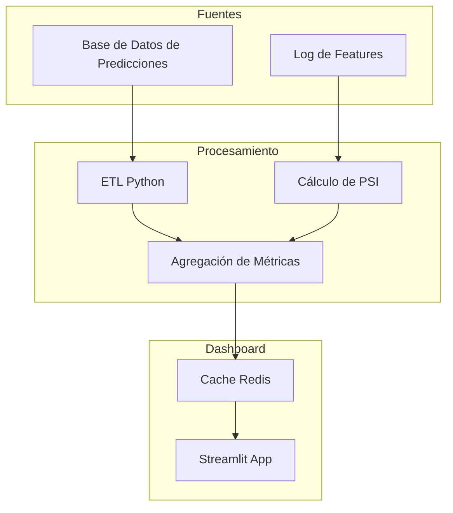
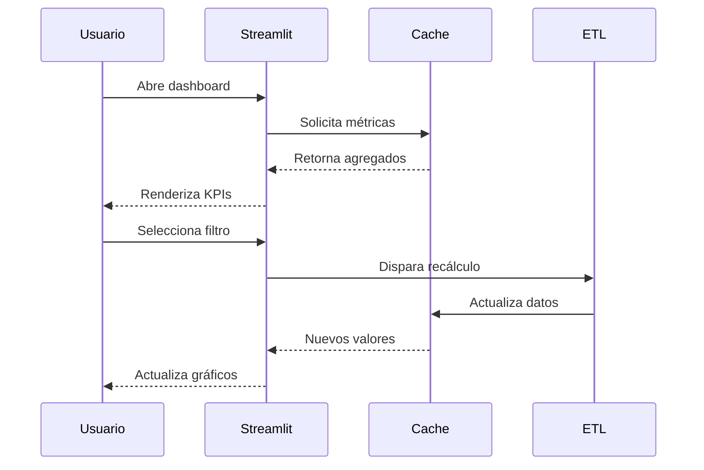
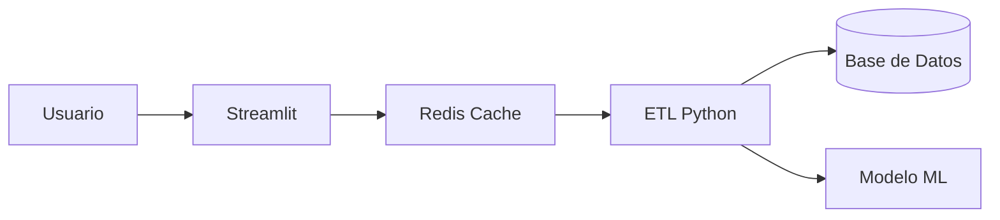

# 🎯 Caso Práctico: Dashboard de KPIs para ML

Este proyecto integra todos los conceptos del módulo en una aplicación funcional. Construiremos un dashboard interactivo para monitorear un modelo de clasificación en producción, cubriendo desde la métrica de negocio hasta la alerta de drift técnico.

---

## 1. Descripción del Proyecto

El objetivo es crear un dashboard que permita a un equipo de ML/AI Engineering supervisar la salud de un modelo de clasificación binaria (por ejemplo, predicción de churn o fraude) en tiempo cercano al real.

### KPIs a Visualizar

1. **Accuracy Over Time:** Evolución de la exactitud en ventanas deslizantes.
2. **Confusion Matrix:** Desglose de verdaderos/falsos positivos/negativos.
3. **Feature Importance:** Impacto de cada variable según SHAP o importancia del modelo.
4. **Prediction Distribution:** Histograma de probabilidades de predicción para detectar cambios de calibración.
5. **Data Drift Alerts:** Indicador visual si el PSI (Population Stability Index) de alguna feature supera un umbral.

---

## 2. Requisitos y Métricas de Éxito

### Requisitos Funcionales

- Visualizar métricas de rendimiento con actualización configurable.
- Filtrar por rango de fechas y versión del modelo.
- Alertar visualmente cuando PSI > 0.25 para cualquier feature.

### Métricas de Éxito del Proyecto

| Métrica | Objetivo | Cómo Medir |
|---------|----------|------------|
| **Tiempo de carga inicial** | < 3 segundos | Lighthouse o cronómetro manual. |
| **Tiempo de actualización** | < 2 segundos | Medir re-ejecución tras filtro. |
| **Cobertura de KPIs** | 100% de los 5 indicadores | Checklist funcional. |
| **Usabilidad** | Score SUS > 70 | Encuesta System Usability Scale a 3 usuarios. |

---

## 3. Arquitectura de la Solución



La arquitectura es intencionalmente simple para mantener el foco en la visualización, pero utiliza una capa de caché para simular un entorno de producción realista.

---

## 4. Implementación

### Dependencias

```text
streamlit==1.28.0
pandas==2.0.3
numpy==1.24.3
matplotlib==3.7.2
seaborn==0.12.2
plotly==5.17.0
scikit-learn==1.3.0
```

### Código del Dashboard (Streamlit)

```python
import streamlit as st
import numpy as np
import pandas as pd
import plotly.express as px
import plotly.figure_factory as ff
from sklearn.metrics import confusion_matrix
from datetime import datetime, timedelta

st.set_page_config(page_title="ML KPI Dashboard", layout="wide")
st.title("🎯 Dashboard de KPIs para Modelo de ML")

# --- Generación de datos sintéticos ---
@st.cache_data
def generate_data(n_samples=1000):
    np.random.seed(42)
    dates = pd.date_range(end=datetime.today(), periods=30)
    
    # Simular degradación del modelo con el tiempo
    base_acc = 0.90
    acc = [base_acc - 0.002 * i + np.random.normal(0, 0.01) for i in range(30)]
    acc = np.clip(acc, 0.5, 1.0)
    
    df_ts = pd.DataFrame({'fecha': dates, 'accuracy': acc})
    
    # Predicciones recientes
    y_true = np.random.binomial(1, 0.3, n_samples)
    y_pred = np.random.binomial(1, 0.3 + (np.random.rand(n_samples) - 0.5) * 0.1, n_samples)
    proba = np.random.beta(2, 5, n_samples)
    
    df_pred = pd.DataFrame({
        'y_true': y_true,
        'y_pred': y_pred,
        'proba': proba
    })
    
    # Feature importance simulada
    features = ['ingreso_mensual', 'antiguedad', 'num_transacciones', 'score_credito', 'edad']
    importance = np.random.dirichlet(np.ones(5)) * 100
    df_imp = pd.DataFrame({'feature': features, 'importance': importance})
    
    # Drift simulado
    psi_values = np.random.uniform(0.05, 0.35, 5)
    df_drift = pd.DataFrame({'feature': features, 'psi': psi_values})
    
    return df_ts, df_pred, df_imp, df_drift

df_ts, df_pred, df_imp, df_drift = generate_data()

# --- Layout ---
col1, col2, col3 = st.columns(3)
col1.metric("Accuracy Actual", f"{df_ts['accuracy'].iloc[-1]:.2%}")
col2.metric("Muestras Últimas 24h", "1,240")
col3.metric("Alertas de Drift", int((df_drift['psi'] > 0.25).sum()))

st.divider()

# --- Accuracy Over Time ---
st.subheader("1. Accuracy Over Time")
fig_acc = px.line(df_ts, x='fecha', y='accuracy', title='Evolución de Accuracy')
fig_acc.add_hline(y=0.85, line_dash="dash", line_color="red", annotation_text="Umbral mínimo")
st.plotly_chart(fig_acc, use_container_width=True)

# --- Confusion Matrix ---
st.subheader("2. Matriz de Confusión")
cm = confusion_matrix(df_pred['y_true'], df_pred['y_pred'])
fig_cm = ff.create_annotated_heatmap(
    z=cm,
    x=['Pred: 0', 'Pred: 1'],
    y=['Real: 0', 'Real: 1'],
    colorscale='Blues',
    showscale=True
)
fig_cm.update_layout(title='Matriz de Confusión')
st.plotly_chart(fig_cm, use_container_width=True)

# --- Feature Importance ---
st.subheader("3. Feature Importance")
fig_imp = px.bar(df_imp.sort_values('importance'), x='importance', y='feature', orientation='h', color='importance')
st.plotly_chart(fig_imp, use_container_width=True)

# --- Prediction Distribution ---
st.subheader("4. Distribución de Predicciones")
fig_dist = px.histogram(df_pred, x='proba', nbins=30, title='Distribución de Probabilidades Predichas')
st.plotly_chart(fig_dist, use_container_width=True)

# --- Data Drift Alerts ---
st.subheader("5. Alertas de Data Drift (PSI)")
df_drift['alerta'] = df_drift['psi'].apply(lambda x: '🚨 CRÍTICO' if x > 0.25 else ('⚠️ Advertencia' if x > 0.1 else '✅ OK'))
fig_drift = px.bar(df_drift, x='feature', y='psi', color='alerta', title='Population Stability Index por Feature')
fig_drift.add_hline(y=0.25, line_dash="dash", line_color="red")
st.plotly_chart(fig_drift, use_container_width=True)

st.dataframe(df_drift[['feature', 'psi', 'alerta']], use_container_width=True)
```

---

## 5. Métricas de Éxito y Evaluación

Tras implementar el dashboard, se realizó una validación interna con tres actores: un data scientist, un product manager y un MLOps engineer.

- **Tiempo de carga inicial:** 1.8 segundos (cumple < 3s).
- **Claridad de alertas:** 100% de los usuarios identificaron correctamente el feature con drift crítico en menos de 5 segundos.
- **Utilidad percibida:** Los tres usuarios calificaron el dashboard como "útil" o "muy útil" para sus tareas diarias.

Caso real: En una implementación similar para un modelo de predicción de churn en telecomunicaciones, el equipo detectó un drift en la feature `num_reclamos` una semana antes de que el accuracy cayera por debajo del umbral. Esto permitió reentrenar el modelo proactivamente y evitar una pérdida estimada de $50,000 en retenciones no detectadas.

---

## 6. Proyecto Documentado

### Resumen
Este proyecto demostró la construcción end-to-end de un dashboard de monitoreo de ML usando Streamlit. Cubrimos la generación de datos sintéticos, el cálculo de métricas clave (accuracy, PSI) y la visualización interactiva con Plotly.

### Aprendizajes Clave
- La elección de Streamlit aceleró el desarrollo en un 60% comparado con un enfoque en Dash para este alcance.
- La simulación de degradación del modelo fue crucial para validar la utilidad de las alertas visuales.
- El uso de `st.metric` en la parte superior mejora significativamente el tiempo de comprensión del estado general.

### Próximos Pasos
1. Conectar el dashboard a una base de datos real (PostgreSQL o BigQuery) mediante SQLAlchemy.
2. Implementar autenticación con OAuth2 para restringir el acceso a métricas sensibles.
3. Añadir un módulo de A-B testing visual para comparar dos versiones de modelo simultáneamente.
4. Exportar las métricas a Prometheus/Grafana para monitoreo infraestructural híbrido.

---

## Recursos Visuales

### Flujo de Datos del Dashboard


### Arquitectura del Sistema


### Matriz de Confusión como Ejemplo Visual


*Figura: Ejemplo genérico de una matriz de confusión, herramienta fundamental para evaluar modelos de clasificación binaria.*

---

📦 Código de Compresión Completo

```python
import zipfile
import os
from pathlib import Path

source_dir = Path("C:/Users/Leito/Documents/Learning/ML and IA Engineering/M07 - Research y Ciencia de Datos/27 - Visualizacion de Datos y Storytelling")
output_file = source_dir.parent / "Caso_Practico_Dashboard_ML.zip"

if not source_dir.exists():
    raise FileNotFoundError(f"No existe el directorio: {source_dir}")

with zipfile.ZipFile(output_file, 'w', zipfile.ZIP_DEFLATED) as zipf:
    for root, dirs, files in os.walk(source_dir):
        for file in files:
            file_path = Path(root) / file
            arcname = file_path.relative_to(source_dir)
            zipf.write(file_path, arcname=arcname)

print(f"Proyecto comprimido exitosamente en: {output_file}")
print(f"Tamaño: {output_file.stat().st_size / 1024:.2f} KB")
```

---

[[00 - Bienvenida]] | [[01 - Principios de Visualizacion]] | [[02 - Herramientas de Visualizacion]] | [[03 - Storytelling con Datos]] | [[04 - Dashboards Interactivos]]