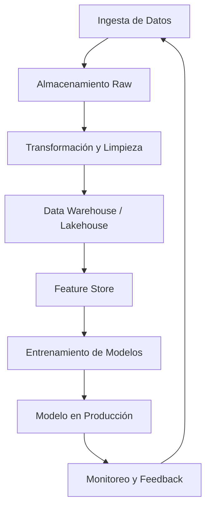

# 🚀 Bienvenida al Curso de ETL y Data Engineering

Bienvenido al módulo **28 - ETL y Data Engineering**, un curso intensivo diseñado para transformar tu comprensión de cómo los datos se mueven, se procesan y se almacenan a escala industrial. En el mundo del Machine Learning (ML) y la Inteligencia Artificial (IA), los modelos no son más que expresiones matemáticas sofisticadas; su verdadero poder emerge cuando se alimentan con datos de alta calidad, bien gobernados y disponibles en el momento exacto en que se necesitan.

Este curso no solo te enseñará a construir pipelines robustos, sino que te dotará del pensamiento arquitectónico necesario para diseñar sistemas de datos que escalen desde prototipos en tu laptop hasta clusters de miles de nodos procesando petabytes de información.

## 📋 Índice del Curso

A continuación encontrarás un mapa de ruta detallado de las secciones que componen este módulo. Cada nota está diseñada para construir sobre la anterior, creando una narrativa coherente desde los fundamentos hasta la aplicación práctica.

1. [[01 - Pipeline de Datos]]: Arquitectura de flujos de datos, patrones batch vs streaming, orquestación y monitoreo.

2. [[02 - Apache Spark y Procesamiento Distribuido]]: Computación distribuida a gran escala con PySpark, optimización de queries y gestión de clusters.

3. [[03 - Data Warehousing]]: Modelado dimensional, diferencias entre warehouse, lake y lakehouse, y motores de consulta analítica.

4. [[04 - Calidad de Datos y Data Governance]]: Dimensiones de calidad, validación automatizada, linaje y cumplimiento normativo.

5. [[05 - Caso Practico - Pipeline ETL para Datos de Ventas]]: Proyecto end-to-end integrando extracción multi-fuente, transformación compleja y carga en un data warehouse dimensional.

## 📖 Glosario Esencial

Dominar la terminología es el primer paso para comunicarte efectivamente con otros ingenieros de datos, científicos de datos y arquitectos de sistemas. A continuación, presentamos los términos críticos de este dominio.

| Término | Definición | Relevancia para ML/AI |
|---------|------------|----------------------|
| **ETL** | Extract, Transform, Load. Proceso de extraer datos de fuentes heterogéneas, transformarlos para cumplir con estándares de calidad y formato, y cargarlos en un destino final. | Garantiza que los datasets de entrenamiento sean consistentes, limpios y estén en el formato óptimo para frameworks como TensorFlow o PyTorch. |
| **ELT** | Extract, Load, Transform. Variante donde los datos se cargan primero en el destino (generalmente un data lake o warehouse moderno) y las transformaciones ocurren *in-situ* mediante SQL o motores de procesamiento. | Permite a los científicos de datos acceder a datos crudos rápidamente y definir sus propias transformaciones sin depender de un equipo de ingeniería dedicado. |
| **Pipeline** | Secuencia automatizada de procesos de datos donde la salida de una etapa es la entrada de la siguiente. Representa el flujo de trabajo end-to-end. | Un pipeline de ML (MLOps) extiende el pipeline de datos para incluir entrenamiento, validación y despliegue de modelos. |
| **Ingestion** | Proceso de obtención y transporte de datos desde sus fuentes originales hacia un sistema de almacenamiento o procesamiento. | La ingesta eficiente determina la frescura de los datos y, por ende, la capacidad de realizar inferencias en tiempo real. |
| **Transformation** | Manipulación de datos para cambiar su estructura, formato o valores. Incluye limpieza, normalización, agregación y enriquecimiento. | Las transformaciones adecuadas reducen el sesgo, mejoran la convergencia de algoritmos y permiten la ingeniería de características (feature engineering). |
| **Loading** | Fase final del pipeline donde los datos transformados se persisten en el sistema de destino, ya sea mediante carga completa o incremental. | Un mal diseño de carga puede causar cuellos de botella que retrasan la disponibilidad de datos para el reentrenamiento de modelos. |
| **Batch** | Procesamiento de datos en grupos acumulados durante un período de tiempo. Ejemplo: procesar todas las transacciones del día a las 2:00 AM. | Ideal para entrenamiento de modelos que no requieren actualización continua, como recomendadores semanales. |
| **Streaming** | Procesamiento de datos de forma continua y en tiempo real a medida que se generan los eventos. Ejemplo: procesar cada clic de usuario instantáneamente. | Esencial para ML en tiempo real (online learning) y sistemas de detección de anomalías. |
| **Data Lake** | Repositorio de almacenamiento que contiene una vasta cantidad de datos en su formato raw o nativo, estructurados, semi-estructurados y no estructurados. | Actúa como el "lago" central donde los científicos de datos pueden pescar datos para experimentación sin restricciones de esquema. |
| **Data Warehouse** | Sistema de almacenamiento optimizado para consultas analíticas y reporting. Los datos están altamente estructurados y modelados. | Fuente de verdad para dashboards de negocio y análisis históricos que alimentan la toma de decisiones estratégicas. |
| **Schema** | Estructura lógica que define la organización de los datos (tablas, columnas, tipos de datos, relaciones). | Un esquema bien definido es crucial para la validación de features y la compatibilidad entre versiones de datasets. |
| **Partition** | División lógica o física de un dataset en subconjuntos más pequeños basados en el valor de una o más columnas (ej. fecha, región). | Las particiones correctas aceleran drásticamente las consultas de entrenamiento que suelen filtrar por rangos temporales. |
| **Orchestration** | Automatización, gestión y coordinación de workflows complejos de datos. Garantiza que las tareas se ejecuten en el orden correcto, manejando dependencias y fallos. | La orquestación es el corazón de MLOps, asegurando que el reentrenamiento ocurra solo cuando los datos nuevos estén listos y validados. |
| **Airflow** | Plataforma de orquestación de workflows de código abierto desarrollada por Airbnb. Utiliza DAGs (Directed Acyclic Graphs) para definir pipelines. | Estándar de facto para la programación de pipelines de datos y ML en la industria. |
| **Spark** | Motor de procesamiento distribuido de código abierto diseñado para computación a gran escala. Soporta Java, Scala, Python (PySpark) y R. | Permite entrenar modelos de ML sobre datasets que no caben en la memoria de una sola máquina mediante MLlib. |
| **Hadoop** | Ecosistema de código abierto para almacenamiento y procesamiento distribuido de grandes conjuntos de datos. Su componente principal es HDFS (Hadoop Distributed File System). | Pionero del Big Data; aunque ha sido complementado por tecnologías más modernas, sigue siendo la base de muchas arquitecturas on-premise. |
| **SQL** | Structured Query Language. Lenguaje estándar para gestionar y consultar datos en bases de datos relacionales. | Indispensable para la preparación de datasets tabulares, el 80% de los pipelines de datos lo utilizan extensivamente. |
| **NoSQL** | Categoría de bases de datos que no utilizan el modelo relacional tradicional. Incluyen documentales (MongoDB), clave-valor (Redis), columnares (Cassandra) y grafos (Neo4j). | Ideales para almacenar datos semi-estructurados como logs, perfiles de usuario o grafos de conocimiento para sistemas de IA. |

## 🎯 Objetivos de Aprendizaje

Al finalizar este curso, serás capaz de:

1. Diseñar arquitecturas de pipelines de datos que equilibren latencia, throughput y costo, seleccionando conscientemente entre patrones batch, streaming, lambda y kappa.

2. Implementar transformaciones complejas en PySpark, aprovechando el procesamiento distribuido para reducir de horas a minutos el tiempo de preparación de datasets de entrenamiento.

3. Modelar datos dimensionales utilizando esquemas estrella y copo de nieve, optimizando las consultas analíticas que alimentan tanto dashboards como modelos de ML.

4. Implementar marcos de calidad de datos automatizados que detecten anomalías, valores faltantes y drift en los datos antes de que afecten la precisión de los modelos en producción.

5. Construir un pipeline ETL completo, desde la extracción de múltiples fuentes heterogéneas hasta la carga en un data warehouse, incluyendo monitoreo, logging y manejo de errores.

## 💡 Tip para Navegar el Curso

> 💡 No trates de memorizar cada herramienta o framework. En Data Engineering, la tecnología evoluciona rápidamente. Enfócate en comprender los **principios subyacentes**: la inmutabilidad de los datos en streaming, la idempotencia de las transformaciones, y el desacoplamiento de la ingesta del procesamiento. Si dominas estos principios, aprender cualquier herramienta nueva será trivial.

## ⚠️ Advertencia Importante

> ⚠️ Este curso asume que tienes conocimientos intermedios de Python y SQL. Aunque explicaremos los conceptos desde cero, la velocidad y profundidad del contenido está calibrada para profesionales que buscan aplicar estos conocimientos en entornos de producción reales. Si encuentras conceptos desafiantes, te recomendamos reforzar los fundamentos de programación funcional y bases de datos relacionales antes de continuar.

---

¡Comencemos este viaje hacia la maestría en el movimiento y la gobernanza de datos!
