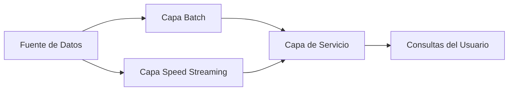

# 🔄 Pipeline de Datos

En el ecosistema del Machine Learning y la Inteligencia Artificial, un modelo predictivo solo es tan bueno como los datos que lo alimentan. Sin embargo, los datos rara vez llegan en el formato, calidad o velocidad requeridos. Aquí es donde entra en juego el **pipeline de datos**: una secuencia automatizada de procesos que transforma datos crudos en activos estructurados, confiables y listos para el consumo analítico o predictivo. Para un ML/AI Engineer, comprender la arquitectura de estos pipelines no es opcional; es una competencia fundamental para escalar soluciones desde notebooks locales hasta sistemas de producción que manejan millones de eventos por segundo.


## 1. Arquitectura de Pipelines: Batch vs Streaming

La primera decisión arquitectónica al diseñar un pipeline es determinar la naturaleza temporal del procesamiento. Esta elección impacta directamente en la latencia, el costo operativo, la complejidad del sistema y la frescura de los datos disponibles para entrenar modelos o realizar inferencias.

### 1.1 Procesamiento Batch

El procesamiento por lotes (batch) opera sobre conjuntos finitos de datos acumulados durante un intervalo de tiempo definido. Es el paradigma tradicional del Data Engineering, optimizado para throughput masivo en lugar de baja latencia.

**Características fundamentales:**

- **Datos acumulativos:** Los datos se agrupan en ventanas temporales (horas, días, semanas).

- **Alta throughput:** Diseñado para procesar volúmenes masivos de datos históricos de manera eficiente.

- **Latencia alta:** El tiempo entre la generación del dato y su disponibilidad para análisis es igual al intervalo del batch más el tiempo de procesamiento.

**Fórmula de latencia batch:**

$$L_{batch} = T_{intervalo} + T_{procesamiento}$$

Donde $L_{batch}$ es la latencia total, $T_{intervalo}$ es el tiempo de acumulación de datos y $T_{procesamiento}$ es el tiempo que tarda el job en ejecutarse.

**Aplicaciones en ML/AI:**

- Entrenamiento de modelos de aprendizaje profundo que requieren epochs completos sobre datasets históricos.

- Re-entrenamiento semanal de modelos de recomendación colaborativa.

- Generación de features agregadas de largo plazo (ej. "promedio de gasto mensual del cliente").

> ⚠️ **Advertencia:** No utilices batch para casos de uso que requieren inferencia en tiempo real, como la detección de fraude en transacciones bancarias. La latencia inherente haría que el modelo reaccione demasiado tarde.

### 1.2 Procesamiento Streaming

El procesamiento en streaming (o tiempo real) consume y procesa datos de forma continua, evento por evento o en micro-batches de baja latencia. Es el paradigma dominante para aplicaciones donde el valor del dato decae rápidamente con el tiempo.

**Características fundamentales:**

- **Baja latencia:** Los datos están disponibles para análisis en segundos o milisegundos.

- **Procesamiento continuo:** No hay un "fin" del dataset; el flujo es potencialmente infinito.

- **Estado y ventanas:** Requiere gestión de estado (stateful processing) y definición de ventanas temporales (tumbling, sliding, session windows) para operaciones de agregación.

**Aplicaciones en ML/AI:**

- Detección de anomalías en sensores IoT.

- Sistemas de recomendación en tiempo real durante una sesión de navegación.

- Online Learning, donde el modelo se actualiza incrementalmente con cada nuevo evento.

### 1.3 Patrón Lambda

El patrón Lambda, propuesto por Nathan Marz, intenta obtener lo mejor de ambos mundos: la exhaustividad del batch y la baja latencia del streaming. Consiste en mantener **dos capas de procesamiento paralelas**.



- **Capa Batch (Batch Layer):** Procesa el dataset completo (master dataset) para generar vistas precomputadas exactas. Es lento pero correcto.

- **Capa Speed (Speed Layer):** Procesa solo los datos recientes que aún no han sido absorbidos por la capa batch. Es rápido pero puede ser aproximado.

- **Capa de Servicio (Serving Layer):** Combina los resultados de ambas capas para responder consultas. Cuando el batch termina, sus resultados sobrescriben los de la capa speed.

> 💡 **Tip:** El patrón Lambda fue extremadamente popular, pero su complejidad operativa (mantener dos codebases) ha llevado a muchas organizaciones a migrar al patrón Kappa cuando sus motores de streaming se volvieron lo suficientemente robustos.

### 1.4 Patrón Kappa

Propuesto por Jay Kreps, el patrón Kappa simplifica la arquitectura al tratar **todo como un stream**. No existe una capa batch separada; el procesamiento batch no es más que un stream con un offset de inicio fijo.

**Principio fundamental:**

Si tu motor de streaming es lo suficientemente capaz (ej. Apache Kafka con Kafka Streams, Apache Flink), puedes re-procesar datos históricos simplemente reiniciando el consumidor desde el principio del log de eventos (replayability).


| Característica | Patrón Lambda | Patrón Kappa |
|---------------|---------------|--------------|
| **Complejidad** | Alta (dos sistemas) | Baja (un solo sistema) |
| **Mantenimiento** | Costoso | Simplificado |
| **Re-procesamiento** | En capa batch | Replay del stream |
| **Casos de uso** | Cuando el batch y stream requieren lógicas muy diferentes | Ideal para arquitecturas modernas con Kafka/Flink |

**Caso real:** LinkedIn, creador de Apache Kafka, utiliza extensivamente el patrón Kappa para sus sistemas de análisis de engagement y detección de conexiones profesionales, re-procesando logs de eventos cuando necesitan corregir bugs en la lógica de procesamiento.

## 2. Ingesta de Datos

La ingesta es la puerta de entrada del pipeline. Un sistema de ingesta robusto debe ser capaz de manejar múltiples fuentes, formatos y velocidades sin convertirse en un cuello de botella.

### 2.1 Fuentes de Datos Comunes

**Archivos Batch:**

- **CSV/JSON/XML:** Formatos ubicuos pero poco eficientes a gran escala.

- **Parquet/ORC:** Formatos columnares optimizados para lectura analítica. Son el estándar de facto para almacenamiento en data lakes.

- **Avro:** Formatos binarios con esquema, ideales para la serialización entre microservicios.

**APIs:**

- **REST/GraphQL:** Extracción mediante polling o webhooks.

- **APIs de SaaS:** Salesforce, HubSpot, Google Analytics. Requieren manejo de rate limits y paginación.

**Bases de Datos:**

- **Full Extraction:** Extraer tablas completas. Simple pero ineficiente para tablas grandes.

- **Incremental Extraction:** Extraer solo registros modificados desde la última ejecución, típicamente usando una columna timestamp o un ID autoincremental.

**Streaming:**

- **Apache Kafka:** Plataforma de streaming distribuida. Utiliza el concepto de topics y particiones para escalar horizontalmente.

- **Apache Pulsar:** Alternativa moderna a Kafka con mejor soporte para geo-replicación y multi-tenancy.

- **AWS Kinesis / Google Pub/Sub:** Servicios gestionados de streaming en la nube.

### 2.2 Consideraciones de Ingesta

**Idempotencia:**

Una operación de ingesta es idempotente si ejecutarla múltiples veces produce el mismo resultado que ejecutarla una sola vez. Esto es crítico para la recuperación ante fallos.

$$f(x) = f(f(x))$$

> ⚠️ **Advertencia:** La falta de idempotencia en la ingesta es una de las causas principales de duplicación de datos. Si un job de ingesta falla a la mitad y se reinicia, sin mecanismos idempotentes terminarás con registros duplicados que contaminarán tu dataset de entrenamiento.

## 3. Transformación de Datos

La transformación es donde los datos crudos se convierten en información accionable. Para ML/AI, esta etapa es sinónimo de **feature engineering** a gran escala.

### 3.1 Tipos de Transformación

**Limpieza (Cleaning):**

- Manejo de valores nulos (imputación, eliminación).

- Corrección de tipos de datos y formatos inconsistentes.

- Eliminación de duplicados.

**Normalización y Escalado:**

Crucial para algoritmos sensibles a la magnitud de las features (SVM, KNN, redes neuronales).

$$x_{norm} = \frac{x - x_{min}}{x_{max} - x_{min}}$$

**Estandarización (Z-score):**

$$z = \frac{x - \mu}{\sigma}$$

Donde $\mu$ es la media y $\sigma$ es la desviación estándar.

**Agregación:**

- Operaciones de grupo: `GROUP BY`, ventanas temporales.

- Métricas derivadas: conteos, promedios, medianas, percentiles.

**Enriquecimiento:**

- Unión (join) con datasets externos para añadir contexto.

- Geocodificación, enriquecimiento demográfico, lookups en bases de datos maestras.

> 💡 **Tip:** En pipelines de ML, documenta cada transformación y mantén un **feature store** centralizado. Si un científico de datos crea una feature que mejora el modelo, otros equipos deben poder reutilizarla sin recalcularla desde cero.

## 4. Carga de Datos

Una vez transformados, los datos deben cargarse en el sistema de destino. La estrategia de carga impacta directamente en la disponibilidad y el rendimiento de las consultas.

### 4.1 Carga Completa (Full Load)

Trunca la tabla destino y reinserta todos los datos desde cero.

- **Ventajas:** Simplicidad, garantía de consistencia total.

- **Desventajas:** Impracticable para tablas masivas; alto consumo de recursos y tiempo.

### 4.2 Carga Incremental (Incremental Load)

Inserta o actualiza solo los registros que han cambiado desde la última ejecución.

- **Ventajas:** Eficiencia, baja latencia.

- **Desventajas:** Mayor complejidad para detectar cambios y manejar eliminaciones.

### 4.3 Change Data Capture (CDC)

Técnica avanzada para capturar cambios en la base de datos fuente en tiempo real.

- **Log-based CDC:** Lee el transaction log de la base de datos (WAL en PostgreSQL, binlog en MySQL). Es el método más eficiente y con menor impacto en la fuente.

- **Trigger-based CDC:** Usa triggers de base de datos para registrar cambios en tablas auxiliares.

**Caso real:** Netflix utiliza CDC basado en logs para replicar cambios de sus bases de datos transaccionales hacia su data warehouse en tiempo casi real, permitiendo análisis de consumo de contenido con latencia mínima.

## 5. Orquestación y Workflow Management

Un pipeline real no es un solo script; es un grafo de dependencias complejas donde la tarea C no puede comenzar hasta que A y B terminen exitosamente. Los orquestadores gestionan este grafo.

### 5.1 Apache Airflow

Líder de facto en la industria. Utiliza DAGs (Directed Acyclic Graphs) escritos en Python para definir workflows.

**Conceptos clave:**

- **DAG:** Grafo dirigido acíclico que define el flujo de tareas.

- **Operators:** Unidades atómicas de trabajo (PythonOperator, BashOperator, SQL operators).

- **Schedulers:** Componente que decide cuándo ejecutar un DAG basado en su configuración cron.

- **Workers:** Procesos que ejecutan las tareas reales.

```python
from airflow import DAG
from airflow.operators.python import PythonOperator
from datetime import datetime, timedelta

def extract_data():
    print("Extrayendo datos de múltiples fuentes...")
    # Lógica de extracción

def transform_data():
    print("Aplicando transformaciones y feature engineering...")
    # Lógica de transformación

def load_data():
    print("Cargando datos en el data warehouse...")
    # Lógica de carga

with DAG(
    'etl_pipeline_ml',
    default_args={
        'owner': 'data_engineering',
        'depends_on_past': False,
        'email_on_failure': True,
        'retries': 3,
        'retry_delay': timedelta(minutes=5),
    },
    description='Pipeline ETL para datos de entrenamiento de ML',
    schedule_interval=timedelta(hours=6),
    start_date=datetime(2024, 1, 1),
    catchup=False,
    tags=['ml', 'etl'],
) as dag:

    extract = PythonOperator(
        task_id='extract',
        python_callable=extract_data,
    )

    transform = PythonOperator(
        task_id='transform',
        python_callable=transform_data,
    )

    load = PythonOperator(
        task_id='load',
        python_callable=load_data,
    )

    extract >> transform >> load
```

### 5.2 Prefect

Framework moderno y Python-native que simplifica la construcción de workflows robustos. Su diferenciador principal es la separación del "flow" (lógica) de la "infrastructure" (dónde se ejecuta).

### 5.3 Dagster

Diseñado específicamente para data applications. Introduce conceptos como "assets" (datos producidos) y un catálogo de datos integrado, haciendo énfasis en la observabilidad y testabilidad.

| Característica | Apache Airflow | Prefect | Dagster |
|---------------|----------------|---------|---------|
| **Paradigma** | Task-centric | Flow-centric | Asset-centric |
| **Configuración** | Python DAGs | Python decorators | Python pipelines |
| **UI** | Web UI madura | UI moderna | UI con lineage integrado |
| **Testabilidad** | Media | Alta | Muy Alta |
| **Caso de uso ideal** | ETL tradicional | Microservicios de datos | Data products complejos |

## 6. Monitoreo y Lineage

Un pipeline en producción sin monitoreo es una catástrofe esperando a ocurrir.

### 6.1 Monitoreo

- **SLAs (Service Level Agreements):** Definir métricas como "el pipeline debe terminar antes de las 8:00 AM" o "la latencia de ingesta no debe superar los 5 minutos".

- **Alertas:** Notificaciones vía Slack, PagerDuty o email cuando un job falla o un SLA se incumple.

- **Métricas clave:**
  - **Duración de jobs:** Detectar degradaciones de rendimiento.
  - **Volumen de datos:** Detectar caídas inesperadas (fuente caída) o picos (duplicación).
  - **Tasa de error:** Porcentaje de registros rechazados durante la transformación.

### 6.2 Data Lineage

El linaje de datos documenta el flujo completo de los datos desde su origen hasta su destino final, incluyendo todas las transformaciones intermedias.

- **Impact Analysis:** Si una columna fuente cambia, ¿qué dashboards y modelos de ML se verán afectados?

- **Debugging:** Facilita la trazabilidad cuando un dato en el destino final es incorrecto.

**Caso real:** JPMorgan Chase invirtió masivamente en herramientas de lineage después de la crisis financiera para cumplir con regulaciones como BCBS 239, demostrando que el linaje no es solo una "buena práctica" sino un requisito legal en industrias reguladas.

## 7. Código de Compresión

```python
"""
📦 Pipeline ETL Compacto en Python
Un script autocontenido que demuestra las fases
esenciales de un pipeline batch para ML.
"""

import pandas as pd
import numpy as np
from datetime import datetime

class CompactETLPipeline:
    def __init__(self, source_path, dest_path):
        self.source_path = source_path
        self.dest_path = dest_path
        self.raw_data = None
        self.transformed_data = None

    def extract(self):
        """Fase 1: Extracción desde CSV."""
        self.raw_data = pd.read_csv(self.source_path)
        print(f"Extraídos {len(self.raw_data)} registros.")
        return self

    def transform(self):
        """Fase 2: Limpieza y feature engineering."""
        df = self.raw_data.copy()
        # Imputación de nulos
        df.fillna(df.median(numeric_only=True), inplace=True)
        # Normalización min-max
        numeric_cols = df.select_dtypes(include=[np.number]).columns
        df[numeric_cols] = (df[numeric_cols] - df[numeric_cols].min()) / (df[numeric_cols].max() - df[numeric_cols].min())
        # Feature derivada
        df['log_feature'] = np.log1p(df[numeric_cols[0]])
        self.transformed_data = df
        print("Transformaciones aplicadas.")
        return self

    def load(self):
        """Fase 3: Carga en Parquet."""
        self.transformed_data.to_parquet(
            self.dest_path,
            partition_cols=['year', 'month'],
            engine='pyarrow'
        )
        print(f"Datos cargados en {self.dest_path}")
        return self

    def run(self):
        """Ejecuta el pipeline completo."""
        return self.extract().transform().load()

# Uso
# pipeline = CompactETLPipeline('raw_data.csv', 'processed_data')
# pipeline.run()
```

---

Este conocimiento sobre pipelines de datos te prepara para comprender cómo escalar estas ideas a sistemas distribuidos, tema que exploraremos en profundidad en [[02 - Apache Spark y Procesamiento Distribuido]].
