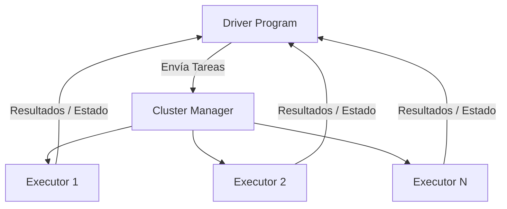

# ⚡ Apache Spark y Procesamiento Distribuido

En la era del Big Data, los datasets de entrenamiento para modelos de Machine Learning a menudo superan la capacidad de memoria y procesamiento de una sola máquina. Un dataset de imágenes de alta resolución, logs de comportamiento de usuarios o datos de sensores IoT pueden fácilmente alcanzar terabytes o petabytes. **Apache Spark** emerge como la solución de facto para procesar estos volúmenes masivos de datos de manera distribuida, permitiendo a los ML Engineers preparar features, entrenar modelos y evaluar resultados a escala industrial sin sacrificar la velocidad de desarrollo que ofrece Python.


## 1. Arquitectura de Spark

Spark no es simplemente un programa más grande; es un sistema distribuido con una arquitectura maestro-esclavo (o más políticamente correcto, driver-executor) diseñada para tolerancia a fallos y paralelismo masivo.

### 1.1 Driver Program

El **Driver** es el proceso central que ejecuta la función `main()` de tu aplicación. Es el cerebro de la operación.

- **Responsabilidades:**
  - Convierte el código de la aplicación en un grafo de ejecución (DAG de tareas).
  - Distribuye las tareas a los Executors.
  - Coordina el estado y los resultados finales.

> ⚠️ **Advertencia:** Si el Driver falla, toda la aplicación Spark se detiene. En producción, los Drivers deben ejecutarse en máquinas estables o ser gestionados por el cluster manager para reinicio automático.

### 1.2 Executors

Los **Executors** son procesos de Java que se ejecutan en los nodos worker del cluster. Realizan el trabajo pesado: leer datos, ejecutar transformaciones y devolver resultados al Driver.

- **Responsabilidades:**
  - Ejecutar las tareas asignadas por el Driver.
  - Almacenar datos en memoria (cache) para reutilización.
  - Reportar su estado y heartbeat al Driver.

### 1.3 Cluster Managers

Spark es agnóstico al gestor de cluster. Puede ejecutarse sobre:

| Cluster Manager | Descripción | Caso de Uso Típico |
|----------------|-------------|-------------------|
| **Standalone** | Gestor simple incluido con Spark. | Desarrollo local o clusters dedicados pequeños. |
| **YARN** | Gestor de recursos de Hadoop. | Entornos empresariales on-premise con infraestructura Hadoop existente. |
| **Mesos** | Gestor de recursos generalista. | Arquitecturas híbridas que ejecutan múltiples frameworks. |
| **Kubernetes** | Orquestador de contenedores. | **Estrategia moderna por excelencia.** Escalado dinámico, aislamiento de recursos y portabilidad cloud-native. |



## 2. Abstracciones de Datos en Spark

Spark evolucionó desde una API de bajo nivel hasta abstracciones de alto nivel que facilitan la computación distribuida.

### 2.1 RDD (Resilient Distributed Dataset)

La abstracción fundamental. Un RDD es una colección inmutable y distribuida de objetos.

- **Resiliente:** Tolerante a fallos mediante linaje (lineage). Si un nodo falla, Spark puede reconstruir la partición perdida re-ejecutando las transformaciones desde el origen.

- **Distribuido:** Los datos se dividen en particiones que residen en diferentes nodos.

- **Dataset:** Colección de registros.

$$RDD_{final} = f_n(f_{n-1}(...f_1(RDD_{origen})...))$$

> 💡 **Tip:** Hoy en día, rara vez manipulas RDDs directamente. Son útiles para operaciones de bajo nivel o integración con código legacy, pero las DataFrames son preferibles por su optimización automática.

### 2.2 DataFrame

Abstracción de alto nivel similar a un DataFrame de Pandas, pero distribuido. Es el estándar actual para el 95% de las operaciones.

- **Optimización:** Spark utiliza el **Catalyst Optimizer** para analizar el plan lógico y generar un plan físico eficiente.

- **Lenguaje unificado:** La misma API funciona en Python, Scala, Java y R.

### 2.3 Dataset (Scala/Java)

Disponible solo en Scala y Java, combina la seguridad de tipos en tiempo de compilación de los RDDs con la optimización del Catalyst Optimizer de los DataFrames.

| Abstracción | Nivel | Optimización | Tipado | Uso Recomendado |
|------------|-------|-------------|--------|----------------|
| **RDD** | Bajo | Manual | Fuerte | Computación custom, streaming legacy |
| **DataFrame** | Alto | Catalyst Optimizer | Débil (runtime) | **General purpose**, ETL, SQL |
| **Dataset** | Alto | Catalyst Optimizer | Fuerte (compile-time) | Scala/Java con type safety |

## 3. Transformaciones y Acciones

Spark opera bajo un modelo de ejecución perezosa (**lazy evaluation**).

### 3.1 Lazy Evaluation

Las transformaciones no se ejecutan inmediatamente. Spark construye un grafo acíclico de dependencias (DAG) y solo ejecuta el cómputo cuando encuentra una **acción**.

**Beneficios:**

- **Optimización de queries:** Spark puede reordenar y fusionar transformaciones para minimizar el movimiento de datos.

- **Recuperación de fallos:** El DAG completo permite reconstruir datos perdidos.

### 3.2 Transformaciones

Operaciones que producen un nuevo RDD/DataFrame a partir de uno existente. Son **perezosas**.

| Transformación | Descripción | Ejemplo PySpark |
|---------------|-------------|-----------------|
| `map()` | Aplica función a cada elemento | `rdd.map(lambda x: x * 2)` |
| `filter()` | Mantiene elementos que cumplen condición | `df.filter(df.age > 18)` |
| `reduceByKey()` | Agrega valores por clave | `rdd.reduceByKey(lambda a,b: a+b)` |
| `join()` | Une dos datasets por clave | `df1.join(df2, 'id')` |
| `groupBy()` | Agrupa por columnas | `df.groupBy('category').count()` |

**Ejemplo de transformación con map y reduce:**

```python
from pyspark.sql import SparkSession

spark = SparkSession.builder.appName("TransformacionesBasicas").getOrCreate()

rdd = spark.sparkContext.parallelize([1, 2, 3, 4, 5])

# Transformación: elevar al cuadrado cada elemento
cuadrados_rdd = rdd.map(lambda x: x ** 2)

# La línea anterior NO ejecuta nada todavía.
# Spark solo construye el DAG.

# Acción: collect() fuerza la ejecución
resultado = cuadrados_rdd.collect()
print(resultado)  # [1, 4, 9, 16, 25]
```

### 3.3 Acciones

Operaciones que devuelven un resultado al Driver o escriben datos en un sistema de almacenamiento externo. Son las que **desencadenan** la ejecución.

| Acción | Descripción | Cuidado |
|--------|-------------|---------|
| `collect()` | Trae todos los datos al Driver | **Peligroso en datasets grandes** (OutOfMemory) |
| `count()` | Cuenta registros | Seguro, devuelve un escalar |
| `take(n)` | Trae n registros al Driver | Seguro si n es pequeño |
| `reduce()` | Agrega con función | Devuelve un valor al Driver |
| `write.parquet()` | Escribe en disco | Acción de salida |

> ⚠️ **Advertencia:** Llamar `collect()` en un dataset de 100GB traerá toda esa información a la memoria de una sola máquina (el Driver), provocando un fallo catastrófico. Para inspeccionar grandes datasets, usa `show()`, `take()` o escribe a disco.

## 4. Spark SQL y el Catalyst Optimizer

Spark SQL permite ejecutar consultas SQL sobre DataFrames, integrando el mundo del procesamiento procedural (Python/Scala) con el declarativo (SQL).

### 4.1 Catalyst Optimizer

Motor de optimización basado en reglas y costos.

1. **Análisis:** Resuelve referencias de columnas y tablas.
2. **Optimización lógica:** Aplica reglas como pushdown de predicados (mover filtros lo más cerca posible de la fuente de datos).
3. **Planificación física:** Elige algoritmos de join (broadcast hash join vs sort-merge join) basados en estadísticas.
4. **Generación de código:** Compila las operaciones a bytecode de Java para ejecución nativa.

> 💡 **Tip:** Puedes ver el plan de ejecución físico con `df.explain()`. Si ves `BroadcastHashJoin`, significa que Spark decidió que una de las tablas es lo suficientemente pequeña para enviarla a todos los nodos, ahorrando un shuffle costoso.

## 5. PySpark en Profundidad

PySpark es la API de Python para Spark. Es la herramienta más utilizada por Data Scientists y ML Engineers.

### 5.1 Inicialización y Configuración

```python
from pyspark.sql import SparkSession
from pyspark.sql.functions import col, avg, count, when, isnan

# Crear sesión con configuraciones optimizadas para ML
spark = SparkSession.builder \
    .appName("MLDataPreparation") \
    .config("spark.sql.adaptive.enabled", "true") \
    .config("spark.sql.adaptive.coalescePartitions.enabled", "true") \
    .config("spark.serializer", "org.apache.spark.serializer.KryoSerializer") \
    .getOrCreate()

# Leer datos particionados en Parquet
df = spark.read.parquet("s3a://datalake/raw/events/")

# Mostrar esquema
print("Esquema del dataset:")
df.printSchema()
```

### 5.2 Feature Engineering a Escala

```python
from pyspark.ml.feature import VectorAssembler, StandardScaler, StringIndexer

# Indexar variable categórica
indexer = StringIndexer(inputCol="category", outputCol="categoryIndex")
df_indexed = indexer.fit(df).transform(df)

# Ensamblar features en un vector
assembler = VectorAssembler(
    inputCols=["categoryIndex", "numeric_feature1", "numeric_feature2"],
    outputCol="features_raw"
)
df_features = assembler.transform(df_indexed)

# Escalar features (equivalente a StandardScaler de sklearn)
scaler = StandardScaler(
    inputCol="features_raw",
    outputCol="features_scaled",
    withStd=True,
    withMean=True
)
df_scaled = scaler.fit(df_features).transform(df_features)

# Particionar para entrenamiento y validación
train_df, test_df = df_scaled.randomSplit([0.8, 0.2], seed=42)
```

### 5.3 Joins y Shuffles

Los joins en Spark son operaciones costosas porque pueden requerir **shuffling**: mover datos entre nodos para agrupar registros con la misma clave en el mismo executor.

**Estrategias de Join:**

- **Broadcast Hash Join:** Se usa cuando una tabla es pequeña (típicamente < 10MB por defecto). Spark envía una copia completa de la tabla pequeña a cada nodo. Es extremadamente eficiente.

- **Sort-Merge Join:** Algoritmo estándar para tablas grandes. Ambas tablas se ordenan por la clave de join y se fusionan. Requiere shuffle.

> 💡 **Tip:** Si sabes que una tabla es pequeña, forzar un broadcast join puede reducir el tiempo de ejecución de horas a segundos:
> ```python
> from pyspark.sql.functions import broadcast
> large_df.join(broadcast(small_df), "id")
> ```

## 6. Comparativa: Spark vs Pandas vs Dask

| Característica | Pandas | Dask | Apache Spark |
|---------------|--------|------|--------------|
| **Paradigma** | In-memory, single-node | Out-of-core, distributed (laptop/cluster) | Distributed, cluster-centric |
| **Tamaño de datos** | Hasta ~50GB (memoria RAM) | Terabytes (disco + cluster) | Petabytes (cluster) |
| **API** | Muy madura y rica | Casi idéntica a Pandas | DataFrame API propia, similar a SQL |
| **Latencia** | Muy baja (interactiva) | Media | Media-Alta (overhead de cluster) |
| **SQL Engine** | Limitado | Básico | Spark SQL (Catalyst Optimizer) |
| **ML Integration** | Scikit-learn, XGBoost | Dask-ML | MLlib, integración nativa con big data |
| **Casos de uso** | Prototipado, datasets pequeños | Migración fácil desde Pandas, medium data | Producción a gran escala, ETL heavy |

**Caso real:** Uber utiliza Apache Spark para procesar decenas de petabytes de logs de viajes diariamente. Sus científicos de datos utilizan PySpark para calcular features como "tiempo promedio de espera en una zona geográfica durante una hora específica", datos que alimentan sus modelos de pricing dinámico (surge pricing).

## 7. Código de Compresión

```python
"""
📦 Pipeline PySpark Compacto
ETL distribuido con feature engineering para ML.
"""

from pyspark.sql import SparkSession
from pyspark.sql.functions import col, avg, lit, when
from pyspark.ml.feature import VectorAssembler, StandardScaler

spark = SparkSession.builder.appName("CompactSparkETL").getOrCreate()

# 1. Lectura distribuida desde Data Lake
df = spark.read.parquet("data/raw/sales.parquet")

# 2. Limpieza y enriquecimiento
df_clean = df.filter(col("amount") > 0) \
    .withColumn("amount_log", log1p(col("amount"))) \
    .withColumn("is_high_value", when(col("amount") > 1000, 1).otherwise(0))

# 3. Agregación para feature engineering
features_df = df_clean.groupBy("customer_id").agg(
    avg("amount").alias("avg_amount"),
    count("*").alias("transaction_count")
)

# 4. Vectorización y escalado
assembler = VectorAssembler(inputCols=["avg_amount", "transaction_count"], outputCol="features_vec")
vec_df = assembler.transform(features_df)
scaler = StandardScaler(inputCol="features_vec", outputCol="features_scaled")
final_df = scaler.fit(vec_df).transform(vec_df)

# 5. Escritura particionada para entrenamiento
final_df.write.mode("overwrite").partitionBy("region").parquet("data/processed/features")

spark.stop()
```

---

Con el procesamiento distribuido dominado, el siguiente paso es comprender dónde y cómo almacenar estos datos procesados para que los sistemas de ML y BI puedan consultarlos eficientemente. Esto nos lleva a [[03 - Data Warehousing]].
