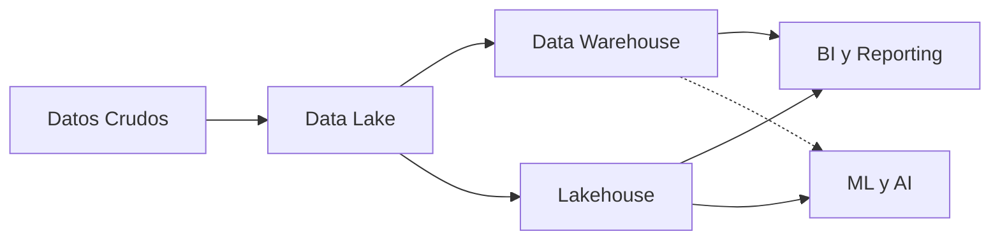
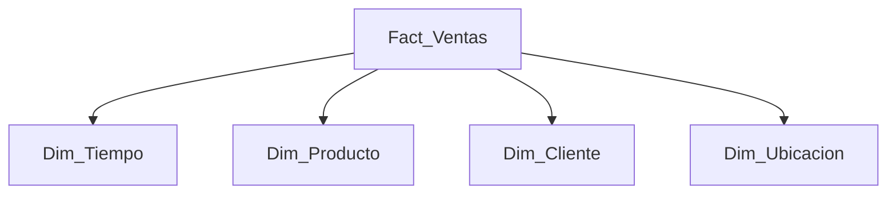
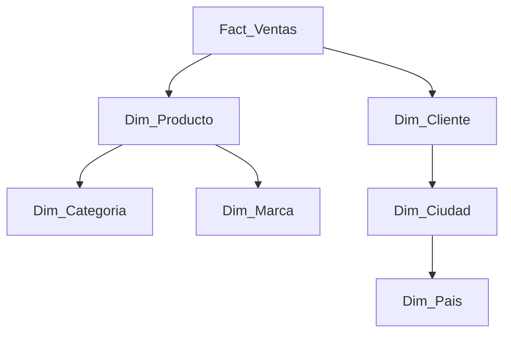

# 🏛️ Data Warehousing

Los modelos de Machine Learning y los dashboards de inteligencia de negocios no pueden operar directamente sobre los datos crudos de un data lake; requieren estructuras optimizadas para consultas analíticas complejas y agregaciones masivas. El **Data Warehouse** (almacén de datos) es el componente arquitectónico que transforma el caos de los datos operacionales en un repositorio centralizado, estructurado y diseñado específicamente para la toma de decisiones. Para un AI Engineer, el warehouse es la fuente de verdad para las features históricas y los datasets de entrenamiento que requieren contexto temporal y dimensional.


## 1. Data Warehouse vs Data Lake vs Lakehouse

La evolución del almacenamiento de datos analíticos ha pasado por tres paradigmas principales. Comprender sus diferencias es crucial para elegir la arquitectura correcta para un pipeline de ML.

### 1.1 Data Warehouse

Sistema de almacenamiento optimizado para consultas analíticas (OLAP). Los datos están altamente estructurados, limpios y modelados antes de ser cargados.

- **Esquema:** Schema-on-write. Debes definir tablas y tipos antes de cargar.

- **Formato:** Relacional (filas/columnas).

- **Usuarios típicos:** Analistas de negocio, BI, reportes.

- **Ventaja:** Rendimiento excepcional en consultas SQL complejas.

- **Desventaja:** Rígido y costoso para almacenar datos no estructurados.

### 1.2 Data Lake

Repositorio que almacena datos en su formato nativo (raw): estructurados, semi-estructurados y no estructurados.

- **Esquema:** Schema-on-read. Puedes almacenar cualquier cosa y definir la estructura al consultar.

- **Formato:** Archivos (CSV, JSON, Parquet, imágenes, videos, audio).

- **Usuarios típicos:** Data Scientists, ML Engineers, ingenieros de datos.

- **Ventaja:** Flexibilidad infinita, bajo costo de almacenamiento.

- **Desventaja:** Puede convertirse en un "pantano de datos" (data swamp) sin gobernanza.

### 1.3 Lakehouse

Arquitectura moderna que combina lo mejor de ambos mundos: la flexibilidad y bajo costo de un data lake con la gestión de transacciones y rendimiento de un data warehouse.

- **Tecnologías clave:** Delta Lake, Apache Iceberg, Apache Hudi.

- **Características:**
  - Transacciones ACID sobre archivos en el lake.
  - Time travel (consultar versiones históricas de los datos).
  - Schema evolution (cambiar esquemas sin reescribir todo).
  - Unificación de batch y streaming.

| Característica | Data Warehouse | Data Lake | Lakehouse |
|---------------|----------------|-----------|-----------|
| **Esquema** | Schema-on-write | Schema-on-read | Ambos |
| **Tipos de datos** | Estructurados | Todos | Todos |
| **Rendimiento SQL** | Excelente | Variable | Muy Bueno |
| **Costo almacenamiento** | Alto | Bajo | Bajo |
| **Transacciones ACID** | Sí | No | Sí |
| **ML/AI** | Limitado | Ideal | Ideal |
| **Ejemplos** | Snowflake, Redshift | S3 + Parquet | Databricks, Starburst |

**Caso real:** Netflix migró gran parte de su infraestructura hacia una arquitectura de lakehouse utilizando Apache Iceberg sobre S3. Esto les permite a sus científicos de datos acceder a petabytes de datos de visualización con garantías de consistencia, ejecutando queries SQL complejas mientras mantienen la flexibilidad de trabajar con datos semi-estructurados para sus modelos de recomendación.



## 2. Modelado Dimensional

El modelado dimensional es la técnica estándar para diseñar data warehouses. Fue popularizado por Ralph Kimball y se centra en la **usabilidad** y **comprensibilidad** para el usuario final.

### 2.1 Tablas de Hechos (Fact Tables)

Almacenan las **medidas** cuantitativas de los procesos de negocio. Son el núcleo del modelo.

- **Granularidad:** Cada fila representa un evento individual (ej. una línea de venta, un clic).

- **Medidas:** Columnas numéricas que se agregan (sum, avg, count).
  - **Aditivas:** Se pueden sumar en cualquier dimensión (ej. `cantidad_vendida`, `ingresos`).
  - **Semi-aditivas:** Se pueden sumar en algunas dimensiones (ej. `saldo_bancario` no se suma por tiempo).
  - **No aditivas:** No se pueden sumar (ej. `precio_unitario`, `porcentaje_margen`).

### 2.2 Tablas de Dimensiones (Dimension Tables)

Describen el contexto de los hechos. Responden a las preguntas "quién", "qué", "dónde", "cuándo", "por qué".

- **Atributos:** Columnas descriptivas utilizadas para filtrar, agrupar y etiquetar.

- **Jerarquías:** Estructuras naturales de drill-down (Año → Trimestre → Mes → Día).

## 3. Esquemas de Modelado

### 3.1 Esquema Estrella (Star Schema)

El diseño más común. Una tabla de hechos central rodeada por tablas de dimensiones desnormalizadas.



- **Ventajas:** Simplicidad, rendimiento de joins (pocas tablas), intuitivo para usuarios de BI.

- **Desventajas:** Redundancia de datos en dimensiones (denormalización).

### 3.2 Esquema Copo de Nieve (Snowflake Schema)

Variante del estrella donde las dimensiones están **normalizadas** en sub-dimensiones.



- **Ventajas:** Menor redundancia, integridad referencial más estricta.

- **Desventajas:** Más joins, mayor complejidad para el usuario final.

> 💡 **Tip:** Para proyectos de ML, el esquema estrella es generalmente preferible porque simplifica los joins que debes hacer para ensamblar datasets de entrenamiento. La normalización excesiva en un copo de nieve puede convertir la extracción de features en una pesadilla de SQL con múltiples JOINs anidados.

### 3.3 Data Vault 2.0

Metodología de modelado diseñada para data warehouses empresariales masivos y complejos. Enfatiza la auditabilidad, la escalabilidad de carga y la adaptabilidad a cambios en las fuentes.

- **Hubs:** Almacenan claves de negocio únicas.
- **Links:** Modelan relaciones entre hubs.
- **Satellites:** Almacenan atributos descriptivos y metadatos temporales.

**Caso real:** Empresas bancarias como Danske Bank utilizan Data Vault para integrar cientos de sistemas fuente con ciclos de cambio frecuentes, permitiendo que los data engineers añadan nuevas fuentes sin reestructurar el modelo central.

## 4. Slowly Changing Dimensions (SCD)

Las dimensiones cambian con el tiempo. ¿Cómo registramos el histórico sin perder la consistencia de los hechos pasados?

### 4.1 Tipo 1: Sobrescribir

Se actualiza el registro existente. **No se mantiene historia.**

- Uso: Correcciones de errores donde el historial no importa.

### 4.2 Tipo 2: Versión Histórica

Se crea un nuevo registro con un rango de validez temporal.

| customer_id | nombre | ciudad | fecha_inicio | fecha_fin | activo |
|-------------|--------|--------|--------------|-----------|--------|
| 101 | Ana | Madrid | 2023-01-01 | 2023-06-15 | F |
| 101 | Ana | Barcelona | 2023-06-16 | 9999-12-31 | T |

- Uso: **Estándar para ML.** Permite reconstruir el estado del mundo en cualquier punto del tiempo, crucial para entrenar modelos con features temporales correctas.

### 4.3 Tipo 3: Columna Alternativa

Se añade una columna para el valor anterior.

- Uso: Raro. Solo cuando se necesita el valor inmediatamente anterior.

> ⚠️ **Advertencia:** Usar SCD Tipo 1 para dimensiones críticas (como el segmento de un cliente) puede introducir **data leakage** en tus modelos de ML. Si entrenas con datos donde la etiqueta del cliente ya refleja un cambio futuro, el modelo aprenderá a "hacer trampa". Para ML histórico, SCD Tipo 2 es prácticamente obligatorio.

## 5. ETL vs ELT en el Contexto del Warehouse

| Fase | ETL | ELT |
|------|-----|-----|
| **Transformación** | Antes de cargar | Después de cargar |
| **Herramientas** | Informatica, Talend, Spark | SQL en el warehouse |
| **Lugar de transformación** | Motor externo | Dentro del warehouse |
| **Carga inicial** | Más lenta | Más rápida |
| **Flexibilidad** | Menor | Mayor (schema-on-read) |
| **Escalabilidad** | Depende del motor ETL | Ilimitada (escala con el warehouse) |

**Caso real:** Fivetran, líder en ELT moderno, promueve el modelo ELT porque permite a los analistas transformar datos con SQL directamente en Snowflake o BigQuery, reduciendo la dependencia de un equipo de ingeniería dedicado y acelerando el time-to-insight.

## 6. Almacenamiento Columnar y Motores de Consulta

### 6.1 Formatos Columnares

Los data warehouses modernos almacenan datos por columnas en lugar de filas.

**Ventajas para ML/AI:**

- **Compresión:** Las columnas del mismo tipo se comprimen mucho mejor.
- **Proyección:** Las consultas que seleccionan pocas columnas no leen datos innecesarios.
- **Vectorización:** Las operaciones de agregación se ejecutan vectorialmente (SIMD).

| Formato | Características | Uso |
|---------|----------------|-----|
| **Parquet** | Columnar, comprimido, con esquema | **Estándar** para data lakes y warehouses |
| **ORC** | Similar a Parquet, optimizado para Hive | Ecosistema Hadoop |
| **Avro** | Filas, esquema evolutivo | Streaming, serialización |

### 6.2 Motores de Consulta

| Motor | Tipo | Características |
|-------|------|----------------|
| **Presto/Trino** | SQL query engine | Consulta federada sobre múltiples fuentes (S3, PostgreSQL, Kafka) |
| **Amazon Athena** | Serverless sobre S3 | Paga por query, integrado con Glue Catalog |
| **Google BigQuery** | Warehouse serverless | Escalado automático extremo, separación storage/compute |

## 7. Comparativa: Redshift vs BigQuery vs Snowflake

| Característica | Amazon Redshift | Google BigQuery | Snowflake |
|---------------|-----------------|-----------------|-----------|
| **Modelo** | Provisionado / Serverless | Totalmente serverless | Totalmente serverless |
| **Separación S/C** | Limitada (RA3) | Total | Total |
| **Escalado** | Manual / Auto | Automático | Automático |
| **Lenguaje** | SQL PostgreSQL | SQL ANSI | SQL ANSI |
| **ML Integrado** | Redshift ML | BigQuery ML | Snowpark (Python/Java/Scala) |
| **Costo** | Por nodo/hora | Por TB escaneado | Por crédito de computo |
| **Casos ideales** | Workloads predecibles | Análisis ad-hoc masivo | Data sharing, multi-cloud |

> 💡 **Tip:** Si tu equipo de ML necesita ejecutar Python directamente dentro del warehouse (sin mover datos), **Snowflake Snowpark** y **BigQuery Dataframes** son opciones revolucionarias que eliminan la fricción entre SQL y Python.

## 8. Código de Compresión

```python
"""
📦 Modelado Dimensional Compacto en Python
Simula la creación de un esquema estrella
y la generación de un dataset de entrenamiento.
"""

import pandas as pd
import numpy as np
from datetime import datetime, timedelta

# --- Generar Dimensiones ---
np.random.seed(42)

# Dim_Tiempo
fechas = pd.date_range(start='2023-01-01', end='2023-12-31', freq='D')
dim_tiempo = pd.DataFrame({
    'fecha_id': range(1, len(fechas)+1),
    'fecha': fechas,
    'anio': fechas.year,
    'mes': fechas.month,
    'dia': fechas.day,
    'dia_semana': fechas.dayofweek,
    'es_fin_de_semana': fechas.dayofweek >= 5
})

# Dim_Producto
productos = ['Laptop', 'Mouse', 'Teclado', 'Monitor', 'Webcam']
dim_producto = pd.DataFrame({
    'producto_id': range(1, len(productos)+1),
    'nombre': productos,
    'categoria': ['Electrónica'] * 5,
    'precio_base': [1200, 25, 75, 300, 80]
})

# Dim_Cliente
dim_cliente = pd.DataFrame({
    'cliente_id': range(1, 101),
    'nombre': [f'Cliente_{i}' for i in range(1, 101)],
    'ciudad': np.random.choice(['Madrid', 'Barcelona', 'Valencia', 'Sevilla'], 100),
    'segmento': np.random.choice(['Premium', 'Standard', 'Basic'], 100)
})

# --- Generar Tabla de Hechos ---
n_ventas = 10000
ventas = pd.DataFrame({
    'venta_id': range(1, n_ventas+1),
    'fecha_id': np.random.choice(dim_tiempo['fecha_id'], n_ventas),
    'producto_id': np.random.choice(dim_producto['producto_id'], n_ventas),
    'cliente_id': np.random.choice(dim_cliente['cliente_id'], n_ventas),
    'cantidad': np.random.randint(1, 5, n_ventas),
    'descuento': np.random.uniform(0, 0.2, n_ventas)
})

# Unir para calcular ingresos
ventas = ventas.merge(dim_producto[['producto_id', 'precio_base']], on='producto_id')
ventas['ingreso_neto'] = ventas['cantidad'] * ventas['precio_base'] * (1 - ventas['descuento'])

# --- Crear Dataset de Entrenamiento (Feature Engineering) ---
# Agregar features por cliente para un modelo de churn
features = ventas.groupby('cliente_id').agg(
    total_gastado=('ingreso_neto', 'sum'),
    total_transacciones=('venta_id', 'count'),
    avg_ticket=('ingreso_neto', 'mean'),
    max_descuento=('descuento', 'max')
).reset_index()

# Enriquecer con dimensión cliente
ml_dataset = features.merge(dim_cliente[['cliente_id', 'ciudad', 'segmento']], on='cliente_id')

print("Esquema Estrella creado.")
print(f"Tabla de hechos: {len(ventas)} registros")
print(f"Dataset ML: {len(ml_dataset)} registros, {ml_dataset.shape[1]} features")
print(ml_dataset.head())
```

---

Una vez que los datos están modelados y almacenados en el warehouse, el desafío siguiente es garantizar que mantengan una calidad impecable a lo largo de todo su ciclo de vida. Esto nos lleva a [[04 - Calidad de Datos y Data Governance]].
