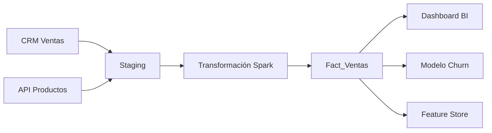

# 🛡️ Calidad de Datos y Data Governance

En el ciclo de vida del Machine Learning, existe una verdad incómoda pero ineludible: **Garbage In, Garbage Out**. Un modelo de deep learning con la arquitectura más sofisticada no podrá superar los resultados de un modelo simple si sus datos de entrenamiento están contaminados con valores duplicados, registros inconsistentes o sesgos históricos. La **Calidad de Datos** y la **Data Governance** (gobernanza de datos) constituyen el pilar invisible sobre el cual se construyen sistemas de IA confiables, auditables y éticos. Sin ellas, los pipelines de ML son meras máquinas de producir resultados no reproducibles y potencialmente dañinos.


## 1. Dimensiones de Calidad de Datos

Las dimensiones de calidad son categorías mensurables que nos permiten evaluar el estado de un dataset. Aunque existen múltiples frameworks, seis dimensiones son universales en la industria.

### 1.1 Accuracy (Exactitud)

Grado en que los datos representan correctamente la realidad del evento o entidad que describen.

$$Accuracy = \frac{\text{Número de registros correctos}}{\text{Número total de registros}} \times 100$$

- **Ejemplo:** La edad de un cliente registrada como 150 años es un error de exactitud.
- **Impacto en ML:** Features incorrectas confunden al modelo, especialmente en regresión.

### 1.2 Completeness (Completitud)

Proporción de datos almacenados versus la totalidad de datos que deberían estar presentes.

$$Completeness = \frac{\text{Número de valores no nulos}}{\text{Número total de valores esperados}} \times 100$$

- **Ejemplo:** Un 30% de los registros de clientes tienen el campo "ingreso anual" vacío.
- **Impacto en ML:** Valores faltantes pueden reducir drásticamente el tamaño del dataset si se eliminan, o introducir sesgo si se imputan incorrectamente.

### 1.3 Consistency (Consistencia)

Ausencia de contradicciones cuando los mismos datos se comparan entre diferentes sistemas o dentro del mismo dataset.

- **Ejemplo:** La fecha de nacimiento de un cliente es 1990-05-12 en el CRM y 1985-05-12 en el sistema de facturación.
- **Impacto en ML:** Inconsistencias generan ruido que dificulta la convergencia del modelo.

### 1.4 Timeliness (Oportunidad)

Grado en que los datos están actualizados y disponibles en el momento en que se necesitan.

$$Timeliness = T_{actual} - T_{evento}$$

- **Ejemplo:** Datos de ventas de ayer que solo están disponibles 48 horas después.
- **Impacto en ML:** En sistemas de ML en tiempo real (ej. detección de fraude), datos tardíos son inútiles.

### 1.5 Validity (Validez)

Conformidad de los datos con las reglas de formato, tipo y rango definidos por el dominio.

- **Ejemplo:** Un campo de correo electrónico que no contiene el carácter "@", o un código postal con letras en un país donde solo existen números.
- **Impacto en ML:** Datos inválidos pueden causar fallos en la ingesta o producir features numéricas corruptas.

### 1.6 Uniqueness (Unicidad)

Grado en que cada entidad del mundo real está representada una sola vez en el dataset.

$$Duplication\ Rate = \frac{\text{Número de registros duplicados}}{\text{Número total de registros}} \times 100$$

- **Ejemplo:** El mismo cliente aparece tres veces con ligeras variaciones en el nombre ("Juan Pérez", "Juan Perez", "J. Pérez").
- **Impacto en ML:** Duplicados en el dataset de entrenamiento llevan a una sobreestimación optimista de la métrica de evaluación, ya que el modelo "ve" los mismos ejemplos en entrenamiento y test.

| Dimensión | Métrica Típica | Riesgo para ML |
|-----------|---------------|----------------|
| Accuracy | % de registros correctos | Sesgo, predicciones erróneas |
| Completeness | % de valores no nulos | Pérdida de muestras, imputación sesgada |
| Consistency | % de registros sin conflictos | Ruido, features contradictorias |
| Timeliness | Latencia promedio | Modelos obsoletos |
| Validity | % de registros en formato válido | Errores de runtime, features NaN |
| Uniqueness | % de registros únicos | Data leakage, overfitting aparente |

## 2. Data Profiling

El **data profiling** es el proceso de examinar un dataset para recopilar estadísticas descriptivas y descubrir patrones, anomalías y metadatos.

### 2.1 Técnicas de Profiling

- **Análisis de estructura:** Tipos de datos, longitudes, formatos.
- **Análisis de contenido:** Frecuencias, distribuciones, valores mínimos/máximos, mediana, moda.
- **Análisis de relaciones:** Cardinalidad de claves foráneas, dependencias funcionales.
- **Detección de anomalías:** Identificación de outliers mediante estadísticos como el Z-score:

$$Z = \frac{x - \mu}{\sigma}$$

Un valor con $|Z| > 3$ se considera típicamente un outlier.

**Caso real:** American Express utiliza data profiling avanzado para analizar miles de variables de transacciones. Antes de entrenar sus modelos de detección de fraude, ejecutan perfiles automatizados que detectan desviaciones estadísticas en el volumen de transacciones por comercio, lo que les permite identificar posibles breaches de seguridad antes de que afecten el modelo.

## 3. Validación de Datos Automatizada

Manualmente inspeccionar datasets no es escalable. Los frameworks de validación permiten codificar expectativas sobre los datos y ejecutarlas como parte del pipeline CI/CD.

### 3.1 Great Expectations

Framework de código abierto que permite definir "expectativas" en forma de tests sobre tus datos.

```python
import great_expectations as gx

# Inicializar contexto
context = gx.get_context()

datasource = context.sources.add_pandas("pandas_datasource")
data_asset = datasource.add_dataframe_asset(name="sales_asset")

batch_request = data_asset.build_batch_request(dataframe=df)

# Crear un validator
validator = context.get_validator(
    batch_request=batch_request,
    expectation_suite_name="sales_suite"
)

# Definir expectativas
validator.expect_column_values_to_not_be_null(column="customer_id")
validator.expect_column_values_to_be_between(column="amount", min_value=0, max_value=100000)
validator.expect_column_values_to_be_in_set(column="status", value_set=["completed", "pending", "cancelled"])
validator.expect_column_pair_values_to_be_equal(column_A="total", column_B="subtotal + tax")

# Guardar suite
validator.save_expectation_suite(discard_failed_expectations=False)

# Validar y generar reporte
checkpoint = context.add_or_update_checkpoint(
    name="sales_checkpoint",
    validator=validator,
)
checkpoint_result = checkpoint.run()
context.view_validation_result(checkpoint_result)
```

### 3.2 Soda Core

Herramienta ligera que permite definir checks en archivos YAML y ejecutarlos desde la CLI o integrarlos en Airflow.

```yaml
# checks.yml
checks for sales:
  - missing_count(customer_id) = 0
  - invalid_count(amount) = 0:
      valid format: number
  - duplicate_count(order_id) = 0
  - row_count > 1000
```

### 3.3 Deequ (AWS)

Biblioteca desarrollada por AWS para validación de datos a gran escala sobre Apache Spark.

```python
from pydeequ.checks import Check, CheckLevel
from pydeequ.verification import VerificationSuite

check = Check(spark, CheckLevel.Error, "Review Check")

check_result = VerificationSuite(spark).onData(df) \
    .addCheck(
        check.hasSize(lambda x: x >= 1000) \
        .isComplete("customer_id") \
        .isUnique("order_id") \
        .isContainedIn("status", ["completed", "pending"]) \
        .isNonNegative("amount")
    ) \
    .run()

check_result_df = VerificationResult.checkResultsAsDataFrame(spark, check_result)
check_result_df.show()
```

| Framework | Integración | Escalabilidad | Curva de aprendizaje | Ideal para |
|-----------|-------------|---------------|----------------------|------------|
| **Great Expectations** | Python, Airflow, dbt | Media (Spark via plugins) | Media | Equipos que quieren documentación y data docs |
| **Soda Core** | CLI, Airflow, dbt, Spark | Alta | Baja | Validación rápida en pipelines existentes |
| **Deequ** | Spark (PySpark/Scala) | Muy Alta | Media-Alta | Big Data en AWS/Spark |

> 💡 **Tip:** No trates de validar todo. Aplica el principio de Pareto: identifica las 20% de columnas que generan el 80% de los problemas de calidad y enfoca tus tests de validación allí.

## 4. Data Lineage y Metadata Management

### 4.1 Data Lineage

El linaje de datos documenta el recorrido completo de los datos: de dónde vienen, qué transformaciones sufrieron y dónde se utilizan.

**Beneficios para ML:**

- **Debugging:** Cuando un modelo comienza a degradarse, el linaje te permite identificar rápidamente si el problema radica en una fuente de datos específica o en una transformación reciente.
- **Impact Analysis:** Antes de modificar una columna fuente, sabes exactamente qué tablas, dashboards y modelos de ML se verán afectados.



### 4.2 Metadata Management

Los metadatos son "datos sobre los datos". Un sistema de gestión de metadatos centralizado es esencial para la gobernanza.

| Tipo de Metadato | Descripción | Ejemplo |
|-----------------|-------------|---------|
| **Técnico** | Esquema, tipos, particiones | "Tabla X tiene 15 columnas, particionada por fecha" |
| **Operacional** | Linaje, jobs, frecuencia | "Generada por el job ETL diario a las 3 AM" |
| **De negocio** | Definiciones, owners, clasificación | "La columna 'ingreso' representa el ingreso bruto anual en EUR" |
| **De calidad** | Scores, reglas, incidentes | "Completitud del 98.5%, último fallo el 15/03" |

### 4.3 Herramientas de Metadata y Catalogación

| Herramienta | Tipo | Características |
|-------------|------|----------------|
| **Apache Atlas** | Open Source | Linaje, clasificación, integración con Ranger para seguridad |
| **DataHub** | Open Source (LinkedIn) | Catalogo unificado, linaje automático, escalable |
| **Alation** | Comercial | Descubrimiento, crowdsourcing de definiciones |
| **Collibra** | Comercial | Gobernanza empresarial completa, workflows |

**Caso real:** LinkedIn desarrolló DataHub para resolver un problema crítico: sus científicos de datos pasaban el 30% de su tiempo buscando y entendiendo datasets. Con DataHub, centralizaron el catálogo de miles de datasets, permitiendo a cualquier ingeniero descubrir features existentes y comprender su linaje sin depender de conocimiento tribal.

## 5. Cumplimiento Normativo y Ética

### 5.1 GDPR y Privacidad

El Reglamento General de Protección de Datos de la UE impone restricciones estrictas sobre el uso de datos personales.

- **Derecho al olvido:** Si un usuario solicita la eliminación de sus datos, esto debe propagarse a todos los sistemas, incluyendo backups y datasets de entrenamiento de ML.
- **Minimización de datos:** Solo recolectar y procesar los datos estrictamente necesarios para el propósito declarado.
- **Privacidad desde el diseño (Privacy by Design):** Anonimización y pseudonimización deben ser parte del pipeline, no un afterthought.

> ⚠️ **Advertencia:** Entrenar un modelo con datos personales sin el consentimiento adecuado no solo es ilegal; si el modelo "memoriza" datos sensibles (posible en modelos grandes), podría exponer información privada mediante ataques de membership inference. Implementa técnicas de **differential privacy** cuando trabajes con datos sensibles.

### 5.2 Data Ownership y Stewardship

- **Data Owner:** Rol de negocio responsable de la calidad y definición de un dominio de datos.
- **Data Steward:** Rol operacional que implementa las políticas definidas por el owner.
- **Data Custodian:** Rol técnico (IT/Engineering) responsable del almacenamiento y seguridad.

## 6. Código de Compresión

```python
"""
📦 Pipeline de Validación de Calidad Compacto
Validación con Pandas para datasets que caben en memoria.
"""

import pandas as pd
import numpy as np

class DataQualityValidator:
    def __init__(self, df):
        self.df = df
        self.report = {}

    def check_completeness(self, threshold=0.95):
        comp = self.df.count() / len(self.df)
        self.report['completeness'] = comp.to_dict()
        failed = comp[comp < threshold]
        if not failed.empty:
            print(f"⚠️ Columnas bajo umbral de completitud ({threshold}):")
            print(failed)
        return self

    def check_uniqueness(self, key):
        dup_rate = self.df.duplicated(subset=[key]).mean()
        self.report['duplication_rate'] = dup_rate
        if dup_rate > 0:
            print(f"⚠️ Tasa de duplicados en '{key}': {dup_rate:.2%}")
        return self

    def check_validity(self, column, valid_fn):
        invalid_mask = ~self.df[column].apply(valid_fn)
        invalid_count = invalid_mask.sum()
        self.report[f'invalid_count_{column}'] = invalid_count
        if invalid_count > 0:
            print(f"⚠️ Registros inválidos en '{column}': {invalid_count}")
        return self

    def check_range(self, column, min_val, max_val):
        out_of_range = self.df[(self.df[column] < min_val) | (self.df[column] > max_val)]
        self.report[f'out_of_range_{column}'] = len(out_of_range)
        if len(out_of_range) > 0:
            print(f"⚠️ Valores fuera de rango en '{column}': {len(out_of_range)}")
        return self

    def generate_report(self):
        print("\n📋 Reporte de Calidad de Datos:")
        for k, v in self.report.items():
            print(f"  {k}: {v}")
        return self.report

# Uso
# validator = DataQualityValidator(df)
# validator.check_completeness().check_uniqueness('id').check_range('age', 0, 120).generate_report()
```

---

La calidad y gobernanza de datos son los cimientos, pero la verdadera maestría se demuestra en la integración de todos estos conceptos en un proyecto end-to-end. En [[05 - Caso Practico - Pipeline ETL para Datos de Ventas]], aplicaremos todo lo aprendido para construir un sistema de producción completo.
