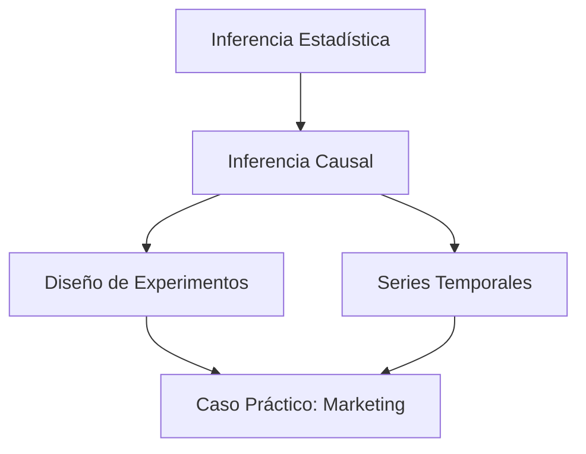

# 🎓 00 - Bienvenida

Bienvenido al módulo **29 - Estadística Avanzada y Causalidad**. Este curso es el pilar metodológico que separa a un ingeniero de ML/IA que solo entrena modelos de uno que comprende qué decisiones tomar y por qué. En el mundo real, la mayoría de los datos son observacionales, ruidosos y sesgados; saber inferir y establecer causalidad es la habilidad diferenciadora para diseñar productos de datos robustos.

---

## 1. Índice del curso

A continuación encontrarás el mapa de ruta del módulo con enlaces internos a cada nota:

1. [[01 - Inferencia Estadistica]]: Fundamentos de estimación, pruebas de hipótesis e inferencia bayesiana.
2. [[02 - Inferencia Causal]]: De la correlación a la causalidad, DAGs, do-calculus y métodos cuasi-experimentales.
3. [[03 - Diseno de Experimentos]]: Diseño de RCTs, A/B testing avanzado, cálculo de poder y tamaño de muestra.
4. [[04 - Series Temporales]]: Modelado temporal, estacionariedad, ARIMA y métricas de forecasting.
5. [[05 - Caso Practico - Analisis Causal de Impacto de Marketing]]: Proyecto integrador con datos observacionales.

---

## 2. Glosario

| Término | Definición |
|---------|------------|
| Inferencia | Proceso de deducir propiedades de una población a partir de una muestra. |
| Hypothesis testing | Marco estadístico para tomar decisiones sobre parámetros poblacionales usando evidencia muestral. |
| Confidence interval | Rango de valores dentro del cual se espera que se encuentre el parámetro poblacional con cierta probabilidad. |
| P-value | Probabilidad de observar un estadístico de prueba al menos tan extremo como el observado, bajo la hipótesis nula. |
| Effect size | Magnitud del efecto de una variable sobre otra, independiente del tamaño muestral. |
| Causal inference | Conjunto de métodos para estimar el efecto de una intervención o tratamiento sobre un resultado. |
| Confounding | Presencia de variables que influyen tanto en el tratamiento como en el resultado, distorsionando la relación aparente. |
| Counterfactual | Resultado hipotético que habría ocurrido bajo una condición alternativa no observada. |
| Propensity score | Probabilidad condicional de recibir un tratamiento dado un conjunto de covariables observadas. |
| Instrumental variable | Variable que afecta al tratamiento pero no directamente al resultado, excepto a través del tratamiento. |
| A/B test | Experimento controlado aleatorio donde se comparan dos o más variantes. |
| RCT | Randomized Controlled Trial; experimento donde la asignación al tratamiento es aleatoria. |
| Time series | Secuencia de observaciones indexadas en el tiempo. |
| Trend | Dirección general a largo plazo de una serie temporal. |
| Seasonality | Patrones repetitivos y predecibles en intervalos fijos de tiempo. |
| Stationarity | Propiedad de una serie temporal cuyos momentos estadísticos no dependen del tiempo. |

---

## 3. Objetivos de aprendizaje

Al finalizar este módulo serás capaz de:

1. Construir intervalos de confianza y realizar pruebas de hipótesis rigurosas en contextos de ML/IA.
2. Diseñar experimentos controlados aleatorios (RCT) y A/B tests con poder estadístico adecuado.
3. Identificar sesgos de confusión y aplicar métodos de inferencia causal en datos observacionales.
4. Modelar series temporales, evaluar estacionariedad y generar pronósticos con ARIMA.
5. Ejecutar un proyecto end-to-end de análisis causal usando propensity score matching y difference-in-differences.

---

## 4. Diagrama del flujo del módulo



---

## 5. Recursos visuales complementarios


*Figura: Representación visual de la relación entre variables, base de la inferencia.*


*Figura: Modelo conceptual de inferencia causal.*

---

## 6. Recomendaciones previas

- Tener dominio de Python, pandas, numpy y matplotlib.
- Revisar previamente los módulos de probabilidad y estadística descriptiva.
- Familiarizarse con LaTeX básico para leer fórmulas.

⚠️ **Advertencia:** Este módulo asume que ya dominas álgebra lineal y cálculo diferencial. Si no es así, repasa esos conceptos antes de continuar.

💡 **Tip:** Mantén un notebook de ejercicios paralelo para replicar cada snippet de código.

---

## 📦 Código de compresión

Si necesitas resumir los conceptos clave de esta nota en una línea para un prompt o recordatorio:

```text
Módulo 29: Inferencia (estimación, tests), Causalidad (DAGs, PSM, DiD), Experimentos (RCT, A/B), Series (ARIMA), Caso Marketing end-to-end.
```
