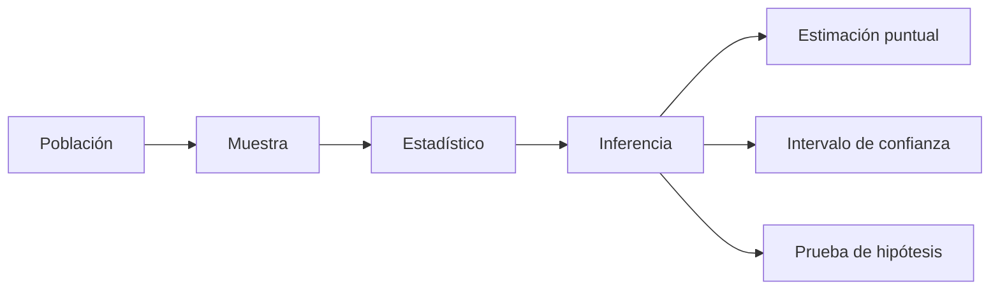

# 📊 01 - Inferencia Estadística

La inferencia estadística es el conjunto de métodos que permite extraer conclusiones sobre una población a partir de una muestra finita de datos. Para un ingeniero de ML/IA, dominar la inferencia es esencial: no basta con que un modelo prediga bien en un conjunto de prueba; es necesario cuantificar la incertidumbre de esas predicciones, entender si las mejoras observadas son estadísticamente significativas y evitar decisiones basadas en ruido muestral.

---

## 1. Estimación de parámetros

### 1.1 Estimación puntual vs. intervalo

Una estimación puntual proporciona un único valor como "mejor" aproximación de un parámetro poblacional desconocido θ. Sin embargo, nunca sabemos si ese valor es exacto. La estimación por intervalo, en cambio, ofrece un rango [L, U] tal que:

$$
P(L \leq \theta \leq U) = 1 - \alpha
$$

donde 1 − α es el nivel de confianza (típicamente 0.95).

| Característica | Estimación puntual | Estimación por intervalo |
|----------------|-------------------|--------------------------|
| Salida | Un solo valor | Rango de valores |
| Incertidumbre | No cuantificada | Cuantificada explícitamente |
| Uso típico | Métricas de desempeño en producción | Reportes de confianza en experimentos |
| Riesgo | Sobreconfianza | Interpretación errónea del intervalo |

💡 **Tip:** Siempre reporta intervalos de confianza junto con tus estimaciones puntuales en dashboards de modelos.

---

### 1.2 Máxima Verosimilitud (MLE)

El estimador de máxima verosimilitud (Maximum Likelihood Estimation, MLE) encuentra el parámetro que maximiza la probabilidad de haber observado los datos muestrales. Dada una muestra independiente e idénticamente distribuida X₁, X₂, ..., Xₙ y una función de densidad f(x; θ), la función de verosimilitud es:

$$
L(\theta; x_1, \dots, x_n) = \prod_{i=1}^{n} f(x_i; \theta)
$$

En la práctica se maximiza el logaritmo de la verosimilitud:

$$
\hat{\theta}_{MLE} = \arg\max_{\theta} \sum_{i=1}^{n} \log f(x_i; \theta)
$$

**Ejemplo: MLE para la media de una distribución normal**

$$
\hat{\mu}_{MLE} = \frac{1}{n} \sum_{i=1}^{n} x_i = \bar{x}
$$

$$
\hat{\sigma}^2_{MLE} = \frac{1}{n} \sum_{i=1}^{n} (x_i - \bar{x})^2
$$

Caso real: En sistemas de recomendación, MLE se usa para estimar parámetros de modelos probabilísticos como Latent Dirichlet Allocation (LDA).

⚠️ **Advertencia:** El estimador MLE de la varianza es sesgado. Para muestras pequeñas, usa el estimador insesgado con n−1 en el denominador.

---

### 1.3 Estimación MAP (Maximum A Posteriori)

MAP incorpora una distribución a priori sobre el parámetro, combinando evidencia muestral con conocimiento previo:

$$
\hat{\theta}_{MAP} = \arg\max_{\theta} P(\theta | X) = \arg\max_{\theta} P(X | \theta) P(\theta)
$$

Tomando logaritmos:

$$
\hat{\theta}_{MAP} = \arg\max_{\theta} \left[ \log L(\theta; X) + \log P(\theta) \right]
$$

Cuando la prior es uniforme, MAP coincide con MLE.

Caso real: Los filtros de spam bayesianos usan MAP para actualizar la probabilidad de que un correo sea spam dado el historial previo.

---

## 2. Intervalos de confianza

### 2.1 Definición formal

Un intervalo de confianza del (1 − α)100% para un parámetro θ es un par de estadísticos L(X) y U(X) tales que:

$$
P(L(X) \leq \theta \leq U(X)) = 1 - \alpha
$$

Para una media poblacional con varianza conocida:

$$
\bar{x} \pm z_{\alpha/2} \frac{\sigma}{\sqrt{n}}
$$

Para varianza desconocida (usando la t de Student):

$$
\bar{x} \pm t_{\alpha/2, n-1} \frac{s}{\sqrt{n}}
$$

⚠️ **Advertencia:** Un intervalo de confianza del 95% NO significa que hay una probabilidad del 95% de que el parámetro esté dentro del intervalo calculado. Significa que el 95% de los intervalos construidos con este método contendrán el parámetro.

---

## 3. Pruebas de hipótesis

### 3.1 Marco general

Una prueba de hipótesis contrasta dos afirmaciones mutuamente excluyentes:

- **Hipótesis nula (H₀):** No hay efecto o diferencia.
- **Hipótesis alternativa (H₁):** Existe un efecto o diferencia.

El procedimiento consiste en:

1. Definir H₀ y H₁.
2. Elegir un nivel de significancia α (típicamente 0.05).
3. Calcular el estadístico de prueba.
4. Calcular el p-value.
5. Tomar una decisión.

### 3.2 P-value

El p-value se define como:

$$
p\text{-value} = P(T \geq t_{obs} \mid H_0 \text{ es verdadera})
$$

Si p-value < α, se rechaza H₀.

⚠️ **Advertencia:** Un p-value alto no prueba que H₀ sea verdadera. Solo indica falta de evidencia en contra.

### 3.3 Errores Tipo I y Tipo II

| Decisión | H₀ es verdadera | H₀ es falsa |
|----------|----------------|-------------|
| Rechazar H₀ | Error Tipo I (α) | Correcto (1 − β) |
| No rechazar H₀ | Correcto (1 − α) | Error Tipo II (β) |

La **potencia estadística** es:

$$
\text{Power} = 1 - \beta = P(\text{rechazar } H_0 \mid H_1 \text{ es verdadera})
$$

Caso real: En un sistema de detección de fraude, un Error Tipo I equivale a bloquear una transacción legítima, mientras que un Error Tipo II es dejar pasar un fraude.

💡 **Tip:** Aumenta el tamaño de muestra para reducir β sin incrementar α.

---

## 4. Pruebas específicas

### 4.1 T-test

Compara las medias de una o dos muestras.

**T-test de una muestra:**

$$
t = \frac{\bar{x} - \mu_0}{s / \sqrt{n}}
$$

**T-test de dos muestras independientes:**

$$
t = \frac{\bar{x}_1 - \bar{x}_2}{\sqrt{\frac{s_1^2}{n_1} + \frac{s_2^2}{n_2}}}
$$

```python
import scipy.stats as stats

# T-test de dos muestras
sample_a = [2.3, 3.1, 2.9, 3.5, 2.8]
sample_b = [3.8, 4.1, 3.9, 4.5, 4.2]

t_stat, p_value = stats.ttest_ind(sample_a, sample_b)
print(f"t-statistic: {t_stat:.3f}, p-value: {p_value:.3f}")
```

### 4.2 Chi-cuadrado

Evalúa la independencia entre dos variables categóricas:

$$
\chi^2 = \sum_{i=1}^{k} \frac{(O_i - E_i)^2}{E_i}
$$

donde Oᵢ son las frecuencias observadas y Eᵢ las esperadas bajo independencia.

### 4.3 ANOVA

Análisis de varianza para comparar medias entre múltiples grupos:

$$
F = \frac{\text{Varianza entre grupos}}{\text{Varianza dentro de grupos}} = \frac{MS_{between}}{MS_{within}}
$$

Caso real: Google usa ANOVA para comparar múltiples algoritmos de ranking en experimentos paralelos.

---

## 5. Comparaciones múltiples

### 5.1 Corrección de Bonferroni

Si realizas m pruebas simultáneas, ajusta el nivel de significancia:

$$
\alpha_{adj} = \frac{\alpha}{m}
$$

⚠️ **Advertencia:** Bonferroni es muy conservador cuando m es grande, aumentando el riesgo de Error Tipo II.

### 5.2 FDR (False Discovery Rate)

Controla la proporción esperada de falsos positivos entre los rechazos:

$$
FDR = E\left[ \frac{V}{R} \right]
$$

donde V es el número de falsos positivos y R el número total de rechazos.

💡 **Tip:** En genómica y A/B testing masivo, prefiere FDR sobre Bonferroni.

---

## 6. Métodos de remuestreo

### 6.1 Bootstrap

El bootstrap permite estimar la distribución muestral de un estadístico sin asumir una forma paramétrica:

1. Dada una muestra original de tamaño n, genera B muestras bootstrap de tamaño n con reemplazo.
2. Calcula el estadístico de interés en cada muestra bootstrap.
3. Usa la distribución resultante para construir intervalos de confianza.

```python
import numpy as np

def bootstrap_ci(data, stat_func=np.mean, n_bootstrap=10000, ci=0.95):
    boot_stats = [stat_func(np.random.choice(data, size=len(data), replace=True))
                  for _ in range(n_bootstrap)]
    lower = np.percentile(boot_stats, (1 - ci) / 2 * 100)
    upper = np.percentile(boot_stats, (1 + ci) / 2 * 100)
    return lower, upper

data = np.random.normal(loc=5, scale=2, size=100)
print(bootstrap_ci(data))
```

Caso real: Netflix usa bootstrap para estimar intervalos de confianza de métricas de engagement cuando la distribución es desconocida.

### 6.2 Permutation tests

Reasigna aleatoriamente las etiquetas de tratamiento para construir la distribución nula del estadístico de prueba, sin asumir normalidad.

---

## 7. Introducción a la inferencia bayesiana

La inferencia bayesiana actualiza creencias usando el teorema de Bayes:

$$
P(\theta | D) = \frac{P(D | \theta) P(\theta)}{P(D)}
$$

- P(θ): Prior
- P(D|θ): Verosimilitud
- P(θ|D): Posterior
- P(D): Evidencia

```python
import numpy as np
from scipy import stats

# Ejemplo simple: actualización de una media normal con prior normal
mu_prior, sigma_prior = 0, 1
sigma_likelihood = 0.5
data = np.array([1.2, 1.5, 1.3])

n = len(data)
posterior_var = 1 / (1 / sigma_prior**2 + n / sigma_likelihood**2)
posterior_mean = posterior_var * (mu_prior / sigma_prior**2 + data.sum() / sigma_likelihood**2)
print(f"Posterior: N({posterior_mean:.2f}, {np.sqrt(posterior_var):.2f})")
```

Caso real: Los sistemas de detección de anomalías en tiempo real de Uber usan actualización bayesiana para adaptar umbrales dinámicamente.

---

## 8. Diagramas




*Figura: Distribución normal, base de muchas pruebas paramétricas.*

---

## 📦 Código de compresión

```text
Inferencia: MLE/MAP estiman parámetros; IC cuantifican incertidumbre; H0 vs H1 con p-value y power; t-test, chi2, ANOVA comparan grupos; Bonferroni/FDR controlan múltiples comparaciones; bootstrap/permutaciones no paramétricas; Bayes actualiza P(theta|D).
```
