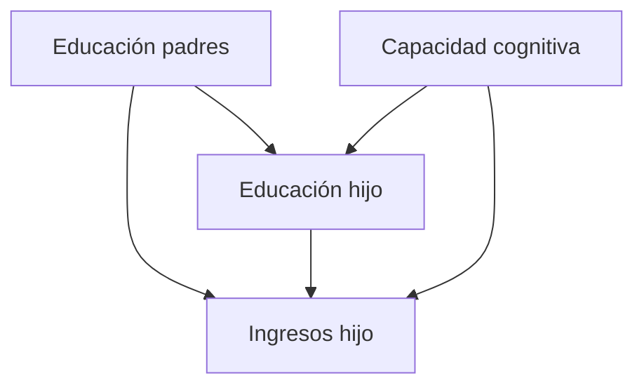
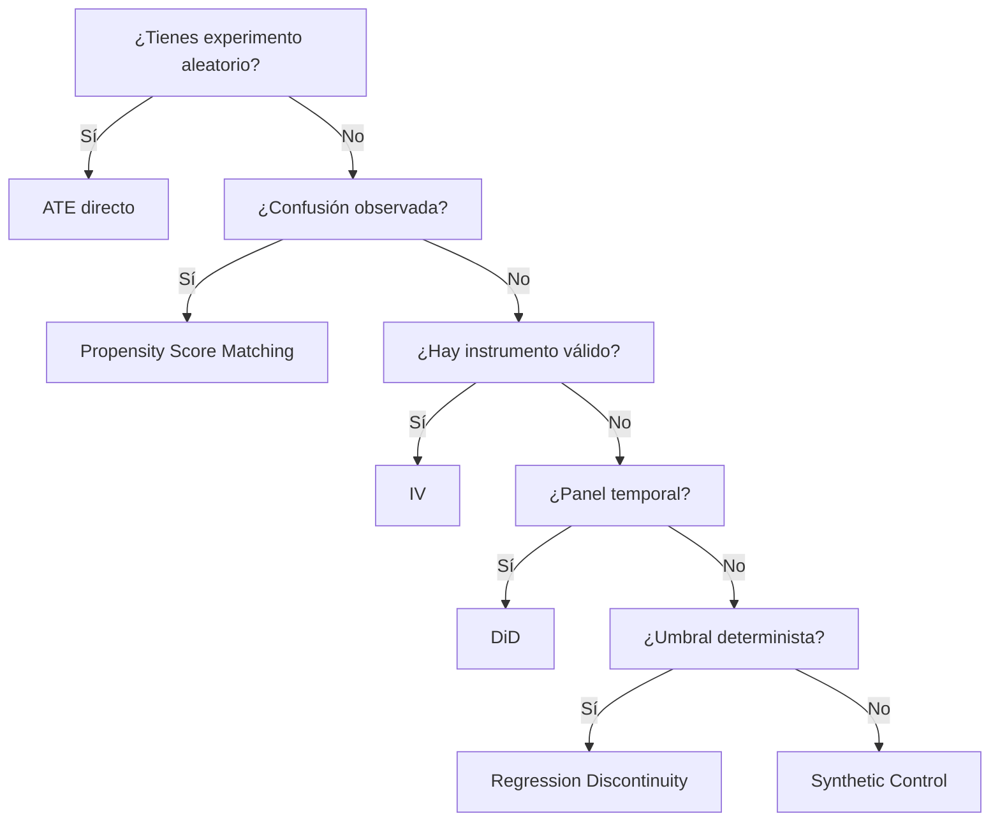

# 🔗 02 - Inferencia Causal

La inferencia causal busca responder preguntas del tipo "¿Qué pasaría si...?". Mientras que la inferencia estadística clásica se centra en asociaciones, la inferencia causal va un paso más allá: intenta estimar el efecto de una intervención. Para un ingeniero de ML/IA, esto es crucial porque los modelos predictivos pueden detectar correlaciones, pero solo los métodos causales pueden fundamentar decisiones estratégicas como cambios en políticas de producto o asignación de recursos.

---

## 1. Correlación vs. causalidad

La correlación mide la co-ocurrencia estadística entre variables, pero no implica causalidad. La confusión entre ambas ha llevado a decisiones erróneas en medicina, economía y ML.

| Aspecto | Correlación | Causalidad |
|---------|-------------|------------|
| Pregunta | ¿X e Y varían juntas? | ¿Cambiar X cambia Y? |
| Dirección | Simétrica | Asimétrica |
| Requiere intervención | No | Sí (o proxy) |
| Valor para ML | Predicción | Decisión y política |

Caso real: Se observó una correlación positiva entre el consumo de helados y los ahogamientos. La variable confusora es la temperatura: ambos aumentan en verano, pero uno no causa el otro.

⚠️ **Advertencia:** Los modelos de ML pueden explotar correlaciones espurias para predecir, pero esas correlaciones pueden desaparecer si el entorno cambia.

---

## 2. Variables de confusión

Una variable confusora Z es aquella que afecta tanto al tratamiento X como al resultado Y, creando una asociación espuria:

$$
X \leftarrow Z \rightarrow Y
$$

Controlar por Z (ajustar, estratificar o incluir en el modelo) es necesario para identificar el efecto causal de X sobre Y.

💡 **Tip:** Siempre dibuja tu DAG antes de ajustar modelos. Ajustar por la variable equivocada puede abrir caminos no causales (collider bias).

---

## 3. Causal graphs (DAGs)

Los Directed Acyclic Graphs (DAGs) representan relaciones causales entre variables usando nodos y flechas dirigidas. Formalizados por Judea Pearl, permiten determinar qué variables ajustar para estimar efectos causales sin sesgo.



*Diagrama: Ejemplo de confusión en la relación educación-ingresos.*

---

## 4. Backdoor criterion

El criterio de puerta trasera (backdoor criterion) identifica un conjunto de variables S que, al ser ajustadas, bloquean todos los caminos no causales (puertas traseras) entre X e Y:

1. S no contiene descendientes de X.
2. S bloquea todos los caminos entre X e Y que contienen una flecha hacia X.

Si existe un conjunto S que satisface el backdoor criterion, el efecto causal de X sobre Y es identificable:

$$
P(Y | do(X=x)) = \sum_{s} P(Y | X=x, S=s) P(S=s)
$$

Caso real: En estudios epidemiológicos, el backdoor criterion se usa para seleccionar covariables que deben incluirse en modelos de regresión para estimar efectos de exposiciones ambientales.

---

## 5. Do-calculus (Pearl)

El do-calculus es un conjunto de reglas algebraicas para manipular expresiones que involucran el operador do(X=x), que representa una intervención externa que fija X en x:

$$
P(Y | do(X=x)) \neq P(Y | X=x)
$$

Las tres reglas del do-calculus permiten eliminar el operador do cuando el efecto es identificable a partir de datos observacionales.

⚠️ **Advertencia:** Si no hay variables observadas que satisfagan el backdoor criterion, el efecto causal no es identificable sin experimentos o supuestos adicionales.

---

## 6. Potential outcomes framework (Rubin)

El marco de resultados potenciales define el efecto causal para un individuo i como:

$$
\tau_i = Y_i(1) - Y_i(0)
$$

donde Yᵢ(1) es el resultado bajo tratamiento y Yᵢ(0) bajo control. El problema fundamental de la inferencia causal es que solo observamos uno de los dos:

$$
Y_i = D_i Y_i(1) + (1 - D_i) Y_i(0)
$$

El **Average Treatment Effect (ATE)** se define como:

$$
ATE = E[Y(1) - Y(0)] = E[Y(1)] - E[Y(0)]
$$

El **Average Treatment Effect on the Treated (ATT)** es:

$$
ATT = E[Y(1) - Y(0) | D = 1]
$$

Caso real: Facebook usa el marco de resultados potenciales para estimar el efecto causal de notificaciones push sobre el engagement, comparando usuarios expuestos y no expuestos.

---

## 7. Propensity score matching

El propensity score es la probabilidad de recibir tratamiento dado las covariables observadas:

$$
e(X) = P(D = 1 | X)
$$

La idea es emparejar unidades tratadas y de control con propensity scores similares, balanceando así las covariables observadas.

### 7.1 Pasos

1. Estimar e(X) usando regresión logística o métodos de ML.
2. Emparejar unidades (1:1, 1:k, o ponderación por inverso de propensity score).
3. Verificar balance de covariables post-matching.
4. Estimar el efecto en la muestra emparejada.

```python
from sklearn.linear_model import LogisticRegression
from sklearn.neighbors import NearestNeighbors
import numpy as np

# X: covariables, D: tratamiento, Y: resultado
model = LogisticRegression()
model.fit(X, D)
propensity = model.predict_proba(X)[:, 1]

# 1:1 nearest neighbor matching sin reemplazo
treated_idx = np.where(D == 1)[0]
control_idx = np.where(D == 0)[0]

nn = NearestNeighbors(n_neighbors=1)
nn.fit(propensity[control_idx].reshape(-1, 1))
distances, matched = nn.kneighbors(propensity[treated_idx].reshape(-1, 1))

matched_control_idx = control_idx[matched.flatten()]
att = np.mean(Y[treated_idx] - Y[matched_control_idx])
print(f"ATT estimado: {att:.3f}")
```

💡 **Tip:** Verifica siempre el balance post-matching usando standardized mean differences (SMD < 0.1 es deseable).

---

## 8. Instrumental variables

Una variable instrumental Z satisface:

1. **Relevancia:** Z afecta a X.
2. **Exclusión:** Z afecta a Y solo a través de X.
3. **Independencia:** Z no está correlacionada con el error.

El estimador de Variables Instrumentales (IV) en su forma más simple ( Wald ) es:

$$
\beta_{IV} = \frac{Cov(Z, Y)}{Cov(Z, X)}
$$

Caso real: Para estimar el efecto de la educación sobre los ingresos, los economistas usan la proximidad a una universidad o reformas educativas como instrumentos.

---

## 9. Difference-in-differences (DiD)

DiD compara el cambio en resultados a lo largo del tiempo entre un grupo tratado y un grupo de control no tratado:

$$
\hat{\tau}_{DiD} = (\bar{Y}_{tratado, post} - \bar{Y}_{tratado, pre}) - (\bar{Y}_{control, post} - \bar{Y}_{control, pre})
$$

El supuesto clave es el **parallel trends**: en ausencia de tratamiento, ambos grupos habrían seguido trayectorias paralelas.

```python
import pandas as pd
import statsmodels.formula.api as smf

# Datos de panel
df['post'] = df['periodo'] >= fecha_tratamiento
df['treated'] = df['grupo'] == 'tratado'

model = smf.ols('y ~ treated * post + C(unidad) + C(periodo)', data=df).fit()
print(model.summary())
```

Caso real: Amazon usa DiD para medir el impacto causal de cambios en algoritmos de precios sobre las ventas, comparando regiones afectadas y no afectadas.

⚠️ **Advertencia:** Si los grupos tienen tendencias previas diferentes, el supuesto de tendencias paralelas falla y la estimación es sesgada.

---

## 10. Regression discontinuity (RD)

RD aprovecha un umbral determinista donde la asignación al tratamiento cambia discontinuamente:

$$
\tau = \lim_{x \downarrow c} E[Y | X = x] - \lim_{x \uparrow c} E[Y | X = x]
$$

donde c es el punto de corte.

Caso real: Muchos gobiernos usan RD para evaluar el impacto de becas educativas, donde solo los estudiantes por encima de una nota de corte las reciben.

---

## 11. Synthetic control

Crea un "control sintético" como combinación ponderada de unidades no tratadas que mejor reproduzca la trayectoria pre-tratamiento de la unidad tratada.

$$
\hat{Y}_{1t}^{N} = \sum_{j=2}^{J+1} w_j Y_{jt}
$$

Caso real: El método de control sintético se usó para evaluar el efecto económico del terrorismo en el País Vasco, usando otras regiones españolas para construir el control.

---

## 12. Diagrama comparativo de métodos




*Figura: Modelo conceptual de relaciones causales.*

---

## 📦 Código de compresión

```text
Inferencia causal: correlación≠causalidad; DAGs identifican confusión; backdoor/do-calculus identifican efectos; resultados potenciales (Rubin) definen ATE/ATT; métodos observacionales: PSM (emparejar por e(X)), IV (Cov(Z,Y)/Cov(Z,X)), DiD (diferencia de diferencias), RD (discontinuidad umbral), Synthetic Control (ponderación pre-tratamiento).
```
