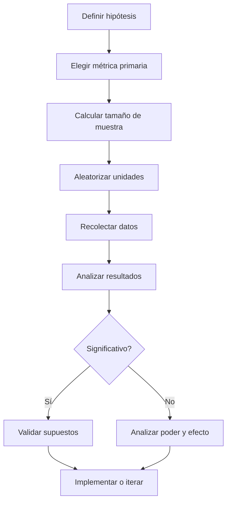

# 🧪 03 - Diseño de Experimentos

El diseño de experimentos es la disciplina que permite establecer relaciones causales de manera rigurosa. Para un ingeniero de ML/IA, dominar esta área significa poder validar que un nuevo modelo, algoritmo o feature realmente mejora las métricas de negocio, y no que las diferencias observadas se deben al azar o a factores externos.

---

## 1. RCT (Randomized Controlled Trials)

Un RCT asigna aleatoriamente las unidades a tratamiento o control, garantizando que, en expectativa, los grupos sean comparables en todas las dimensiones observables y no observables.

$$
E[Y(0) | D = 1] = E[Y(0) | D = 0]
$$

Esta igualdad en expectativa elimina el sesgo de selección.

### 1.1 Métodos de aleatorización

| Método | Descripción | Ventaja |
|--------|-------------|---------|
| Simple | Asignación aleatoria pura | Fácil de implementar |
| Por bloques | Aleatorización dentro de subgrupos homogéneos | Reduce varianza |
| Estratificada | Aleatorización proporcional por estratos | Balance garantizado en covariables clave |
| Por conglomerados | Aleatorización de grupos enteros | Logístico para intervenciones a nivel comunitario |

Caso real: Airbnb realiza RCTs para probar cambios en la interfaz de búsqueda, asignando aleatoriamente a usuarios a la versión nueva o antigua.

⚠️ **Advertencia:** La aleatorización simple puede producir desequilibrios en muestras pequeñas. Usa estratificación cuando el tamaño de muestra sea limitado.

---

## 2. Estratificación y bloques

La estratificación divide la población en grupos homogéneos (estratos) y aleatoriza dentro de cada uno:

$$
\hat{\tau}_{strat} = \sum_{h=1}^{H} \frac{N_h}{N} \hat{\tau}_h
$$

La varianza del estimador estratificado es generalmente menor que la del estimador completamente aleatorizado.

💡 **Tip:** Estratifica por variables que correlacionan fuertemente con el resultado (por ejemplo, historial de compras en un experimento de e-commerce).

---

## 3. Diseños factoriales

Un diseño factorial evalúa simultáneamente múltiples tratamientos y sus interacciones. Un diseño 2² tiene dos factores, cada uno con dos niveles:

| Celda | Factor A | Factor B | Respuesta esperada |
|-------|----------|----------|-------------------|
| 1 | 0 | 0 | μ |
| 2 | 1 | 0 | μ + α |
| 3 | 0 | 1 | μ + β |
| 4 | 1 | 1 | μ + α + β + (αβ) |

Esto permite estimar efectos principales y efectos de interacción con mayor eficiencia.

Caso real: Google ejecuta diseños factoriales para probar simultáneamente cambios en el color de un botón y el texto del mismo, midiendo tanto efectos individuales como sinergias.

---

## 4. A/B testing avanzado

### 4.1 Tratamientos múltiples

Cuando hay más de dos variantes (A/B/C/D), los métodos de comparación múltiple son obligatorios para controlar la tasa de error familiar.

### 4.2 Sequential testing

En lugar de esperar a un tamaño de muestra fijo, el sequential testing permite detener el experimento tan pronto como haya evidencia suficiente:

- **SPRT (Sequential Probability Ratio Test):** Compara la verosimilitud de H₁ vs H₀ en cada observación.

### 4.3 Peeking problem

Mirar los resultados de un experimento de forma continua y detenerlo cuando el p-value cruza un umbral inflaciona drásticamente la tasa de Error Tipo I.

| Enfoque | Error Tipo I real (nominado 0.05) |
|---------|-----------------------------------|
| 1 mirada | 0.05 |
| 5 miradas | ~0.14 |
| 10 miradas | ~0.19 |
| Continuo | ~0.30 |

💡 **Tip:** Si necesitas monitorear un experimento, usa bandas de confianza de Group Sequential Tests o Always Valid P-values.

---

## 5. Power analysis y cálculo de tamaño de muestra

### 5.1 Potencia estadística

La potencia es la probabilidad de rechazar H₀ cuando H₁ es verdadera:

$$
1 - \beta = P(\text{rechazar } H_0 \mid H_1 \text{ verdadera})
$$

Factores que afectan la potencia:

- Tamaño del efecto (δ): mayor efecto, mayor potencia.
- Tamaño de muestra (n): mayor n, mayor potencia.
- Nivel de significancia (α): mayor α, mayor potencia.
- Varianza (σ²): menor varianza, mayor potencia.

### 5.2 Fórmulas de tamaño de muestra

Para una prueba t de dos muestras con igual varianza:

$$
n = \frac{2\sigma^2 (z_{1-\alpha/2} + z_{1-\beta})^2}{\delta^2}
$$

Para una prueba de proporciones:

$$
n = \frac{(z_{1-\alpha/2}\sqrt{2\bar{p}(1-\bar{p})} + z_{1-\beta}\sqrt{p_1(1-p_1)+p_2(1-p_2)})^2}{(p_1 - p_2)^2}
$$

```python
from statsmodels.stats.power import TTestIndPower

power_analysis = TTestIndPower()
sample_size = power_analysis.solve_power(
    effect_size=0.2,
    alpha=0.05,
    power=0.8,
    ratio=1.0
)
print(f"Tamaño de muestra por grupo: {int(np.ceil(sample_size))}")
```

Caso real: LinkedIn calcula tamaños de muestra mínimos antes de lanzar cualquier experimento de producto, para evitar ejecutar pruebas con potencia insuficiente.

---

## 6. Spillover effects y SUTVA

### 6.1 SUTVA (Stable Unit Treatment Value Assumption)

SUTVA consta de dos partes:

1. **No interferencia:** El resultado de una unidad no depende del tratamiento asignado a otras unidades.
2. **Consistencia:** No hay versiones ocultas del tratamiento.

$$
Y_i(d_1, d_2, \dots, d_n) = Y_i(d_i)
$$

Cuando SUTVA falla, los efectos estimados están sesgados.

### 6.2 Spillovers

Ocurren cuando el tratamiento de una unidad afecta a otra (por ejemplo, un usuario tratado habla con uno de control).

| Estrategia | Descripción |
|------------|-------------|
| Clustering | Aleatorizar a nivel de conglomerado (redes, ciudades) |
| Diseño de dos etapas | Medir efectos directos e indirectos por separado |
| Modelos de red | Incorporar la estructura de vecindad en el análisis |

Caso real: Facebook enfrentó spillovers masivos al probar una nueva función de chat: los usuarios de control se enteraban por sus amigos tratados, invalidando SUTVA.

⚠️ **Advertencia:** Si ignoras los spillovers en un experimento de red, puedes subestimar o sobrestimar el efecto del tratamiento.

---

## 7. Diagrama de flujo de diseño experimental




*Figura: Esquema general del diseño de experimentos.*

---

## 📦 Código de compresión

```text
Diseño experimental: RCT aleatoriza para eliminar sesgo; estratificación/bloques reducen varianza; factoriales evalúan interacciones; A/B avanzado requiere control de múltiples comparaciones y evitar peeking; power analysis define n mínimo; SUTVA y spillovers deben validarse en redes.
```
