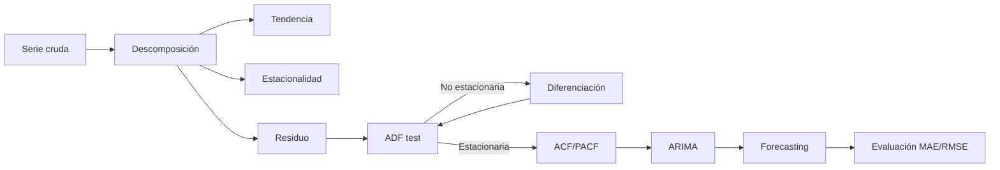

# 📈 04 - Series Temporales

Las series temporales son secuencias de observaciones indexadas en el tiempo. Para un ingeniero de ML/IA, el análisis de series temporales es fundamental en forecasting de demanda, detección de anomalías en sistemas, predicción de precios y monitoreo de métricas operativas. A diferencia de los datos cross-sectional, las series temporales violan la independencia: el valor presente depende del pasado.

---

## 1. Componentes de una serie temporal

Una serie temporal Yₜ puede descomponerse en:

$$
Y_t = T_t + S_t + C_t + \varepsilon_t
$$

| Componente | Descripción | Ejemplo |
|------------|-------------|---------|
| Tₜ (Trend) | Movimiento a largo plazo | Crecimiento anual de usuarios |
| Sₜ (Seasonality) | Patrones repetitivos fijos | Picos de ventas en diciembre |
| Cₜ (Cyclical) | Ciclos económicos irregulares | Recesiones y expansiones |
| εₜ (Residual) | Ruido aleatorio | Fluctuaciones impredecibles |

Caso real: Uber descompone las solicitudes de viaje para separar la tendencia de crecimiento de la estacionalidad diaria y semanal.

---

## 2. Estacionariedad

### 2.1 Definición

Una serie es estrictamente estacionaria si la distribución conjunta de cualquier conjunto de observaciones es invariante en el tiempo. En la práctica, se usa la **estacionariedad débil** (covarianza estacionaria):

$$
E[Y_t] = \mu, \quad \forall t
$$

$$
Cov(Y_t, Y_{t+h}) = \gamma(h), \quad \forall t, h
$$

### 2.2 Test de Dickey-Fuller Aumentado (ADF)

El ADF test evalúa la presencia de raíz unitaria (no estacionariedad):

$$
\Delta Y_t = \alpha + \beta t + \gamma Y_{t-1} + \sum_{i=1}^{p} \delta_i \Delta Y_{t-i} + \varepsilon_t
$$

H₀: γ = 0 (raíz unitaria, serie no estacionaria).

```python
from statsmodels.tsa.stattools import adfuller

result = adfuller(series, autolag='AIC')
print(f'ADF Statistic: {result[0]:.4f}')
print(f'p-value: {result[1]:.4f}')
if result[1] < 0.05:
    print("Se rechaza H0: la serie es estacionaria.")
else:
    print("No se rechaza H0: la serie NO es estacionaria.")
```

⚠️ **Advertencia:** Un p-value bajo en ADF indica estacionariedad, pero no descarta estacionariedad local o cambios estructurales no capturados.

---

## 3. Autocorrelación

### 3.1 ACF (Autocorrelation Function)

La ACF mide la correlación entre Yₜ e Yₜ₋ₕ:

$$
\rho(h) = \frac{Cov(Y_t, Y_{t+h})}{Var(Y_t)}
$$

### 3.2 PACF (Partial Autocorrelation Function)

La PACF mide la correlación entre Yₜ e Yₜ₋ₕ eliminando el efecto de los rezagos intermedios.

| Gráfico | Interpretación |
|---------|----------------|
| ACF decrece lentamente | Posible tendencia; necesita diferenciación |
| ACF corta después de q | Indica componente MA(q) |
| PACF corta después de p | Indica componente AR(p) |

💡 **Tip:** Usa ACF y PACF para identificar los órdenes p y q de un modelo ARIMA.

---

## 4. Modelos clásicos

### 4.1 AR(p) - Autoregresivo

$$
Y_t = c + \sum_{i=1}^{p} \phi_i Y_{t-i} + \varepsilon_t
$$

### 4.2 MA(q) - Media Móvil

$$
Y_t = \mu + \varepsilon_t + \sum_{j=1}^{q} \theta_j \varepsilon_{t-j}
$$

### 4.3 ARMA(p, q)

Combina ambos componentes:

$$
Y_t = c + \sum_{i=1}^{p} \phi_i Y_{t-i} + \varepsilon_t + \sum_{j=1}^{q} \theta_j \varepsilon_{t-j}
$$

### 4.4 ARIMA(p, d, q)

Incorpora diferenciación para alcanzar estacionariedad:

$$
\nabla^d Y_t \sim ARMA(p, q)
$$

donde ∇Yₜ = Yₜ − Yₜ₋₁.

```python
from statsmodels.tsa.arima.model import ARIMA
import pandas as pd

# Asumiendo 'series' es una Serie de pandas con índice datetime
model = ARIMA(series, order=(2, 1, 2))
result = model.fit()
print(result.summary())

# Forecasting
forecast = result.get_forecast(steps=12)
mean_forecast = forecast.predicted_mean
conf_int = forecast.conf_int()
```

Caso real: Amazon utiliza modelos ARIMA y sus extensiones para el forecasting de inventario a corto plazo en centros de distribución.

---

## 5. Métodos de forecasting

| Método | Descripción | Cuándo usarlo |
|--------|-------------|---------------|
| Naive | Ŷₜ₊₁ = Yₜ | Serie sin estructura clara |
| Moving Average | Promedio de los últimos k periodos | Suavizar ruido |
| Exponential Smoothing | Promedio ponderado con pesos decrecientes | Tendencia moderada |
| Holt-Winters | Exponential smoothing + tendencia + estacionalidad | Series con estacionalidad |
| ARIMA | Modelo paramétrico completo | Series estacionarias tras diferenciación |

---

## 6. Métricas de evaluación

$$
MAE = \frac{1}{n} \sum_{t=1}^{n} |Y_t - \hat{Y}_t|
$$

$$
RMSE = \sqrt{\frac{1}{n} \sum_{t=1}^{n} (Y_t - \hat{Y}_t)^2}
$$

$$
MAPE = \frac{100\%}{n} \sum_{t=1}^{n} \left| \frac{Y_t - \hat{Y}_t}{Y_t} \right|
$$

| Métrica | Ventaja | Desventaja |
|---------|---------|------------|
| MAE | Interpretable, escala original | No penaliza grandes errores |
| RMSE | Penaliza outliers | Sensible a escala |
| MAPE | Relativa, comparación cruzada | Inestable cuando Yₜ ≈ 0 |

Caso real: Spotify evalúa modelos de forecasting de streams usando MAPE para comparar el desempeño entre géneros musicales con volúmenes muy diferentes.

---

## 7. Detección de anomalías en series temporales

Métodos comunes:

1. **Z-score dinámico:** Detecta puntos fuera de un umbral basado en media móvil y desviación.
2. **Isolation Forest:** Algoritmo de ML no supervisado.
3. **Prophet (mención):** Librería de Meta que descompone series y detecta outliers basándose en intervalos de incertidumbre.

```python
# Z-score dinámico simple
rolling_mean = series.rolling(window=30).mean()
rolling_std = series.rolling(window=30).std()

anomalies = series[(series - rolling_mean).abs() > 3 * rolling_std]
```

⚠️ **Advertencia:** Las anomalías en series temporales pueden ser puntos atípicos, cambios de nivel o cambios de varianza. Asegúrate de identificar qué tipo buscas.

---

## 8. Diagrama de procesos temporales




*Figura: Descomposición aditiva de una serie temporal.*

---

## 📦 Código de compresión

```text
Series temporales: descomposición T+S+C+E; ADF test para estacionariedad; ACF/PACF identifican AR/MA; ARIMA(p,d,q) modela con diferenciación; forecasting naive/MA/exp smoothing; métricas MAE/RMSE/MAPE; anomalías con z-score o Prophet.
```
