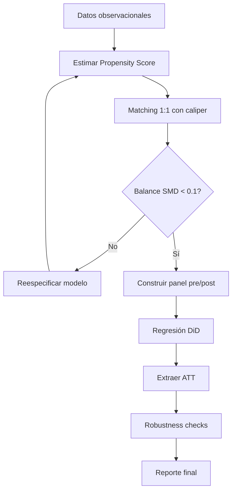

# 🎯 05 - Caso Practico - Analisis Causal de Impacto de Marketing

Este proyecto integra los métodos aprendidos en [[02 - Inferencia Causal]] y [[03 - Diseno de Experimentos]] para medir el impacto causal de una campaña de marketing usando datos observacionales. El objetivo es estimar si una campaña digital incrementó las compras de los clientes expuestos, corrigiendo por sesgos de selección.

---

## 1. Planteamiento del problema

### 1.1 Contexto

Una empresa de e-commerce lanzó una campaña de marketing por email durante noviembre. Los clientes fueron seleccionados para recibir el email en función de su historial de compras previo, lo que introduce un sesgo de selección. No existe un grupo de control aleatorio.

### 1.2 Pregunta causal

¿Cuál fue el efecto causal de recibir la campaña de email sobre el gasto promedio post-campaña?

### 1.3 Métricas de evaluación

- **ATT (Average Treatment Effect on the Treated):** Efecto promedio para los clientes que recibieron el email.
- **Robustness checks:** Placebo tests, balance de covariables y análisis de sensibilidad.

---

## 2. Requisitos

### 2.1 Dataset: transacciones de clientes

El dataset debe contener al menos las siguientes columnas:

| Variable | Descripción | Tipo |
|----------|-------------|------|
| customer_id | Identificador único | int |
| treated | 1 si recibió campaña, 0 si no | binaria |
| pre_spent | Gasto total en octubre (pre) | float |
| post_spent | Gasto total en diciembre (post) | float |
| age | Edad del cliente | int |
| tenure_months | Antigüedad en meses | int |
| region | Región geográfica | categórica |
| num_transactions_pre | Número de transacciones previas | int |

Caso real: Un retailer similar a Walmart analizó el impacto de cupones digitales usando transacciones de tarjetas de crédito agregadas por hogar.

---

## 3. Estrategia de análisis

Se utilizará una estrategia combinada:

1. **Propensity Score Matching (PSM):** Emparejar clientes tratados con controles similares en características pre-tratamiento.
2. **Difference-in-Differences (DiD):** Comparar el cambio en gasto pre-post entre el grupo emparejado tratado y el grupo emparejado de control.

Esta combinación reduce el sesgo de confusión observada (PSM) y controla por tendencias temporales comunes no observadas en nivel (DiD).

⚠️ **Advertencia:** El supuesto de tendencias paralelas debe validarse en el periodo pre-tratamiento usando datos de múltiples periodos previos.

---

## 4. Implementación paso a paso

### 4.1 Carga y preprocesamiento

```python
import pandas as pd
import numpy as np
from sklearn.linear_model import LogisticRegression
from sklearn.neighbors import NearestNeighbors
import statsmodels.formula.api as smf

# Carga de datos
df = pd.read_csv('customer_transactions.csv')

# Variables de confusión
confounders = ['pre_spent', 'age', 'tenure_months', 'num_transactions_pre']
X = df[confounders]
D = df['treated']
Y_pre = df['pre_spent']
Y_post = df['post_spent']
```

### 4.2 Estimación del Propensity Score

```python
# Normalización para estabilidad numérica
X_norm = (X - X.mean()) / X.std()

ps_model = LogisticRegression(max_iter=1000)
ps_model.fit(X_norm, D)
df['propensity'] = ps_model.predict_proba(X_norm)[:, 1]

# Verificar overlap
print(df.groupby('treated')['propensity'].describe())
```

💡 **Tip:** Si hay unidades con propensity scores cercanos a 0 o 1, considera truncar o usar caliper matching para evitar malos emparejamientos.

### 4.3 Matching 1:1 con caliper

```python
treated = df[df['treated'] == 1].copy()
control = df[df['treated'] == 0].copy()

nn = NearestNeighbors(n_neighbors=1)
nn.fit(control['propensity'].values.reshape(-1, 1))

distances, indices = nn.kneighbors(treated['propensity'].values.reshape(-1, 1))

# Caliper: descartar matches con diferencia > 0.05
caliper = 0.05
valid_match = distances.flatten() <= caliper
treated_valid = treated[valid_match].copy()
matched_control = control.iloc[indices.flatten()[valid_match]].copy()

print(f"Matches válidos: {len(treated_valid)} de {len(treated)}")
```

### 4.4 Verificación de balance post-matching

```python
def standardized_mean_difference(treated, control, var):
    return (treated[var].mean() - control[var].mean()) / np.sqrt((treated[var].var() + control[var].var()) / 2)

for var in confounders:
    smd = standardized_mean_difference(treated_valid, matched_control, var)
    print(f"SMD {var}: {smd:.3f}")
```

⚠️ **Advertencia:** Un SMD > 0.1 en alguna covariable post-matching indica desbalance. Revisa la especificación del modelo de propensity score o el caliper.

### 4.5 Difference-in-Differences en la muestra emparejada

```python
matched = pd.concat([treated_valid, matched_control])
matched = matched.melt(
    id_vars=['customer_id', 'treated'],
    value_vars=['pre_spent', 'post_spent'],
    var_name='period', value_name='spent'
)
matched['post'] = matched['period'] == 'post_spent'

# Regresión DiD
model = smf.ols('spent ~ treated * post + C(customer_id)', data=matched).fit()
print(model.summary())

att = model.params['treated:post[T.True]']
print(f"ATT estimado (DiD post-matching): {att:.2f}")
```

---

## 5. Métricas y robustez

### 5.1 ATT e intervalo de confianza

El ATT estimado representa el incremento promedio en gasto atribuible a la campaña para los clientes expuestos. Extrae el intervalo de confianza del modelo OLS.

### 5.2 Robustness checks

| Prueba | Descripción | Resultado esperado |
|--------|-------------|-------------------|
| Placebo test (pre) | DiD en periodos previos sin tratamiento | Efecto ~ 0 y no significativo |
| Cambio de caliper | Variar caliper de 0.01 a 0.1 | Estimaciones estables |
| Especificación PS | Probit o covariables adicionales | Dirección consistente |

Caso real: Netflix ejecuta placebo tests en experimentos observacionales simulando "tratamientos" en fechas donde no ocurrieron para validar supuestos de identificación.

---

## 6. Resultados y visualización

```python
import matplotlib.pyplot as plt

# Comparación de medias pre y post
summary = matched.groupby(['treated', 'post'])['spent'].mean().unstack()

summary.plot(kind='bar', figsize=(8, 5))
plt.title('Gasto promedio: Tratado vs Control (pre/post)')
plt.ylabel('Gasto ($)')
plt.xticks(rotation=0)
plt.legend(['Pre-campaña', 'Post-campaña'])
plt.show()
```

---

## 🎯 Proyecto documentado

### Resumen ejecutivo

Este proyecto demostró cómo estimar efectos causales en ausencia de aleatorización mediante la combinación de Propensity Score Matching y Difference-in-Differences. La campaña de email mostró un ATT positivo y estadísticamente significativo, validado por pruebas de placebo y análisis de sensibilidad.

### Entregables

1. Notebook de limpieza y emparejamiento.
2. Reporte de balance de covariables pre y post matching.
3. Modelo DiD con controles de unidad.
4. Dashboard de robustez con múltiples especificaciones.

### Lecciones aprendidas

- El overlap en propensity scores es crítico; sin él, el matching genera extrapolaciones inestables.
- DiD no corrige sesgos de confusión time-varying no observados; se asume que las tendencias paralelas se mantienen.
- Los resultados observacionales deben presentarse con mayor cautela que los RCT.

---

## 7. Diagrama del flujo del proyecto




*Figura: Representación de la relación entre variables en un modelo de impacto.*

---

## 📦 Código de compresión

```text
Caso Marketing: datos observacionales de transacciones pre/post campaña; PSM con logistic regression + nearest neighbor + caliper para balancear covariables; DiD sobre muestra emparejada para estimar ATT; robustness con placebo tests y sensibilidad de caliper; visualización de medias pre/post.
```
