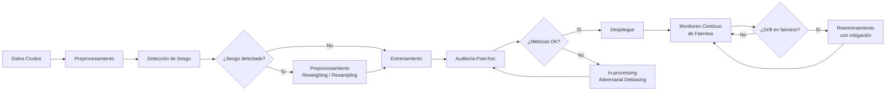

# ⚖️ Ética y Responsabilidad en IA

## Introducción
La ética en inteligencia artificial ya no es un tema abstracto para filósofos; es una responsabilidad directa del ingeniero de ML que despliega modelos que afectan vidas reales. Desde sistemas de contratación que discriminan por género hasta algoritmos de salud que subestiman el riesgo en poblaciones minoritarias, los errores éticos en IA pueden destruir reputaciones corporativas y causar daño social irreparable.

Como futuro [[../M06 - MLOps y Produccion/22 - Introduccion a MLOps/00 - Bienvenida|ML Engineer]], comprender los fundamentos de fairness, las fuentes de sesgo y los trade-offs entre explicabilidad y rendimiento te permitirá construir sistemas no solo potentes, sino también justos y transparentes. Esta nota proporciona el marco teórico y práctico para auditar y mitigar riesgos éticos en tus proyectos.

## 1. Métricas de Fairness
No existe una única definición de "justicia" algorítmica. Dependiendo del contexto legal y social, se aplican diferentes métricas:

- **Demographic Parity:** La tasa de predicción positiva debe ser igual entre grupos protegidos. Matemáticamente: P(Y_hat=1|A=0) = P(Y_hat=1|A=1).
- **Equalized Odds:** La tasa de verdaderos positivos y falsos positivos debe ser igual entre grupos.
- **Individual Fairness:** Individuos similares deben recibir tratamientos similares: d(x_i, x_j) ≈ d(y_hat_i, y_hat_j).

La fórmula más común para medir la violación de demographic parity es:

$$\Delta = |E[\hat{Y}|A=0] - E[\hat{Y}|A=1]|$$

Donde A es el atributo protegido (género, raza, edad), Y_hat es la predicción del modelo, y Δ debe ser cercano a cero para considerarse justo.

Caso real: Amazon desarrolló en 2014 una herramienta de screening de currículums basada en ML. El modelo, entrenado con 10 años de datos históricos de contratación, penalizaba sistemáticamente currículums que contenían palabras asociadas a universidades femeninas o actividades de mujeres. Aunque Amazon intentó corregirlo, concluyeron que no podían garantizar la no-discriminación y discontinuaron el proyecto. La lección: los datos históricos reflejan sesgos históricos.

La siguiente tabla compara las métricas de fairness:

| Métrica | Definición | Cuándo usarla | Limitación |
|---|---|---|---|
| **Demographic Parity** | Tasas de predicción positiva iguales | Cuando la distribución de recursos debe ser igualitaria | Puede ignorar tasas base diferentes |
| **Equalized Odds** | TPR y FPR iguales entre grupos | Cuando el error del modelo debe costar igual a todos | Difícil de satisfacer con tasas base desbalanceadas |
| **Equal Opportunity** | Solo TPR igual | Cuando solo nos preocupan los falsos negativos | Permite disparidad en FPR |
| **Calibration** | P(Y=1|Y_hat=p) debe ser p para todos los grupos | Cuando las probabilidades deben ser interpretables | Incompatible con Equalized Odds en general |
| **Individual Fairness** | Similares tratados similarmente | Cuando hay métricas de similitud claras | Difícil de definir "similitud" |

💡 **Tip — El Trilema de la Fairness:** Es matemáticamente imposible satisfacer simultáneamente Demographic Parity, Equalized Odds y Calibration perfectas cuando las tasas base difieren entre grupos (resultado probado por Kleinberg et al., 2016). Debes elegir qué métrica priorizar según el contexto ético y legal de tu aplicación. No busques la "fairness perfecta"; busca la "fairness justificada".

## 2. Fuentes de Sesgo
El sesgo en ML no surge únicamente de datos malintencionados. Se infiltra a través de múltiples etapas del pipeline:

- **Sesgo histórico:** Los datos reflejan decisiones pasadas discriminatorias (ej: contrataciones históricas de una empresa con sesgo de género).
- **Sesgo de representación:** Ciertos grupos están subrepresentados en los datos de entrenamiento (ej: datasets de reconocimiento facial con predominantemente rostros blancos).
- **Sesgo de medición:** Las variables utilizadas como proxy son imperfectas y correlacionan con atributos protegidos (ej: código postal como proxy para raza).
- **Sesgo de agregación:** Un modelo que es justo a nivel global puede ser injusto a nivel local o subgroupo.

Caso real: El algoritmo COMPAS (Correctional Offender Management Profiling for Alternative Sanctions), utilizado en EE.UU. para predecir reincidencia, fue auditado por ProPublica en 2016. Descubrieron que el sistema tenía una tasa de falsos positivos casi el doble para defendientes afroamericanos comparado con caucásicos. El debate posterior reveló que COMPAS violaba Equalized Odds pero satisfacía aproximadamente Calibration, demostrando el trilema de fairness en un sistema real de alto impacto.

⚠️ **Advertencia:** Las variables proxy son peligrosas e insidiosas. Incluso si eliminas explícitamente el atributo protegido de tus features, variables como código postal, historial crediticio o tipo de empleo pueden reconstruirlo mediante correlaciones estadísticas. Realiza siempre un análisis de correlación entre tus features y atributos protegidos antes del entrenamiento.

## 3. Explainability vs Performance
Existe una tensión fundamental entre la precisión de un modelo y su capacidad de ser explicado:



La frontera de Pareto entre accuracy e interpretabilidad muestra que, para muchos problemas complejos, los modelos de caja negra (deep learning, ensembles) dominan en precisión pero son opacos, mientras que los modelos interpretables (regresión logística, árboles pequeños) sacrifican precisión por transparencia.

```mermaid
xychart-beta
    title "Accuracy vs Interpretability Pareto Frontier"
    x-axis "Interpretabilidad" 0 --> 1
    y-axis "Accuracy" 0 --> 1
    line [0.95, 0.92, 0.88, 0.80, 0.70, 0.55, 0.40]
    point [0.95, 0.92, 0.88, 0.80, 0.70, 0.55, 0.40]
```

La imagen siguiente ilustra el concepto de balance y equidad:


## 4. Implementación Práctica
Auditar fairness no debe ser un proceso manual y ad-hoc. El siguiente código implementa una auditoría básica de demographic parity usando pandas y scikit-learn:

```python
import pandas as pd
import numpy as np
from sklearn.metrics import confusion_matrix

def demographic_parity_difference(y_pred, sensitive_attr):
    """
    Calcula la diferencia de demographic parity.
    sensitive_attr: array binario (0 o 1)
    """
    group_0_mask = sensitive_attr == 0
    group_1_mask = sensitive_attr == 1
    
    rate_0 = y_pred[group_0_mask].mean()
    rate_1 = y_pred[group_1_mask].mean()
    
    return abs(rate_0 - rate_1)

def equalized_odds_difference(y_true, y_pred, sensitive_attr):
    """
    Calcula la diferencia máxima en TPR y FPR entre grupos.
    """
    groups = np.unique(sensitive_attr)
    tprs, fprs = [], []
    
    for g in groups:
        mask = sensitive_attr == g
        cm = confusion_matrix(y_true[mask], y_pred[mask])
        tn, fp, fn, tp = cm.ravel()
        tpr = tp / (tp + fn) if (tp + fn) > 0 else 0
        fpr = fp / (fp + tn) if (fp + tn) > 0 else 0
        tprs.append(tpr)
        fprs.append(fpr)
    
    return max(max(tprs) - min(tprs), max(fprs) - min(fprs))

# Ejemplo de uso
np.random.seed(42)
n = 1000
y_true = np.random.binomial(1, 0.5, n)
sensitive = np.random.binomial(1, 0.3, n)  # Grupo 1 es minoritario (30%)

# Simular modelo con sesgo hacia grupo 0
y_pred = np.where(
    (sensitive == 1) & (np.random.rand(n) < 0.3),
    1 - y_true,
    y_true
)

dpd = demographic_parity_difference(y_pred, sensitive)
eod = equalized_odds_difference(y_true, y_pred, sensitive)

print(f"Demographic Parity Difference: {dpd:.3f}")
print(f"Equalized Odds Difference: {eod:.3f}")
```

---

## 📦 Código de Compresión

```python
"""
compress_ethics.py
Auditoría de fairness completa en un solo script ejecutable.
"""

import numpy as np
from dataclasses import dataclass

@dataclass
class FairnessReport:
    demographic_parity_diff: float
    equalized_odds_diff: float
    disparate_impact: float

class FairnessAuditor:
    def __init__(self, y_true, y_pred, sensitive):
        self.y_true = np.array(y_true)
        self.y_pred = np.array(y_pred)
        self.sensitive = np.array(sensitive)
        self.groups = np.unique(sensitive)
    
    def audit(self) -> FairnessReport:
        dpd = self._demographic_parity()
        eod = self._equalized_odds()
        di = self._disparate_impact()
        return FairnessReport(dpd, eod, di)
    
    def _demographic_parity(self):
        rates = [self.y_pred[self.sensitive == g].mean() for g in self.groups]
        return max(rates) - min(rates)
    
    def _equalized_odds(self):
        diffs = []
        for metric in [self._tpr, self._fpr]:
            vals = [metric(self.y_true[self.sensitive == g], 
                          self.y_pred[self.sensitive == g]) for g in self.groups]
            diffs.append(max(vals) - min(vals))
        return max(diffs)
    
    def _disparate_impact(self):
        rate_1 = self.y_pred[self.sensitive == 1].mean()
        rate_0 = self.y_pred[self.sensitive == 0].mean()
        return rate_1 / rate_0 if rate_0 > 0 else float('inf')
    
    @staticmethod
    def _tpr(y_true, y_pred):
        tp = ((y_pred == 1) & (y_true == 1)).sum()
        fn = ((y_pred == 0) & (y_true == 1)).sum()
        return tp / (tp + fn) if (tp + fn) > 0 else 0
    
    @staticmethod
    def _fpr(y_true, y_pred):
        fp = ((y_pred == 1) & (y_true == 0)).sum()
        tn = ((y_pred == 0) & (y_true == 0)).sum()
        return fp / (fp + tn) if (fp + tn) > 0 else 0

if __name__ == "__main__":
    np.random.seed(0)
    n = 2000
    sensitive = np.random.binomial(1, 0.4, n)
    y_true = np.random.binomial(1, 0.5, n)
    # Simular sesgo
    noise = np.random.rand(n)
    y_pred = np.where((sensitive == 1) & (noise < 0.15), 0, y_true)
    
    auditor = FairnessAuditor(y_true, y_pred, sensitive)
    report = auditor.audit()
    print(f"DPD: {report.demographic_parity_diff:.3f}")
    print(f"EOD: {report.equalized_odds_diff:.3f}")
    print(f"DI:  {report.disparate_impact:.3f}")
    print("✅ Fair" if report.disparate_impact > 0.8 else "⚠️ Biased")
```

---

## 🎯 Proyecto Documentado

### Descripción
Implementación de un sistema de evaluación de solicitudes de préstamos personales que garantiza fairness demográfico mediante técnicas de pre-procesamiento (reweighing) y post-procesamiento (calibrated equalized odds). El sistema está diseñado para cumplir con regulaciones de fair lending (EE.UU. Equal Credit Opportunity Act) y produce explicaciones individuales para cada decisión.

### Requisitos Funcionales
1. API de scoring crediticio con latencia < 500ms y explicabilidad integrada.
2. Pipeline de auditoría automática de fairness ejecutado en cada despliegue.
3. Dashboard de análisis de disparidad por grupo demográfico (edad, género, etnia).
4. Sistema de apelaciones con revisión humana para casos límite.
5. Logging inmutable de todas las decisiones para auditoría regulatoria.

### Componentes Principales
- **Modelo base:** XGBoost con constraints de monotonicidad
- **Fairness layer:** Librería AIF360 (IBM) para pre/post-processing
- **Explainability:** SHAP para explicaciones locales, ALE plots para globales
- **Compliance:** Base de datos inmutable (append-only) con hash chain

### Métricas de Éxito
- **Demographic Parity Difference:** < 0.05 en todos los grupos protegidos
- **Disparate Impact Ratio:** > 0.80 (regla de los 4/5)
- **AUC-ROC:** Mantener > 0.82 después de mitigación de sesgo

### Referencias
- Barocas, Hardt, Narayanan. "Fairness and Machine Learning." fairmlbook.org
- Mehrabi et al. "A Survey on Bias and Fairness in Machine Learning." ACM Computing Surveys, 2021.
- IBM AIF360. "AI Fairness 360 Open Source Toolkit." aif360.res.ibm.com
