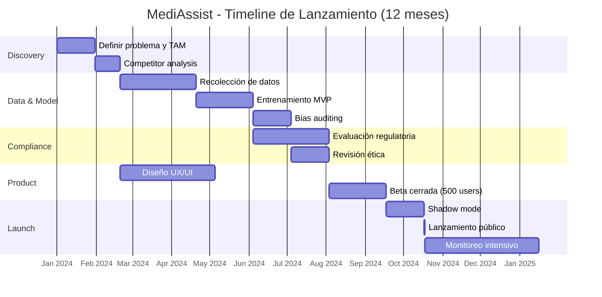
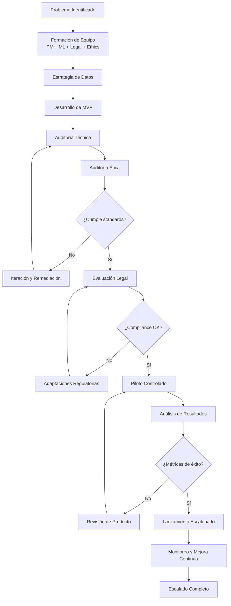

# 🚀 Caso Práctico: Lanzamiento de Producto IA

## Introducción
Lanzar un producto de inteligencia artificial al mercado es una disciplina que integra ingeniería, estrategia de negocio, ética y operaciones. A diferencia de un lanzamiento de software tradicional, un producto de IA requiere validaciones adicionales: ¿los datos de entrenamiento representan adecuadamente a la población objetivo? ¿el modelo mantiene su rendimiento bajo carga de producción? ¿existen salvaguardas legales y éticas suficientes?

Esta nota presenta un caso práctico end-to-end que sintetiza todo lo aprendido en el curso. Partiremos de la definición del problema, pasaremos por la estrategia de datos y el desarrollo del MVP, continuaremos con la revisión ética y legal, y concluiremos con consideraciones de go-to-market y monitoreo post-lanzamiento. Es el cierre natural del camino que comenzó en [[01 - Diseño de Productos con IA|🎨 Diseño de Productos con IA]] y transitó por [[02 - Estrategia y Roadmap de ML|🗺️ Estrategia]] y [[03 - Ética y Responsabilidad en IA|⚖️ Ética]].

## 1. De la Idea al MVP
El caso práctico se centra en "MediAssist", un asistente de IA para diagnóstico preliminar de dermatología. El producto permite a los usuarios fotografiar una lesión cutánea y recibir una evaluación de riesgo (bajo, medio, alto) junto con una recomendación sobre si deben consultar a un dermatólogo.

El flujo de desarrollo siguió estos pasos:

- **Definición del problema:** El acceso a dermatólogos es limitado en zonas rurales. El objetivo no es reemplazar al médico, sino triar casos y reducir la barrera de entrada a la consulta especializada.
- **Estrategia de datos:** Recopilación de 50,000 imágenes dermatoscópicas de datasets públicos (ISIC) y colaboración con 3 hospitales para datos propios. Implementación de un pipeline de augmentación para balancear representación de tonos de piel.
- **MVP:** Modelo de clasificación multi-clase ( EfficientNet-B3 ) que distingue entre 7 categorías de lesiones. Interfaz móvil simple: cámara → predicción → explicación visual (Grad-CAM).
- **Validación:** Estudio piloto con 500 usuarios y 5 dermatólogos supervisores. Métrica clave: sensibilidad para melanoma > 90%.

Caso real: El lanzamiento de Babylon Health en el Reino Unido ilustra tanto el potencial como los riesgos. La app prometía diagnósticos preliminares basados en IA y atrajo millones de usuarios. Sin embargo, una investigación posterior de la CQC (Care Quality Commission) encontró que el chatbot de IA proporcionaba consejos inseguros en ciertos escenarios. La lección: un MVP médico requiere salvaguardas de seguridad extremas que van más allá de la precisión del modelo.

La siguiente tabla contrasta las actividades pre-lanzamiento y post-lanzamiento:

| Fase | Pre-lanzamiento | Post-lanzamiento |
|---|---|---|
| **Datos** | Validación de calidad, bias auditing, consentimientos | Monitoreo de data drift, feedback loop, re-labeling |
| **Modelo** | Cross-validation, testing en hold-out sets | A/B testing, shadow mode, performance dashboards |
| **Legal** | Clasificación de riesgo, evaluación de impacto, términos de servicio | Manejo de reclamaciones, actualizaciones regulatorias |
| **Ético** | Fairness audit, explainability review, comité de ética | Reportes de incidentes, análisis de disparidades en uso real |
| **Producto** | UX research, beta cerrada, pricing strategy | Onboarding, churn analysis, feature requests |
| **Operaciones** | Load testing, disaster recovery, runbooks | SRE on-call, incident response, capacity planning |

💡 **Tip — Lanzamiento en Shadow Mode:** Antes de exponer predicciones a usuarios reales, ejecuta tu modelo en "modo sombra" durante 2-4 semanas: recibe las mismas solicitudes que el sistema legacy o humano, pero sin mostrar sus resultados. Compara tus predicciones con las decisiones reales para detectar discrepancias sistémicas antes de afectar a usuarios.

## 2. Revisión Ética y Legal
Antes del lanzamiento, MediAssist pasó por una revisión ética estructurada:

- **Comité de Ética de IA:** Formado por un dermatólogo, un bioético, un representante legal y un ingeniero de ML. Revisaron el dataset para sesgos de tono de piel y validaron que el modelo no mostraba disparidad significativa entre grupos étnicos.
- **Clasificación regulatoria:** En la UE, el producto se clasificó como "dispositivo médico de clase IIa" bajo el MDR (Medical Device Regulation), lo que exigió una evaluación clínica formal por un Notified Body.
- **Supervisión humana:** Diseño de "human-in-the-loop" obligatorio: toda predicción de "riesgo alto" se revisaba por un dermatólogo antes de notificarse al usuario. Las predicciones de "riesgo bajo" incluían una advertencia explícita: "Esto no sustituye la opinión de un médico."

⚠️ **Advertencia:** No lances un producto de IA en salud, finanzas o justicia sin una auditoría de bias realizada por un tercero independiente. El conflicto de intereses es real: el equipo que construye el modelo tiene incentivos implícitos para demostrar que funciona. Un auditor externo puede detectar sesgos que el equipo interno ignora por cercanía al proyecto.

## 3. Go-to-Market para Productos IA
La estrategia de go-to-market (GTM) para productos de IA difiere del software SaaS tradicional en tres dimensiones críticas:

- **Educación del mercado:** Los usuarios finales (y a veces los compradores B2B) no entienden qué puede y qué no puede hacer la IA. El GTM debe incluir contenido educativo que gestione las expectativas y evite el "hype backlash".
- **Prueba de valor tangible:** Ofrecer métricas de ROI claras desde el primer mes. En el caso de MediAssist, el argumento de venta fue "reducción del 30% en consultas innecesarias", medido en el piloto.
- **Confianza y transparencia:** Publicar los resultados de auditorías éticas (resumidos) y mantener una política clara de privacidad. Los productos de IA que manejan datos sensibles deben construir confianza activamente.





## 4. Monitoreo Post-Lanzamiento
El lanzamiento no es el final; es el comienzo de una nueva fase de riesgo. Los modelos de IA se degradan en producción por múltiples factores:

- **Data drift:** La distribución de los datos de entrada cambia (ej: nuevos modelos de smartphones con cámaras diferentes alteran la calidad de las imágenes).
- **Concept drift:** La relación subyacente entre features y target cambia (ej: nuevos tratamientos médicos alteran la presentación de enfermedades).
- **Feedback loops:** El modelo influye en el mundo que está prediciendo (ej: si el sistema recomienda dermatólogos específicos, la distribución de diagnósticos puede sesgarse).

El siguiente código implementa un monitor simple de data drift usando la distancia de Kolmogorov-Smirnov:

```python
import numpy as np
from scipy import stats
from typing import List, Tuple

class DriftMonitor:
    def __init__(self, reference_data: np.ndarray, threshold: float = 0.05):
        """
        reference_data: datos de entrenamiento o ventana baseline
        threshold: p-value mínimo para considerar que NO hay drift
        """
        self.reference = reference_data
        self.threshold = threshold
        self.drift_log: List[dict] = []
    
    def check_feature_drift(
        self, 
        new_data: np.ndarray, 
        feature_names: List[str]
    ) -> Tuple[bool, dict]:
        """
        Retorna (hay_drift, reporte_por_feature)
        """
        report = {}
        has_drift = False
        
        for i, name in enumerate(feature_names):
            ref_feature = self.reference[:, i]
            new_feature = new_data[:, i]
            
            statistic, p_value = stats.ks_2samp(ref_feature, new_feature)
            is_drifted = p_value < self.threshold
            
            report[name] = {
                "ks_statistic": round(statistic, 4),
                "p_value": round(p_value, 6),
                "drift_detected": is_drifted
            }
            
            if is_drifted:
                has_drift = True
        
        self.drift_log.append({
            "timestamp": np.datetime64('now'),
            "overall_drift": has_drift,
            "details": report
        })
        
        return has_drift, report
    
    def get_alert_summary(self) -> str:
        if not self.drift_log:
            return "No hay registros de drift."
        latest = self.drift_log[-1]
        status = "🚨 DRIFT DETECTADO" if latest["overall_drift"] else "✅ Sin drift"
        drifted_features = [
            k for k, v in latest["details"].items() if v["drift_detected"]
        ]
        return f"{status} | Features con drift: {drifted_features}"

# Ejemplo de uso
np.random.seed(42)
reference = np.random.normal(loc=0, scale=1, size=(1000, 3))
current_normal = np.random.normal(loc=0, scale=1, size=(500, 3))
current_drifted = np.random.normal(loc=2.5, scale=1.2, size=(500, 3))

monitor = DriftMonitor(reference)

# Sin drift
drift, report = monitor.check_feature_drift(
    current_normal, ["feature_a", "feature_b", "feature_c"]
)
print(monitor.get_alert_summary())

# Con drift
drift, report = monitor.check_feature_drift(
    current_drifted, ["feature_a", "feature_b", "feature_c"]
)
print(monitor.get_alert_summary())
```

## 5. Lecciones Aprendidas
El lanzamiento de MediAssist (y de productos de IA en general) deja lecciones universales:

- **Empieza más pequeño de lo que crees:** El MVP inicial solo clasificaba 3 tipos de lesiones. Ampliar a 7 categorías vino después de validar que los usuarios confiaban en las predicciones.
- **La confianza se construye con transparencia, no con precisión:** Un modelo 95% preciso que no explica su razonamiento genera menos adopción que un modelo 85% preciso con explicaciones claras.
- **Prepara un plan de rollback:** En productos de IA, el rollback no es solo revertir código; puede implicar desactivar un modelo y activar uno anterior desde el model registry.

---

## 📦 Código de Compresión

```python
"""
compress_launch.py
Simulación end-to-end del pipeline de lanzamiento de un producto IA,
integrando validación de datos, auditoría ética y monitoreo post-lanzamiento.
"""

import random
from dataclasses import dataclass
from enum import Enum

class Stage(Enum):
    DISCOVERY = 1
    DATA = 2
    MVP = 3
    ETHICS = 4
    LEGAL = 5
    PILOT = 6
    LAUNCH = 7
    MONITOR = 8

@dataclass
class LaunchPipeline:
    product_name: str
    has_sufficient_data: bool
    model_accuracy: float
    bias_score: float  # 0 = justo, 1 = sesgado
    compliance_passed: bool
    pilot_satisfaction: float  # 0-1

    def run(self):
        stages = [
            (Stage.DISCOVERY, self._check_discovery),
            (Stage.DATA, self._check_data),
            (Stage.MVP, self._check_mvp),
            (Stage.ETHICS, self._check_ethics),
            (Stage.LEGAL, self._check_legal),
            (Stage.PILOT, self._check_pilot),
            (Stage.LAUNCH, self._launch),
            (Stage.MONITOR, self._monitor),
        ]
        
        for stage, check in stages:
            result = check()
            status = "✅" if result else "❌ BLOQUEADO"
            print(f"{stage.name:12} | {status}")
            if not result:
                print(f"   → Acción requerida: {self._remediation(stage)}")
                return stage
        print(f"\n🚀 {self.product_name} lanzado exitosamente!")
        return None

    def _check_discovery(self): return True
    def _check_data(self): return self.has_sufficient_data
    def _check_mvp(self): return self.model_accuracy >= 0.80
    def _check_ethics(self): return self.bias_score <= 0.15
    def _check_legal(self): return self.compliance_passed
    def _check_pilot(self): return self.pilot_satisfaction >= 0.75
    def _launch(self): return True
    def _monitor(self): return True

    def _remediation(self, stage: Stage) -> str:
        return {
            Stage.DATA: "Recopilar más datos o features.",
            Stage.MVP: "Mejorar modelo o reducir alcance.",
            Stage.ETHICS: "Aplicar técnicas de mitigación de sesgo.",
            Stage.LEGAL: "Consultar con asesoría legal especializada.",
            Stage.PILOT: "Iterar sobre UX basado en feedback.",
        }.get(stage, "Revisar estrategia.")

if __name__ == "__main__":
    pipeline = LaunchPipeline(
        product_name="MediAssist v1.0",
        has_sufficient_data=True,
        model_accuracy=0.87,
        bias_score=0.08,
        compliance_passed=True,
        pilot_satisfaction=0.82,
    )
    pipeline.run()
```

---

## 🎯 Proyecto Documentado

### Descripción
Lanzamiento completo de "DocuMind", un procesador inteligente de documentos legales para despachos de abogados. El producto utiliza LLMs fine-tuned para extraer cláusulas críticas, identificar riesgos contractuales y generar resúmenes ejecutivos. El proyecto cubre todo el ciclo desde la ideación hasta el monitoreo en producción, aplicando los frameworks de estrategia, ética y compliance vistos en el curso.

### Requisitos Funcionales
1. Extracción de entidades y cláusulas de contratos con precisión > 92% (F1-score).
2. Clasificación de riesgo contractual (alto/medio/bajo) con explicaciones citando el texto fuente.
3. Integración con Microsoft Word y Google Docs mediante add-ins.
4. Sistema de feedback donde los abogados corrigen errores del modelo, alimentando un loop de mejora.
5. Cumplimiento con estándares de confidencialidad legal (attorney-client privilege) mediante procesamiento on-premise opcional.

### Componentes Principales
- **Core Model:** LLM fine-tuned (Llama 3 70B) con QLoRA sobre corpus legal propietario
- **Document Parser:** LayoutLMv3 para extracción estructurada de PDFs escaneados
- **Explanation Engine:** RAG con citas a párrafos originales para reducir alucinaciones
- **Deployment:** Kubernetes on-premise o VPC privada en cloud (sin datos a terceros)

### Métricas de Éxito
- **Tiempo de revisión de contrato:** Reducción del 60%
- **Tasa de adopción por abogado senior:** > 40% en 6 meses
- **Precisión de extracción de cláusulas críticas:** F1 > 0.92
- **Satisfacción del cliente (NPS):** > 50

### Referencias
- OpenAI. "GPT-4 Technical Report." arXiv:2303.08774, 2023.
- Hugging Face. "Fine-tuning LLMs with PEFT and QLoRA." huggingface.co/docs
- EU AI Act. "High-risk systems requirements for critical infrastructure and legal domains."
