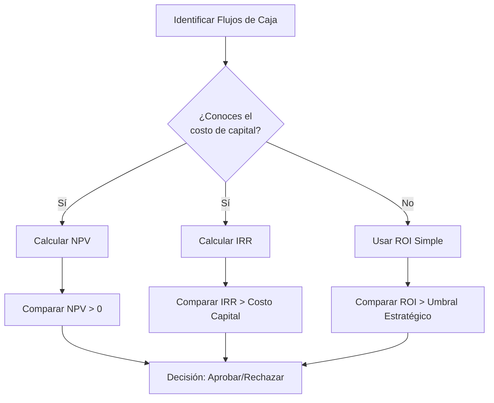

# 💰 ROI de Proyectos de ML

## Introducción

En el mundo de la inteligencia artificial, es frecuente encontrar equipos técnicos que desarrollan modelos con una precisión impresionante pero sin una comprensión clara del valor que generan para la organización. El Retorno sobre la Inversión (ROI) de un proyecto de [[Machine Learning]] no se mide únicamente en términos de exactitud o puntajes F1, sino en el impacto tangible sobre la línea de resultados del negocio.

Comprender cómo cuantificar el valor de ML permite a los ingenieros y científicos de datos justificar presupuestos, priorizar iniciativas y alinear su trabajo con los objetivos estratégicos de la empresa. En esta nota exploraremos las metodologías para calcular el ROI, los diferentes tipos de valor que un modelo puede generar y los plazos realistas para recuperar la inversión.

## 1. Cuantificando el Valor del ML

El valor generado por un sistema de Machine Learning puede clasificarse en tres categorías principales. Identificar cuál aplica a tu proyecto es el primer paso para un cálculo de ROI riguroso.

- **Ingresos Directos:** El modelo genera ventas o ingresos nuevos que no existirían sin él. Ejemplos: sistemas de recomendación que aumentan el ticket promedio, precios dinámicos que maximizan márgenes, o modelos de detección de leads que incrementan la conversión.
- **Ahorro de Costos:** El modelo reduce gastos operativos o evita pérdidas. Ejemplos: mantenimiento predictivo que previene fallas costosas, detección de fraude que disminuye chargebacks, o automatización de procesos que reduce horas-hombre.
- **Ganancias de Eficiencia:** El modelo optimiza procesos internos, permitiendo que los equipos se concentren en tareas de mayor valor. Ejemplos: clasificación automática de tickets de soporte, resumen automático de documentos, o asistentes de código para desarrolladores.

**Caso real: Netflix**
El sistema de recomendación de Netflix se estima que genera un valor de más de 1,000 millones de dólares anuales. Sin embargo, no se trata de ingresos directos, sino de la retención de suscriptores (ahorro de costos de adquisición) y la reducción del churn. Su equipo de ML comunica el ROI en términos de "porcentaje de contenido visto que proviene de recomendaciones" y su correlación con la retención mensual.

⚠️ **Advertencia:** No confundas "eficiencia" con "ahorro real". Un modelo que ahorra 10 horas semanales a un equipo no genera valor a menos que esas horas se reinviertan en actividades productivas o se reduzca personal. Si el equipo simplemente trabaja menos, el valor es cero para la empresa.

💡 **Tip: La Regla del Árbol de Frutas**
Piensa en el valor de ML como un huerto: los **ingresos directos** son las frutas que cosechas hoy, los **ahorros** son las frutas que dejas de perder por plagas, y la **eficiencia** es el tiempo que ahorras podando para plantar más árboles mañana. Si no plantas más árboles, el tiempo ahorrado no tiene valor.

## 2. Time-to-Value y Periodo de Recuperación

Una de las mayores diferencias entre proyectos de software tradicional y de ML es la incertidumbre en el time-to-value. Mientras una aplicación web puede generar valor desde su primer despliegue, un modelo de ML requiere datos, entrenamiento, validación y un período de adaptación.

- **Time-to-Value (TTV):** El tiempo que transcurre desde la aprobación del proyecto hasta la primera generación de valor medible.
- **Payback Period:** El tiempo necesario para que los beneficios acumulados igualen la inversión inicial.
- **J-Curve del ML:** Es común que los proyectos de ML muestren un retorno negativo al inicio debido a los altos costos de infraestructura y adquisición de datos, para luego escalar exponencialmente.

**Caso real: Amazon**
Los proyectos de fulfillment de Amazon (robótica + ML) tienen un payback period de 2-3 años. Sin embargo, el TTV se mide en meses: un robot en un centro de distribución comienza a generar valor medible en eficiencia de picking en aproximadamente 6 meses, aunque el ROI total solo se alcanza tras la amortización del hardware.

| Fase del Proyecto | Duración Típica | Inversión Acumulada | Valor Generado |
|-------------------|-----------------|---------------------|----------------|
| Descubrimiento    | 2-4 semanas     | Baja                | Nulo           |
| MVP/POC           | 2-3 meses       | Media               | Nulo/Negativo  |
| Producción V1     | 3-6 meses       | Alta                | Bajo           |
| Escalamiento      | 6-12 meses      | Muy Alta            | Creciente      |
| Madurez           | 12+ meses       | Estable             | Alto/Positivo  |

⚠️ **Advertencia:** No prometas ROI positivo antes de la fase de "Producción V1". Prometer retornos durante la POC es una receta para que el proyecto sea cancelado cuando los números no cuadren.

## 3. Metodologías de Cálculo de ROI

Existen diferentes métodos para calcular el retorno de una inversión en ML, cada uno con sus fortalezas y debilidades.



| Método | Fórmula | Ventajas | Desventajas |
|--------|---------|----------|-------------|
| **ROI Simple** | `(Ganancias - Costos) / Costos × 100%` | Fácil de entender y comunicar | Ignora el valor del tiempo |
| **NPV (Valor Presente Neto)** | `Σ(Bt - Ct) / (1 + r)^t` | Considera valor temporal del dinero | Requiere estimar tasa de descuento |
| **IRR (Tasa Interna de Retorno)** | Tasa que hace NPV = 0 | Útil para comparar proyectos | Puede tener múltiples soluciones |

**Fórmula clave:**

$$ROI = \frac{Ganancias_{ML} - Costos_{ML}}{Costos_{ML}} \times 100\%$$

**Caso real: Uber**
Uber utiliza NPV para evaluar sus proyectos de ML en el marketplace (matching de conductores y pasajeros). Dado que el flujo de caja es continuo y masivo, una mejora del 1% en la eficiencia de matching se traduce en millones de dólares anuales. Utilizan una tasa de descuento del 10-12% para proyectos de tecnología.

## 4. Implementando el Cálculo de ROI en Python

```python
import numpy as np
import pandas as pd

class ML_ROI_Calculator:
    def __init__(self, costos_iniciales, costos_operativos_mensuales,
                 ganancias_mensuales, tasa_descuento_anual=0.10, meses=24):
        self.costos_iniciales = costos_iniciales
        self.costos_op = costos_operativos_mensuales
        self.ganancias = ganancias_mensuales
        self.r = tasa_descuento_anual / 12
        self.meses = meses

    def roi_simple(self):
        total_costos = self.costos_iniciales + (self.costos_op * self.meses)
        total_ganancias = self.ganancias * self.meses
        return (total_ganancias - total_costos) / total_costos * 100

    def npv(self):
        flujos = []
        for t in range(1, self.meses + 1):
            flujo = self.ganancias - self.costos_op
            flujos.append(flujo / (1 + self.r) ** t)
        return -self.costos_iniciales + sum(flujos)

    def payback_period(self):
        acumulado = -self.costos_iniciales
        for mes in range(1, self.meses + 1):
            acumulado += (self.ganancias - self.costos_op)
            if acumulado >= 0:
                return mes
        return None

    def resumen(self):
        return {
            'ROI Simple (%)': round(self.roi_simple(), 2),
            'NPV ($)': round(self.npv(), 2),
            'Payback Period (meses)': self.payback_period()
        }

# Ejemplo: Sistema de recomendación para e-commerce
calculadora = ML_ROI_Calculator(
    costos_iniciales=150000,      # Desarrollo, datos, infra inicial
    costos_operativos_mensuales=8000,
    ganancias_mensuales=25000,    # Aumento en conversión estimado
    tasa_descuento_anual=0.10,
    meses=24
)

print(calculadora.resumen())
```

## 5. Errores Comunes y Buenas Prácticas

- No incluir el costo del equipo de ML en el cálculo (solo se cuentan servidores).
- Ignorar la degradación del modelo: un modelo que genera $X hoy puede generar $X/2 en 12 meses si no se reentrena.
- Comparar ROI de ML con ROI de software tradicional sin ajustar por riesgo.
- No realizar análisis de sensibilidad: ¿qué pasa si las ganancias son un 20% menores?

💡 **Tip:** Siempre presenta al menos tres escenarios (optimista, esperado, pesimista) cuando comuniques el ROI a la dirección.

---

## 📦 Código de Compresión

```python
"""
Script: ml_roi_quick_calculator.py
Calcula ROI, NPV y Payback Period para cualquier proyecto de ML.
"""

def calcular_roi_ml(costos_iniciales, ganancias_mensuales, costos_mensuales, meses=12, tasa_anual=0.10):
    r = tasa_anual / 12
    costos_totales = costos_iniciales + costos_mensuales * meses
    ganancias_totales = ganancias_mensuales * meses
    roi_simple = (ganancias_totales - costos_totales) / costos_totales

    npv = -costos_iniciales
    acumulado = -costos_iniciales
    payback = None

    for t in range(1, meses + 1):
        flujo = ganancias_mensuales - costos_mensuales
        npv += flujo / ((1 + r) ** t)
        acumulado += flujo
        if acumulado >= 0 and payback is None:
            payback = t

    return {
        'roi_percent': round(roi_simple * 100, 2),
        'npv': round(npv, 2),
        'payback_months': payback
    }

# Uso rápido
if __name__ == "__main__":
    resultado = calcular_roi_ml(
        costos_iniciales=100000,
        ganancias_mensuales=20000,
        costos_mensuales=5000,
        meses=18
    )
    print(resultado)
```

## 🎯 Proyecto Documentado

### Descripción

Diseñar un framework de evaluación financiera para proyectos de Machine Learning que permita a un equipo de Data Science estimar el ROI antes de iniciar el desarrollo, durante la fase de POC y tras el despliegue a producción.

### Requisitos Funcionales

1. Debe soportar tres metodologías de cálculo: ROI Simple, NPV e IRR.
2. Debe permitir la comparación lado a lado de múltiples proyectos de ML.
3. Debe incluir un módulo de análisis de sensibilidad que varíe ganancias y costos en un rango de ±30%.
4. Debe generar automáticamente un resumen ejecutivo en formato markdown para stakeholders.
5. Debe permitir el input de métricas de negocio (conversion rate, churn, etc.) y traducirlas a proyecciones financieras.

### Componentes Principales

- `roi_engine.py`: Motor de cálculo financiero con soporte para flujos de caja descontados.
- `sensitivity_analyzer.py`: Generador de escenarios optimista, esperado y pesimista.
- `business_translator.py`: Traduce métricas de producto a proyecciones de ingresos.
- `report_generator.py`: Crea informes ejecutivos en markdown con gráficos.

### Métricas de Éxito

- Precisión de las proyecciones: el ROI real a 12 meses debe estar dentro del ±15% del estimado.
- Tiempo de evaluación: un nuevo proyecto debe poder evaluarse en menos de 30 minutos.
- Adopción: al menos el 80% de los proyectos de ML de la empresa deben pasar por el framework.

### Referencias

- Damodaran, A. (2012). *Investment Valuation: Tools and Techniques for Determining the Value of Any Asset*. Wiley Finance.
- HBR Article: "A Refresher on Internal Rate of Return" (https://hbr.org/2016/03/a-refresher-on-internal-rate-of-return)
- Scikit-learn: `sklearn.metrics` para conectar métricas técnicas con proyecciones de negocio.
