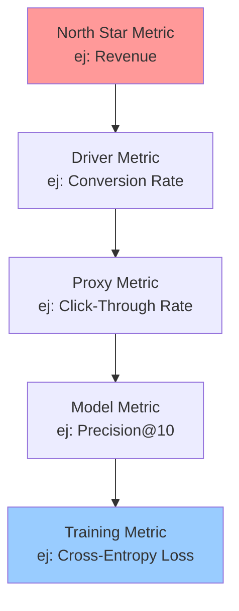
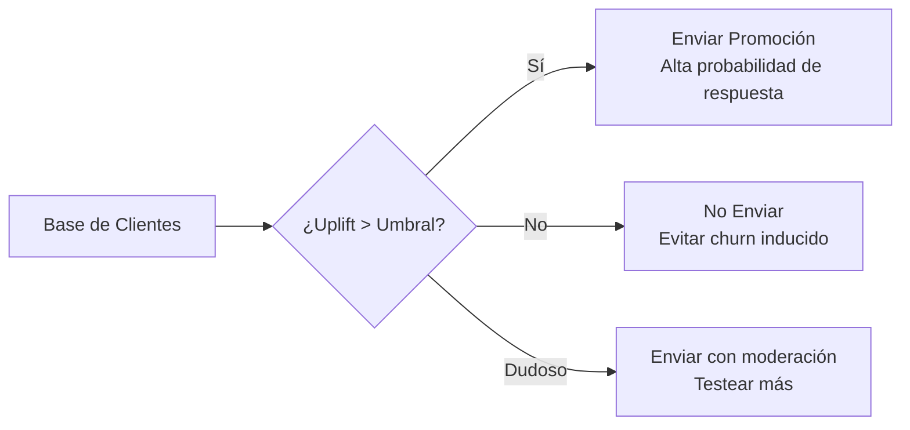

# 📈 Métricas de Negocio vs Métricas Técnicas

## Introducción

En la práctica del Machine Learning, existe una brecha frecuente y peligrosa entre lo que los científicos de datos optimizan y lo que la empresa realmente necesita. Un modelo con un AUC de 0.95 puede ser inútil si no reduce el churn, y un modelo con un F1-score modesto puede generar millones si identifica correctamente los leads de alto valor. La clave está en entender que las métricas técnicas son medios, no fines.

Esta nota explora cómo alinear las métricas de modelado con los objetivos estratégicos del negocio, introduce el concepto de estimación contrafactual para medir el impacto causal real de un modelo, y presenta las bases del [[Uplift Modeling]] como herramienta para maximizar el retorno de las intervenciones de ML.

## 1. North Star Metrics vs Métricas Técnicas

Las organizaciones exitosas definen una "North Star Metric" que captura el valor central que entregan a sus clientes. Todo modelo de ML debería contribuir directa o indirectamente a mover esa métrica.

- **North Star Metric:** Una métrica de negocio que refleja el éxito del producto (ej: "Weekly Active Users", "Revenue per User", "Customer Lifetime Value").
- **Driver Metrics:** Métricas de producto que influyen en la North Star (ej: "tasa de conversión del checkout", "tiempo de entrega").
- **Métricas Técnicas:** Métricas del modelo que deberían correlacionar con los drivers (ej: AUC-ROC, Precision@K, Latencia P99).

**Caso real: Spotify**
La North Star de Spotify es "Tiempo de Escucha". Sus modelos de recomendación no se evalúan principalmente por AUC, sino por "stream completion rate" y "descubrimiento de artistas nuevo". Un modelo con menor AUC que aumente el tiempo de escucha se prefiere sobre uno con AUC perfecto pero que no enganche al usuario.

⚠️ **Advertencia:** Optimizar únicamente métricas técnicas lleva al "Optimization Myopia". Un modelo de detección de fraude con 99.9% de precisión puede ser inútil si su recall es del 10% y deja pasar el 90% del fraude real. Siempre pregunta: "¿Qué pasa en el negocio cuando este modelo acierta o falla?"

💡 **Tip: La Cadena de Métricas**
Cada vez que presentes una métrica técnica, vincúlala visualmente a la cadena de valor:
`AUC-ROC ↑` → `Mejor segmentación de leads` → `Más conversiones` → `Revenue ↑`
Si no puedes dibujar esta cadena, tu métrica técnica probablemente no importa.

## 2. Comparando Métricas de Negocio y Técnicas

Es fundamental establecer un lenguaje común entre ingenieros y stakeholders. La siguiente tabla permite traducir rápidamente entre ambos mundos.

| Métrica de Negocio | Métrica Técnica Equivalente | Contexto de Uso | Qué Mide Realmente |
|--------------------|------------------------------|-----------------|--------------------|
| **Tasa de Conversión** | Precision@K, AUC-PR | Recomendaciones, Marketing | De todas las recomendaciones, cuántas resultaron en acción |
| **Churn Reducido** | Recall, AUC-ROC | Retención de clientes | Capacidad de identificar a los clientes que se irán |
| **Costo por Atención** | Latencia P99, Throughput | Chatbots, Routing | Tiempo y recursos necesarios para servir al cliente |
| **Ingreso por Usuario** | NDCG, MAP | Búsqueda, Personalización | Calidad del ranking de items presentados |
| **Tasa de Error Operativo** | Accuracy, F1-Score | Clasificación de documentos, QA | Confiabilidad del modelo para automatizar tareas |
| **Satisfacción del Cliente (CSAT)** | Calibration, Brier Score | Predicciones probabilísticas | Qué tan confiables son las probabilidades que ve el usuario |

**Caso real: LinkedIn**
LinkedIn utiliza "social selling index" y "acceptance rate de invitaciones" como métricas de negocio para sus modelos de "People You May Know". Aunque internamente monitorean AUC y recall, el OKR del equipo está atado a la tasa de aceptación de conexiones. Un modelo que prediga mejor pero genere conexiones irrelevantes (menor aceptación) es considerado un fracaso.



## 3. Estimación Contrafactual y Uplift Modeling

El problema fundamental de medir el impacto de ML es que no puedes observar ambos mundos simultáneamente: uno con el modelo y otro sin él. La estimación contrafactual resuelve esto mediante experimentación o modelado causal.

- **Estimación Contrafactual:** ¿Qué hubiera pasado si no hubiéramos desplegado el modelo?
- **A/B Testing:** La forma más robusta de estimar el impacto causal. El grupo de control no recibe la predicción del modelo.
- **Uplift Modeling:** En lugar de predecir `P(Y|X)`, predice `P(Y|X, T=1) - P(Y|X, T=0)`, es decir, el efecto causal del tratamiento.

**Fórmula clave:**

$$Uplift = E[Y | T=1] - E[Y | T=0]$$

Donde:
- `Y` es el outcome de negocio (ej: compra, churn, click)
- `T=1` es el grupo tratado (recibe la intervención basada en ML)
- `T=0` es el grupo de control



**Caso real: Uber Eats**
Uber Eats utiliza uplift modeling para decidir a qué usuarios enviar cupones de descuento. Enviar un cupón a un usuario que ya iba a comprar ("sure thing") es un costo innecesario. Enviarlo a un usuario que solo compra con descuentos ("sleeping dog" en términos de marketing) genera dependencia. Solo quieren enviar cupones a los "persuadibles": usuarios que comprarán *porque* recibieron el cupón. Esto aumentó el ROI de su campaña de marketing en un 30%.


## 4. Implementando Uplift Modeling en Python

```python
from sklearn.base import BaseEstimator, ClassifierMixin
from sklearn.ensemble import RandomForestClassifier
import numpy as np

class TwoModelUplift(BaseEstimator, ClassifierMixin):
    """
    Implementación simple del enfoque de Two-Models para Uplift.
    Entrena un modelo para el grupo de tratamiento y otro para control.
    """
    def __init__(self, base_estimator=None):
        self.model_treatment = base_estimator or RandomForestClassifier()
        self.model_control = base_estimator or RandomForestClassifier()

    def fit(self, X, treatment, y):
        # treatment: 1 si recibió tratamiento, 0 si es control
        # y: 1 si tuvo outcome positivo, 0 si no
        self.model_treatment.fit(X[treatment == 1], y[treatment == 1])
        self.model_control.fit(X[treatment == 0], y[treatment == 0])
        return self

    def predict_uplift(self, X):
        # P(Y=1 | T=1, X) - P(Y=1 | T=0, X)
        prob_treatment = self.model_treatment.predict_proba(X)[:, 1]
        prob_control = self.model_control.predict_proba(X)[:, 1]
        return prob_treatment - prob_control

    def predict(self, X, threshold=0.0):
        # Solo tratar si el uplift es positivo y significativo
        return (self.predict_uplift(X) > threshold).astype(int)

# Ejemplo de uso
# X: features de clientes
# treatment: array binario (1=recibió campaña, 0=control)
# y: array binario (1=compró, 0=no compró)
# uplift_model = TwoModelUplift()
# uplift_model.fit(X_train, treatment_train, y_train)
# uplift_scores = uplift_model.predict_uplift(X_test)
```

## 5. Construyendo un Dashboard de Métricas Unificado

La clave para alinear equipos es mostrar métricas técnicas y de negocio en el mismo contexto.

- Utiliza paneles de control donde cada gráfico técnico tenga su contraparte de negocio.
- Establece alertas sobre métricas de negocio, no solo sobre drift técnico.
- Programa revisiones mensuales donde el equipo de ML presente primero el impacto en la North Star y luego las mejoras técnicas.

💡 **Tip:** Si tu única alerta es "el AUC bajó un 5%", estás monitorizando el síntoma. Si tu alerta es "la tasa de conversión del checkout bajó un 2%", estás monitorizando la enfermedad.

---

## 📦 Código de Compresión

```python
"""
Script: metrics_translator.py
Traduce métricas técnicas a estimaciones de impacto de negocio.
"""

def estimar_impacto_negocio(auc_roc, precision_at_k, baseline_conversion,
                            traffic_diario, valor_conversion):
    """
    Estima el impacto de un modelo basado en sus métricas técnicas.

    Args:
        auc_roc: Área bajo la curva ROC del modelo
        precision_at_k: Precisión en el top K de recomendaciones
        baseline_conversion: Tasa de conversión sin modelo (0-1)
        traffic_diario: Número de usuarios/impresiones por día
        valor_conversion: Valor promedio de una conversión en $
    """
    # Heurística: una mejora del 0.01 en AUC ≈ mejora del 2% en conversion relativa
    mejora_auc = (auc_roc - 0.5) / 0.5  # normalizado respecto a random
    mejora_conversion = baseline_conversion * (1 + mejora_auc * 0.02)

    conversiones_con_ml = traffic_diario * mejora_conversion
    conversiones_sin_ml = traffic_diario * baseline_conversion
    conversiones_adicionales = conversiones_con_ml - conversiones_sin_ml

    valor_diario = conversiones_adicionales * valor_conversion
    valor_anual = valor_diario * 365

    return {
        'conversiones_diarias_adicionales': round(conversiones_adicionales, 2),
        'valor_diario_adicional_$': round(valor_diario, 2),
        'valor_anual_estimado_$': round(valor_anual, 2),
        'precision_at_k_reportada': precision_at_k
    }

# Ejemplo: Modelo de recomendación para e-commerce
impacto = estimar_impacto_negocio(
    auc_roc=0.78,
    precision_at_k=0.12,
    baseline_conversion=0.03,
    traffic_diario=50000,
    valor_conversion=45.00
)
print(impacto)
```

## 🎯 Proyecto Documentado

### Descripción

Construir un sistema de evaluación de modelos que automaticamente conecte las métricas técnicas de un modelo en producción con su impacto en las métricas de negocio, permitiendo a cualquier stakeholder entender el valor real generado sin necesidad de interpretar AUC o F1-score.

### Requisitos Funcionales

1. Debe recibir métricas técnicas (AUC, Precision, Recall, Latencia) como input.
2. Debe traducir esas métricas a estimaciones de impacto de negocio usando un modelo de heurísticas calibrado.
3. Debe ejecutar experimentos A/B automáticos para validar las estimaciones contrafactuales.
4. Debe generar alertas cuando una métrica técnica se degrade pero la de negocio no, o viceversa (indicador de desalineación).
5. Debe exportar un informe semanal automático en markdown con visualizaciones de ambos tipos de métricas.

### Componentes Principales

- `metrics_bridge.py`: Motor de traducción entre métricas técnicas y de negocio.
- `ab_test_orchestrator.py`: Gestiona la asignación de usuarios a grupos de control y tratamiento.
- `causal_impact_estimator.py`: Utiliza métodos bayesianos para estimar el impacto cuando no hay A/B test puro.
- `alignment_monitor.py`: Detecta desviaciones entre el desempeño técnico y el de negocio.

### Métricas de Éxito

- Correlación Spearman > 0.8 entre la métrica técnica principal y la métrica de negocio objetivo.
- Tiempo de detección de desalineación < 24 horas.
- 100% de los modelos en producción deben tener al menos una métrica de negocio asociada visible en el dashboard.

### Referencias

- Gutierrez, P., & Gérardy, J. Y. (2017). "Causal Inference and Uplift Modelling: A Review of the Literature." *Proceedings of ICMLA*.
- Google Causal Impact (https://github.com/google/CausalImpact) para inferencia causal en series temporales.
- Uber's Synthetic Control Method para estimación contrafactual en mercados geográficos.
