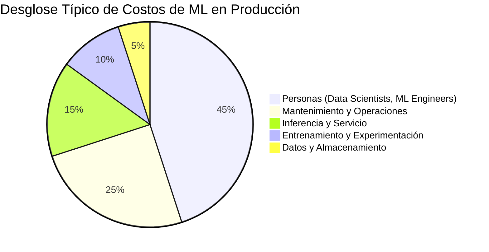
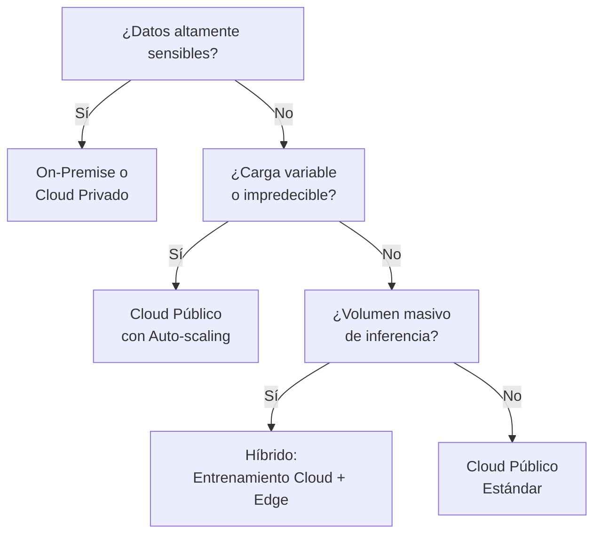

# 💸 Costos y Presupuesto de ML

## Introducción

Los proyectos de Machine Learning a menudo comienzan con un presupuesto optimista que solo considera los costos de computación para entrenar un modelo. Sin embargo, la realidad de mantener un sistema de ML en producción revela una estructura de costos mucho más compleja y, frecuentemente, subestimada. Desde la adquisición y limpieza de datos hasta la monitorización continua y el cumplimiento normativo, los gastos se acumulan rápidamente.

Entender el Costo Total de Propiedad ([[TCO]]) es esencial para la viabilidad financiera de cualquier iniciativa de IA. En esta nota desglosaremos los componentes del TCO, exploraremos estrategias de optimización en la nube y daremos visibilidad a los costos ocultos que pueden convertir un proyecto rentable en un agujero negro presupuestario.

## 1. Desglosando el TCO de Sistemas de ML

El TCO de un sistema de Machine Learning no es solo la suma de las facturas de AWS o GCP. Se compone de cuatro pilares fundamentales que deben estimarse desde la fase de planificación.

- **Costos de Datos (`C_data`):** Adquisición, almacenamiento, limpieza, etiquetado, y gobernanza de datos. Incluye licencias de datasets de terceros y el trabajo de ingenieros de datos.
- **Costos de Cómputo (`C_compute`):** Entrenamiento, experimentación, inferencia, y almacenamiento de artefactos. Altamente variable según la escala y la arquitectura del modelo.
- **Costos de Personas (`C_personas`):** Salarios de científicos de datos, ingenieros de ML, ingenieros de datos, y gestores de producto. Suele ser el componente más grande.
- **Costos de Mantenimiento (`C_mantenimiento`):** Retraining, monitorización, debugging, deuda técnica, y actualizaciones de infraestructura.

**Fórmula clave:**

$$C_{total} = C_{data} + C_{compute} + C_{personas} + C_{mantenimiento}$$

**Caso real: OpenAI**
El entrenamiento de GPT-4 se estima que costó más de 100 millones de dólares solo en computación. Sin embargo, el costo de los investigadores, ingenieros de infraestructura, y el proceso iterativo de entrenamiento fallido (múltiples runs que no llegaron a producción) probablemente duplicó o triplicó esa cifra. El TCO real incluye años de I+D previos.

⚠️ **Advertencia:** La regla de oro del TCO en ML es que el costo de entrenamiento es solo la "punta del iceberg". Para sistemas en producción, la inferencia y el mantenimiento a menudo superan el costo del entrenamiento inicial en un factor de 5x a 10x durante la vida útil del modelo.

💡 **Tip: El Principio 50/30/20**
En la mayoría de los proyectos de ML empresariales maduros, la distribución del TCO anual tiende a:
- **50%** Personas (equipo multidisciplinario)
- **30%** Mantenimiento y operaciones
- **20%** Datos y computación
Si tus costos de computación son el ítem más grande, probablemente estás subdimensionando el equipo o ignorando la deuda técnica.

## 2. Estrategias de Optimización de Costos en la Nube

La infraestructura en la nube ofrece flexibilidad, pero también riesgo de costos incontrolados si no se gestiona activamente. Existen estrategias específicas para las fases de entrenamiento e inferencia.

| Estrategia | Fase | Descripción | Ahorro Estimado |
|------------|------|-------------|-----------------|
| **Spot/Preemptible Instances** | Entrenamiento | Usar instancias interrumpibles para workloads tolerantes a fallos | 60-90% |
| **Auto-scaling de Inferencia** | Inferencia | Escalar pods/nodos según la carga real en lugar de capacidad fija | 30-50% |
| **Model Quantization** | Inferencia | Reducir precisión de FP32 a INT8/FP16 | 2-4x velocidad, menos costo |
| **Model Distillation** | Ambas | Entrenar un modelo pequeño que imite al grande | 10x reducción en inferencia |
| **Caching de Predicciones** | Inferencia | Almacenar predicciones frecuentes para evitar re-computo | 20-40% |
| **Pipeline Scheduling** | Entrenamiento | Entrenar en horarios de baja demanda | 20-30% |

**Caso real: Spotify**
Spotify utiliza Google Cloud Preemptible VMs para el 70% de sus workloads de entrenamiento de modelos de recomendación. Dado que entrenan modelos con checkpointing frecuente, la interrupción ocasional de una instancia no afecta el resultado final. Esta estrategia les permite entrenar modelos más grandes con el mismo presupuesto, o reducir costos en un 70% manteniendo la misma escala.



## 3. Costos Ocultos y Deuda Técnica

Los costos que no aparecen en la planificación inicial son los más peligrosos. La deuda técnica en ML es particularmente insidiosa porque se acumula en lugares invisibles.

- **Retraining Costs:** Los modelos se degradan. El reentrenamiento periódico consume computación, datos frescos, y tiempo de ingenieros.
- **Monitoring & Observability:** Los sistemas de ML requieren monitorización de datos (data drift), modelos (concept drift), y predicciones (outlier detection).
- **Compliance & Governance:** GDPR, CCPA, y regulaciones sectoriales (HIPAA, SOC2) implican costos de auditoría, anonimización, y gestión de consentimientos.
- **Pipeline Entropy:** Con el tiempo, las dependencias de un pipeline de ML se vuelven frágiles. Actualizar una librería puede romper todo el flujo.
- **Shadow IT de ML:** Equipos que entrenan modelos en sus laptops y luego no pueden escalarlos, desperdiciando el trabajo inicial.

**Caso real: Zillow**
El famoso caso de Zillow Offers, donde su modelo de "iBuying" sobreestimó los precios de viviendas, costó a la empresa más de 500 millones de dólares en pérdidas. No fue un problema de costos de computación, sino de un ciclo de reentrenamiento inadecuado y una monitorización de negocio que no detectó a tiempo la degradación del modelo en un mercado cambiante. El mantenimiento del modelo falló, no el modelo en sí.


## 4. Comparando Modelos de Infraestructura

La elección entre on-premise, nube pública o híbrida tiene implicaciones profundas en el TCO de ML.

| Característica | On-Premise | Cloud Público | Híbrido |
|----------------|------------|---------------|---------|
| **Capex Inicial** | Muy Alto (GPUs, servidores) | Bajo (pay-as-you-go) | Medio |
| **Escalabilidad** | Lenta y costosa | Inmediata | Flexible |
| **Costos de Entrenamiento** | Bajo (marginal) | Alto (instancias GPU) | Optimizado |
| **Costos de Inferencia** | Medio | Medio/Variable | Bajo (edge) |
| **Mantenimiento de HW** | Responsabilidad propia | Gestión del proveedor | Mixto |
| **Seguridad/Compliance** | Control total | Depende del proveedor | Control parcial |
| **Mejor para** | Datos sensibles, carga estable | Experimentación, escala variable | Producción a gran escala |



## 5. Presupuestando un Proyecto de ML

Un presupuesto realista debe ser un documento vivo, no una línea única aprobada al inicio.

1. **Fase 1 - Estimación Inicial:** Basada en proyectos similares o benchmarks de la industria.
2. **Fase 2 - POC:** Tras la prueba de concepto, ajustar basado en datos reales de costos.
3. **Fase 3 - Producción:** Incluir un buffer del 20-30% para imprevistos y deuda técnica.
4. **Revisión Trimestral:** Comparar costos estimados vs reales y ajustar proyecciones.

💡 **Tip: La Reserva de Guerra del ML**
Siempre incluye una línea de "Contingencia" del 25% en tu presupuesto de ML. No es por pesimismo, es por realismo. Los modelos fallan, los datos se corrompen, y las regulaciones cambian. Si no usas la reserva, genial. Si la necesitas, salvaste el proyecto.

---

## 📦 Código de Compresión

```python
"""
Script: ml_cost_estimator.py
Estima el TCO de un proyecto de ML basado en parámetros de infraestructura y equipo.
"""

def estimar_tco_ml(meses_proyecto,
                   num_data_scientists, salario_ds_anual,
                   num_ml_engineers, salario_mle_anual,
                   horas_entrenamiento_mes, costo_hora_gpu,
                   requests_diarios_inferencia, costo_por_1000_requests,
                   tamano_datos_tb, costo_almacenamiento_tb_mes,
                   pct_mantenimiento=0.25):
    """
    Estima el TCO total de un proyecto de ML.
    """
    # Costos de personas
    costo_ds = num_data_scientists * (salario_ds_anual / 12) * meses_proyecto
    costo_mle = num_ml_engineers * (salario_mle_anual / 12) * meses_proyecto
    costos_personas = costo_ds + costo_mle

    # Costos de computación
    costos_entrenamiento = horas_entrenamiento_mes * costo_hora_gpu * meses_proyecto
    costos_inferencia = (requests_diarios_inferencia / 1000) * costo_por_1000_requests * 30 * meses_proyecto
    costos_almacenamiento = tamano_datos_tb * costo_almacenamiento_tb_mes * meses_proyecto
    costos_datos_compute = costos_entrenamiento + costos_inferencia + costos_almacenamiento

    # Subtotal
    subtotal = costos_personas + costos_datos_compute

    # Mantenimiento (retraining, monitoreo, deuda técnica)
    costos_mantenimiento = subtotal * pct_mantenimiento

    tco_total = subtotal + costos_mantenimiento

    return {
        'costos_personas': round(costos_personas, 2),
        'costos_datos_compute': round(costos_datos_compute, 2),
        'costos_mantenimiento': round(costos_mantenimiento, 2),
        'tco_total': round(tco_total, 2),
        'desglose_porcentual': {
            'personas': round(costos_personas / tco_total * 100, 1),
            'datos_compute': round(costos_datos_compute / tco_total * 100, 1),
            'mantenimiento': round(costos_mantenimiento / tco_total * 100, 1)
        }
    }

# Ejemplo: Proyecto de NLP para atención al cliente
tco = estimar_tco_ml(
    meses_proyecto=12,
    num_data_scientists=2, salario_ds_anual=120000,
    num_ml_engineers=1, salario_mle_anual=130000,
    horas_entrenamiento_mes=50, costo_hora_gpu=2.5,
    requests_diarios_inferencia=50000, costo_por_1000_requests=0.02,
    tamano_datos_tb=5, costo_almacenamiento_tb_mes=25
)
print(tco)
```

## 🎯 Proyecto Documentado

### Descripción

Desarrollar un "Cloud Cost Guard" para proyectos de Machine Learning: un sistema que monitorea en tiempo real los costos de entrenamiento e inferencia, detecta anomalías de gasto, sugiere optimizaciones automáticas (como cambio a instancias spot o reducción de batch size), y genera proyecciones de TCO actualizadas semanalmente.

### Requisitos Funcionales

1. Debe integrarse con APIs de AWS, GCP y Azure para extraer costos por servicio y proyecto.
2. Debe etiquetar automáticamente recursos (instancias, buckets, endpoints) según el proyecto de ML al que pertenecen.
3. Debe detectar anomalías de gasto usando un modelo de series temporales (ej: Isolation Forest o Prophet).
4. Debe sugerir optimizaciones específicas basadas en el patrón de uso (ej: "Tu entrenamiento ocurre de 2-4 AM, considera spot instances").
5. Debe generar alertas proactivas cuando un proyecto supere el 80% de su presupuesto mensual estimado.

### Componentes Principales

- `cost_collector.py`: Recolector multi-nube de métricas de costo y uso.
- `anomaly_detector.py`: Modelo de detección de anomalías en series de gasto.
- `optimizer_engine.py`: Motor de recomendaciones de optimización.
- `budget_alerter.py`: Sistema de alertas de presupuesto con umbrales configurables.
- `tco_projector.py`: Proyector de costos totales basado en tendencias actuales.

### Métricas de Éxito

- Reducción del 20% en costos de computación de ML tras 3 meses de uso.
- Detección de anomalías de gasto con < 4 horas de latencia.
- Precisión de proyecciones de TCO: ±10% a 3 meses de horizonte.

### Referencias

- Huyen, C. (2022). *Designing Machine Learning Systems*. O'Reilly Media. Capítulo 7: "Compute and Infrastructure".
- AWS Cost Explorer y AWS Budgets APIs para integración de costos.
- Kubeflow Cost Optimization: Guías de uso de spot instances y pipelines eficientes.
