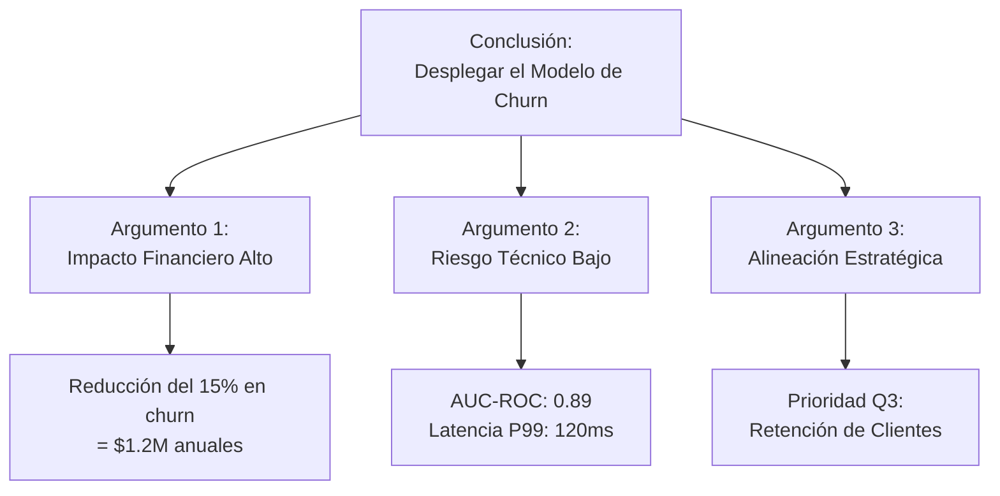

# 🗣️ Comunicación con Stakeholders

## Introducción

Un modelo de Machine Learning perfectamente diseñado genera cero valor si los resultados no se comunican efectivamente a quienes toman decisiones. La habilidad de traducir hallazgos técnicos complejos en narrativas claras y accionables es, con frecuencia, el factor determinante entre un proyecto que prospera y uno que es archivado.

En esta nota exploraremos técnicas probadas para presentar resultados de ML a diferentes audiencias, la aplicación del "Principio de Pirámide" en la estructuración de presentaciones, y estrategias para gestionar las expectativas en un campo rodeado de hype mediático. La comunicación es, en sí misma, una métrica de éxito de cualquier iniciativa de IA.

## 1. Traduciendo Resultados Técnicos a Lenguaje de Negocio

El error más común en la comunicación de ML es comenzar con el "cómo" (arquitectura del modelo, hiperparámetros) en lugar del "qué" (impacto en el negocio). La traducción efectiva requiere un cambio de mentalidad: tu audiencia no se preocupa por el algoritmo, se preocupa por el resultado.

- **Evita jargon innecesario:** No digas "optimizamos el learning rate con AdamW"; di "ajustamos el modelo para aprender más rápido y con menos errores".
- **Usa analogías:** Un modelo de clasificación es como un filtro de correo spam. Un sistema de recomendación es como un buen vendedor que conoce tus gustos.
- **Conecta cada número con una consecuencia:** No digas "el AUC mejoró un 5%"; di "esto significa que detectaremos 200 fraudes adicionales por mes, ahorrando $50,000".
- **Visualiza antes de verbalizar:** Un gráfico de impacto financiero es más poderoso que 10 diapositivas de curvas ROC.

**Caso real: Microsoft**
Cuando el equipo de ML de Microsoft presentaba mejoras en su motor de búsqueda Bing, no mostraban tablas de NDCG. En su lugar, presentaban "sessions saved" (sesiones de usuario ahorradas) y "tasks completed" (tareas completadas). Cada mejora en una métrica de ranking se traducía a "el usuario encontró su respuesta 0.3 segundos más rápido", lo que escalaba a millones de horas de usuario ahorradas anualmente.

⚠️ **Advertencia:** No mientas por simplificar. Decir "el modelo es 100% preciso" cuando tienes 95% de precisión destruye tu credibilidad cuando el modelo falla. Es mejor decir "el modelo acierta 19 de cada 20 veces, lo cual nos permite automatizar el 80% de los casos y revisar manualmente el 20% restante".

💡 **Tip: La Regla del Elevador**
Debes poder explicar el valor de tu proyecto de ML en 30 segundos (el tiempo de un viaje en ascensor) sin mencionar una sola métrica técnica. Práctica: "Nuestro sistema reduce en un 40% el tiempo que los abogados pasan revisando contratos, permitiéndoles atender un 60% más de clientes".

## 2. El Principio de Pirámide para Presentaciones de ML

El "Pyramid Principle" de Barbara Minto es una herramienta excepcional para estructurar comunicaciones de negocio, y se adapta perfectamente a las presentaciones de ML.

1. **Conclusión primero:** Comienza con la recomendación o resultado principal. "Deberíamos desplegar el modelo X porque generará $2M adicionales anuales".
2. **Argumentos clave:** Presenta 3-4 razones que soporten tu conclusión. Cada razón debe ser mutuamente excluyente y colectivamente exhaustiva (MECE).
3. **Datos y evidencia:** Bajo cada argumento, presenta los datos técnicos que lo respaldan. Esta es la única parte donde entran las curvas ROC y las matrices de confusión.



**Caso real: McKinsey & AI Implementations**
Las firmas de consultoría utilizan el Principio de Pirámide para todos sus informes de IA. Un estudio de implementación de ML nunca comienza con "entrenamos un Random Forest"; comienza con "identificamos una oportunidad de $50M en optimización de cadena de suministro, validada por un modelo predictivo". Los detalles técnicos van en anexos para los equipos de ingeniería.

| Elemento de la Pirámide | ¿Qué incluir para Ejecutivos? | ¿Qué incluir para PMs? | ¿Qué incluir para Ingenieros? |
|-------------------------|------------------------------|------------------------|-------------------------------|
| **Conclusión** | Decisión sí/no + impacto $ | Decisión + timeline + dependencias | Decisión + arquitectura objetivo |
| **Argumentos** | Riesgo, retorno, estrategia | Alcance, métricas de éxito, recursos | Stack técnico, deuda técnica, escalabilidad |
| **Evidencia** | Benchmarks de mercado, casos de éxito | Experimentos A/B, métricas de producto | Métricas de modelo, código, tests |

## 3. Gestión de Expectativas: Hype vs Realidad

El ciclo de hype de Gartner para IA crea presiones irrealistas. Es responsabilidad del equipo de ML educar a los stakeholders sobre lo que es posible, lo que es probable y lo que es pura fantasía.

- **La "Ley de Amara":** "Tendemos a sobrestimar el efecto de una tecnología en el corto plazo y subestimarlo en el largo plazo".
- **El "Valle de la Desilusión":** Muchos proyectos de ML son cancelados en la fase de POC porque se esperaba magia instantánea.
- **Técnica del "Under-promise, Over-deliver":** Establece expectativas conservadoras en torno a métricas de negocio, luego celebra cuando las superas.
- **Educación continua:** Dedica el 10% de tus presentaciones a explicar limitaciones fundamentales de ML (sesgos, necesidad de datos, degradación del modelo).

**Caso real: Tesla Autopilot**
Tesla enfrentó investigaciones regulatorias y demandas por comunicar su sistema "Full Self-Driving" de manera que sugería capacidades autónomas completas antes de que la tecnología estuviera lista. Esto generó expectativas imposibles de cumplir, dañando la reputación de la marca y creando riesgos legales. Por el contrario, Waymo (Google) comunicó de manera mucho más conservadora, logrando mayor credibilidad a largo plazo.

```mermaid
flowchart LR
    A[Hype Inicial<br/>"La IA lo hará todo"] --> B[POC<br/>"Funciona en el 70%"]
    B --> C{¿Expectativas<br/>gestionadas?}
    C -->|No| D[Valle de la Desilusión<br/>"Cancelar proyecto"]
    C -->|Sí| E[Meseta de Productividad<br/>"Iterar y escalar"]
    E --> F[Proyecto Exitoso<br/>"Valor real"]
    D --> G[Fracaso del Proyecto]
```

⚠️ **Advertencia:** Nunca prometas un porcentaje de mejora exacto antes de tener datos reales de producción. Decir "este modelo aumentará las ventas un 25%" sin evidencia es una apuesta que puedes perder. Mejor di: "basado en nuestros tests, estimamos un rango de mejora del 15-25%, y validaremos esto en las primeras 4 semanas de producción".


## 4. Adaptando el Mensaje a la Audiencia

No todos los stakeholders necesitan el mismo nivel de detalle. Adaptar tu mensaje es tan importante como el mensaje mismo.

```python
"""
Ejemplo conceptual: Clasificador de audiencias y niveles de detalle.
"""

class MLCommunicationDeck:
    def __init__(self, project_results):
        self.results = project_results

    def for_executives(self):
        return {
            'headline': f"ROI proyectado: {self.results['roi_percent']}%",
            'recommendation': self.results['recommendation'],
            'investment': f"${self.results['cost_total']:,}",
            'payback': f"{self.results['payback_months']} meses",
            'risk_level': self.results['risk_level'],
            'next_step': "Aprobar presupuesto para fase de producción"
        }

    def for_product_managers(self):
        return {
            'feature_impact': self.results['business_metrics'],
            'a_b_test_results': self.results['experiment_data'],
            'rollout_plan': self.results['deployment_phases'],
            'dependencies': self.results['blockers'],
            'success_criteria': self.results['kpis']
        }

    def for_engineers(self):
        return {
            'model_performance': self.results['technical_metrics'],
            'architecture': self.results['system_design'],
            'monitoring_plan': self.results['observability_setup'],
            'retraining_strategy': self.results['retraining_pipeline'],
            'debt_items': self.results['technical_debt']
        }

# Uso:
# deck = MLCommunicationDeck(project_results)
# exec_summary = deck.for_executives()
# pm_details = deck.for_product_managers()
```

## 5. Herramientas y Formatos de Comunicación

- **One-pagers:** Un documento de una página con la conclusión, los 3 argumentos clave y las métricas principales. Ideal para ejecutivos.
- **Dashboards vivos:** Para PMs y operadores, un dashboard con métricas de negocio y técnicas actualizadas diariamente.
- **Tech Specs:** Para ingenieros, un documento detallado con arquitectura, decisiones de diseño y plan de monitorización.
- **Demos interactivos:** Una interfaz donde el stakeholder puede introducir datos y ver la predicción del modelo. Muy poderoso para generar confianza.

💡 **Tip: La Regla de los 3 Números**
Cuando hables con no-técnicos, nunca presentes más de 3 números clave en una sola conversación. El cerebro humano retiene mejor la información en grupos de 3. Elige: un número de impacto financiero, un número de escala (usuarios/requests), y un número de riesgo o confianza.

---

## 📦 Código de Compresión

```python
"""
Script: stakeholder_communicator.py
Genera resúmenes de proyectos de ML adaptados a diferentes audiencias.
"""

def generar_resumen(results, audiencia='ejecutivo'):
    """
    Genera un resumen estructurado según el tipo de audiencia.
    """
    plantillas = {
        'ejecutivo': {
            'header': 'Resumen Ejecutivo',
            'puntos': [
                f"💰 Impacto financiero: ${results.get('ganancia_anual', 0):,} anuales",
                f"⏱️ Periodo de recuperación: {results.get('payback', 'N/A')} meses",
                f"🎯 Recomendación: {results.get('recommendation', 'Evaluar')}"
            ]
        },
        'pm': {
            'header': 'Resumen para Producto',
            'puntos': [
                f"📈 Métrica clave: {results.get('kpis', 'N/A')}",
                f"🧪 Estado del experimento: {results.get('experiment_status', 'N/A')}",
                f"🚀 Plan de rollout: {results.get('rollout', 'N/A')}"
            ]
        },
        'ingeniero': {
            'header': 'Resumen Técnico',
            'puntos': [
                f"🤖 Modelo: {results.get('model_name', 'N/A')} (AUC: {results.get('auc', 'N/A')})",
                f"⚙️ Infraestructura: {results.get('infra', 'N/A')}",
                f"📊 Monitorización: {results.get('monitoring', 'N/A')}"
            ]
        }
    }

    plantilla = plantillas.get(audiencia, plantillas['ejecutivo'])
    resumen = f"# {plantilla['header']}\n\n"
    for punto in plantilla['puntos']:
        resumen += f"- {punto}\n"
    return resumen

# Ejemplo de uso
resultados = {
    'ganancia_anual': 500000,
    'payback': 8,
    'recommendation': 'Aprobar despliegue inmediato',
    'kpis': 'Churn reducido en 12%',
    'model_name': 'XGBoost Churn v2',
    'auc': 0.91
}

print(generar_resumen(resultados, 'ejecutivo'))
print(generar_resumen(resultados, 'ingeniero'))
```

## 🎯 Proyecto Documentado

### Descripción

Crear una herramienta automatizada de generación de informes de ML que, a partir de los resultados técnicos de un experimento o modelo en producción, genere automáticamente tres documentos adaptados: un one-pager para ejecutivos, un informe detallado para product managers, y un tech spec para el equipo de ingeniería.

### Requisitos Funcionales

1. Debe recibir como input un archivo JSON con métricas técnicas, financieras y de producto.
2. Debe generar automáticamente un "Executive Summary" en markdown de máximo una página.
3. Debe generar un "Product Report" con análisis de experimentos A/B, plan de rollout y dependencias.
4. Debe generar un "Technical Specification" con detalles de arquitectura, métricas de modelo y deuda técnica.
5. Debe permitir la personalización de plantillas por empresa/departamento.

### Componentes Principales

- `input_parser.py`: Valida y parsea el JSON de entrada con los resultados del proyecto.
- `executive_summarizer.py`: Genera el one-pager usando el Principio de Pirámide.
- `product_reporter.py`: Crea el informe de producto con énfasis en métricas de negocio.
- `tech_spec_generator.py`: Genera el documento técnico con diagramas y especificaciones.
- `template_manager.py`: Sistema de plantillas personalizables por organización.

### Métricas de Éxito

- Reducción del 70% en el tiempo necesario para preparar presentaciones de proyectos de ML.
- Satisfacción de stakeholders > 4.0/5.0 en claridad y relevancia de los informes generados.
- 100% de los proyectos de ML deben tener al menos un informe generado automáticamente.

### Referencias

- Minto, B. (2009). *The Pyramid Principle: Logic in Writing and Thinking*. Financial Times Prentice Hall.
- Google ML Best Practices: "Communicating ML Results" (https://developers.google.com/machine-learning/guides/rules-of-ml)
- Streamlit (https://streamlit.io/) para la creación de demos interactivos de modelos.
