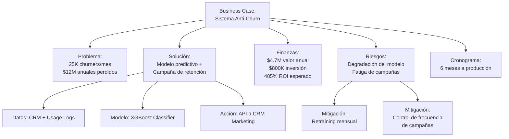

# 💼 Caso Práctico: Business Case para ML

## Introducción

El Business Case es el documento fundamental que determina si un proyecto de Machine Learning recibe financiamiento, recursos y apoyo organizacional. No es un mero formulario administrativo: es la narrativa que conecta una oportunidad de negocio con una solución técnica, sustentada por proyecciones financieras y un análisis riguroso de riesgos.

Construir un Business Case sólido requiere pensar como un ingeniero (¿es técnicamente viable?) y como un ejecutivo (¿genera valor superior a la alternativa de no hacer nada?). En esta nota, desarrollaremos un caso completo desde cero, aplicando todo lo aprendido en las notas previas sobre [[01 - ROI de Proyectos de ML|ROI]], [[02 - Métricas de Negocio vs Métricas Técnicas|métricas]], [[03 - Costos y Presupuesto de ML|costos]] y [[04 - Comunicación con Stakeholders|comunicación]].

## 1. Estructura de un Business Case para ML

Un Business Case efectivo sigue una estructura que responde secuencialmente las preguntas más importantes de quien toma decisiones.

- **Resumen Ejecutivo:** La respuesta completa en 3-4 párrafos. ¿Qué propones, por qué, cuánto cuesta y qué ganamos?
- **Definición del Problema:** La evidencia del dolor de negocio. Datos, testimonios, y el costo de la inacción.
- **Solución Propuesta:** Descripción de la solución de ML, por qué es la mejor alternativa, y qué la hace viable ahora.
- **Proyecciones Financieras:** ROI, NPV, payback period, y análisis de sensibilidad.
- **Análisis de Riesgos:** Riesgos técnicos, de negocio, y de implementación, con planes de mitigación.
- **Cronograma y Milestones:** Fases del proyecto, entregables, y puntos de decisión (go/no-go).

**Caso real: American Express**
Amex construyó su Business Case para su sistema de detección de fraude "Enhanced Authorization" en 2010. En lugar de enfocarse en "mejorar un modelo", el caso se centró en "reducir la pérdida anual por fraude en $200M y mejorar la experiencia del cliente al reducir falsos positivos en un 30%". El resultado financiero fue el driver, no la precisión del modelo.

⚠️ **Advertencia:** Un Business Case que no incluye un análisis de "no hacer nada" es incompleto. Siempre cuantifica el costo de mantener el status quo. Si el costo de la inacción es bajo, tal vez el proyecto no sea prioritario.

💡 **Tip: La Regla de la Primera Página**
Si un ejecutivo no entiende la propuesta de valor después de leer la primera página, tu Business Case falla. La primera página debe contener: el problema en una oración, la solución en una oración, el ROI en un número, y la inversión requerida en otro número.

## 2. Construyendo las Proyecciones Financieras

Las proyecciones financieras son el corazón del Business Case. Deben ser realistas, sustentadas en datos y presentadas con escenarios.

**Datos base para nuestro caso práctico:**
Imaginemos un proyecto de "Sistema de Predicción de Churn" para una empresa de telecomunicaciones con 1 millón de clientes.

| Concepto | Valor Base |
|----------|------------|
| Clientes totales | 1,000,000 |
| Tasa de churn mensual | 2.5% |
| Churners mensuales | 25,000 |
| Ingreso promedio por cliente (ARPU) | $40/mes |
| Costo de retención (oferta/cupón) | $15 por cliente |
| Costo de adquisición de nuevo cliente | $120 |

**Impacto estimado del modelo:**
- El modelo identifica el 80% de los churners con 3 meses de anticipación.
- La tasa de aceptación de la oferta de retención es del 40%.
- Clientes retenidos permanecen 12 meses adicionales en promedio.

**Cálculo de valor:**
- Churners identificados: 25,000 × 0.80 = 20,000
- Clientes retenidos: 20,000 × 0.40 = 8,000
- Valor de retención: 8,000 × ($40 × 12 - $15) = 8,000 × $465 = $3,720,000 anuales
- Costo evitado de adquisición: 8,000 × $120 = $960,000
- **Valor total anual generado: $4,680,000**

| Escenario | Probabilidad | Ganancia Anual | Inversión | ROI Simple |
|-----------|--------------|----------------|-----------|------------|
| **Pesimista** | 25% | $2,340,000 | $800,000 | 192.5% |
| **Esperado** | 50% | $4,680,000 | $800,000 | 485.0% |
| **Optimista** | 25% | $7,020,000 | $800,000 | 777.5% |

## 3. Diagrama de Estructura y Análisis de Sensibilidad

Visualizar la estructura del Business Case ayuda a identificar dependencias críticas.



El análisis de sensibilidad responde: ¿qué pasa si nuestras suposiciones están equivocadas?

```python
def analisis_sensibilidad(ganancia_base, inversion_base,
                        variaciones_ganancia=[-0.30, -0.15, 0, 0.15, 0.30],
                        variaciones_costo=[-0.10, 0, 0.10, 0.20, 0.30]):
    """
    Genera una matriz de sensibilidad para el ROI.
    """
    print(f"{'Variación Costo':<18}", end="")
    for vg in variaciones_ganancia:
        print(f"{vg*100:>+8.0f}%", end="")
    print()
    print("-" * 60)

    for vc in variaciones_costo:
        print(f"{vc*100:>+8.0f}%{'':<10}", end="")
        for vg in variaciones_ganancia:
            ganancia = ganancia_base * (1 + vg)
            inversion = inversion_base * (1 + vc)
            roi = (ganancia - inversion) / inversion * 100
            print(f"{roi:>8.0f}%", end="")
        print()

# Uso:
# analisis_sensibilidad(ganancia_base=4_680_000, inversion_base=800_000)
```

**Caso real: JPMorgan Chase**
JPMorgan desarrolló el proyecto COiN (Contract Intelligence) para automatizar la revisión de documentos legales. En su Business Case, realizaron un análisis de sensibilidad extremo: incluso si el modelo solo era la mitad de efectivo de lo esperado, el ROI seguía siendo positivo en el primer año porque los abogados junior dedicaban 360,000 horas anuales a esta tarea. La robustez ante escenarios pesimistas fue clave para la aprobación.


## 4. Implementando el Business Case en Código

```python
"""
Script: business_case_builder.py
Construye un business case completo para proyectos de ML.
"""

import json
from dataclasses import dataclass
from typing import Dict

@dataclass
class BusinessCaseML:
    nombre: str
    problema_descripcion: str
    costo_inaccion_anual: float
    inversion_inicial: float
    costos_operativos_anuales: float
    ganancias_anuales_esperadas: float
    probabilidad_exito: float
    meses_implementacion: int
    riesgos: list

    def roi_simple(self) -> float:
        ganancia_neta = self.ganancias_anuales_esperadas - self.costos_operativos_anuales
        return (ganancia_neta - self.inversion_inicial) / self.inversion_inicial * 100

    def payback_period(self) -> float:
        ganancia_mensual = (self.ganancias_anuales_esperadas - self.costos_operativos_anuales) / 12
        return self.inversion_inicial / ganancia_mensual

    def valor_esperado(self) -> float:
        return (self.ganancias_anuales_esperadas * self.probabilidad_exito) - \
               (self.costo_inaccion_anual * (1 - self.probabilidad_exito))

    def generar_resumen(self) -> Dict:
        return {
            'proyecto': self.nombre,
            'roi_anual_percent': round(self.roi_simple(), 1),
            'payback_meses': round(self.payback_period(), 1),
            'valor_esperado_anual': round(self.valor_esperado(), 2),
            'inversion_requerida': self.inversion_inicial,
            'recomendacion': 'APROBAR' if self.roi_simple() > 100 and self.payback_period() < 18 else 'REEVALUAR'
        }

    def exportar_markdown(self) -> str:
        r = self.generar_resumen()
        md = f"""# Business Case: {self.nombre}

## Resumen Ejecutivo
- **Inversión requerida:** ${self.inversion_inicial:,}
- **ROI anual esperado:** {r['roi_anual_percent']}%
- **Payback period:** {r['payback_meses']} meses
- **Recomendación:** {r['recomendacion']}

## Problema
{self.problema_descripcion}
El costo anual de no actuar se estima en ${self.costo_inaccion_anual:,}.

## Solución
Implementar un sistema de ML que genere ${self.ganancias_anuales_esperadas:,} anuales
con un costo operativo de ${self.costos_operativos_anuales:,}.

## Riesgos Principales
"""
        for riesgo in self.riesgos:
            md += f"- {riesgo}\n"
        return md

# Ejemplo: Sistema de predicción de churn
bc = BusinessCaseML(
    nombre="Sistema Anti-Churn Predictivo",
    problema_descripcion="La empresa pierde 25,000 clientes mensuales (2.5% de churn) "
                        "con un costo de reposición de $120 por cliente, generando "
                        "pérdidas anuales de $36M en valor de vida del cliente.",
    costo_inaccion_anual=36_000_000,
    inversion_inicial=800_000,
    costos_operativos_anuales=200_000,
    ganancias_anuales_esperadas=4_680_000,
    probabilidad_exito=0.75,
    meses_implementacion=6,
    riesgos=[
        "Degradación del modelo sin retraining periódico",
        "Fatiga del cliente por campañas de retención agresivas",
        "Cambios regulatorios en el uso de datos de telecomunicaciones"
    ]
)

print(json.dumps(bc.generar_resumen(), indent=2))
print(bc.exportar_markdown())
```

## 5. Presentando y Defendiendo el Business Case

Un Business Case perfecto en papel puede fallar si su presentación es deficiente.

- **Anticipa objeciones:** Prepara respuestas para "¿Por qué no usamos reglas en lugar de ML?", "¿Y si el modelo es sesgado?", "¿Qué pasa si AWS sube sus precios?".
- **Usa anclaje:** Comienza presentando el costo de la inacción ($36M/año en nuestro ejemplo). Cualquier inversión menor se verá razonable en comparación.
- **Ofrece opciones:** En lugar de un único "sí/no", presenta tres opciones: (1) MVP ligero ($400K), (2) Solución completa ($800K), (3) Solución completa + monitoreo avanzado ($1.2M). La opción 2 parecerá el compromiso sensato.
- **Cierra con un ask claro:** No termines con "entonces, piénsenlo". Termina con "necesitamos su aprobación de $800K para comenzar la fase de datos el próximo lunes".

**Caso real: Airbnb**
Cuando el equipo de ML de Airbnb propuso su sistema de "Dynamic Pricing" (sugerencias de precio para hosts), enfrentó resistencia porque los hosts podrían percibirlo como manipulación. Su Business Case incluyó extensos datos mostrando que los hosts que seguían las sugerencias tenían un 15% más de reservas. Presentaron tres niveles de implementación, y la dirección eligió la opción media con un programa piloto en 3 ciudades antes del despliegue global.

⚠️ **Advertencia:** No over-engineeres el Business Case. Un documento de 50 páginas con 20 gráficos técnicos intimida más que convence. Mantén la presentación principal bajo 10 diapositivas, con anexos técnicos disponibles para quien los solicite.

| Escenario | Inversión | Ganancia Año 1 | Ganancia Año 2 | ROI Año 2 | Riesgo |
|-----------|-----------|----------------|----------------|-----------|--------|
| **MVP Limitado** | $400,000 | $1,200,000 | $2,400,000 | 500% | Bajo |
| **Completo Esperado** | $800,000 | $2,800,000 | $4,680,000 | 485% | Medio |
| **Completo + ML Ops** | $1,200,000 | $2,600,000 | $5,200,000 | 333% | Medio-Bajo |

💡 **Tip: La Prueba del "Entonces ¿Qué?"**
Después de cada afirmación en tu Business Case, pregúntate "entonces, ¿qué?". Si dices "el modelo tiene un AUC de 0.92", la pregunta es "entonces, ¿qué?". La respuesta: "entonces identificamos correctamente al 85% de clientes en riesgo, lo que nos permite intervenir antes de que cancelen". Si no puedes responder "entonces, ¿qué?", elimina esa afirmación.

---

## 📦 Código de Compresión

```python
"""
Script: business_case_compressor.py
Genera un business case completo y su análisis de sensibilidad en segundos.
"""

def business_case_rapido(nombre, inversion, ganancia_anual, costo_anual,
                         escenarios=[0.7, 1.0, 1.3]):
    """
    Genera un business case con tres escenarios de sensibilidad.
    """
    print(f"=== BUSINESS CASE: {nombre} ===\n")
    print(f"Inversión inicial: ${inversion:,}")
    print(f"Ganancia anual esperada: ${ganancia_anual:,}")
    print(f"Costo operativo anual: ${costo_anual:,}\n")

    print(f"{'Escenario':<15} {'Factor':<10} {'Ganancia':<15} {'ROI':<10} {'Payback'}")
    print("-" * 65)

    for factor in escenarios:
        g = ganancia_anual * factor
        roi = (g - costo_anual - inversion) / inversion * 100
        pb = inversion / ((g - costo_anual) / 12)
        label = {0.7: "Pesimista", 1.0: "Esperado", 1.3: "Optimista"}.get(factor, f"{factor}x")
        print(f"{label:<15} {factor:<10.1f} ${g:<14,.0f} {roi:<10.0f}% {pb:.1f} meses")

    ganancia_neta = ganancia_anual - costo_anual
    if ganancia_neta > 0 and inversion / (ganancia_neta / 12) < 24:
        print(f"\n✅ RECOMENDACIÓN: APROBAR (Payback < 24 meses)")
    else:
        print(f"\n⚠️ RECOMENDACIÓN: REEVALUAR (Payback > 24 meses o ROI negativo)")

# Uso rápido
business_case_rapido(
    nombre="Predicción de Demanda para Inventario",
    inversion=500_000,
    ganancia_anual=3_000_000,
    costo_anual=300_000
)
```

## 🎯 Proyecto Documentado

### Descripción

Construir una aplicación web interactiva que permita a equipos de Data Science ingresar los parámetros de un proyecto de ML y generar automáticamente un Business Case completo en formato PDF y markdown, incluyendo análisis de sensibilidad, diagramas de riesgo, y recomendación final, listo para ser presentado a la dirección.

### Requisitos Funcionales

1. Debe permitir el input de parámetros financieros (inversión, ganancias, costos) y técnicos (tiempo de implementación, probabilidad de éxito).
2. Debe generar automáticamente tres escenarios financieros (pesimista, esperado, optimista) con gráficos.
3. Debe incluir un módulo de análisis de riesgos donde el usuario clasifique riesgos por probabilidad e impacto (matriz 2x2).
4. Debe producir un documento ejecutivo en markdown con estructura profesional y un PDF exportable.
5. Debe incluir un "score de madurez" del Business Case que valide si hay suficiente información para tomar una decisión informada.

### Componentes Principales

- `financial_projector.py`: Motor de proyecciones financieras con soporte para descuento.
- `sensitivity_engine.py`: Generador de escenarios y gráficos de tornado.
- `risk_matrix.py`: Constructor de matrices de riesgo y planes de mitigación.
- `document_compiler.py`: Compilador de markdown/PDF con plantillas profesionales.
- `maturity_scorer.py`: Evalúa la calidad y completitud del business case.

### Métricas de Éxito

- Reducción del 80% en el tiempo de preparación de Business Cases para proyectos de ML.
- Tasa de aprobación de proyectos que usan la herramienta > 70%.
- Precisión de proyecciones: el ROI real debe estar dentro del ±20% del escenario esperado a 12 meses.

### Referencias

- Osterwalder, A., & Pigneur, Y. (2010). *Business Model Generation*. Wiley. (Frameworks de valor)
- Damodaran, A. "The Dark Side of Valuation" para startups y tecnología.
- Plotly/Dash (https://dash.plotly.com/) para la construcción de la interfaz interactiva.
