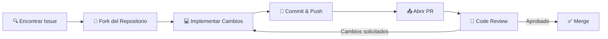

# 🤝 Contribución a Open Source

## Introducción
Contribuir a proyectos de código abierto es una de las formas más efectivas de acelerar tu carrera en ingeniería de ML e IA. No solo te permite trabajar con código de producción real, sino que también te conecta con algunos de los mejores ingenieros del mundo. En el ecosistema de [[Python]] y [[Machine Learning]], proyectos como [[scikit-learn]], [[TensorFlow]] y [[PyTorch]] dependen enteramente de comunidades globales de contribuyentes.

El código abierto en ML tiene una particularidad única: la barrera entre "usuario" y "contribuyente" es mucho más permeable que en otros campos. Un investigador que reporta un bug en una función de optimización, un ingeniero que mejora la documentación de una API, o un estudiante que traduce tutoriales, todos son contribuyentes esenciales. En este módulo aprenderás a navegar este ecosistema con profesionalismo y estrategia.

## 1. Modelos de Contribución y Gobernanza

Los proyectos open source operan con modelos de gobernanza que definen quién toma decisiones y cómo se integra el trabajo nuevo.

- **Contributor:** Cualquier persona que envía una contribución (código, docs, diseño). No tiene privilegios de merge.
- **Maintainer:** Revisa PRs, responde issues, tiene permisos de merge en ciertas áreas del proyecto.
- **Core Team/Committer:** Tiene permisos de merge globales y voz en decisiones arquitectónicas.
- **BDFL (Benevolent Dictator For Life):** Modelo donde una sola persona tiene la palabra final (ej. Guido van Rossum en Python, antes de la transición al Steering Council).

Caso real: [[scikit-learn]] utiliza un modelo de core developers donde se requieren al menos dos aprobaciones de maintainers para mergear código. Este sistema ha permitido mantener una calidad excepcional durante más de una década, convirtiéndolo en la librería de ML más estable del ecosistema Python.

⚠️ **Advertencia:** No envíes PRs masivos de refactorización a proyectos grandes sin discutirlo primero en un issue. Es uno de los errores más comunes que frustran a los maintainers y suelen cerrarse inmediatamente.

💡 **Tip mnemotécnico:** **C-M-C-B** — Contribuye primero, Mantén después, Construye comunidad, y recién entonces Busca liderazgo.

## 2. Encontrando el Proyecto y la Primera Contribución

La clave del éxito está en encontrar un proyecto que se alinee con tus intereses y nivel de experiencia.

| Tipo de Contribución | Descripción | Ideal para | Ejemplo en ML |
|---|---|---|---|
| Código | Bug fixes, nuevas features, optimización | Ingenieros con experiencia en Python/C++ | Implementar un nuevo optimizador en PyTorch |
| Documentación | Docstrings, tutoriales, traducciones | Principiantes, escritores técnicos | Traducir la guía de usuario de scikit-learn |
| Diseño | UX/UI, logos, diagramas, sitio web | Diseñadores, comunicadores visuales | Rediseñar la documentación de Jupyter |
| Testing | Tests unitarios, reproducción de bugs | QA, ingenieros de software | Añadir tests de regresión para transformers |
| Traducción | Localización de docs y mensajes | Multilingües, comunidades regionales | Traducir errores de TensorFlow al español |

Plataformas clave para encontrar oportunidades:
- **Good First Issue:** Etiqueta estándar en GitHub para tareas accesibles a nuevos contribuyentes.
- **Help Wanted:** Issues que los maintainers no pueden atender y necesitan ayuda externa.
- **Google Summer of Code (GSOC):** Programa de Google que paga a estudiantes para contribuir a open source durante el verano.
- **MLH Fellowship:** Programa intensivo de Major League Hacking donde estudiantes contribuyen a proyectos reales con mentores.

Caso real: [[Hugging Face]] organiza regularmente "sprints" de contribución donde la comunidad se reúne para añadir modelos, datasets o documentación. Estos eventos han sido cruciales para escalar su ecosistema de Transformers a miles de modelos disponibles.

## 3. Etiqueta y Flujo de Contribución

El proceso de contribución sigue un flujo estructurado que maximiza la calidad y minimiza el fricción.



Reglas de oro para contribuciones exitosas:
- Lee el `CONTRIBUTING.md` antes de escribir una sola línea de código.
- Abre un issue antes de un PR grande para validar que tu enfoque es correcto.
- Mantén los PRs pequeños y enfocados; un PR de 500 líneas tiene menos probabilidades de revisión rápida que uno de 50.
- Responde amablemente a la retroalimentación, incluso cuando sea crítica.
- Documenta siempre los cambios públicos en `CHANGELOG` o release notes.

⚠️ **Advertencia:** Nunca hagas "drive-by PRs" (cambios sin contexto ni descripción) en proyectos establecidos. Un PR sin descripción clara es casi siempre rechazado automáticamente.


## 4. Revisión de Código y Comunicación Comunitaria

La revisión de código es una habilidad tan importante como escribir código. En proyectos de ML, esto incluye verificar no solo la corrección del código, sino también la reproducibilidad de experimentos y la calidad matemática de los algoritmos.

Aspectos clave del code review en ML:
- ¿El cambio incluye tests que verifican el comportamiento?
- ¿La documentación matemática es correcta (fórmulas, referencias a papers)?
- ¿El cambio afecta el rendimiento (benchmarks)?
- ¿La API es consistente con el resto de la librería?

Plataformas de comunicación:
- **GitHub Discussions:** Ideal para preguntas de uso, anuncios y debates largos.
- **Discord/Slack:** Comunicación síncrona para comunidades activas.
- **Stack Overflow:** Soporte técnico estructurado para usuarios.


## 5. De Contribuyente a Líder de Comunidad

La transición de contribuyente ocasional a maintainer requiere consistencia, empatía y visión estratégica.

- **Consistencia:** Contribuir regularmente durante meses construye confianza.
- **Mentoría:** Ayudar a otros nuevos contribuyentes multiplica el impacto del proyecto.
- **Visión:** Entender hacia dónde va el proyecto y alinear tus contribuciones con esa dirección.

Caso real: El equipo de [[NumPy]] ha cultivado intencionalmente nuevos maintainers durante años. Su proceso de " NumPy Newcomers' Hour" y programas de mentoría han permitido que el proyecto crítico de la ciencia en Python sobreviva y evolucione más allá de sus fundadores originales.

💡 **Tip:** Documenta tu proceso de aprendizaje en un blog personal. Escribir sobre cómo resolviste un bug o cómo entendiste una arquitectura te convierte en un recurso para futuros contribuyentes.

---

## 📦 Código de Compresión

```python
#!/usr/bin/env python3
"""
contribucion_os.py
Simulador minimalista del flujo de contribución open source.
Ejecuta: python contribucion_os.py
"""

from enum import Enum, auto
from dataclasses import dataclass, field
from typing import List, Optional
from datetime import datetime

class Rol(Enum):
    CONTRIBUTOR = auto()
    MAINTAINER = auto()
    CORE = auto()
    BDFL = auto()

class EstadoPR(Enum):
    ABIERTO = auto()
    EN_REVISION = auto()
    CAMBIOS_SOLICITADOS = auto()
    APROBADO = auto()
    MERGEADO = auto()
    CERRADO = auto()

@dataclass
class Contribuyente:
    nombre: str
    rol: Rol = Rol.CONTRIBUTOR
    contribuciones: int = 0

@dataclass
class PullRequest:
    id: int
    autor: Contribuyente
    titulo: str
    estado: EstadoPR = EstadoPR.ABIERTO
    revisiones: int = 0
    cambios_solicitados: int = 0
    creado: datetime = field(default_factory=datetime.now)

    def revisar(self):
        self.estado = EstadoPR.EN_REVISION
        self.revisiones += 1

    def solicitar_cambios(self):
        self.estado = EstadoPR.CAMBIOS_SOLICITADOS
        self.cambios_solicitados += 1

    def aprobar(self):
        if self.cambios_solicitados > 0:
            print("⚠️ No se puede aprobar: hay cambios pendientes")
            return
        self.estado = EstadoPR.APROBADO

    def mergear(self, merger: Contribuyente):
        if self.estado != EstadoPR.APROBADO:
            print("❌ Solo PRs aprobados pueden mergearse")
            return
        if merger.rol.value < Rol.MAINTAINER.value:
            print("❌ Permisos insuficientes")
            return
        self.estado = EstadoPR.MERGEADO
        self.autor.contribuciones += 1
        print(f"✅ PR #{self.id} mergeado por {merger.nombre}")

def main():
    nuevo = Contribuyente(nombre="Ana García")
    maintainer = Contribuyente(nombre="Carlos López", rol=Rol.MAINTAINER)

    pr = PullRequest(id=1, autor=nuevo, titulo="Fix: gradient clipping en optimizador AdamW")
    print(f"📝 PR creado: {pr.titulo}")

    pr.revisar()
    pr.solicitar_cambios()
    print(f"🔁 Cambios solicitados: {pr.cambios_solicitados}")

    # Segunda ronda tras correcciones
    pr.revisar()
    pr.aprobar()
    pr.mergear(maintainer)

    print(f"🏆 Contribuciones de {nuevo.nombre}: {nuevo.contribuciones}")

if __name__ == "__main__":
    main()
```

## 🎯 Proyecto Documentado

### Descripción
Contribución real a un proyecto de ML open source: implementación de una métrica de evaluación faltante en una librería de procesamiento de lenguaje natural, incluyendo tests, documentación y un notebook de demostración.

### Requisitos Funcionales
1. Identificar una métrica de evaluación (ej. BERTScore, COMET) no soportada por la librería objetivo.
2. Implementar la métrica siguiendo las convenciones de API del proyecto.
3. Añadir tests unitarios con cobertura >90% para la nueva funcionalidad.
4. Documentar la métrica con ejemplos de uso y referencias al paper original.
5. Crear un notebook reproducible que demuestre la métrica en un dataset público.

### Componentes Principales
- Módulo de métrica (`metrics/bertscore.py`)
- Tests unitarios (`tests/test_metrics.py`)
- Documentación de API (`docs/metrics.md`)
- Notebook de demostración (`notebooks/demo_bertscore.ipynb`)

### Métricas de Éxito
- PR mergeado en el repositorio upstream.
- Tiempo de revisión < 2 semanas (indica calidad del PR).
- La métrica es adoptada por al menos 10 usuarios (stars/forks del fork).

### Referencias
- Zhang, T. et al. (2020). BERTScore: Evaluating Text Generation with BERT. *ICLR*.
- Guía de contribución de Hugging Face `evaluate`: https://github.com/huggingface/evaluate/blob/main/CONTRIBUTING.md
