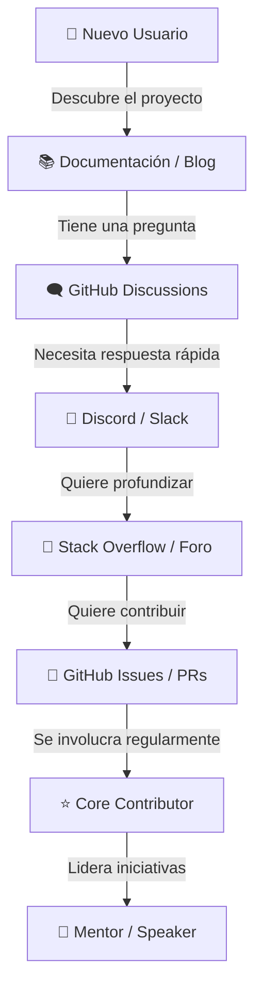

# 🏗️ Construcción de Comunidad Técnica

## Introducción
Las comunidades técnicas son el motor invisible detrás de cada gran proyecto de ML/IA. TensorFlow, PyTorch y Hugging Face no son exitosos solo por su código, sino por las miles de personas que responden preguntas, escriben tutoriales, organizan eventos y evangelizan las herramientas. Para un ingeniero de ML, entender cómo construir comunidad es tan valioso como entender backpropagation.

En el contexto de [[Machine Learning]], las comunidades tienen una dinámica particular: son híbridas entre investigación académica e ingeniería de software. Los miembros pueden ser investigadores de universidades, ingenieros de startups, estudiantes autodidactas y profesionales de grandes tecnológicas. Esta diversidad es una fortaleza, pero también requiere estrategias de inclusión deliberadas.

## 1. Frameworks y Métricas de Comunidad

Construir comunidad sin medir es como entrenar un modelo sin métricas de evaluación. Existen frameworks específicos para entender y optimizar el crecimiento comunitario.

- **Orbit Model:** Clasifica a los miembros en círculos concéntricos según su nivel de compromiso: observers → participants → contributors → champions. El objetivo es mover personas hacia el centro.
- **CHAOSS (Community Health Analytics Open Source Software):** Proyecto de la Linux Foundation que define métricas estandarizadas para salud comunitaria: diversidad, respuesta a issues, tiempo de merge de PRs, retención de contribuyentes.
- **Developer DAO:** Organización descentralizada que demuestra cómo las comunidades Web3 pueden escalar mediante tokens de gobernanza y contribuciones abiertas.

Caso real: [[PyTorch]] utiliza métricas de CHAOSS para monitorear su tiempo medio de respuesta a issues. Al detectar que este tiempo creció de 3 a 15 días en 2022, reorganizaron su equipo de community managers y redujeron drásticamente la fricción para nuevos contribuyentes.

⚠️ **Advertencia:** No confundas "tamaño de comunidad" con "salud de comunidad". Un Discord con 50,000 miembros donde nadie habla es menos valioso que uno con 500 miembros activos que se ayudan mutuamente.

💡 **Tip mnemotécnico:** **O-C-D** — Observa quién participa, Cultiva relaciones 1-a-1, y Documenta todo para escalar.

## 2. Tipos de Eventos y Ritmos de Interacción

Los eventos son los latidos del corazón de una comunidad. Cada tipo de evento sirve a un propósito diferente en el embudo de compromiso.

| Tipo de Evento | Frecuencia Ideal | Formato | Objetivo Principal |
|---|---|---|---|
| Meetups locales | Mensual | Presencial/híbrido, 1-2 charlas | Networking y aprendizaje estructurado |
| Conferencias | Anual/Bianual | Multi-track, keynotes, posters | Difusión masiva y reclutamiento |
| Hackathons | Trimestral | Competitivo o colaborativo, 24-48h | Innovación rápida y descubrimiento de talento |
| Study groups | Semanal | Virtual, 5-15 personas | Aprendizaje profundo de papers o cursos |
| Office hours | Semanal/Bisemanal | Virtual, Q&A abierto | Soporte directo y feedback de usuarios |
| Sprints de contribución | Trimestral | Virtual/presencial, enfocado en código | Aumentar contribuciones al proyecto |

Caso real: Los **PyData meetups** han sido fundamentales para la adopción de pandas, NumPy y scikit-learn. Estos eventos locales, organizados por voluntarios, crearon una red global de evangelistas que luego se convirtieron en contribuyentes, maintainers y conferencistas internacionales.


## 3. Plataformas y Arquitectura de Comunicación

Elegir la plataforma correcta depende de quién es tu audiencia y qué tipo de interacción quieres fomentar.



| Plataforma | Audiencia Típica | Engagement Principal | Ventaja Clave |
|---|---|---|---|
| Discord | Jóvenes, gamers, ML engineers | Síncrono, informal | Canales de voz, comunidad cercana |
| Slack | Empresas, profesionales | Síncrono, formal | Integraciones empresariales, historial |
| GitHub Discussions | Usuarios técnicos | Asíncrono, estructurado | Vinculado al código, indexable |
| Stack Overflow | Desarrolladores globales | Asíncrono, Q&A | SEO, archivo de conocimiento permanente |
| Reddit (r/MachineLearning) | Generalista, curiosos | Asíncrono, viral | Alcance masivo, discusión amplia |
| Twitter/X | Investigadores, influencers | Síncrono, fragmentado | Difusión de papers, networking |

⚠️ **Advertencia:** Fragmentar tu comunidad en demasiadas plataformas simultáneamente diluye la energía. Es mejor dominar una plataforma antes de expandirse a otra.

## 4. Medición y Optimización del Engagement

Para optimizar una comunidad, necesitas medirla. La fórmula fundamental del engagement técnico es:

$$\text{Engagement} = \frac{\text{Active Users}}{\text{Total Users}} \times \frac{\text{Contributions per User}}{\text{Time Window}}$$

Donde:
- **Active Users:** Miembros que realizaron al menos una acción significativa (mensaje, PR, reacción) en el período.
- **Total Users:** Miembros registrados o suscritos.
- **Contributions per User:** Promedio de mensajes, PRs, issues abiertos, etc.

Métricas derivadas importantes:
- **Retention rate:** % de nuevos miembros que siguen activos después de 30/90 días.
- **Time to first response:** Tiempo medio para que un nuevo mensaje/issue reciba respuesta.
- **Contributor growth rate:** Nuevos contribuyentes únicos por mes.

Caso real: [[Kaggle]] mide meticulosamente su "time to first submission" (tiempo desde registro hasta primera participación en competición). Al descubrir que era de 7 días, simplificaron su onboarding con notebooks "starter" y lo redujeron a 2 días, duplicando su tasa de retención a 30 días.


## 5. Cultura, Código de Conducta y Sostenibilidad

Una comunidad saludable no crece sola; se cultiva intencionalmente.

- **Código de Conducta:** Documento visible que establece expectativas de comportamiento. Debe incluir un proceso claro de reporte y consecuencias.
- **Onboarding deliberado:** Los nuevos miembros necesitan un camino claro. Etiquetas como "good first issue", guías de primeros pasos, y mentores asignados reducen la fricción inicial.
- **Reconocimiento:** Celebrar contribuciones públicamente (release notes, newsletters, swag) aumenta la retención.
- **Líderes distribuidos:** Depender de una sola persona es riesgoso. Formar "mantainers regionales" o "líderes de área" distribuye la carga.

💡 **Tip:** Implementa un "community health file" (`.github/ISSUE_TEMPLATE`, `CODE_OF_CONDUCT.md`, `CONTRIBUTING.md`) en tu repositorio. Es la infraestructura invisible que permite escalar comunidad sin caos.

---

## 📦 Código de Compresión

```python
#!/usr/bin/env python3
"""
comunidad.py
Simulador de métricas de comunidad técnica ML.
Ejecuta: python comunidad.py
"""

from dataclasses import dataclass, field
from typing import List, Dict
from datetime import datetime, timedelta
import random

@dataclass
class Miembro:
    nombre: str
    fecha_union: datetime
    actividades: List[str] = field(default_factory=list)

    @property
    def is_active(self, dias=30) -> bool:
        if not self.actividades:
            return False
        return (datetime.now() - self.fecha_union).days <= dias

    @property
    def contribution_count(self) -> int:
        return len(self.actividades)

@dataclass
class Comunidad:
    nombre: str
    miembros: List[Miembro] = field(default_factory=list)

    def engagement_score(self) -> float:
        if not self.miembros:
            return 0.0
        active = sum(1 for m in self.miembros if m.is_active)
        total = len(self.miembros)
        contrib_per_user = sum(m.contribution_count for m in self.miembros) / total
        return (active / total) * contrib_per_user

    def funnel(self) -> Dict[str, int]:
        observers = sum(1 for m in self.miembros if m.contribution_count == 0)
        participants = sum(1 for m in self.miembros if 1 <= m.contribution_count <= 5)
        contributors = sum(1 for m in self.miembros if 6 <= m.contribution_count <= 20)
        champions = sum(1 for m in self.miembros if m.contribution_count > 20)
        return {
            "observers": observers,
            "participants": participants,
            "contributors": contributors,
            "champions": champions,
        }

def main():
    comunidad = Comunidad(nombre="ML Open Source LatAm")

    # Simular miembros con actividad variable
    for i in range(100):
        m = Miembro(
            nombre=f"Miembro_{i}",
            fecha_union=datetime.now() - timedelta(days=random.randint(1, 120)),
        )
        acts = random.choices(
            ["msg", "issue", "pr", "event", "doc"],
            k=random.choices([0, 3, 10, 25], weights=[40, 30, 20, 10])[0]
        )
        m.actividades.extend(acts)
        comunidad.miembros.append(m)

    print(f"🏘️  Comunidad: {comunidad.nombre}")
    print(f"📊 Engagement Score: {comunidad.engagement_score():.2f}")
    print("🔄 Funnel Orbit Model:")
    for nivel, count in comunidad.funnel().items():
        bar = "█" * (count // 2)
        print(f"   {nivel:12s}: {count:3d} {bar}")

if __name__ == "__main__":
    main()
```

## 🎯 Proyecto Documentado

### Descripción
Lanzamiento de una comunidad local de ML/IA en tu ciudad: desde el primer meetup hasta una organización sostenible con eventos mensuales, canal de Discord activo y programa de mentoría.

### Requisitos Funcionales
1. Definir la identidad y misión de la comunidad (nombre, audiencia objetivo, valores).
2. Lanzar un canal de comunicación principal (Discord o Slack) con canales estructurados.
3. Organizar el primer meetup con al menos 20 asistentes y 2 charlas técnicas.
4. Establecer un ritmo de eventos recurrentes (meetups mensuales, study groups quincenales).
5. Crear un programa de mentoría que empareje a 5 parejas mentor-mentee en el primer trimestre.

### Componentes Principales
- Documento de gobernanza (`GOVERNANCE.md`)
- Código de conducta (`CODE_OF_CONDUCT.md`)
- Plantillas de eventos (checklist de meetup)
- Dashboard de métricas (engagement, retención, satisfacción)

### Métricas de Éxito
- Engagement score > 0.3 (usuarios activos / total × contribuciones).
- Retención a 90 días > 40%.
- Al menos 3 contribuyentes regulares que no sean los fundadores.

### Referencias
- Orbit Model: https://orbit.love/model
- CHAOSS Metrics: https://chaoss.community/metrics/
- "The Art of Community" by Jono Bacon (O'Reilly)
