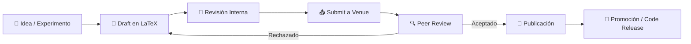

# 📚 Publicación de Librerías y Papers

## Introducción
Publicar tu trabajo es el puente entre el conocimiento privado y el impacto colectivo. En el ecosistema de ML/IA, esto significa dos cosas: publicar **librerías de software** que otros ingenieros puedan usar, y publicar **papers** que la comunidad científica pueda validar y construir sobre ellos. Ambos procesos son complementarios; las mejores librerías suelen venir acompañadas de papers rigurosos, y los papers más influyentes suelen tener implementaciones reproducibles.

El proceso de publicación en ML ha evolucionado dramáticamente. Hace una década, un paper sin código era aceptable. Hoy, la reproducibilidad es un estándar de facto, y conferencias como [[NeurIPS]] e [[ICML]] exigen activamente artefactos de código. Entender este panorama es esencial para cualquier ingeniero de ML que aspire a tener impacto más allá de su equipo inmediato.

## 1. Empaquetado y Distribución de Librerías Python

Empaquetar código correctamente es la diferencia entre un script que solo tú puedes ejecutar y una herramienta que la comunidad adopta masivamente.

Herramientas modernas de empaquetado:
- **setuptools:** El estándar histórico, aún muy usado. Define dependencias en `setup.py` o `setup.cfg`.
- **Poetry:** Gestor de dependencias y empaquetado moderno. Usa `pyproject.toml` y resuelve dependencias con un lockfile determinista.
- **Flit:** Minimalista y rápido. Ideal para librerías puras de Python sin compilación compleja.
- **conda-forge:** Canal comunitario de Conda. Esencial para librerías con dependencias binarias complejas (CUDA, BLAS, etc.).

```python
# Ejemplo minimalista de setup.py para una librería de ML
from setuptools import setup, find_packages

setup(
    name="mllib-demo",
    version="0.1.0",
    description="Librería demo para preprocesamiento de datos de ML",
    author="Tu Nombre",
    packages=find_packages(where="src"),
    package_dir={"": "src"},
    install_requires=[
        "numpy>=1.21.0",
        "pandas>=1.3.0",
        "scikit-learn>=1.0.0",
    ],
    python_requires=">=3.8",
    extras_require={
        "dev": ["pytest", "black", "mypy", "sphinx"],
        "docs": ["sphinx", "myst-parser", "furo"],
    },
    classifiers=[
        "Development Status :: 3 - Alpha",
        "Intended Audience :: Science/Research",
        "Programming Language :: Python :: 3",
        "License :: OSI Approved :: MIT License",
    ],
)
```

⚠️ **Advertencia:** Nunca publique credenciales, tokens o datos privados en PyPI. Una vez publicado, el paquete es permanentemente público e indexable. Usa siempre `MANIFEST.in` y `.gitignore` de forma deliberada.

💡 **Tip mnemotécnico:** **P-D-T** — Prueba localmente (`pip install -e .`), Documenta antes de publicar, y Testea en CI antes del release.

## 2. Documentación Técnica y API Reference

Una librería sin documentación es un paper sin abstract: existe, pero nadie lo usa.

Herramientas de documentación:
- **Sphinx:** El estándar de Python. Altamente configurable, soporta autodoc (extraer docstrings automáticamente).
- **MkDocs:** Basado en Markdown. Más simple y moderno, ideal para equipos que prefieren Markdown sobre reStructuredText.
- **ReadTheDocs:** Hosting gratuito para documentación open source. Se integra con GitHub para builds automáticos en cada PR.
- **JupyterBook:** Combina notebooks ejecutables con documentación estática. Perfecto para tutoriales de ML.

Buenas prácticas de API documentation:
- Toda función pública debe tener un docstring con descripción, parámetros, return values y ejemplos.
- Usa type hints; herramientas como `sphinx-autodoc-typehints` generan documentación automáticamente.
- Incluye una "Quickstart" en la página principal; los usuarios deciden si usar tu librería en los primeros 30 segundos.
- Mantén ejemplos ejecutables; fragmentos de código rotos destruyen la confianza instantáneamente.

Caso real: [[FastAPI]] se convirtió en uno de los frameworks web Python más populares en parte gracias a su documentación interactiva automática (Swagger UI). Su documentación no es un afterthought; es una feature central del producto.

| Aspecto | Sphinx | MkDocs | JupyterBook |
|---|---|---|---|
| Formato principal | reStructuredText | Markdown | Markdown + Notebooks |
| Autodoc Python | Excelente | Medio (vía mkdocstrings) | Limitado |
| Hosting en RTD | Nativo | Nativo | Nativo |
| Ideal para | APIs complejas, librerías maduras | Documentación legible, blogs | Tutoriales, libros de ML |
| Curva de aprendizaje | Media | Baja | Baja |


## 3. Publicación de Papers y Venues Académicos

El ciclo de publicación científica en ML sigue un pipeline definido que varía según la venue.



| Venue | Impacto | Tiempo de Revisión | Tasa de Aceptación | Requiere Código |
|---|---|---|---|---|
| NeurIPS | Muy Alto | 2-3 meses | ~25% | Fuertemente recomendado |
| ICML | Muy Alto | 2-3 meses | ~28% | Fuertemente recomendado |
| ICLR | Muy Alto | 2-3 meses | ~32% | Fuertemente recomendado |
| JMLR (Journal) | Alto | 3-6 meses | ~25% | Recomendado |
| Workshops (NeurIPS/ICML) | Medio | 1-2 meses | ~50% | Opcional |
| arXiv | Variable | Inmediato | 100% | Opcional |
| Conferencias regionales | Medio | 1-2 meses | ~40% | Variable |

Caso real: El paper "Attention Is All You Need" (Vaswani et al., 2017) fue presentado en el workshop de traducción de NeurIPS. A pesar de no ganar el best paper de la conferencia principal, su publicación en arXiv simultánea con código en TensorFlow creó un efecto de red que lo convirtió en el paper más citado de la década en ML.

⚠️ **Advertencia:** El "arXiv effect" puede ser peligroso. Publicar en arXiv sin revisión por pares puede llevar a que resultados erróneos o irreproducibles sean ampliamente difundidos antes de ser corregidos. Siempre busca validación crítica antes de promocionar ampliamente.

## 4. Open Science y Reproducibilidad

La reproducibilidad es el pilar de la ciencia, y en ML enfrenta desafíos únicos.

- **Semillas aleatorias:** Documenta todas las seeds (numpy, torch, tensorflow, python hash).
- **Entornos:** Usa `requirements.txt` con versiones pinnadas, o mejor aún, contenedores Docker.
- **Datos:** Proporciona scripts de descarga y preprocesamiento, no solo links rotos.
- **Hardware:** Reporta GPU, tiempo de entrenamiento y memoria utilizada.
- **Checkpoints:** Sube modelos entrenados a Hugging Face Hub o releases de GitHub.

Herramientas de reproducibilidad:
- **MLflow / Weights & Biases:** Tracking de experimentos.
- **DVC (Data Version Control):** Git para datos y modelos.
- **Docker + CUDA:** Contenedores con drivers GPU para reproducibilidad exacta.

💡 **Tip:** Crea un `REPRODUCIBILITY.md` en tu repositorio de papers con comandos exactos para replicar cada tabla y figura del artículo. Es el estándar de oro en ML open source.


## 5. Promoción y Difusión del Trabajo Publicado

Publicar no es el final; es el principio. La difusión estratégica multiplica el impacto.

- **Twitter/X threads:** Resume el paper en 5-10 tweets con figuras clave.
- **Blog posts técnicos:** Explica la intuición detrás del método para audiencia no experta.
- **Videos y charlas:** YouTube, PyData, Papers with Code.
- **Newsletters comunitarias:** Import from AI, The Batch, etc.
- **Código demo:** Gradio, Streamlit o notebooks interactivos en Hugging Face Spaces.

Caso real: [[Anthropic]] publica papers acompañados de "system cards" y demos interactivas. Esta estrategia de comunicación multimodal les permite alcanzar audiencias mucho más amplias que la comunidad académica tradicional, reforzando su marca como empresa de IA responsable.

---

## 📦 Código de Compresión

```python
#!/usr/bin/env python3
"""
publicacion.py
Pipeline completo: empaquetado, versionado y publicación de una mini-librería ML.
Ejecuta: python publicacion.py
"""

import subprocess
import sys
from pathlib import Path
from dataclasses import dataclass
from typing import List

@dataclass
class Libreria:
    nombre: str
    version: str
    descripcion: str
    autores: List[str]
    dependencias: List[str]

    def to_pyproject(self) -> str:
        deps = ',\n    "'.join(self.dependencias)
        autores = ',\n    "'.join(self.autores)
        return f'''[build-system]
requires = ["hatchling"]
build-backend = "hatchling.build"

[project]
name = "{self.nombre}"
version = "{self.version}"
description = "{self.descripcion}"
authors = [
    "{autores}"
]
dependencies = [
    "{deps}"
]
requires-python = ">=3.9"
readme = "README.md"
license = {{text = "MIT"}}
classifiers = [
    "Development Status :: 3 - Alpha",
    "Intended Audience :: Developers",
    "Programming Language :: Python :: 3",
]

[project.optional-dependencies]
dev = ["pytest", "black", "ruff", "mypy"]
docs = ["mkdocs", "mkdocs-material"]
'''

    def generar_estructura(self, base: Path):
        src = base / "src" / self.nombre.replace("-", "_")
        tests = base / "tests"
        docs = base / "docs"

        for d in [src, tests, docs]:
            d.mkdir(parents=True, exist_ok=True)

        (src / "__init__.py").write_text(f'__version__ = "{self.version}"\n')
        (src / "transform.py").write_text("""
def normalize(x, mean=0.0, std=1.0):
    \"\"\"Normaliza un array.\"\"\"
    return [(v - mean) / std for v in x]
""")
        (tests / "test_transform.py").write_text("""
from mllib_demo.transform import normalize

def test_normalize():
    assert normalize([1, 2, 3], mean=2, std=1) == [-1, 0, 1]
""")
        (base / "pyproject.toml").write_text(self.to_pyproject())
        (base / "README.md").write_text(f"# {self.nombre}\n\n{self.descripcion}\n")

        print(f"📦 Estructura generada en {base}")
        print("   src/\n   tests/\n   docs/\n   pyproject.toml\n   README.md")

def main():
    lib = Libreria(
        nombre="mllib-demo",
        version="0.1.0",
        descripcion="Mini librería de preprocesamiento ML",
        autors=["Tu Nombre <tu@email.com>"],
        dependencias=["numpy>=1.21", "scikit-learn>=1.0"],
    )
    base = Path("./mllib-demo")
    lib.generar_estructura(base)
    print("\n🚀 Próximos pasos:")
    print("   cd mllib-demo")
    print("   pip install -e .[dev]")
    print("   pytest")
    print("   python -m build")
    print("   twine upload dist/*")

if __name__ == "__main__":
    main()
```

## 🎯 Proyecto Documentado

### Descripción
Publicación de una librería Python que implementa un algoritmo de optimización novedoso para entrenamiento de transformers, acompañada de un paper técnico en arXiv y documentación completa.

### Requisitos Funcionales
1. Implementar el algoritmo con API compatible con PyTorch (`torch.optim.Optimizer`).
2. Crear tests unitarios con cobertura >90% y benchmarks de rendimiento.
3. Generar documentación con Sphinx/MkDocs incluyendo guía de uso y referencia API.
4. Publicar en PyPI con versionado SemVer y metadatos completos.
5. Redactar paper técnico con resultados experimentales y subir a arXiv con código reproducible.

### Componentes Principales
- Módulo principal (`src/optim/nuevo_optimizer.py`)
- Suite de tests (`tests/`)
- Documentación (`docs/`)
- Paper LaTeX (`paper/main.tex`)
- Dockerfile de reproducibilidad (`Dockerfile`)

### Métricas de Éxito
- >100 descargas mensuales en PyPI en los primeros 3 meses.
- Paper citado al menos 5 veces en el primer año.
- Al menos 1 contribución externa al repositorio.

### Referencias
- Vaswani, A. et al. (2017). Attention Is All You Need. *NeurIPS*.
- Python Packaging User Guide: https://packaging.python.org/
- ReadTheDocs: https://docs.readthedocs.io/
