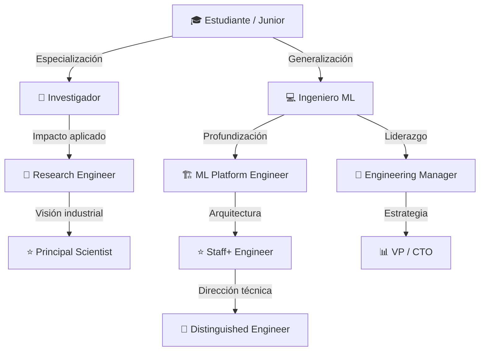

# 🚀 Carrera y Crecimiento Profesional

## Introducción
La carrera en Machine Learning e Inteligencia Artificial es una de las más dinámicas y mejor compensadas de la tecnología, pero también una de las más difíciles de navegar. A diferencia de campos como el desarrollo web, donde los niveles de seniority son relativamente estandarizados, en ML la diversidad de roles —investigador, ingeniero, product manager, consultor— crea un laberinto de posibilidades que requiere planificación deliberada.

Este módulo te proporcionará un mapa para esa navegación. No se trata solo de subir de nivel técnico; se trata de entender cómo las habilidades de [[comunicación]], [[liderazgo]] y [[visibilidad pública]] se combinan con la excelencia técnica para construir una carrera sostenible y significativa en el ecosistema de ML/IA.

## 1. Escaleras de Carrera en ML: IC vs Management

Las organizaciones de tecnología generalmente ofrecen dos tracks de progresión: Individual Contributor (IC) y Management.

**Track de IC (Individual Contributor):**
- **Software Engineer / Research Engineer:** Implementa modelos, pipelines y APIs.
- **Senior Engineer:** Lidera proyectos técnicos complejos, mentoriza juniors.
- **Staff Engineer:** Impacto a nivel de organización. Define arquitecturas, resuelve problemas "imposibles", influye en múltiples equipos.
- **Principal Engineer:** Impacto a nivel de compañía o industria. Define la visión técnica de largo plazo.
- **Distinguished / Fellow Engineer:** Impacto industrial. Reconocimiento como líder de pensamiento. Muy pocos alcanzan este nivel.

**Track de Management:**
- **Engineering Manager:** Lidera un equipo (~5-10 personas). Responsable de entregas y desarrollo del equipo.
- **Senior Manager / Director:** Lidera múltiples equipos o una área completa (ej. "Director of ML Platform").
- **VP of Engineering / CTO:** Estrategia tecnológica global de la organización.

Caso real: En [[Google]], el track de IC llega hasta "Senior Fellow" (el nivel de Jeff Dean). Este sistema paralelo permite que ingenieros de extraordinario talento técnico reciban compensación y prestigio comparables a los de vicepresidentes, sin forzarlos a gestionar personas.

⚠️ **Advertencia:** Muchos ingenieros brillantes fracasan como managers porque asumen el rol por presión salarial sin disfrutar las dinámicas de personas. El management es una especialización diferente, no una promoción del IC track.

💡 **Tip mnemotécnico:** **I-M-I** — Identifica tu motivador principal (¿problemas técnicos o personas?), Mide el impacto no el título, y Invierte en habilidades complementarias (escritura, presentación, negociación).

## 2. Construcción de Portfolio y Marca Personal

Tu portfolio es tu argumento de venta permanente. En ML, debe demostrar no solo que puedes escribir código, sino que puedes resolver problemas reales de datos.

Componentes de un portfolio sólido:
- **GitHub:** Repositorios con código limpio, READMEs explicativos, y proyectos que van más allá de tutoriales copiados.
- **Blog técnico:** Escribir sobre lo que aprendes fija el conocimiento y demuestra comunicación. Plataformas: Medium, Substack, GitHub Pages.
- **Kaggle:** Competencias demuestran habilidad de modelado bajo presión. Discussions y notebooks destacados construyen reputación.
- **Papers y preprints:** Aunque no seas académico, publicar en arXiv o workshops demuestra rigor.
- **Charlas y meetups:** Presentar en público acelera el networking y posiciona como experto.
- **Open source:** Contribuciones documentadas a proyectos conocidos son la mejor prueba de código colaborativo.

| Canal | Esfuerzo Inicial | Retorno a Largo Plazo | Audiencia Principal |
|---|---|---|---|
| GitHub | Medio | Muy Alto | Reclutadores, ingenieros |
| Blog | Alto | Alto | Comunidad técnica, reclutadores |
| Kaggle | Medio | Medio | Data scientists, empresas |
| Papers | Muy Alto | Muy Alto | Academia, labs de investigación |
| Charlas | Medio | Alto | Networking directo |
| Open Source | Alto | Muy Alto | Comunidad técnica global |

Caso real: [[Jeremy Howard]] construyó su carrera no solo con papers, sino con cursos prácticos (fast.ai), librerías de código abierto y participación constante en foros. Su marca personal como "el tipo que hace ML accesible" le ha dado más influencia que muchos investigadores puramente académicos.


## 3. Networking y Mentoría Estratégica

El networking en ML no es intercambiar tarjetas; es construir relaciones basadas en intereses técnicos compartidos.

Estrategias efectivas:
- **Mentoría formal:** Programas como Google Summer of Code, MLH Fellowship, o mentorship tracks en conferencias.
- **Mentoría informal:** Preguntas específicas y bien investigadas a personas que admiras en Twitter/LinkedIn. Nunca preguntes "¿puedo hacerte preguntas?"; pregunta directamente lo que necesites.
- **Comunidades de nicho:** Grupos especializados (MLOps Community, Papers with Code, RL China) tienen señal más fuerte que redes generales.
- **Peer groups:** Grupos de 3-5 personas en un nivel similar que se revisan mutuamente papers, prácticas de entrevista o proyectos.

⚠️ **Advertencia:** El "networking extractivo" (contactar a alguien solo cuando necesitas un trabajo) es visible y daña tu reputación. Construye relaciones antes de necesitarlas.

## 4. Compensación Total y Negociación

Entender tu valor de mercado es una habilidad técnica tan importante como entender gradient descent.

La fórmula fundamental de compensación en tecnología es:

$$\text{TCO} = \text{Base} + \text{Equity} + \text{Bonus} + \text{Benefits}$$

Donde:
- **Base:** Salario fijo anual. Varía enormemente por ubicación.
- **Equity:** RSUs (Restricted Stock Units) o stock options. En startups, puede ser el componente más valioso (o worthless).
- **Bonus:** Variable, generalmente 10-20% del base para ICs, más alto para ventas/ejecutivos.
- **Benefits:** Seguro médico, 401k match, educación, relocation, etc.

Comparativa de paths de carrera:

| Path | TCO Inicial (USD) | TCO Senior (USD) | Estabilidad | Crecimiento |
|---|---|---|---|---|
| Research (PhD → Lab) | $120k - $180k | $300k - $600k | Media | Lento pero sólido |
| Engineering (Big Tech) | $150k - $220k | $400k - $1M+ | Alta | Rápido |
| Product (PM en AI) | $130k - $190k | $350k - $700k | Alta | Medio |
| Consulting / Freelance | $80k - $150k | $200k - $500k | Baja | Variable |
| Startup (early employee) | $80k - $140k + equity | $0 - $10M+ | Muy baja | Exponencial o cero |

Caso real: En 2023, ingenieros de ML Staff+ en empresas como OpenAI, Anthropic y Google DeepMind reportaban TCOs que superaban el millón de dólares anuales, impulsados principalmente por bonos de retención y equity en empresas de IA generativa en auge.

💡 **Tip:** Nunca compartas tu historial salarial en una negociación. En muchas jurisdicciones es ilegal que te lo pidan, y en todas es información que solo beneficia al empleador.

## 5. Transiciones de Carrera y Resiliencia

Las carreras en ML no son lineales. Es común pivotar entre investigación e ingeniería, o entre grandes empresas y startups.

- **De academia a industria:** Enfatiza código de producción, escalabilidad y trabajo en equipo. Los papers importan, pero las implementaciones deployadas importan más.
- **De industria a academia:** Necesitarás un historial de publicaciones. Considera posdocs o roles de "research engineer" en labs híbridos (Google Research, FAIR).
- **Especialización vs generalización:** Los primeros años de carrera benefician la generalización (full-stack ML). A nivel senior, la especialización (visión por computadora, NLP, sistemas de recomendación) aumenta el valor de mercado.
- **Burnout:** El campo de ML avanza tan rápido que el FOMO (fear of missing out) es endémico. Establecer límites saludables de consumo de información es una habilidad de supervivencia.



Caso real: **Andrej Karpathy** transitó de PhD en Stanford (bajo Fei-Fei Li) a OpenAI (founding team), luego a Tesla (Director of AI), y de vuelta a OpenAI. Su carrera demuestra que en ML, la movilidad entre roles y organizaciones es no solo posible sino potenciadora cuando se construye una marca personal basada en excelencia técnica demostrable.

---

## 📦 Código de Compresión

```python
#!/usr/bin/env python3
"""
carrera.py
Simulador de progresión de carrera ML con métricas y comparativas.
Ejecuta: python carrera.py
"""

from dataclasses import dataclass, field
from typing import List, Optional
from enum import Enum

class Track(Enum):
    IC = "Individual Contributor"
    MGMT = "Management"
    RESEARCH = "Research"

class Nivel(Enum):
    JUNIOR = 1
    MID = 2
    SENIOR = 3
    STAFF = 4
    PRINCIPAL = 5
    DISTINGUISHED = 6

@dataclass
class Rol:
    nombre: str
    track: Track
    nivel: Nivel
    base: int
    equity: int = 0
    bonus_pct: float = 0.15

    @property
    def tco(self) -> int:
        bonus = int(self.base * self.bonus_pct)
        return self.base + bonus + self.equity

    def promover(self) -> Optional["Rol"]:
        if self.nivel == Nivel.DISTINGUISHED:
            return None
        siguiente = Nivel(self.nivel.value + 1)
        multiplicador = 1.3
        return Rol(
            nombre=f"{self.track.value} - {siguiente.name.title()}",
            track=self.track,
            nivel=siguiente,
            base=int(self.base * multiplicador),
            equity=int(self.equity * 1.5) if self.equity else int(self.base * 0.2),
            bonus_pct=min(self.bonus_pct + 0.05, 0.5),
        )

@dataclass
class Profesional:
    nombre: str
    rol_actual: Rol
    portfolio: List[str] = field(default_factory=list)
    network_size: int = 0

    def agregar_portfolio(self, item: str):
        self.portfolio.append(item)
        print(f"📁 Añadido a portfolio: {item}")

    def networking(self, eventos: int = 1):
        self.network_size += eventos * 3
        print(f"🤝 Network creció a {self.network_size} conexiones")

    def simular_año(self):
        nuevo = self.rol_actual.promover()
        if nuevo and len(self.portfolio) >= self.rol_actual.nivel.value * 2:
            self.rol_actual = nuevo
            print(f"🚀 Promoción: {nuevo.nombre} (TCO: ${nuevo.tco:,})")
        else:
            print(f"📈 Creciendo en rol actual (TCO: ${self.rol_actual.tco:,})")

def main():
    ana = Profesional(
        nombre="Ana Torres",
        rol_actual=Rol("ML Engineer", Track.IC, Nivel.MID, base=130000, equity=30000),
    )

    ana.agregar_portfolio("Blog: Entendiendo Transformers")
    ana.agregar_portfolio("GitHub: librería de NLP")
    ana.agregar_portfolio("Charla: PyData 2024")
    ana.networking(eventos=2)
    ana.simular_año()
    ana.simular_año()

    print(f"\n🏁 Estado final de {ana.nombre}:")
    print(f"   Rol: {ana.rol_actual.nombre}")
    print(f"   TCO: ${ana.rol_actual.tco:,}")
    print(f"   Portfolio: {len(ana.portfolio)} items")
    print(f"   Red: {ana.network_size} contactos")

if __name__ == "__main__":
    main()
```

## 🎯 Proyecto Documentado

### Descripción
Diseño de un plan de carrera de 5 años para un ingeniero de ML mid-level, incluyendo transiciones de rol, construcción de portfolio, estrategia de networking y objetivos de compensación.

### Requisitos Funcionales
1. Auditar habilidades actuales y mapearlas contra los requisitos de Staff Engineer en ML.
2. Definir 3 proyectos de portfolio que demuestren impacto a nivel de organización.
3. Establecer un plan de publicación (blog mensual, paper anual, charla trimestral).
4. Identificar 5 mentores potenciales y estrategia de contacto.
5. Crear un dashboard personal de métricas de carrera (TCO objetivo, habilidades adquiridas, network).

### Componentes Principales
- Matriz de habilidades (`career/skills_matrix.md`)
- Plan de portfolio (`career/portfolio_plan.md`)
- Calendario de publicación (`career/content_calendar.md`)
- Tracker de networking (`career/network_tracker.csv`)
- Dashboard de compensación (`career/compensation_tracker.py`)

### Métricas de Éxito
- Promoción a Senior dentro de 18 meses.
- 3 charlas en conferencias reconocidas en 3 años.
- TCO incrementado 40% en 24 meses.

### Referencias
- "Staff Engineer" de Will Larson (LeadDev)
- "The Manager's Path" de Camille Fournier (O'Reilly)
- levels.fyi: https://www.levels.fyi/
