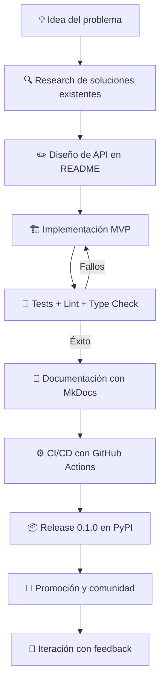

# 📦 Caso Práctico: Lanzar una Librería Open Source

## Introducción
Este módulo es la síntesis de todo el curso. Aquí no solo aprenderás teoría; seguirás una guía paso a paso para llevar una idea de librería ML desde la concepción hasta el primer release público. El objetivo es que al final tengas un repositorio real, documentado, testeado y listo para que otros lo usen y contribuyan.

Lanzar una librería open source es uno de los proyectos más formativos que puede emprender un ingeniero de ML. Te obliga a pensar en [[API design]], [[testing]], [[documentación]], [[CI/CD]] y [[comunidad]] simultáneamente. Es el proyecto perfecto para demostrar competencia de nivel senior.

## 1. De la Idea al MVP Técnico

Todo proyecto open source exitoso comienza con un problema real y bien definido.

- **Identifica el dolor:** ¿Qué tarea repetitiva haces en cada proyecto ML? ¿Qué librería existente es difícil de usar o está abandonada?
- **Investiga el estado del arte:** Busca en PyPI, GitHub, papers. Si existen 5 librerías similares, tu ventaja competitiva debe ser clara (mejor API, más rápida, más documentada, más activa).
- **Define el alcance mínimo:** El MVP debe resolver un problema específico excepcionalmente bien. Es mejor una librería que hace una sola cosa perfectamente que una que hace diez mediocremente.
- **Diseña la API antes del código:** Escribe el README con ejemplos de uso ideal *antes* de implementar. Si la API se siente intuitiva en el README, estás en buen camino.

Caso real: [[Polars]] nació porque su creador, Ritchie Vink, encontró que pandas era demasiado lento para sus necesidades de procesamiento de datos en Rust. En lugar de intentar mejorar pandas desde dentro, construyó una alternativa con API similar pero arquitectura radicalmente diferente. La claridad del problema (velocidad) y la similitud de API (barrera de adopción baja) fueron clave para su explosivo crecimiento.

⚠️ **Advertencia:** El síndrome del "segundo sistema" es letal para proyectos open source personales. No intentes construir el framework perfecto. Construye la herramienta que necesitas hoy, y deja que la comunidad te diga hacia dónde evolucionar.

💡 **Tip mnemotécnico:** **P-I-D** — Problema claro, Investigación honesta de competidores, y Diseño de API primero.

## 2. Estructura del Repositorio y Calidad de Código

Un repositorio profesional transmite confianza instantáneamente.

Estructura recomendada:

```
mi-libreria/
├── src/
│   └── mi_libreria/
│       ├── __init__.py
│       ├── core.py
│       └── utils.py
├── tests/
│   ├── __init__.py
│   ├── test_core.py
│   └── conftest.py
├── docs/
│   ├── index.md
│   └── api.md
├── .github/
│   └── workflows/
│       └── ci.yml
├── pyproject.toml
├── README.md
├── LICENSE
├── CHANGELOG.md
└── CONTRIBUTING.md
```

Herramientas de calidad esenciales:
- **pytest:** Framework de testing. Usa fixtures, parametrización y cobertura (`pytest-cov`).
- **black:** Formateador de código sin configuración. Elimina debates de estilo.
- **ruff:** Linter ultrarrápido que reemplaza a flake8, isort y pydocstyle.
- **mypy:** Chequeo estático de tipos. Esencial para APIs públicas.
- **pre-commit:** Hooks que ejecutan estas herramientas antes de cada commit.

| Checklist Pre-Release | Checklist Post-Release |
|---|---|
| README con instalación y quickstart | Monitorizar issues reportados por primeros usuarios |
| Tests con cobertura >80% | Responder a issues en <48h |
| CI/CD configurado (tests + lint en cada PR) | Añadir badge de cobertura al README |
| LICENSE clara (MIT/Apache-2.0 para máxima adopción) | Escribir release notes detallados |
| `pyproject.toml` con metadatos completos | Anunciar en Reddit, Twitter, Hacker News |
| Documentación mínima funcional | Preparar un roadmap público |
| CHANGELOG iniciado | Buscar primeros contribuyentes y mentorizarlos |

## 3. Versionado Semántico para ML

SemVer (`MAJOR.MINOR.PATCH`) es el estándar, pero en ML tiene matices especiales.

```
MAJOR: Cambios incompatibles en API o cambios en resultados numéricos (breaking changes)
MINOR: Nuevas features, modelos, datasets. Backward compatible.
PATCH: Bug fixes, correcciones de docs. No cambia API ni resultados.
```

Consideraciones específicas de ML:
- **Cambios en pesos/modelos:** Si actualizas un modelo pre-entrenado y los outputs cambian (aunque sean "mejores"), esto puede ser un breaking change para usuarios en producción.
- **Dependencias de hardware:** Cambios en soporte CUDA o arquitecturas pueden requerir versionado cuidadoso.
- **Reproducibilidad:** Documenta exactamente qué versión generó qué resultados en papers o benchmarks.

💡 **Tip:** Usa `setuptools_scm` o `hatch-vcs` para versionado automático basado en tags de Git. Elimina la fricción de actualizar versiones manualmente.

## 4. CI/CD, Tests y Automatización

La infraestructura de integración continua es lo que permite que un proyecto de una persona escale sin convertirse en un caos.

```yaml
# .github/workflows/ci.yml - Ejemplo completo
name: CI

on:
  push:
    branches: [main]
  pull_request:
    branches: [main]

jobs:
  test:
    runs-on: ubuntu-latest
    strategy:
      matrix:
        python-version: ["3.9", "3.10", "3.11", "3.12"]

    steps:
      - uses: actions/checkout@v4

      - name: Set up Python ${{ matrix.python-version }}
        uses: actions/setup-python@v5
        with:
          python-version: ${{ matrix.python-version }}

      - name: Install dependencies
        run: |
          python -m pip install --upgrade pip
          pip install -e ".[dev]"

      - name: Lint with ruff
        run: ruff check src tests

      - name: Type check with mypy
        run: mypy src

      - name: Test with pytest
        run: pytest --cov=src/mi_libreria --cov-report=xml

      - name: Upload coverage
        uses: codecov/codecov-action@v3
        with:
          files: ./coverage.xml
```

Automatizaciones recomendadas:
- **Dependabot:** Actualiza automáticamente dependencias.
- **Release drafter:** Genera automáticamente release notes desde PRs mergeados.
- **Codecov / Coveralls:** Reportes de cobertura visuales en cada PR.

Caso real: [[scikit-learn]] mantiene una matriz de CI enorme (múltiples versiones de Python, NumPy, SciPy, SOs). Esta inversión en infraestructura les permite detectar incompatibilidades antes de que lleguen a los usuarios, manteniendo su reputación de "simplemente funciona".



## 5. Lanzamiento, Promoción y Crecimiento

El lanzamiento es 20% del trabajo; el 80% restante es mantener y hacer crecer el proyecto.

Estrategias de lanzamiento:
- **Soft launch:** Comparte primero con amigos y colegas para detectar problemas obvios.
- **Show HN / Reddit r/MachineLearning:** Postea con una demo clara y código reproducible.
- **Twitter/X thread:** Explica el problema, la solución, y cómo usar la librería en 5-10 tweets.
- **Blog post técnico:** Profundiza en decisiones de diseño y trade-offs.
- **Charla en meetup:** Presentación en vivo con Q&A.

Sostenibilidad a largo plazo:
- Responde a issues amablemente, incluso las "tontas". Cada persona que pregunta representa a 100 que se rindieron en silencio.
- Secciona el trabajo: etiqueta issues como "good first issue", "help wanted", "discussion".
- Considera buscar co-maintainers cuando el proyecto crezca. La sostenibilidad personal es el cuello de botella más común.

⚠️ **Advertencia:** No abandones el repositorio inmediatamente después del lanzamiento. Un proyecto con el último commit hace 6 meses transmite abandono y disuade la adopción. Es mejor no lanzar que lanzar y abandonar.


---

## 📦 Código de Compresión

```python
#!/usr/bin/env python3
"""
lanzamiento.py
Generador de esqueleto completo para lanzar una librería ML open source.
Ejecuta: python lanzamiento.py
"""

from pathlib import Path
from datetime import datetime

PYPROJECT = '''[build-system]
requires = ["hatchling"]
build-backend = "hatchling.build"

[project]
name = "{name}"
version = "0.1.0"
description = "{description}"
authors = [
    {{name = "{author}", email = "{email}"}}
]
readme = "README.md"
license = {{text = "MIT"}}
requires-python = ">=3.9"
dependencies = [
    "numpy>=1.21",
    "scikit-learn>=1.0",
]
classifiers = [
    "Development Status :: 3 - Alpha",
    "Intended Audience :: Science/Research",
    "Programming Language :: Python :: 3",
    "Topic :: Scientific/Engineering :: Artificial Intelligence",
]

[project.optional-dependencies]
dev = ["pytest", "pytest-cov", "black", "ruff", "mypy", "pre-commit"]
docs = ["mkdocs", "mkdocs-material"]

[project.urls]
Homepage = "https://github.com/{github_user}/{name}"
Repository = "https://github.com/{github_user}/{name}"
Issues = "https://github.com/{github_user}/{name}/issues"

[tool.hatch.build.targets.wheel]
packages = ["src/{pkg_name}"]

[tool.ruff]
line-length = 88
select = ["E", "F", "I", "W"]

[tool.mypy]
python_version = "3.9"
warn_return_any = true
warn_unused_configs = true

[tool.pytest.ini_options]
testpaths = ["tests"]
addopts = "--cov=src/{pkg_name} --cov-report=term-missing"
'''

CI_YML = '''name: CI
on:
  push:
    branches: [main]
  pull_request:
    branches: [main]

jobs:
  test:
    runs-on: ubuntu-latest
    strategy:
      matrix:
        python-version: ["3.9", "3.10", "3.11"]
    steps:
      - uses: actions/checkout@v4
      - uses: actions/setup-python@v5
        with:
          python-version: ${{ matrix.python-version }}
      - run: pip install -e ".[dev]"
      - run: ruff check src tests
      - run: mypy src
      - run: pytest
'''

def crear_libreria(name: str, description: str, author: str, email: str, github_user: str):
    pkg_name = name.replace("-", "_")
    base = Path(f"./{name}")
    src = base / "src" / pkg_name
    tests = base / "tests"
    docs = base / "docs"
    gh = base / ".github" / "workflows"

    for d in [src, tests, docs, gh]:
        d.mkdir(parents=True, exist_ok=True)

    (src / "__init__.py").write_text(f'__version__ = "0.1.0"\n')
    (src / "core.py").write_text(f"""\"\"\"Core module for {name}.\"\"\"

def hello(name: str = "world") -> str:
    \"\"\"Return a greeting.\"\"\"
    return f"Hello, {{name}}!"
""")

    (tests / "test_core.py").write_text(f"""from {pkg_name}.core import hello

def test_hello():
    assert hello("Alice") == "Hello, Alice!"
    assert hello() == "Hello, world!"
""")

    (base / "pyproject.toml").write_text(
        PYPROJECT.format(
            name=name,
            pkg_name=pkg_name,
            description=description,
            author=author,
            email=email,
            github_user=github_user,
        )
    )

    (base / "README.md").write_text(f"""# {name}

{description}

## Instalación

```bash
pip install {name}
```

## Uso rápido

```python
from {pkg_name}.core import hello

print(hello("Mundo"))
```

## Contribuir

Ver [CONTRIBUTING.md](CONTRIBUTING.md).
""")

    (base / "LICENSE").write_text("MIT License\n\nCopyright (c) " + str(datetime.now().year) + f" {author}\n")
    (base / "CHANGELOG.md").write_text("# Changelog\n\n## 0.1.0 (" + datetime.now().strftime("%Y-%m-%d") + ")\n\n- Lanzamiento inicial\n")
    (base / "CONTRIBUTING.md").write_text(f"# Contribuir a {name}\n\n1. Fork el repositorio\n2. Crea una rama (`git checkout -b feature/nueva-funcionalidad`)\n3. Haz commit de tus cambios\n4. Abre un Pull Request\n")
    (gh / "ci.yml").write_text(CI_YML)

    print(f"🚀 Proyecto '{name}' generado en ./{name}/")
    print("Próximos pasos:")
    print(f"  cd {name}")
    print("  git init")
    print("  git add .")
    print('  git commit -m "Initial commit"')
    print(f"  gh repo create {name} --public --source=. --push")
    print("  pip install -e '.[dev]'")
    print("  pytest")

def main():
    crear_libreria(
        name="ml-starter",
        description="Librería de inicio para proyectos de ML",
        author="Tu Nombre",
        email="tu@email.com",
        github_user="tu_usuario",
    )

if __name__ == "__main__":
    main()
```

## 🎯 Proyecto Documentado

### Descripción
Lanzamiento real de una librería Python open source que resuelve un problema específico de preprocesamiento en pipelines de NLP, desde el diseño de API hasta la publicación en PyPI y el primer anuncio comunitario.

### Requisitos Funcionales
1. Definir el problema y diseñar una API intuitiva documentada en el README.
2. Implementar el MVP con tests unitarios (cobertura >85%) y type hints.
3. Configurar CI/CD con GitHub Actions (lint, type check, tests en múltiples versiones de Python).
4. Publicar documentación con MkDocs en GitHub Pages.
5. Realizar el primer release (0.1.0) en PyPI con versionado SemVer y anunciarlo en 2 canales.

### Componentes Principales
- Código fuente (`src/`)
- Tests automatizados (`tests/`)
- Documentación (`docs/`)
- Pipeline CI/CD (`.github/workflows/ci.yml`)
- Metadatos de publicación (`pyproject.toml`)

### Métricas de Éxito
- 50+ estrellas en GitHub en el primer mes.
- 10+ descargas diarias en PyPI.
- Al menos 1 issue o PR externo (indica adopción real).

### Referencias
- Semantic Versioning: https://semver.org/
- Python Packaging Authority: https://packaging.python.org/
- GitHub Actions Docs: https://docs.github.com/en/actions
