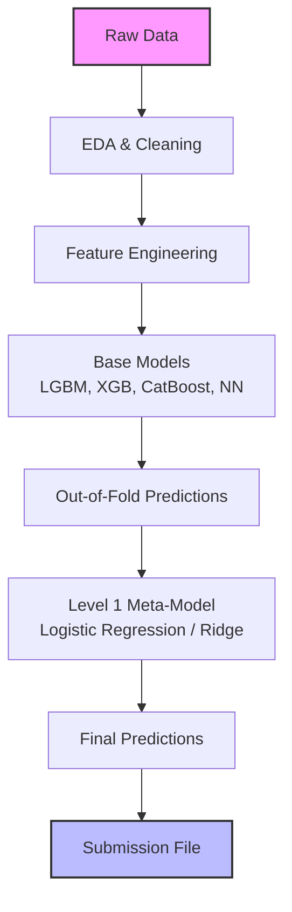

# 🏆 Kaggle Competitions

## Introduction

Kaggle competitions represent one of the most effective ways to develop practical machine learning skills under real constraints. Unlike curated academic datasets, competition data is often noisy, imbalanced, and deliberately obfuscated to test a competitor's ability to engineer robust solutions. Participating in these contests teaches you to move beyond textbook accuracy and focus on the metrics that actually matter for business outcomes, such as LogLoss, AUC-ROC, or Mean Average Precision.

This course covers the full competition lifecycle: from exploratory data analysis (EDA) and leakage detection to advanced ensemble strategies used by Kaggle Grandmasters. We will examine the psychological and technical dynamics of leaderboards, where overfitting the public test set is a constant risk. Understanding [[02 - End-to-End ML Project|end-to-end project management]] and [[03 - Fine-Tuning LLs|fine-tuning techniques]] can further amplify your competition results when dealing with unstructured data.

## 1. Competition Landscape and Evaluation Metrics

Kaggle competitions are broadly categorized into several types, each demanding a distinct mental model and toolkit:

- **Getting Started:** Playground competitions with simpler datasets and no monetary prizes. Ideal for learning new domains without pressure.
- **Featured:** Full-scale competitions with significant prizes and complex datasets. These often attract Grandmasters and research teams.
- **Research:** Scientific challenges where the goal is to advance state-of-the-art. Winners often publish papers.
- **Recruitment:** Sponsored by companies seeking talent. Top finishers may receive job offers.

Deep conceptual explanation:

- The choice of evaluation metric fundamentally shapes your modeling strategy. AUC-ROC optimizes ranking ability, while LogLoss penalizes confident wrong predictions more heavily.
- **LogLoss formula:** `LogLoss = -1/N Σ [y_i log(p_i) + (1-y_i)log(1-p_i)]`
- Leaderboard dynamics create a feedback loop: competitors optimize for the public leaderboard, which may not correlate with the private leaderboard. This is the classic overfitting trap.
- Cross-validation (CV) strategies must mirror the competition's test set construction. Time-series competitions require temporal splits, while image competitions may need stratified group k-fold to prevent data leakage.

Real case: Bojan Tunguz, a Kaggle Grandmaster and former NVIDIA data scientist, consistently emphasizes the importance of building a diverse validation framework before touching complex models. His approach in the *Santander Customer Transaction Prediction* competition involved creating multiple CV splits that matched the competition's hidden data distribution, allowing him to detect overfitting early and trust his local validation scores over the public leaderboard.

⚠️ **Warning:** Never trust the public leaderboard as your sole validation source. Many competitors have dropped hundreds of places when the private leaderboard is revealed because they overfit the public test set through excessive submission tuning.

💡 **Tip:** Set a strict submission budget before the competition starts. Limit yourself to 2-3 submissions per day to force reliance on local validation and prevent leaderboard overfitting.

## 2. EDA, Leakage Detection, and CV Strategies

Effective Exploratory Data Analysis (EDA) on Kaggle goes beyond summary statistics. It is a forensic investigation into how the data was generated, split, and potentially leaked.

| Competition Type | Required Skills | Typical CV Strategy | Key Risk |
|---|---|---|---|
| Tabular | Feature engineering, boosting | Stratified K-Fold | Target leakage |
| Time Series | Temporal features, lag models | Time-Series Split | Future leakage |
| NLP | Text embeddings, transformers | Stratified Group K-Fold | Document overlap |
| Computer Vision | Augmentation, CNNs/ViTs | Group K-Fold | Patient/ID overlap |

Deep conceptual explanation:

- **Leakage detection** involves adversarial thinking: ask yourself how a feature could contain information from the future or from the target that would not be available at inference time.
- **Adversarial validation** is a powerful technique where you train a classifier to distinguish between training and test sets. If it achieves high AUC, the distributions differ, and your CV strategy must account for this shift.
- For time-series competitions, **purged cross-validation** (removing a gap between train and validation) prevents look-ahead bias.
- **Stratification** ensures that class distributions remain consistent across folds, which is critical for imbalanced datasets.

## 3. Ensemble Methods and the Kaggle Workflow

The difference between a silver medal and a gold medal often lies in ensemble construction. A single model, no matter how sophisticated, rarely captures all patterns in complex data.



Deep conceptual explanation:

- **Stacking** trains a meta-learner on the out-of-fold predictions of diverse base models. The key is model diversity—combining tree-based models with neural networks and linear models.
- **Blending** uses a holdout set for meta-training instead of out-of-fold predictions. It is simpler but less robust than stacking.
- **Weighted averaging** is the simplest ensemble and often surprisingly effective. Weights can be optimized using coordinate descent or CV scores.
- Ensembling works because different models make uncorrelated errors. The variance of the ensemble is lower than the variance of individual models.


## 4. Practical Implementation

Below is a Python template for a robust Kaggle competition pipeline, including adversarial validation and a stacking ensemble.

```python
import pandas as pd
import numpy as np
from sklearn.model_selection import StratifiedKFold
from sklearn.linear_model import LogisticRegression
from sklearn.metrics import log_loss
import lightgbm as lgb
from sklearn.ensemble import RandomForestClassifier

# Load data
train = pd.read_csv("train.csv")
test = pd.read_csv("test.csv")

# Adversarial validation: check train/test similarity
adv_train = train.copy()
adv_test = test.copy()
adv_train["is_test"] = 0
adv_test["is_test"] = 1
adv = pd.concat([adv_train, adv_test], axis=0)

# Train a classifier to distinguish train vs test
# If AUC is ~0.5, distributions are similar; if >0.8, there is significant drift

# Stacking setup
NFOLDS = 5
skf = StratifiedKFold(n_splits=NFOLDS, shuffle=True, random_state=42)

oof_lgb = np.zeros(len(train))
oof_rf = np.zeros(len(train))
test_lgb = np.zeros(len(test))
test_rf = np.zeros(len(test))

features = [c for c in train.columns if c not in ["id", "target"]]

for fold, (tr_idx, val_idx) in enumerate(skf.split(train, train["target"])):
    X_tr, X_val = train.iloc[tr_idx][features], train.iloc[val_idx][features]
    y_tr, y_val = train.iloc[tr_idx]["target"], train.iloc[val_idx]["target"]
    
    # LightGBM
    dtrain = lgb.Dataset(X_tr, label=y_tr)
    dval = lgb.Dataset(X_val, label=y_val)
    params = {"objective": "binary", "metric": "binary_logloss", "verbosity": -1}
    model_lgb = lgb.train(params, dtrain, num_boost_round=1000, valid_sets=[dval])
    oof_lgb[val_idx] = model_lgb.predict(X_val)
    test_lgb += model_lgb.predict(test[features]) / NFOLDS
    
    # Random Forest
    model_rf = RandomForestClassifier(n_estimators=200, n_jobs=-1, random_state=42)
    model_rf.fit(X_tr, y_tr)
    oof_rf[val_idx] = model_rf.predict_proba(X_val)[:, 1]
    test_rf += model_rf.predict_proba(test[features])[:, 1] / NFOLDS

# Meta-learner (Logistic Regression on OOF predictions)
meta_X = np.vstack([oof_lgb, oof_rf]).T
meta_model = LogisticRegression()
meta_model.fit(meta_X, train["target"])

# Final predictions
final_test = np.vstack([test_lgb, test_rf]).T
preds = meta_model.predict_proba(final_test)[:, 1]

# Evaluate local CV
print(f"Meta-model LogLoss: {log_loss(train['target'], meta_model.predict_proba(meta_X)[:, 1]):.5f}")
```

---

## 📦 Compression Code

```python
"""
Kaggle Competition Quick-Start Template
A minimal yet complete pipeline for tabular competitions.
"""
import pandas as pd
import numpy as np
from sklearn.model_selection import StratifiedKFold
from sklearn.metrics import log_loss
import lightgbm as lgb
from sklearn.linear_model import LogisticRegression

class KaggleStacker:
    def __init__(self, n_folds=5, seed=42):
        self.n_folds = n_folds
        self.seed = seed
        self.models = []
        self.meta_model = LogisticRegression()
    
    def fit(self, X, y, X_test, base_models):
        oof_preds = np.zeros((len(X), len(base_models)))
        test_preds = np.zeros((len(X_test), len(base_models)))
        skf = StratifiedKFold(n_splits=self.n_folds, shuffle=True, random_state=self.seed)
        
        for i, model in enumerate(base_models):
            for tr_idx, val_idx in skf.split(X, y):
                X_tr, X_val = X.iloc[tr_idx], X.iloc[val_idx]
                y_tr, y_val = y.iloc[tr_idx], y.iloc[val_idx]
                model.fit(X_tr, y_tr)
                oof_preds[val_idx, i] = model.predict_proba(X_val)[:, 1]
                test_preds[:, i] += model.predict_proba(X_test)[:, 1] / self.n_folds
        
        self.meta_model.fit(oof_preds, y)
        final_preds = self.meta_model.predict_proba(test_preds)[:, 1]
        cv_score = log_loss(y, self.meta_model.predict_proba(oof_preds)[:, 1])
        return final_preds, cv_score

# Usage
# stacker = KaggleStacker()
# preds, score = stacker.fit(X_train, y_train, X_test, [lgb.LGBMClassifier(), XGBClassifier()])
```

## 🎯 Documented Project

### Description

Build an automated Kaggle competition assistant that downloads competition data, runs adversarial validation, trains a diverse stacking ensemble, and generates submission files with calibrated probabilities. The system should log all experiments locally to ensure reproducibility and leaderboard sanity.

### Functional Requirements

1. Download and cache competition data using the Kaggle API, handling authentication securely via environment variables.
2. Perform automated EDA including missing value analysis, target distribution, and feature correlation matrices.
3. Run adversarial validation to detect train/test distribution shifts and alert the user if drift exceeds a configurable threshold.
4. Train a heterogeneous stacking ensemble (minimum 3 base model families) with stratified k-fold cross-validation.
5. Generate calibrated probability predictions and format them according to the competition's submission requirements.

### Main Components

- **Data Ingestion Module:** Handles Kaggle API integration, data downloading, and caching.
- **Validation Engine:** Runs adversarial validation and distribution analysis.
- **Modeling Stack:** Orchestrates base model training, out-of-fold prediction generation, and meta-learner fitting.
- **Submission Generator:** Formats predictions, applies calibration, and writes submission CSVs.

### Success Metrics

- Achieve a top 10% ranking in at least one active Kaggle competition using only the automated pipeline.
- Maintain a local CV score within 0.001 LogLoss of the public leaderboard score.
- Complete a full training run end-to-end in under 2 hours for datasets under 5GB.

### References

- Kaggle. "How to Win a Data Science Competition." Coursera Course by HSE University.
- Tunguz, Bojan. Kaggle Grandmaster Blog and Competition Write-ups.
- Wolpert, David H. "Stacked Generalization." Neural Networks, 1992.
