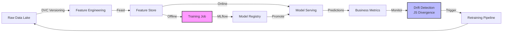

# 🔚 End-to-End ML Project

## Introduction

Building a machine learning model that performs well on a local Jupyter notebook is only the beginning of a much larger engineering challenge. An end-to-end ML project encompasses the entire lifecycle of a model: from data ingestion and versioning to deployment, monitoring, and eventual retraining. This course adapts the CRISP-ML(Q) methodology for the modern MLOps era, where reproducibility, scalability, and observability are non-negotiable requirements.

We will explore how tools like DVC, MLflow, and Feast transform ad-hoc experimentation into industrial-grade pipelines. Understanding [[01 - Kaggle Competitions|competition-grade modeling]] gives you the algorithmic foundation, while [[03 - Fine-Tuning LLMs|fine-tuning expertise]] extends these pipelines to generative AI. The goal is to build systems that not only predict accurately but also degrade gracefully in production.

## 1. CRISP-ML(Q) and the Modern MLOps Lifecycle

CRISP-ML(Q) extends the original CRISP-DM data mining standard with explicit quality assurance gates at each phase. In production environments, this lifecycle is augmented by MLOps practices that treat ML assets with the same rigor as software artifacts.

- **Business Understanding:** Define success metrics in business terms, not just ML metrics. A model with 99% accuracy is useless if its false negative rate bankrupts the company.
- **Data Understanding & Preparation:** Version your data. Raw data is an immutable asset; transformations must be reproducible.
- **Modeling:** Experiment tracking is mandatory. Every hyperparameter, feature set, and random seed must be logged.
- **Evaluation:** Validate against business KPIs, not just validation AUC.
- **Deployment:** Models must be packaged, versioned in a model registry, and served with low latency.
- **Monitoring & Maintenance:** Production data drifts. Models require continuous monitoring for data quality, concept drift, and performance decay.

Deep conceptual explanation:

- The MLOps lifecycle is not linear; it is a continuous loop. Deployment triggers monitoring, which triggers retraining, which triggers re-deployment.
- **Data versioning** with DVC ensures that every experiment is tied to an exact dataset version, not just a git commit.
- **Experiment tracking** with MLflow decouples the code from the results, allowing data scientists to compare hundreds of runs across teams.

Real case: Netflix's recommendation pipeline is a canonical example of end-to-end ML at scale. Netflix uses a multi-layered architecture where offline training happens in Spark/Scala, models are stored in a central registry, and online serving uses microservices with A/B testing frameworks. Their pipeline handles billions of events per day, with strict monitoring for ranking drift and coverage metrics. The key lesson is that the model itself is a small fraction of the total system complexity.

⚠️ **Warning:** Do not deploy a model without a rollback strategy. Production incidents caused by bad model deployments are often more damaging than software bugs because they silently degrade user experience over hours or days.

💡 **Tip:** Start with a "shadow deployment" where the new model makes predictions but does not affect user-facing decisions. Compare its predictions against the production model for a week before promoting it.

## 2. MLOps Tooling and Pipeline Stages

Modern MLOps relies on a specialized toolchain. Each tool addresses a specific failure mode in the ML lifecycle.

| Pipeline Stage | Tool | Purpose | Failure Mode Prevented |
|---|---|---|---|
| Data Versioning | DVC | Track dataset versions with git | "It worked on my machine" data issues |
| Experiment Tracking | MLflow | Log params, metrics, artifacts | Lost experiment history, irreproducible results |
| Feature Store | Feast | Serve consistent features online/offline | Training-serving skew |
| Model Registry | MLflow / Vertex AI | Version and stage models (Staging/Prod) | Deploying untested or wrong model versions |
| Orchestration | Prefect / Airflow | Schedule and monitor pipeline steps | Broken pipelines running silently |
| Monitoring | Evidently / WhyLabs | Detect data drift and performance decay | Silent model degradation |

Deep conceptual explanation:

- **Training-serving skew** occurs when features used during training are computed differently than features used during inference. Feast solves this by providing a unified feature computation layer.
- **Data drift** is quantified by measuring the divergence between the training distribution and the production distribution. The **Jensen-Shannon divergence** is a symmetric and bounded measure for this purpose.
- **Formula:** `Data Drift = JS(P_train || P_prod)` where JS is the Jensen-Shannon divergence between the training probability distribution P_train and the production probability distribution P_prod.
- A/B testing frameworks allow you to measure causal business impact, isolating the model's effect from seasonal or external trends.

## 3. Drift Detection and Model Lifecycle Visualization

Understanding the flow of data and models through the production system is critical for debugging and auditing.



Deep conceptual explanation:

- **Data drift** (covariate shift) happens when the input feature distribution changes. **Concept drift** happens when the relationship between features and target changes. Both require different remediation strategies.
- **Drift detection** should not trigger retraining immediately. Use statistical process control (e.g., 3-sigma rules) to avoid reacting to noise.
- Model registries enforce a promotion workflow: Development -> Staging -> Production -> Archived. No model reaches production without passing integration tests.


## 4. Production Pipeline Implementation

Below is a Python example integrating DVC for data versioning, MLflow for experiment tracking, and a simple drift detection module.

```python
import pandas as pd
import numpy as np
import mlflow
import mlflow.sklearn
from sklearn.ensemble import RandomForestClassifier
from sklearn.model_selection import train_test_split
from sklearn.metrics import accuracy_score
from scipy.spatial.distance import jensenshannon
import dvc.api

# Set MLflow tracking
mlflow.set_tracking_uri("http://localhost:5000")
mlflow.set_experiment("churn_prediction")

# Load versioned data via DVC
with dvc.api.open(
    path="data/customers.csv",
    repo=".",
    rev="v1.0"
) as f:
    df = pd.read_csv(f)

# Feature engineering
features = ["tenure", "monthly_charges", "total_charges"]
X = df[features].fillna(0)
y = df["churn"]

# Train/validation split
X_train, X_val, y_train, y_val = train_test_split(X, y, test_size=0.2, random_state=42)

# Start MLflow run
with mlflow.start_run():
    # Log parameters
    mlflow.log_param("model_type", "RandomForest")
    mlflow.log_param("n_estimators", 200)
    mlflow.log_param("max_depth", 10)
    
    # Train model
    model = RandomForestClassifier(n_estimators=200, max_depth=10, random_state=42)
    model.fit(X_train, y_train)
    
    # Evaluate
    preds = model.predict(X_val)
    acc = accuracy_score(y_val, preds)
    mlflow.log_metric("accuracy", acc)
    
    # Log model to registry
    mlflow.sklearn.log_model(
        sk_model=model,
        artifact_path="model",
        registered_model_name="churn_model"
    )
    
    print(f"Validation Accuracy: {acc:.4f}")

# Drift detection helper
def detect_drift(train_data, prod_data, feature, threshold=0.1):
    """Compute Jensen-Shannon divergence for a single feature."""
    train_hist, bins = np.histogram(train_data[feature], bins=50, density=True)
    prod_hist, _ = np.histogram(prod_data[feature], bins=bins, density=True)
    # Add small epsilon to avoid log(0)
    train_hist += 1e-10
    prod_hist += 1e-10
    js_div = jensenshannon(train_hist, prod_hist)
    is_drift = js_div > threshold
    return js_div, is_drift

# Example usage
# prod_df = pd.read_csv("production_data.csv")
# for feat in features:
#     js, drift = detect_drift(X, prod_df, feat)
#     print(f"Feature {feat}: JS={js:.4f}, Drift={drift}")
```

---

## 📦 Compression Code

```python
"""
End-to-End ML Pipeline Micro-Framework
A concise, reusable pattern for DVC + MLflow + Drift Detection.
"""
import mlflow
import mlflow.sklearn
from sklearn.metrics import accuracy_score
from scipy.spatial.distance import jensenshannon
import numpy as np

class MLOpsPipeline:
    def __init__(self, experiment_name, tracking_uri="http://localhost:5000"):
        mlflow.set_tracking_uri(tracking_uri)
        mlflow.set_experiment(experiment_name)
        self.run_id = None
    
    def train_and_log(self, model, X_train, X_val, y_train, y_val, params, model_name):
        with mlflow.start_run() as run:
            self.run_id = run.info.run_id
            for k, v in params.items():
                mlflow.log_param(k, v)
            model.fit(X_train, y_train)
            preds = model.predict(X_val)
            acc = accuracy_score(y_val, preds)
            mlflow.log_metric("val_accuracy", acc)
            mlflow.sklearn.log_model(model, "model", registered_model_name=model_name)
            return model, acc
    
    @staticmethod
    def check_drift(train_data, prod_data, feature, bins=50, threshold=0.1):
        t_hist, edges = np.histogram(train_data[feature], bins=bins, density=True)
        p_hist, _ = np.histogram(prod_data[feature], bins=edges, density=True)
        js = jensenshannon(t_hist + 1e-10, p_hist + 1e-10)
        return float(js), js > threshold

# Usage
# pipeline = MLOpsPipeline("my_experiment")
# model, acc = pipeline.train_and_log(RandomForestClassifier(), X_tr, X_val, y_tr, y_val, {"n_estimators": 100}, "my_model")
```

## 🎯 Documented Project

### Description

Design and implement a complete churn prediction system for a fictional telecom provider. The system must ingest raw customer data, version it with DVC, engineer features stored in Feast, train a model tracked by MLflow, serve predictions via a REST API, and monitor incoming data for drift using Jensen-Shannon divergence. Include an A/B testing framework to compare the new model against the legacy rule-based system.

### Functional Requirements

1. Implement a DVC pipeline that stages data ingestion, cleaning, and feature engineering, with each stage reproducible via `dvc repro`.
2. Configure a Feast feature store that serves the same features during batch training and online inference to eliminate training-serving skew.
3. Integrate MLflow experiment tracking and a model registry with explicit Staging and Production stages, requiring manual approval for promotion.
4. Build a drift detection service that computes daily JS divergence for all numerical features and triggers alerts when drift exceeds 0.15.
5. Deploy the model behind a FastAPI endpoint with A/B testing logic that routes 10% of traffic to the new model and 90% to the baseline, logging all predictions for analysis.

### Main Components

- **Data Pipeline:** DVC-managed ETL process with versioned raw and processed datasets.
- **Feature Platform:** Feast feature store with online and offline stores synchronized.
- **Training & Registry:** MLflow tracking server and model registry with CI/CD hooks.
- **Serving Layer:** FastAPI application with A/B routing and request/response logging.
- **Monitoring Dashboard:** A simple Streamlit or Grafana dashboard showing drift metrics and model performance over time.

### Success Metrics

- Achieve >85% validation accuracy on churn prediction with a recall of at least 70% for the churn class.
- Detect synthetic data drift (injected via distribution shift) within 24 hours with 100% accuracy.
- A/B test shows a statistically significant 5% improvement in retention rate compared to the baseline rule system.

### References

- Burkov, Andriy. "Machine Learning Engineering." True Positive Inc., 2020.
- Huyen, Chip. "Designing Machine Learning Systems." O'Reilly Media, 2022.
- Netflix Tech Blog. "Recommending for the World: Building a Scalable Real-time Recommendation Pipeline."
- MLflow Documentation. https://mlflow.org/docs/latest/index.html
