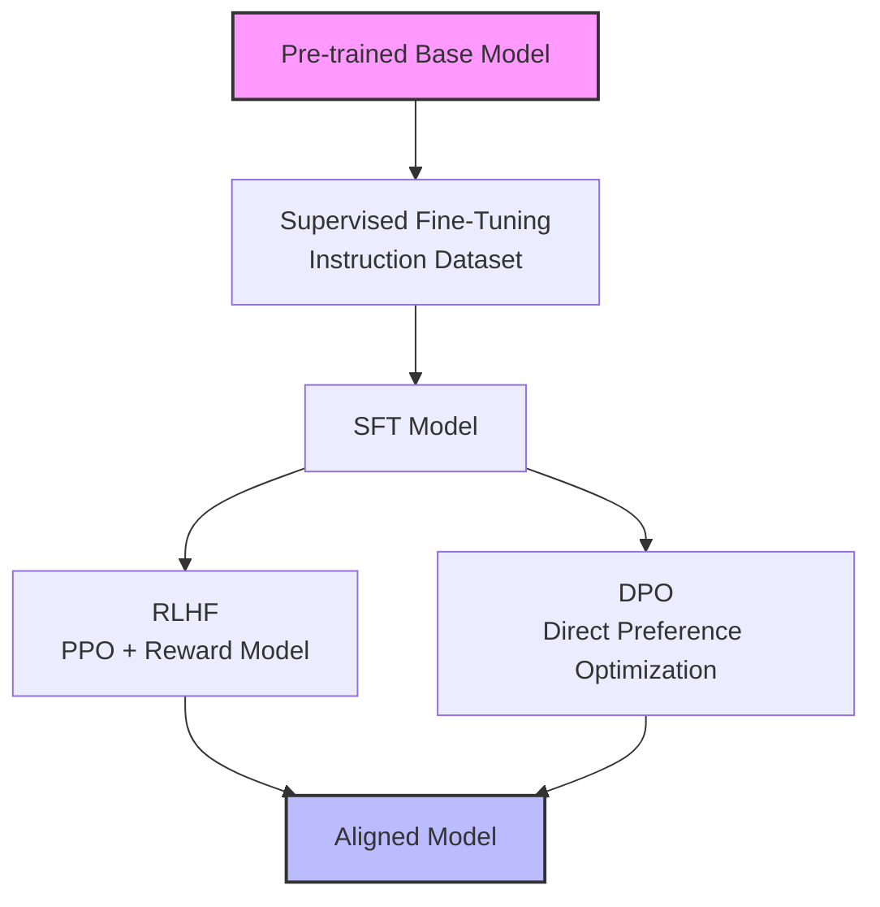

# 🔧 Fine-Tuning LLMs

## Introduction

Large Language Models (LLMs) like GPT-4, Llama, and Mistral have demonstrated remarkable zero-shot capabilities, yet they remain generalists. Fine-tuning allows practitioners to adapt these foundation models to specific domains, styles, or tasks—transforming a general-purpose model into a specialized expert. However, full fine-tuning of multi-billion parameter models is computationally prohibitive for most organizations, necessitating parameter-efficient fine-tuning (PEFT) techniques.

This course delves into the theoretical underpinnings of fine-tuning, from low-rank adaptation (LoRA) to reinforcement learning from human feedback (RLHF). We will cover memory optimization strategies like gradient checkpointing and mixed precision training, which make fine-tuning feasible on consumer hardware. Knowledge from [[01 - Kaggle Competitions|competition pipelines]] and [[02 - End-to-End ML Project|MLOps systems]] is essential for managing experiments and deploying fine-tuned models responsibly.

## 1. Full Fine-Tuning vs Parameter-Efficient Fine-Tuning (PEFT)

Full fine-tuning updates every parameter in a pre-trained model. While this can yield optimal task performance, it requires enormous GPU memory and produces a full copy of the model for each task. PEFT methods freeze most of the base model and introduce a small number of trainable parameters, drastically reducing memory and storage costs.

- **LoRA (Low-Rank Adaptation):** Injects trainable low-rank matrices into the attention layers. Instead of updating a weight matrix `W`, it learns `W + ΔW` where `ΔW = BA` and `B` and `A` are low-rank matrices.
- **QLoRA:** Extends LoRA by quantizing the base model to 4-bit precision (using NormalFloat4) and keeping LoRA adapters in 16-bit. This enables fine-tuning 65B parameter models on a single 48GB GPU.
- **Adapters:** Inserts small bottleneck layers after the attention and feed-forward sublayers. Only these bottleneck parameters are trained.
- **Prefix Tuning / Prompt Tuning:** Prepends trainable vectors (virtual tokens) to the input. The model parameters remain entirely frozen.

Deep conceptual explanation:

- The core intuition behind LoRA is that the update matrix `ΔW` during fine-tuning has a low intrinsic rank. Empirical studies show that even with rank `r=8` or `r=16`, LoRA achieves performance comparable to full fine-tuning on many tasks.
- **Memory formula:** `Memory ≈ 4 × params × bytes_per_param × gpus` (simplified). For a 7B model in fp16, this is roughly `4 × 7B × 2 bytes ≈ 56 GB` for full fine-tuning with Adam (parameters + gradients + optimizer states). QLoRA reduces this to under 20 GB.
- Gradient checkpointing trades compute for memory by recomputing activations during the backward pass instead of storing them.

Real case: Stanford Alpaca demonstrated that a 7B parameter Llama model could be fine-tuned to follow instructions with remarkable quality using only 52,000 synthetic training examples generated by GPT-3.5. More recently, Mistral fine-tuning communities have shown that QLoRA on Mistral-7B outperforms larger, unfine-tuned models on domain-specific benchmarks like medical question answering and legal document analysis.

⚠️ **Warning:** Fine-tuning on biased or low-quality data can amplify harmful behaviors. Always evaluate fine-tuned models for toxicity, hallucination rates, and fairness before deployment. PEFT does not immunize a model against catastrophic forgetting if not configured properly.

💡 **Tip:** When using QLoRA, always use the `bf16` compute dtype if your GPU supports it (Ampere or newer). This avoids the gradient scaling issues common with `fp16` while retaining most of the memory savings.

## 2. PEFT Methods Comparison

Choosing the right PEFT method depends on your GPU budget, target task, and latency requirements.

| Method | Trainable Params | Memory Overhead | Relative Performance | Best Use Case |
|---|---|---|---|---|
| Full Fine-Tuning | 100% | Very High (60-80GB for 7B) | Baseline (Best) | Unlimited compute, maximum accuracy needed |
| LoRA | ~0.1-1% | Low (adds small matrices) | ~95-99% of full | General instruction tuning, domain adaptation |
| QLoRA | ~0.1-1% | Very Low (~15-20GB for 65B) | ~90-95% of full | Single-GPU fine-tuning of very large models |
| Adapters | ~1-5% | Low-Medium | ~90-95% of full | Multi-task serving with task-switching adapters |
| Prefix Tuning | ~0.01% | Minimal | ~80-90% of full | Simple task conditioning, extreme memory constraints |

Deep conceptual explanation:

- **Mixed precision training** uses `fp16` or `bf16` for forward/backward passes while keeping a master copy of weights in `fp32` for optimizer updates. This reduces memory by nearly half and leverages Tensor Cores on modern GPUs.
- **Gradient accumulation** simulates larger batch sizes by accumulating gradients over multiple forward passes before performing an optimizer step. This is essential when GPU memory limits the per-device batch size to 1.
- The trade-off between PEFT methods is not just memory but also inference latency. LoRA adapters can be merged into the base weights at inference time, introducing zero latency overhead. Adapters and prefixes cannot be merged and add minor computational cost.

## 3. Alignment: Instruction Tuning, RLHF, and DPO

Fine-tuning adapts a model to a domain; alignment adapts it to human preferences and safety constraints.



Deep conceptual explanation:

- **Instruction Tuning (SFT):** Trains the model on pairs of (instruction, response) using standard next-token prediction loss. This teaches the model the format and style of helpful assistants but does not explicitly optimize for preference.
- **RLHF (Reinforcement Learning from Human Feedback):** Uses a reward model trained on human preference comparisons to guide the policy model via PPO (Proximal Policy Optimization). The reward model acts as a proxy for human judgment.
- **DPO (Direct Preference Optimization):** A simpler alternative to RLHF that directly optimizes the policy model on preference data without training a separate reward model. DPO is more stable and easier to implement than PPO.
- Alignment often induces a capability tax: the model may become more helpful but slightly less knowledgeable on niche factual tasks.


## 4. Fine-Tuning Implementation

Below is a complete QLoRA fine-tuning example using the `transformers`, `peft`, and `trl` libraries.

```python
import torch
from transformers import (
    AutoModelForCausalLM,
    AutoTokenizer,
    TrainingArguments,
    BitsAndBytesConfig
)
from peft import LoraConfig, get_peft_model, prepare_model_for_kbit_training
from trl import SFTTrainer
from datasets import load_dataset

# Model and dataset configuration
model_id = "mistralai/Mistral-7B-v0.1"
dataset = load_dataset("tatsu-lab/alpaca", split="train[:1000]")

# 4-bit quantization config
bnb_config = BitsAndBytesConfig(
    load_in_4bit=True,
    bnb_4bit_quant_type="nf4",
    bnb_4bit_compute_dtype=torch.bfloat16,
    bnb_4bit_use_double_quant=True,
)

# Load model and tokenizer
model = AutoModelForCausalLM.from_pretrained(
    model_id,
    quantization_config=bnb_config,
    device_map="auto",
    trust_remote_code=True,
)
model.config.use_cache = False
model = prepare_model_for_kbit_training(model)

tokenizer = AutoTokenizer.from_pretrained(model_id, trust_remote_code=True)
tokenizer.pad_token = tokenizer.eos_token

# LoRA configuration
lora_config = LoraConfig(
    r=16,
    lora_alpha=32,
    target_modules=["q_proj", "k_proj", "v_proj", "o_proj"],
    lora_dropout=0.05,
    bias="none",
    task_type="CAUSAL_LM",
)

model = get_peft_model(model, lora_config)

# Training arguments
args = TrainingArguments(
    output_dir="./mistral-alpaca-qlora",
    num_train_epochs=1,
    per_device_train_batch_size=4,
    gradient_accumulation_steps=4,
    optim="paged_adamw_8bit",
    save_steps=50,
    logging_steps=10,
    learning_rate=2e-4,
    bf16=True,
    max_grad_norm=0.3,
    warmup_ratio=0.03,
    lr_scheduler_type="cosine",
)

# Format dataset for instruction tuning
def format_prompt(example):
    if example["input"]:
        text = f"### Instruction:\n{example['instruction']}\n### Input:\n{example['input']}\n### Response:\n{example['output']}"
    else:
        text = f"### Instruction:\n{example['instruction']}\n### Response:\n{example['output']}"
    return text

# Trainer
trainer = SFTTrainer(
    model=model,
    tokenizer=tokenizer,
    train_dataset=dataset,
    max_seq_length=512,
    args=args,
    formatting_func=format_prompt,
)

# Train
trainer.train()

# Save adapter
model.save_pretrained("./mistral-alpaca-qlora-adapter")
tokenizer.save_pretrained("./mistral-alpaca-qlora-adapter")

# Inference example
# from peft import PeftModel
# base = AutoModelForCausalLM.from_pretrained(model_id, device_map="auto")
# model = PeftModel.from_pretrained(base, "./mistral-alpaca-qlora-adapter")
# model = model.merge_and_unload()  # Merge LoRA weights for faster inference
```

---

## 📦 Compression Code

```python
"""
QLoRA Fine-Tuning Minimal Template
A reusable, compact script for instruction tuning with PEFT.
"""
import torch
from transformers import AutoModelForCausalLM, AutoTokenizer, BitsAndBytesConfig
from peft import LoraConfig, get_peft_model, prepare_model_for_kbit_training
from trl import SFTTrainer
from datasets import load_dataset

def quick_qlora(model_id, dataset_name, output_dir, epochs=1, rank=16):
    bnb = BitsAndBytesConfig(
        load_in_4bit=True,
        bnb_4bit_quant_type="nf4",
        bnb_4bit_compute_dtype=torch.bfloat16,
    )
    model = AutoModelForCausalLM.from_pretrained(
        model_id, quantization_config=bnb, device_map="auto"
    )
    model = prepare_model_for_kbit_training(model)
    tokenizer = AutoTokenizer.from_pretrained(model_id)
    tokenizer.pad_token = tokenizer.eos_token
    
    lora = LoraConfig(r=rank, lora_alpha=rank*2, lora_dropout=0.05, bias="none", task_type="CAUSAL_LM")
    model = get_peft_model(model, lora)
    
    dataset = load_dataset(dataset_name, split="train")
    trainer = SFTTrainer(
        model=model,
        tokenizer=tokenizer,
        train_dataset=dataset,
        max_seq_length=512,
        args=transformers.TrainingArguments(
            output_dir=output_dir,
            num_train_epochs=epochs,
            per_device_train_batch_size=4,
            gradient_accumulation_steps=4,
            optim="paged_adamw_8bit",
            learning_rate=2e-4,
            bf16=True,
            logging_steps=10,
        ),
    )
    trainer.train()
    model.save_pretrained(output_dir)
    return model, tokenizer

# Usage
# model, tok = quick_qlora("mistralai/Mistral-7B-v0.1", "tatsu-lab/alpaca", "./output")
```

## 🎯 Documented Project

### Description

Develop a domain-specific conversational assistant for medical triage (disclaimer: not for real medical use). The assistant should be fine-tuned from Mistral-7B using QLoRA on a curated dataset of medical Q&A pairs. The project must include supervised fine-tuning followed by Direct Preference Optimization (DPO) to align the model for safety and helpfulness. Deploy the final model via a FastAPI endpoint with streaming generation.

### Functional Requirements

1. Ingest and preprocess a medical Q&A dataset, filtering out low-quality or ambiguous examples and ensuring HIPAA-like anonymization of any personal information.
2. Perform QLoRA fine-tuning with at least 3 different rank configurations (e.g., r=8, 16, 32) and log all experiments using MLflow or Weights & Biases.
3. Implement DPO training using a preference dataset where human annotators ranked responses by safety and accuracy; compare DPO against the SFT-only baseline.
4. Evaluate the model using automated metrics (BLEU, ROUGE, perplexity) and a manual evaluation rubric for hallucination rate and refusal appropriateness.
5. Deploy the final merged model (base + LoRA weights merged) behind a FastAPI endpoint that supports streaming token generation and maintains a conversation history buffer.

### Main Components

- **Data Sanitization Module:** Handles PII removal, quality filtering, and dataset splitting.
- **Training Orchestrator:** Manages QLoRA SFT and DPO training loops with experiment tracking.
- **Evaluation Suite:** Automated metrics + human evaluation rubric for safety and accuracy.
- **Inference API:** FastAPI service with asynchronous streaming and conversation state management.

### Success Metrics

- Perplexity on the medical validation set is below 8.0 after SFT.
- DPO model shows a 20% relative reduction in harmful or hallucinated responses compared to the SFT baseline on a held-out safety test set.
- API latency remains under 500ms per token on a single A100 GPU with 10 concurrent users.

### References

- Hu, Edward J., et al. "LoRA: Low-Rank Adaptation of Large Language Models." ICLR 2022.
- Dettmers, Tim, et al. "QLoRA: Efficient Finetuning of Quantized LLMs." NeurIPS 2023.
- Rafailov, Rafael, et al. "Direct Preference Optimization: Your Language Model is Secretly a Reward Model." NeurIPS 2023.
- Taori, Rohan, et al. "Stanford Alpaca: An Instruction-following LLaMA model." 2023.
- Mistral AI Documentation. https://docs.mistral.ai/
