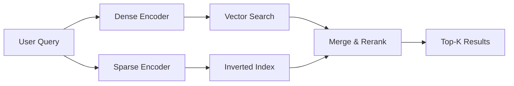
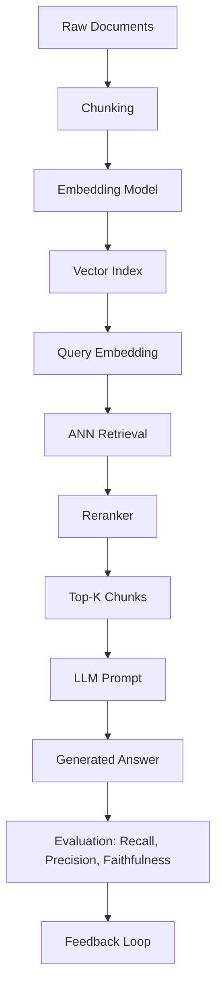

# 🤖 Production RAG System

## Introduction

Retrieval-Augmented Generation (RAG) represents a paradigm shift in how we build production-grade [[LLM]] applications. Instead of relying solely on the parametric knowledge frozen inside a model's weights, RAG systems dynamically retrieve relevant external documents before generating a response. This approach dramatically reduces hallucinations, enables grounding in private or up-to-date data, and provides traceability through citations. Understanding the theoretical foundations of retrieval and generation is essential for any [[Machine Learning]] engineer working with modern AI systems.

The journey from a prototype RAG notebook to a production system involves solving numerous engineering challenges. You must design effective [[chunking strategies]], select appropriate [[vector databases]] with the right indexing algorithms, and implement sophisticated retrieval mechanisms that go beyond simple similarity search. The difference between a demo and a production system often lies in the quality of the retrieval layer and the robustness of the evaluation framework.

This course covers the full theoretical and practical spectrum of production RAG systems. We will explore advanced retrieval techniques including hybrid search and reranking, compare vector database architectures, and build a complete evaluation pipeline. By the end, you will understand how to architect RAG systems that can handle millions of documents with sub-second latency while maintaining high recall and precision.

## 1. RAG Foundations and Chunking Strategies

At its core, RAG combines two distinct AI subfields: information retrieval and natural language generation. The retrieval component searches a corpus for relevant passages, while the generation component synthesizes an answer conditioned on both the retrieved context and the user's query. This decoupling allows the system to access knowledge beyond the model's training cutoff and to specialize on domain-specific documents without fine-tuning.

The chunking strategy—the method by which documents are divided into retrievable units—is arguably the most critical design decision in any RAG system. Poor chunking leads to semantic fragmentation, where related information is split across chunks, or to bloated chunks that dilute relevance signals. There are three primary approaches to chunking:

- **Fixed-size chunking**: Splits documents into segments of a predetermined token or character length, often with a sliding window overlap. This method is simple and predictable but ignores semantic boundaries, potentially cutting sentences or paragraphs mid-thought.
- **Semantic chunking**: Uses embedding similarity or natural language understanding to group related sentences together. This preserves meaning boundaries and often improves retrieval quality, though it requires more computation and can produce variable-length chunks that complicate batching.
- **Hierarchical chunking**: Organizes documents into a tree structure where parent chunks provide coarse context and child chunks provide fine-grained detail. This enables multi-granularity retrieval and is particularly effective for long documents like research papers or legal contracts.

Real case: Microsoft's Azure OpenAI RAG implements a sophisticated multi-stage chunking pipeline for enterprise documents. They first extract structural elements (headings, tables, lists), then apply semantic chunking within each section, and finally index chunks at multiple granularities to support both broad and targeted queries.

⚠️ **Warning**: Overlapping chunks can dramatically increase your index size. A 20% overlap on 1M chunks creates 1.2M vectors, increasing storage and search costs proportionally. Always measure the retrieval quality improvement against the infrastructure cost.

💡 **Tip**: When using hierarchical chunking, store the parent chunk ID as metadata in each child chunk. During retrieval, you can dynamically expand context by fetching the parent if the child chunk alone is insufficient for answering the query.

## 2. Vector Databases and Indexing Trade-offs

Choosing the right vector database and index type is a fundamental systems decision that affects latency, recall, cost, and operational complexity. The Approximate Nearest Neighbor (ANN) problem has spawned numerous algorithmic families, each with distinct characteristics.

| Database | Primary Index | Best For | Latency (ms) | Max Scale | Self-Hosted |
|----------|--------------|----------|--------------|-----------|-------------|
| Chroma | HNSW | Prototyping, small datasets | 10-50 | <1M vectors | Yes |
| Weaviate | HNSW + inverted index | Hybrid search, multimodal | 5-20 | <100M vectors | Yes |
| Pinecone | Metadata-aware proprietary | Managed production | 10-30 | >1B vectors | No |
| Milvus | IVF, HNSW, DISKANN | Massive scale, flexibility | 5-50 | >10B vectors | Yes |
| Qdrant | HNSW + filtering | Filtered ANN, Rust performance | 5-15 | <1B vectors | Yes |

The three main index families deserve deeper understanding:

- **Flat (brute-force)**: Computes exact distances to every vector. Guarantees perfect recall but has O(n) query complexity. Suitable only for small datasets (<100k) or when exactness is mandatory.
- **HNSW (Hierarchical Navigable Small World)**: Builds a multi-layer graph where upper layers provide long-range navigation and lower layers provide local refinement. Offers excellent recall/speed trade-offs with O(log n) complexity, but high memory usage and slow index construction.
- **IVF (Inverted File Index)**: Clusters vectors into Voronoi cells using k-means. At query time, only the nearest cells are searched. Much lower memory footprint than HNSW and faster to build, but requires careful tuning of the number of probes to maintain recall.

⚠️ **Warning**: HNSW indexes are memory-hungry. Each vector requires 2-4x its raw size in graph overhead. For billion-scale deployments, consider Milvus's DISKANN or hybrid DRAM/SSD approaches rather than pure in-memory HNSW.

## 3. Advanced Retrieval and Evaluation

Modern production RAG systems rarely rely on single-vector dense retrieval alone. The progression toward higher retrieval quality typically follows this evolution path:

**Hybrid Search (Sparse + Dense)**
Dense embeddings capture semantic meaning but can miss exact lexical matches, especially for rare technical terms, product names, or acronyms. Sparse retrieval methods like BM25 excel at exact term matching. A hybrid approach combines both:



The merge function typically uses a weighted linear combination or a learned model to fuse sparse and dense scores. Reciprocal Rank Fusion (RRF) is a popular parameter-free alternative that ranks documents by their harmonic mean of reciprocal ranks across both search modes.

**Reranking**
Initial retrieval is optimized for recall—it retrieves a broad candidate set quickly. Reranking then reorders these candidates using a more expensive but more accurate model:

- **Cross-encoders**: Feed the query and document together into a transformer, producing a relevance score. Highly accurate but O(n) per document, suitable for reranking 100-1000 candidates.
- **ColBERT**: Uses late interaction—separately encodes query and document into token-level embeddings, then computes a fine-grained similarity matrix. Offers a middle ground between bi-encoder speed and cross-encoder accuracy.

**Evaluation Metrics**
The quality of a RAG system must be measured systematically. The foundational metric for retrieval is:

$$
\text{Recall@k} = \frac{|\text{Relevant}_k|}{|\text{Total Relevant}|}
$$

Where Relevant_k is the set of relevant documents in the top-k retrieved results, and Total Relevant is the total number of relevant documents for the query. High recall ensures the generator has access to the necessary context. Complementary metrics include Precision@k, NDCG, and MRR.

Real case: Perplexity.ai built their entire product on a sophisticated multi-stage RAG pipeline. They combine real-time web search (sparse), dense embeddings of indexed pages, and a cross-encoder reranker. Their system must answer factual questions within seconds, making latency optimization across every retrieval stage critical to their user experience.




## 4. Building a Production RAG Pipeline

Below is a complete Python implementation demonstrating document chunking, embedding, vector storage with HNSW, hybrid retrieval, and evaluation:

```python
import numpy as np
from typing import List, Dict, Tuple
from dataclasses import dataclass
import heapq

@dataclass
class Chunk:
    text: str
    embedding: np.ndarray
    metadata: Dict

class HNSWIndex:
    """Simplified HNSW index for educational purposes."""
    def __init__(self, dim: int, m: int = 16, ef_construction: int = 200):
        self.dim = dim
        self.m = m
        self.ef_construction = ef_construction
        self.vectors = []
        self.graph = []
    
    def add(self, vector: np.ndarray):
        idx = len(self.vectors)
        self.vectors.append(vector)
        neighbors = self._search_layer(vector, self.ef_construction)
        self.graph.append(neighbors[:self.m])
    
    def _search_layer(self, query: np.ndarray, ef: int) -> List[int]:
        if not self.vectors:
            return []
        dists = [(i, np.linalg.norm(query - v)) for i, v in enumerate(self.vectors)]
        return [i for i, _ in heapq.nsmallest(ef, dists, key=lambda x: x[1])]
    
    def search(self, query: np.ndarray, k: int = 10) -> List[Tuple[int, float]]:
        if not self.vectors:
            return []
        dists = [(i, np.linalg.norm(query - v)) for i, v in enumerate(self.vectors)]
        return [(i, d) for i, d in heapq.nsmallest(k, dists, key=lambda x: x[1])]

class RAGPipeline:
    """End-to-end RAG pipeline with evaluation."""
    def __init__(self, embedder, index, reranker=None):
        self.embedder = embedder
        self.index = index
        self.reranker = reranker
        self.chunks = []
    
    def add_documents(self, documents: List[str], chunk_size: int = 512):
        for doc_id, doc in enumerate(documents):
            words = doc.split()
            for i in range(0, len(words), chunk_size):
                chunk_text = " ".join(words[i:i + chunk_size])
                emb = self.embedder.encode(chunk_text)
                chunk = Chunk(text=chunk_text, embedding=emb, metadata={"doc_id": doc_id})
                self.chunks.append(chunk)
                self.index.add(emb)
    
    def retrieve(self, query: str, k: int = 10) -> List[Chunk]:
        query_emb = self.embedder.encode(query)
        results = self.index.search(query_emb, k=k * 2 if self.reranker else k)
        candidates = [self.chunks[i] for i, _ in results]
        if self.reranker:
            scores = [self.reranker.score(query, c.text) for c in candidates]
            ranked = sorted(zip(candidates, scores), key=lambda x: x[1], reverse=True)
            candidates = [c for c, _ in ranked[:k]]
        return candidates
    
    @staticmethod
    def recall_at_k(retrieved: List[Chunk], relevant_ids: set, k: int) -> float:
        retrieved_ids = {c.metadata["doc_id"] for c in retrieved[:k]}
        relevant_in_k = len(retrieved_ids & relevant_ids)
        return relevant_in_k / len(relevant_ids) if relevant_ids else 0.0

# Usage example
# pipeline = RAGPipeline(embedder=SentenceTransformer('all-MiniLM-L6-v2'), index=HNSWIndex(dim=384))
# pipeline.add_documents(["RAG is a powerful architecture...", "Vector databases enable..."])
# results = pipeline.retrieve("What is RAG?", k=5)
```

💡 **Tip**: Always benchmark your chosen embedding model on your specific domain before committing to it. Generic models like `all-MiniLM-L6-v2` work well for general text but often underperform on medical, legal, or highly technical corpora where domain-specific fine-tuned models provide significant recall improvements.

---

## 📦 Compression Code

```python
"""
Production RAG System - Complete Summarizing Script
This script encapsulates the core concepts: chunking, HNSW indexing,
hybrid retrieval, reranking, and evaluation metrics.
"""

import numpy as np
from typing import List, Dict, Tuple, Set
from dataclasses import dataclass
import heapq
from collections import defaultdict


@dataclass
class Chunk:
    text: str
    embedding: np.ndarray
    sparse_tokens: Dict[str, float]
    metadata: Dict


class SimpleHNSW:
    def __init__(self, dim: int, m: int = 16):
        self.dim = dim
        self.m = m
        self.vectors: List[np.ndarray] = []
        self.graph: List[List[int]] = []
    
    def add(self, vector: np.ndarray):
        idx = len(self.vectors)
        self.vectors.append(vector)
        if idx == 0:
            self.graph.append([])
            return
        dists = [(i, np.linalg.norm(vector - v)) for i, v in enumerate(self.vectors[:-1])]
        neighbors = [i for i, _ in heapq.nsmallest(self.m, dists, key=lambda x: x[1])]
        self.graph.append(neighbors)
    
    def search(self, query: np.ndarray, k: int = 10) -> List[Tuple[int, float]]:
        if not self.vectors:
            return []
        dists = [(i, np.linalg.norm(query - v)) for i, v in enumerate(self.vectors)]
        return [(i, d) for i, d in heapq.nsmallest(k, dists, key=lambda x: x[1])]


class BM25:
    def __init__(self, k1: float = 1.5, b: float = 0.75):
        self.k1 = k1
        self.b = b
        self.doc_freqs: Dict[str, int] = defaultdict(int)
        self.doc_lengths: List[int] = []
        self.total_docs = 0
        self.avg_dl = 0.0
        self.inverted_index: Dict[str, List[Tuple[int, int]]] = defaultdict(list)
    
    def fit(self, tokenized_docs: List[List[str]]):
        self.total_docs = len(tokenized_docs)
        self.doc_lengths = [len(d) for d in tokenized_docs]
        self.avg_dl = sum(self.doc_lengths) / self.total_docs if self.total_docs else 0.0
        
        for doc_id, tokens in enumerate(tokenized_docs):
            freq = defaultdict(int)
            for token in tokens:
                freq[token] += 1
            for token, count in freq.items():
                self.doc_freqs[token] += 1
                self.inverted_index[token].append((doc_id, count))
    
    def search(self, query_tokens: List[str], k: int = 10) -> List[Tuple[int, float]]:
        scores = defaultdict(float)
        for token in query_tokens:
            if token not in self.inverted_index:
                continue
            idf = np.log((self.total_docs - self.doc_freqs[token] + 0.5) /
                         (self.doc_freqs[token] + 0.5) + 1.0)
            for doc_id, tf in self.inverted_index[token]:
                dl = self.doc_lengths[doc_id]
                denom = tf + self.k1 * (1 - self.b + self.b * dl / self.avg_dl)
                scores[doc_id] += idf * (tf * (self.k1 + 1)) / denom
        return heapq.nlargest(k, scores.items(), key=lambda x: x[1])


class HybridRAG:
    def __init__(self, embedder, dim: int, alpha: float = 0.7):
        self.embedder = embedder
        self.dense_index = SimpleHNSW(dim=dim)
        self.bm25 = BM25()
        self.alpha = alpha
        self.chunks: List[Chunk] = []
        self.tokenized_docs: List[List[str]] = []
    
    def add_documents(self, documents: List[str]):
        for doc_id, doc in enumerate(documents):
            tokens = doc.lower().split()
            emb = self.embedder.encode(doc)
            sparse = {t: tokens.count(t) for t in set(tokens)}
            chunk = Chunk(text=doc, embedding=emb, sparse_tokens=sparse,
                          metadata={"doc_id": doc_id})
            self.chunks.append(chunk)
            self.dense_index.add(emb)
            self.tokenized_docs.append(tokens)
        self.bm25.fit(self.tokenized_docs)
    
    def retrieve(self, query: str, k: int = 10) -> List[Tuple[Chunk, float]]:
        query_emb = self.embedder.encode(query)
        dense_results = {i: 1.0 / (1.0 + d) for i, d in self.dense_index.search(query_emb, k=k)}
        
        query_tokens = query.lower().split()
        sparse_results = {i: s for i, s in self.bm25.search(query_tokens, k=k)}
        
        all_ids = set(dense_results.keys()) | set(sparse_results.keys())
        fused = {}
        for idx in all_ids:
            d_score = dense_results.get(idx, 0.0)
            s_score = sparse_results.get(idx, 0.0)
            fused[idx] = self.alpha * d_score + (1 - self.alpha) * s_score
        
        top_k = heapq.nlargest(k, fused.items(), key=lambda x: x[1])
        return [(self.chunks[i], score) for i, score in top_k]
    
    @staticmethod
    def recall_at_k(retrieved: List[Tuple[Chunk, float]], relevant_ids: Set[int], k: int) -> float:
        retrieved_ids = {c.metadata["doc_id"] for c, _ in retrieved[:k]}
        return len(retrieved_ids & relevant_ids) / len(relevant_ids) if relevant_ids else 0.0


# End-to-end usage:
# rag = HybridRAG(embedder=your_embedder, dim=384)
# rag.add_documents(["doc1...", "doc2..."])
# results = rag.retrieve("query", k=5)
# recall = HybridRAG.recall_at_k(results, {0, 2}, k=5)
```

## 🎯 Documented Project

### Description

Build a production-ready Retrieval-Augmented Generation system capable of indexing 100,000+ technical documents and answering user queries with cited sources. The system must support hybrid retrieval (dense + sparse), cross-encoder reranking, and continuous evaluation against a golden dataset. Deployed as a FastAPI service with async endpoints, it should achieve sub-500ms end-to-end latency for the retrieval stage.

### Functional Requirements

1. Support multiple document formats (PDF, Markdown, HTML) with automatic text extraction and cleaning.
2. Implement configurable chunking strategies (fixed-size, semantic, hierarchical) selectable at ingestion time.
3. Provide hybrid search endpoints combining dense vector similarity with BM25 sparse scoring and reciprocal rank fusion.
4. Integrate a cross-encoder reranker as a secondary stage to improve top-k precision before context delivery to the LLM.
5. Expose evaluation metrics (Recall@k, Precision@k, NDCG, answer faithfulness) via a monitoring dashboard with automated regression alerts.

### Main Components

- **Ingestion Service**: Async document parser and chunker with pluggable chunking strategies.
- **Embedding Pipeline**: Batched encoding using domain-adapted sentence transformers with ONNX runtime acceleration.
- **Vector Store**: Qdrant or Milvus backend with HNSW indexing, metadata filtering, and multi-tenancy support.
- **Retrieval Orchestrator**: Hybrid search controller managing dense ANN, sparse BM25, fusion, and reranking stages.
- **Evaluation Framework**: Automated benchmark runner against labeled query sets with statistical significance testing.

### Success Metrics

- **Recall@10 ≥ 0.85** on the internal benchmark dataset of 500 labeled technical queries.
- **P95 retrieval latency ≤ 300ms** for hybrid search + reranking on the production index.
- **Answer faithfulness score ≥ 0.80** as measured by an NLI-based entailment model on 100 held-out queries.
- **System availability ≥ 99.9%** over a 30-day monitoring window, including index updates and rolling restarts.

### References

- Lewis, P., et al. (2020). "Retrieval-Augmented Generation for Knowledge-Intensive NLP Tasks." *NeurIPS*.
- Karpukhin, V., et al. (2020). "Dense Passage Retrieval for Open-Domain Question Answering." *EMNLP*.
- Khattab, O., & Zaharia, M. (2020). "ColBERT: Efficient and Effective Passage Search via Contextualized Late Interaction over BERT." *SIGIR*.
