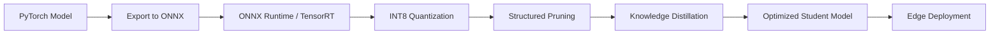
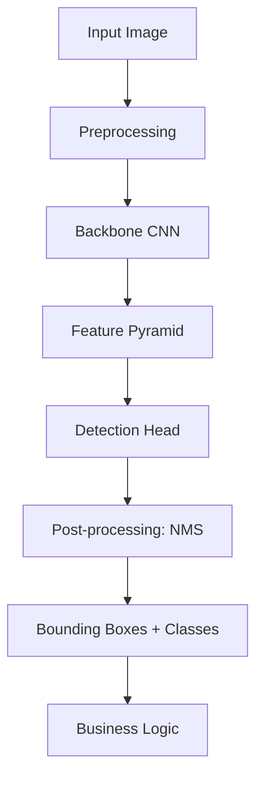

# 👁️ Computer Vision Pipeline

## Introduction

Computer Vision (CV) has evolved from classical feature engineering to deep learning architectures that can detect, segment, and understand visual content with superhuman accuracy in specific domains. Modern [[Computer Vision]] pipelines integrate convolutional networks, attention mechanisms, and optimization techniques to run efficiently from cloud data centers to edge devices. Understanding the theoretical foundations of detection architectures and model compression is critical for building scalable vision systems.

The field of object detection exemplifies the tension between speed and accuracy that pervades all practical CV engineering. Two-stage detectors like the R-CNN family prioritize accuracy by proposing regions before classification, while single-stage detectors like YOLO sacrifice some precision for real-time inference. More recently, transformer-based architectures like DETR have introduced set-based global reasoning that eliminates hand-designed components like anchor boxes and non-maximum suppression.

This course provides a deep theoretical and practical treatment of computer vision pipelines. We will dissect the architectural innovations behind major detection families, explore OCR methodologies from CRNN to transformers, and master the art of model optimization through quantization, pruning, and knowledge distillation. By the end, you will be equipped to design and deploy vision pipelines that balance accuracy, latency, and computational cost for your specific deployment constraints.

## 1. CNN Architectures for Object Detection

Object detection requires solving two problems simultaneously: localization (where is the object?) and classification (what is the object?). The architectural history of detection networks can be understood as a series of creative solutions to this dual-objective optimization problem.

**R-CNN Family (Region-based Convolutional Neural Networks)**

- **R-CNN (2014)**: Proposed selective search to generate ~2,000 region proposals per image, then ran each proposal through a CNN classifier independently. Groundbreaking but painfully slow at ~47 seconds per image.
- **Fast R-CNN (2015)**: Introduced ROI pooling to share convolutional features across proposals. Instead of running the CNN 2,000 times, it runs once and extracts fixed-size features for each proposal from the shared feature map. Reduced inference to ~2 seconds.
- **Faster R-CNN (2015)**: Replaced selective search with a Region Proposal Network (RPN) that shares convolutional features with the detection head. The RPN slides a small network over the feature map to predict objectness scores and bounding box refinements. This unified architecture achieves near real-time performance while maintaining high accuracy.

**YOLO Family (You Only Look Once)**

- **YOLOv1-v3**: Framed detection as a single regression problem, dividing the image into a grid and predicting bounding boxes and class probabilities simultaneously. Extremely fast (45-140 FPS) but struggled with small objects and tight localization.
- **YOLOv4/v5/v7/v8**: Iteratively incorporated modern backbone improvements (CSPDarknet), feature pyramid networks (FPN), anchor-free detection, and advanced augmentation (Mosaic, MixUp). YOLOv8 introduced a decoupled head separating classification and regression branches, dramatically improving convergence.
- **YOLOv9/v10**: Further optimized architecture through programmable gradient information (PGI) and end-to-end latency reduction, solidifying YOLO as the default choice for real-time applications.

**DETR (DEtection TRansformer)**

DETR reimagined detection as a direct set prediction problem. It uses a CNN backbone to extract features, then feeds flattened feature maps into a transformer encoder-decoder. The decoder produces a fixed set of predictions, and bipartite matching (Hungarian algorithm) assigns predictions to ground truth without duplicate removal via NMS. This elegant formulation removes hand-crafted components but requires longer training schedules.

Real case: Tesla's vision-only Full Self-Driving (FSD) stack relies on a custom HydraNet architecture that shares a common backbone across multiple detection and prediction tasks. They use multi-scale feature pyramids, temporal fusion from video streams, and extensive quantization to run 8 cameras at full resolution on their in-car FSD Computer with only 144 TOPS of INT8 compute.

⚠️ **Warning**: YOLO models are notoriously sensitive to anchor box priors and input resolution. Training at 640x640 and deploying at 1280x1280 without recalibrating anchors or retraining will produce severely degraded mAP. Always maintain training-deployment resolution consistency or use anchor-free variants.

💡 **Tip**: When choosing between Faster R-CNN and YOLO, analyze your latency requirements using the 80/20 rule. If your application requires >30 FPS on edge hardware, default to YOLOv8. If you need maximum accuracy on high-resolution images and can tolerate batch processing, Faster R-CNN with FPN remains highly competitive.

## 2. OCR and Speed vs Accuracy Trade-offs

Optical Character Recognition (CR) bridges computer vision and natural language processing. Modern OCR systems must handle diverse fonts, languages, layouts, and degradations. The two dominant paradigms are:

**CRNN (Convolutional Recurrent Neural Network)**

CRNN combines CNN feature extraction with bidirectional LSTM sequence modeling and CTC (Connectionist Temporal Classification) loss. The CNN acts as a visual feature extractor, the LSTM captures sequential dependencies in the feature sequence, and CTC eliminates the need for character-level alignment labels. CRNN remains effective for horizontal text but struggles with curved, rotated, or multi-oriented text.

**TrOCR (Transformer-based OCR)**

TrOCR treats OCR as an image-to-text translation problem using an encoder-decoder transformer architecture. The encoder (often a pre-trained vision transformer like BEiT) processes the text image, and the decoder (a pre-trained language model like RoBERTa) autoregressively generates the transcribed text. TrOCR achieves state-of-the-art accuracy on benchmark datasets and naturally handles multi-language scenarios through pre-training.

| Model | Architecture | Speed (ms/img) | Accuracy (SOTA dataset) | Best Use Case |
|-------|-------------|----------------|------------------------|---------------|
| CRNN | CNN + BiLSTM + CTC | 15-30 | Moderate | Horizontal text, resource-constrained |
| TrOCR | ViT + RoBERTa | 80-150 | Very High | Complex layouts, multi-language |
| PP-OCR | Ultra-light CNN + CTC | 5-10 | Good | Mobile/edge deployment |
| EasyOCR | CRAFT + CRNN | 20-40 | Moderate | General purpose, easy setup |

⚠️ **Warning**: TrOCR's autoregressive decoding is inherently sequential and cannot be easily parallelized during inference. For high-throughput document processing pipelines, consider batching aggressively or falling back to parallelizable CTC-based models for simple text lines.

## 3. Model Optimization Pipeline

Deploying CV models in production inevitably requires optimization. The gap between a research model trained on V100s and a model running on a mobile CPU is bridged through systematic compression and conversion.

**Quantization**

Quantization reduces numerical precision from FP32 to INT8 (or lower). Post-training quantization (PTQ) calibrates scales using a small representative dataset. Quantization-aware training (QAT) simulates low-precision arithmetic during training, allowing the model to adapt its weights to quantization error. INT8 inference can deliver 2-4x speedup and 4x memory reduction with minimal accuracy loss on most CNNs.

**Pruning**

Pruning removes redundant weights or entire structures (filters, channels) from the network. Unstructured pruning zeroes out individual weights but requires sparse hardware support for speed gains. Structured pruning removes whole filters, producing smaller dense matrices that run faster on standard hardware. Magnitude pruning and Lottery Ticket Hypothesis-based approaches are common starting points.

**Knowledge Distillation**

Distillation transfers knowledge from a large teacher model to a smaller student model. Instead of training the student on hard labels, it learns from the teacher's soft probability distribution (logits tempered with a temperature parameter). This preserves inter-class relationships and often allows a student to achieve near-teacher accuracy with a fraction of the parameters.

**ONNX Conversion**

The Open Neural Network Exchange (ONNX) format decouples model training frameworks from inference runtimes. Converting PyTorch or TensorFlow models to ONNX enables deployment optimized runtimes like ONNX Runtime, TensorRT, or OpenVINO, each providing hardware-specific acceleration.



Real case: Amazon Go's just-walk-out technology relies on hundreds of cameras running optimized detection and tracking models in real time. They use heavily quantized and pruned versions of standard detectors, combined with custom hardware accelerators, to process video streams from entire stores with sub-second latency for shopper action recognition.




## 4. Practical Implementation

Below is a Python script demonstrating quantization-aware training preparation, ONNX export, and benchmarking for a vision model:

```python
import torch
import torch.nn as nn
from torch.quantization import QuantStub, DeQuantStub, prepare_qat, convert
import onnx
import time

class SimpleDetector(nn.Module):
    """Simplified detection backbone for demonstration."""
    def __init__(self):
        super().__init__()
        self.quant = QuantStub()
        self.backbone = nn.Sequential(
            nn.Conv2d(3, 32, 3, padding=1), nn.ReLU(), nn.MaxPool2d(2),
            nn.Conv2d(32, 64, 3, padding=1), nn.ReLU(), nn.MaxPool2d(2),
            nn.Conv2d(64, 128, 3, padding=1), nn.ReLU(), nn.AdaptiveAvgPool2d(1)
        )
        self.head = nn.Linear(128, 10)
        self.dequant = DeQuantStub()
    
    def forward(self, x):
        x = self.quant(x)
        x = self.backbone(x)
        x = x.view(x.size(0), -1)
        x = self.head(x)
        x = self.dequant(x)
        return x

# Quantization-aware training setup
model = SimpleDetector()
model.qconfig = torch.quantization.get_default_qat_qconfig('fbgemm')
model.backbone[0].qconfig = None  # Skip first layer quantization for stability
prepare_qat(model, inplace=True)

# Training loop would go here...
# for epoch in range(num_epochs):
#     train(model, train_loader, optimizer, criterion)

# Convert to quantized model for inference
model.eval()
convert(model, inplace=True)

# Export to ONNX
dummy_input = torch.randn(1, 3, 224, 224)
torch.onnx.export(
    model, dummy_input, "detector_quantized.onnx",
    input_names=["input"], output_names=["output"],
    dynamic_axes={"input": {0: "batch_size"}, "output": {0: "batch_size"}}
)

# Benchmark function
def benchmark(model, input_tensor, runs=100):
    model.eval()
    with torch.no_grad():
        # Warmup
        for _ in range(10):
            _ = model(input_tensor)
        
        start = time.time()
        for _ in range(runs):
            _ = model(input_tensor)
        end = time.time()
    
    avg_ms = (end - start) / runs * 1000
    return avg_ms

# Compare FP32 vs INT8
fp32_model = SimpleDetector().eval()
fp32_time = benchmark(fp32_model, dummy_input)
int8_time = benchmark(model, dummy_input)
print(f"FP32: {fp32_time:.2f}ms | INT8: {int8_time:.2f}ms | Speedup: {fp32_time/int8_time:.2f}x")
```

The mean Average Precision (mAP) metric integrates precision over recall and is the standard evaluation criterion for object detection:

$$
mAP = \int_0^1 p(r) \, dr
$$

Where p(r) is the precision at recall level r. In practice, mAP is computed by averaging AP across all object classes. COCO evaluation uses multiple IoU thresholds (0.50:0.95), making it more stringent than Pascal VOC's single 0.50 threshold.

💡 **Tip**: For knowledge distillation in detection, do not only distill the final classification logits. Distilling intermediate feature maps (feature distillation) and bounding box regression outputs often provides larger accuracy gains for the student, especially when the teacher-student architectural gap is large.

---

## 📦 Compression Code

```python
"""
Computer Vision Pipeline - Complete Summarizing Script
Encapsulates detection, OCR concepts, quantization, pruning,
distillation, ONNX export, and mAP evaluation.
"""

import torch
import torch.nn as nn
import torch.nn.utils.prune as prune
import numpy as np
from typing import List, Tuple
import time


class LightweightDetector(nn.Module):
    def __init__(self, num_classes: int = 80):
        super().__init__()
        self.features = nn.Sequential(
            nn.Conv2d(3, 16, 3, padding=1), nn.BatchNorm2d(16), nn.ReLU(),
            nn.MaxPool2d(2),
            nn.Conv2d(16, 32, 3, padding=1), nn.BatchNorm2d(32), nn.ReLU(),
            nn.MaxPool2d(2),
            nn.Conv2d(32, 64, 3, padding=1), nn.BatchNorm2d(64), nn.ReLU(),
            nn.AdaptiveAvgPool2d(1)
        )
        self.classifier = nn.Linear(64, num_classes)
    
    def forward(self, x):
        x = self.features(x)
        x = x.view(x.size(0), -1)
        return self.classifier(x)


class ModelOptimizer:
    def __init__(self, model: nn.Module):
        self.model = model
    
    def apply_pruning(self, amount: float = 0.3):
        for name, module in self.model.named_modules():
            if isinstance(module, nn.Conv2d):
                prune.l1_unstructured(module, name='weight', amount=amount)
                prune.remove(module, 'weight')
    
    def count_parameters(self) -> int:
        return sum(p.numel() for p in self.model.parameters() if p.requires_grad)
    
    def measure_latency(self, input_shape: Tuple[int, ...] = (1, 3, 224, 224), runs: int = 100) -> float:
        dummy = torch.randn(*input_shape)
        self.model.eval()
        with torch.no_grad():
            for _ in range(10):  # warmup
                _ = self.model(dummy)
            start = time.time()
            for _ in range(runs):
                _ = self.model(dummy)
        return (time.time() - start) / runs * 1000
    
    def export_onnx(self, path: str, input_shape: Tuple[int, ...] = (1, 3, 224, 224)):
        dummy = torch.randn(*input_shape)
        torch.onnx.export(
            self.model, dummy, path,
            input_names=["input"], output_names=["output"],
            opset_version=11
        )


def compute_ap(recalls: np.ndarray, precisions: np.ndarray) -> float:
    """Compute Average Precision using 11-point interpolation."""
    ap = 0.0
    for t in np.linspace(0, 1, 11):
        if np.sum(recalls >= t) == 0:
            p = 0
        else:
            p = np.max(precisions[recalls >= t])
        ap += p / 11.0
    return ap


def compute_map(all_detections: List[dict], ground_truths: List[dict], iou_threshold: float = 0.5) -> float:
    """Compute mAP across classes."""
    class_aps = []
    # Simplified: group by class, sort by confidence, calculate PR curve
    for cls in set(d['class'] for d in all_detections):
        cls_dets = [d for d in all_detections if d['class'] == cls]
        cls_dets.sort(key=lambda x: x['confidence'], reverse=True)
        
        tp = np.zeros(len(cls_dets))
        fp = np.zeros(len(cls_dets))
        gt_cls = [g for g in ground_truths if g['class'] == cls]
        
        for i, det in enumerate(cls_dets):
            matched = False
            for gt in gt_cls:
                iou = compute_iou(det['bbox'], gt['bbox'])
                if iou >= iou_threshold:
                    matched = True
                    break
            tp[i] = matched
            fp[i] = not matched
        
        tp_cumsum = np.cumsum(tp)
        fp_cumsum = np.cumsum(fp)
        recalls = tp_cumsum / len(gt_cls) if gt_cls else np.zeros_like(tp_cumsum)
        precisions = tp_cumsum / (tp_cumsum + fp_cumsum + 1e-10)
        class_aps.append(compute_ap(recalls, precisions))
    
    return np.mean(class_aps) if class_aps else 0.0


def compute_iou(box1: List[float], box2: List[float]) -> float:
    x1, y1, x2, y2 = box1
    x3, y3, x4, y4 = box2
    xi1, yi1 = max(x1, x3), max(y1, y3)
    xi2, yi2 = min(x2, x4), min(y2, y4)
    inter_area = max(0, xi2 - xi1) * max(0, yi2 - yi1)
    box1_area = (x2 - x1) * (y2 - y1)
    box2_area = (x4 - x3) * (y4 - y3)
    return inter_area / (box1_area + box2_area - inter_area + 1e-10)


# Usage:
# model = LightweightDetector(num_classes=20)
# optimizer = ModelOptimizer(model)
# optimizer.apply_pruning(amount=0.3)
# latency = optimizer.measure_latency()
# optimizer.export_onnx("model.onnx")
```

## 🎯 Documented Project

### Description

Develop an end-to-end computer vision pipeline for automated shelf monitoring in retail environments. The system must detect and classify products on store shelves from camera feeds, perform OCR to read price tags and expiration dates, and run entirely on edge devices (NVIDIA Jetson or Coral TPU). The pipeline should process 30 FPS at 1080p resolution while maintaining retail-grade detection accuracy.

### Functional Requirements

1. Real-time object detection for 500+ product SKUs with bounding box localization and class confidence scores.
2. OCR module capable of reading price tags, barcodes, and expiration dates under variable lighting and angles.
3. Model optimization pipeline applying INT8 quantization, channel pruning, and TensorRT acceleration for edge deployment.
4. Multi-camera synchronization and tracking to prevent duplicate counting as products move between camera views.
5. Alert generation system for out-of-stock detection, price mismatch identification, and expired product flagging.

### Main Components

- **Detection Engine**: YOLOv8-nano backbone fine-tuned on a custom retail dataset with data augmentation (Mosaic, MixUp, copy-paste).
- **OCR Subsystem**: PP-OCRv3 for fast text detection and recognition, with post-processing rules for price and date formatting.
- **Optimization Pipeline**: PyTorch -> ONNX -> TensorRT conversion with PTQ calibration and structured pruning for 50% FLOPs reduction.
- **Tracking Module**: ByteTrack multi-object tracker maintaining identity across frames and camera handoffs.
- **Edge Runtime**: DeepStream or Triton Inference Server with dynamic batching and hardware-accelerated preprocessing.

### Success Metrics

- **mAP@0.5 ≥ 0.92** on the internal shelf product validation set containing 10,000 annotated images.
- **OCR character accuracy ≥ 96%** on price tags and ≥ 98% on expiration dates under store lighting conditions.
- **End-to-end latency ≤ 33ms per frame** (30 FPS) on NVIDIA Jetson AGX Orin at 1080p resolution.
- **Model size ≤ 50MB** after optimization to fit within edge device memory constraints alongside other store systems.

### References

- Girshick, R., et al. (2014). "Rich Feature Hierarchies for Accurate Object Detection and Semantic Segmentation." *CVPR*.
- Redmon, J., et al. (2016). "You Only Look Once: Unified, Real-Time Object Detection." *CVPR*.
- Carion, N., et al. (2020). "End-to-End Object Detection with Transformers." *ECCV*.
- Li, M., et al. (2021). "TrOCR: Transformer-based Optical Character Recognition with Pre-trained Models." *AAAI*.
